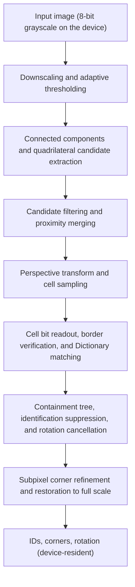

# ArUco3-CUDA

[](https://github.com/MasakazuTobeta/ArUco3-CUDA/actions/workflows/ci.yml)

ArUco3-CUDA is a library that independently implements, in CUDA, the ArUco3 detection strategy found in OpenCV's `cv::aruco::ArucoDetector`. It processes an input image on the GPU all the way to marker IDs and corners, and returns the results while they remain on the device. No GPLv3 code from the official ArUco is copied or adapted ([Intellectual property and licensing policy](docs/ip-and-licensing.md)).

> [!IMPORTANT]
> Evaluation was performed on a synthetic corpus only. Accuracy and speed on a real-image corpus have not been measured. All the numbers below are for the synthetic corpus.

## What it does

- Detection runs entirely on the GPU, from preprocessing through subpixel corner refinement. `Detector` leaves the results on the device. In steady state `detect_async()` only issues kernels, so the synchronizing calls are `initialize()`, `download()`, and the first frame after the input dimensions or pitch change, where the stream is synchronized once to rebuild the buffer layout.
- The kernel launch sequence for one frame is folded into a CUDA Graph. If you pass an explicit stream, every detection after the first takes a single launch.
- The workspace is allocated at its worst-case size in `initialize()` and is not reallocated per frame. Peak usage is 17.51 MB with ArUco3 enabled and 414.51 MB with it disabled. Repeating detection 91 times does not increase the allocation count.
- Detection results are cross-checked against the OpenCV CPU implementation. On the same corpus, precision is 100%, and on the Hybrid route the corners match the CPU baseline on 91 of 91 images ([Accuracy evaluation results](docs/accuracy-report.md)).
- On three machines — DGX Spark GB10, Jetson AGX Orin, and GeForce RTX 5070 Ti — the automated tests and all four Compute Sanitizer tools (memcheck, racecheck, initcheck, synccheck) pass.

## Detection flow

The input image is processed on the GPU through to IDs and corners. The design of each stage is in [Detection pipeline design](docs/design/detector-pipeline.md).



Pose estimation is out of scope. The output corners are in the full-scale coordinates of the input image, so they can be passed directly to OpenCV's `solvePnP` and similar functions.

## Speed

These are end-to-end times measuring detection only. Image loading and checksums are not included in the measured region. 28 scenes x 3 routes x 3 machines are compared using the median of three independent processes ([Benchmark report](docs/benchmark-report.md)).

`CUDA-Resident` is the route that takes device-resident input and processes every stage on the GPU; this is the route the library provides.

`Hybrid` is a **comparison route** that runs downscaling and adaptive thresholding on the GPU and everything from candidate extraction onward on the host. **It is not part of the public API.** It lives in `hybrid/` and requires OpenCV. It exists to cross-check the correctness of the GPU implementation against the CPU baseline, and it is not installed. It appears in the table to show where the move to the GPU pays off.

| Machine | CPU | Hybrid | CUDA-Resident | CUDA-Resident / CPU (1280x720, 4 markers) | Same (3840x2160) |
| --- | --- | --- | --- | --- | --- |
| DGX Spark GB10 | 0.699 ms | 0.301 ms | 0.696 ms | 0.99 | 0.31 |
| Jetson AGX Orin | 1.676 ms | 1.144 ms | 1.077 ms | 0.64 | 0.25 |
| GeForce RTX 5070 Ti | 0.614 ms | 0.295 ms | 0.421 ms | 0.69 | 0.15 |

The left three columns are the steady-state p50 for a scene with 4 markers placed in a 1280x720 image, taken as the median over three independent processes of the one-process, one-image measurement (200 iterations) used to measure startup cost (`docs/measurements/2026-08-29-*-startup.jsonl`). The 1280x720 ratio column is those same three columns divided out. That measurement covers only the one 1280x720 scene, so the 3840x2160 column is taken from the 28-scene sweep instead (`docs/measurements/2026-08-29-*-sweep.jsonl`, scene `clean_3840x2160_n4_s128`); at 3840x2160 every marker in the corpus falls below the ArUco3 detection lower bound, so all three routes return 0 detections there, and that column compares the cost of processing the frame rather than of decoding markers. Measuring the 1280x720 scene in the 28-scene sweep instead gives somewhat different values (for example, CUDA-Resident on DGX Spark comes out at 0.626 ms, a ratio of 0.89 rather than 0.99). **The GPU routes have large run-to-run variance, and differences of this magnitude arise between measurements.** Details are in the [Benchmark report](docs/benchmark-report.md). A ratio below 1 means the GPU is faster.

**There are conditions under which the CPU wins.** **The CPU beats CUDA-Resident on small scenes with a low contour point count.** That is 5 of the 28 scenes on DGX Spark, 4 on GeForce RTX 5070 Ti, and 1 on Jetson AGX Orin. **Resolution alone does not decide it.** At the same 640x480, `noise_640x480` has many contour points, and on DGX Spark the GPU is 2.3x faster — 0.612 ms for CUDA-Resident against 1.406 ms for the CPU. Conversely, the 5 scenes on DGX Spark include one 1280x720 scene.

That said, this applies when the route is fixed to `CUDA-Resident`. **On DGX Spark and GeForce RTX 5070 Ti, there is not a single scene out of 28 where the CPU beats `Hybrid`.** If the faster of the two can be chosen per scene, no scene remains where the CPU wins on these two machines. Only on Jetson AGX Orin is there one scene where the CPU beats both routes at once. On real images the contour point count may be higher than in the synthetic corpus, which would move this boundary. This has not been confirmed yet.

What determines the boundary is neither resolution nor candidate count, but the contour point count after thresholding. The coefficient per 1e5 contour points is 2.48-5.35 ms for CPU, 2.54-5.48 ms for Hybrid, and 0.041-0.278 ms for CUDA-Resident — **Hybrid is nearly the same as CPU**, because everything from contour extraction onward runs on the host. Above about 20,000 contour points CUDA-Resident wins on all three machines, but that figure is a rough guide rather than a boundary: below it, native resolution decides instead, and CUDA-Resident already wins at 3840x2160 on DGX Spark and at 1920x1080 and above on GeForce RTX 5070 Ti even with almost no contour points. On Jetson AGX Orin, CUDA-Resident wins on all 28 scenes.

For short videos or processing a single image, startup cost dominates. When one process handles just one image (1280x720, 4 markers), the time until the first result is available is 3.3 ms for CPU on DGX Spark, against 171.0 ms for Hybrid and 174.0 ms for CUDA-Resident. Jetson AGX Orin is 6.1 / 57.6 / 69.8 ms, and GeForce RTX 5070 Ti is 2.2 / 66.1 / 70.0 ms. On DGX Spark the GPU routes also have run-to-run variance an order of magnitude larger than the CPU route (0.6% for CPU against 17.7% for Hybrid and 14.1% for CUDA-Resident). That does not carry to the other two machines: on Jetson AGX Orin only Hybrid is larger (3.5% against 0.4% for CPU, with CUDA-Resident at 0.5%), and on GeForce RTX 5070 Ti both GPU routes are at or below the CPU route (0.4% and 0.0% against 0.5%).

## Accuracy

Measured on a synthetic corpus of 91 scenes with 480 ground truth items, across the 9 combinations of 3 routes x 3 machines ([Accuracy evaluation results](docs/accuracy-report.md)).

| Metric | Result |
| --- | --- |
| precision | 100% across all 9 combinations. 0 false positives, 0 ID errors |
| recall (whole corpus) | 18.33% (88 of 480 ground truth items) |
| recall (at or above the detection lower bound) | 94.44% (85 of 90 ground truth items) |
| rotation | Matches ground truth for all 88 detections (85 of them at or above the bound) |
| corner RMSE | CPU 0.5184 px (aarch64) / 0.5042 px (x86_64), CUDA 0.4806 px / 0.4653 px |

By design, ArUco3 does not detect markers whose side length after downscaling falls below a lower bound. The corpus deliberately includes sizes below this bound, so the overall recall of 18.33% is a figure dominated by that strategic lower bound. The lower bound for each resolution is in [Accuracy evaluation results](docs/accuracy-report.md). The 5 misses break down as 3 combined degradation, 1 occlusion, and 1 border clipping; rotation, projection, blur, noise, and illumination differences each account for 0 on their own.

The differences from the OpenCV CPU implementation are as follows. The Hybrid route matches on 91 of 91 images (maximum difference 0.000 px). The CUDA route matches on 90 of 91 images; the single difference is 3.804 px on a 640x480 image with occlusion. For that one image, CUDA is in fact closer to the ground truth (CPU 3.6351 px, CUDA 1.0936 px). The difference originates in how the corners are estimated: CUDA uses extreme point search, while OpenCV uses polygonal approximation of the contour.

## Target environments

| Machine | Host architecture | GPU type | Compute Capability | CUDA |
| --- | --- | --- | --- | --- |
| DGX Spark GB10 | aarch64 | Integrated | 12.1 | 13.0 |
| Jetson AGX Orin | aarch64 | Integrated | 8.7 | 11.4 |
| GeForce RTX 5070 Ti | x86_64 | Discrete | 12.0 | 13.0 |

On the two machines with integrated GPUs, the host and device share the same physical memory, so transfer costs differ from those of a discrete GPU. Adding one machine with a discrete GPU separates results specific to integrated GPUs from results that hold generally. Jetson support targets the Orin family. Support for Nano, Xavier, and Thor is undetermined.

## Building and running

Because the same procedure is used on all three machines, builds and measurements are performed in a container. Choose one of the profile names `dgx-spark`, `jetson-orin`, or `rtx-blackwell`.

| Machine | docker profile | CMake preset | GPU architecture |
| --- | --- | --- | --- |
| DGX Spark GB10 | `dgx-spark` | `dgx-spark` | `sm_121` |
| Jetson AGX Orin | `jetson-orin` | `jetson-orin` | `sm_87` |
| GeForce RTX 5070 Ti | `rtx-blackwell` | `rtx-blackwell` | `sm_120` |

```bash
PROFILE=dgx-spark   # or jetson-orin, rtx-blackwell
cp docker/.env.example docker/.env
docker compose -f docker/compose.yaml build "$PROFILE"
docker compose -f docker/compose.yaml run --rm "$PROFILE" verify-environment.sh
docker compose -f docker/compose.yaml run --rm "$PROFILE" bash -c '
  cmake --preset native && cmake --build --preset native && ctest --preset native'
```

The `native` preset detects the architecture of the machine it runs on automatically. To cover all three machines with a single binary, use the `portability` preset, which generates all three of `sm_87`, `sm_120`, and `sm_121`. For Compute Sanitizer, configure the `sanitizer` preset and then run `ctest -L sanitizer`. See [Docker environment design](docs/design/docker-environment.md) for details.

## Usage

### Installation

```bash
cmake -S . -B build -DCMAKE_BUILD_TYPE=Release \
  -DARUCO3CUDA_BUILD_REFERENCE=OFF -DARUCO3CUDA_BUILD_TESTS=OFF \
  -DCMAKE_INSTALL_PREFIX=/your/prefix
cmake --build build -j && cmake --install build
```

`ARUCO3CUDA_BUILD_REFERENCE=OFF` removes the dependency on OpenCV. The library itself does not require OpenCV.

Consumers reference it via `find_package`.

```cmake
find_package(aruco3cuda REQUIRED)
target_link_libraries(your_target PRIVATE aruco3cuda::core aruco3cuda::dictionary)
```

### Example

The public API is in `include/aruco3cuda/`. The input is 8-bit grayscale in device or managed space, and ownership stays with the caller.

```cpp
#include <cuda_runtime_api.h>

#include <string>

#include "aruco3cuda/detector.hpp"

using namespace aruco3cuda;

const DictionaryTable* dictionary = find_builtin_dictionary("DICT_ARUCO_MIP_36h12");

DetectorConfig config;         // defaults: ArUco3 enabled, subpixel corner refinement on
config.max_width_px_ = 1280;   // the workspace is sized for the worst case from these limits
config.max_height_px_ = 720;

Detector detector;
std::string message;
if (detector.initialize(*dictionary, config, &message) != Status::kOk) {
    // message carries the reason
}

ImageViewU8 image;
image.data_ = device_gray;     // memory obtained from cudaMalloc / cudaMallocPitch
image.width_px_ = 1280;
image.height_px_ = 720;
image.pitch_bytes_ = pitch_bytes;
image.space_ = MemorySpace::kDevice;

cudaStream_t stream = nullptr;
cudaStreamCreate(&stream);     // passing an explicit stream folds the launch sequence into a CUDA Graph

detector.detect_async(image, stream, &message);

// If the next stage is on the same device, read the results without going back to the host.
DeviceDetections on_device;
detector.device_detections(&on_device);

// Receive on the host. In steady state this is the only synchronizing call.
HostDetections result;
detector.download(&result, stream, &message);
// result.ids_[i] and result.corners_[i * 8 .. i * 8 + 7] (x0, y0, ... x3, y3)
```

Only two configuration combinations are accepted: ArUco3 enabled with subpixel corner refinement, or ArUco3 disabled without refinement. `initialize()` rejects the other two. The list of defaults and the meaning of each field are in `include/aruco3cuda/config.hpp` and [Public API](docs/design/public-api.md).

### Samples

`examples/` holds two programs that run the whole API without a camera, an image library, or any file not produced on the spot. `generate_marker` renders a marker from the built-in dictionary and writes it as a PGM; `detect_image` reads it back and prints the ids and corners.

```bash
cd build/native/examples
./generate_marker --id 42 --size 200 --margin 40 --output marker.pgm
./detect_image --input marker.pgm
```

```
detections   : 1 (accepted 1)
  [0] id=42 rotation=2 corners= (39.59, 39.59) (239.41, 39.59) (239.42, 239.42) (39.59, 239.41)
```

They are built with the rest of the project by default. `examples/CMakeLists.txt` also configures standalone against an installed package, which is the form that exercises `find_package`. See [Samples](examples/README.md).

Each sample exists twice, in C++ and in Python, taking the same options and printing the same lines.

### Python

`libaruco3cuda_c.so` exposes the detector through a C ABI, and the `aruco3cuda` package drives it with `ctypes`. Nothing is compiled for Python, so the same build works with any CPython 3, and the package depends on nothing outside the standard library.

```bash
export PYTHONPATH=build/native/python
python3 -c "import aruco3cuda; print(aruco3cuda.version())"
```

```python
import aruco3cuda

config = aruco3cuda.Config(max_width_px=280, max_height_px=280)
with aruco3cuda.Detector() as detector:
    detector.initialize("DICT_ARUCO_MIP_36h12", config)
    with aruco3cuda.DeviceImage.from_host(pixels, 280, 280) as image:
        with aruco3cuda.Stream() as stream:
            detector.detect(image, stream)
            for detection in detector.download(stream):
                print(detection.id, detection.corners)
```

`detect()` takes device-resident input: a `DeviceImage`, or anything exposing `__cuda_array_interface__`, which is how a CuPy or PyTorch array is handed over without a copy. A host buffer is rejected with a message naming `DeviceImage.from_host`, so that the transfer is visible where it happens rather than hidden inside every frame. See [C ABI and Python binding](docs/design/c-abi-and-python.md).

## Limitations

- Evaluation covers the synthetic corpus only. A real-image corpus has not been prepared, and accuracy and the crossover point on real images have not been measured.
- The supported dictionary is `DICT_ARUCO_MIP_36h12`. The plan is to add other dictionaries using the same loader and lookup format ([Dictionary policy](docs/dictionaries.md)).
- Pose estimation is out of scope.
- Per-stage times are wall-clock and include host synchronization. Per-stage measurement using CUDA events has not been done.
- A single `Detector` instance cannot be used from multiple threads at the same time.
- Even with the same seed, images in the synthetic corpus differ across build environments. Per-scene hashes were kept only for the 28 benchmark scenes: 18 of those differ between aarch64 and x86_64, and 6 differ between the two aarch64 machines. How many of the 91 scenes differ, and by how much, was not recorded. This affects only comparisons across machines.

## Documentation

- [Project overview](docs/project-overview.md) / [Architecture](docs/architecture.md) / [Roadmap](docs/roadmap.md)
- [Samples](examples/README.md)
- [Detection pipeline design](docs/design/detector-pipeline.md) / [Public API](docs/design/public-api.md) / [C ABI and Python binding](docs/design/c-abi-and-python.md) / [Memory handoff between host and device](docs/design/memory-transfer.md) / [Docker environment design](docs/design/docker-environment.md)
- [Evaluation plan](docs/evaluation-plan.md) / [Benchmark report](docs/benchmark-report.md) / [Accuracy evaluation results](docs/accuracy-report.md)
- [Dictionary policy](docs/dictionaries.md) / [Implementation plan](docs/implementation-plan.md) / [Glossary](docs/terminology.md)
- [ADR-0001: Implement first in an independent repository](docs/adr/0001-independent-implementation.md) / [ADR-0002: Fix the build infrastructure and target environment baseline](docs/adr/0002-toolchain-and-target-baseline.md) / [ADR-0003: Adopt approach A as the primary plan for quadrilateral candidate extraction](docs/adr/0003-candidate-extraction-approach.md)
- [Intellectual property and licensing policy](docs/ip-and-licensing.md) / [Code provenance record](docs/code-provenance.md) / [Contribution guidelines](CONTRIBUTING.md)

If the approach is confirmed to be effective, a proposal to OpenCV will be considered (see: OpenCV Issue #27118).

## License

This project is provided under the [Apache License 2.0](LICENSE). No GPLv3 code from the official ArUco is copied or adapted. See [Intellectual property and licensing policy](docs/ip-and-licensing.md) for details.

Third-party copyright notices are in [NOTICE](NOTICE). OpenCV 4.x has different license headers per file, and the `imgproc` files whose behavior this project mirrors are 3-clause BSD.

The implementation is based solely on the ArUco3 paper and Apache-2.0 OpenCV 4.x. The predefined dictionaries are not extracted from the GPLv3 official ArUco distribution; the authoritative source is OpenCV 4.x data at a pinned version and commit.

## Trademarks

`ArUco` is the name of a marker scheme published by a research group at the Universidad de Córdoba. This project uses the name solely to indicate the compatibility target and the technical scheme, and is **not affiliated with, endorsed by, or recommended by the Universidad de Córdoba, the official ArUco library, or OpenCV.**

All other trademarks belong to their respective owners. See [Intellectual property and licensing policy](docs/ip-and-licensing.md) for details.
