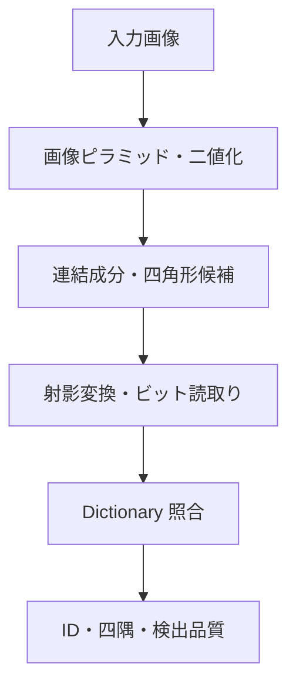

# ArUco3-CUDA

ArUco3-CUDA は、ArUco3 の高速検出戦略を CUDA で実装し、NVIDIA DGX Spark と Jetson Orin で有効性を評価するためのプロジェクトです。

> [!IMPORTANT]
> 現在は設計・評価準備段階です。CUDA 検出器はまだ実装されていません。

## 目的

- OpenCV の `cv::aruco::ArucoDetector` と比較可能な CUDA 実装を構築する。
- GPU 常駐、ユニファイドメモリ、転送込みの各経路を分離して評価する。
- CUDA が有利になる解像度、マーカー数、入力経路の境界を明らかにする。
- 有効性を確認できた段階で、OpenCV へのコントリビュートを検討する。

## 対象環境

| 環境 | GPU アーキテクチャ | CUDA Compute Capability | 主な役割 |
| --- | --- | --- | --- |
| NVIDIA Jetson Orin | Ampere | 8.7 | 実運用を想定した遅延・電力・メモリ評価 |
| NVIDIA DGX Spark GB10 | Blackwell | 12.0 | 開発、解析、性能上限および移植性評価 |

Jetson は当面 Orin 系を対象とします。Jetson Nano、Xavier、Thor の対応は未確定です。

## 目標とする処理

姿勢推定は初期の対象外とし、検出後に OpenCV の `solvePnP` 等へ接続できる出力を目指します。

## 評価方針

CUDA が常に CPU より速いとは仮定しません。次の経路を同一条件で比較します。

1. OpenCV ArUco3 CPU 実装
2. CUDA 実装（転送込み）
3. CUDA 実装（GPU 常駐入力）
4. CUDA / CPU ハイブリッド実装

評価指標は、処理時間、遅延分布、スループット、検出率、誤検出率、ID 一致率、四隅座標誤差、GPU メモリ使用量です。詳細は [評価計画](docs/evaluation-plan.md) を参照してください。

## 文書

- [プロジェクト概要](docs/project-overview.md)
- [アーキテクチャ](docs/architecture.md)
- [評価計画](docs/evaluation-plan.md)
- [Dictionary 方針](docs/dictionaries.md)
- [ロードマップ](docs/roadmap.md)
- [知的財産・ライセンス方針](docs/ip-and-licensing.md)
- [ADR-0001: 独立リポジトリで先行実装する](docs/adr/0001-independent-implementation.md)
- [コントリビューション規約](CONTRIBUTING.md)

## ライセンス

本プロジェクトは [Apache License 2.0](LICENSE) で提供します。公式 ArUco の GPLv3 code はコピーまたは翻案しません。詳細は [知的財産・ライセンス方針](docs/ip-and-licensing.md) を参照してください。

実装根拠は ArUco3 論文と Apache-2.0 の OpenCV 4.x に限定します。定義済み Dictionary は GPLv3 の公式 ArUco 配布物から抽出せず、version と commit を固定した OpenCV 4.x のデータを正本として扱います。
