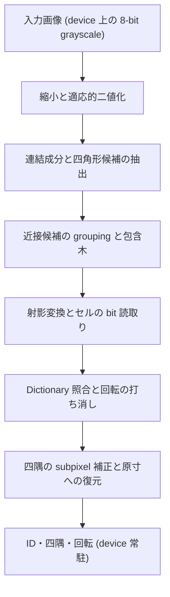

# ArUco3-CUDA

[](https://github.com/MasakazuTobeta/ArUco3-CUDA/actions/workflows/ci.yml)

ArUco3-CUDA は、OpenCV の `cv::aruco::ArucoDetector` が持つ ArUco3 検出戦略を CUDA で独立に実装した library です。入力画像から marker の ID と四隅までを GPU 上で処理し、結果を device に置いたまま返します。公式 ArUco の GPLv3 code は複製も翻案もしていません ([知的財産・ライセンス方針](docs/ip-and-licensing.md))。

> [!IMPORTANT]
> 評価は合成 corpus のみで行っています。実画像 corpus での正確性と速度は測っていません。以下の数値はすべて合成 corpus に対するものです。

## できること

- 検出は前処理から四隅の subpixel 補正まで GPU 常駐で完結します。`Detector` は host 同期なしに device 上の結果を返し、host へ取り出す `download()` だけが同期します。
- 1 frame 分の kernel 発行列を CUDA Graph へ畳みます。明示的な stream を渡すと、2 回目以降の検出が 1 回の起動で済みます。
- workspace は `initialize()` で最悪値を確保し、frame ごとに確保し直しません。最大使用量は ArUco3 有効で 17.51 MB、無効で 414.51 MB です。検出を 91 回繰り返しても確保回数は増えません。
- 検出結果は OpenCV CPU 実装と突き合わせています。同じ corpus で precision は 100%、四隅は Hybrid 経路で 91 枚中 91 枚が CPU 基準と一致します ([正確性評価の結果](docs/accuracy-report.md))。
- DGX Spark GB10、Jetson AGX Orin、GeForce RTX 5070 Ti の 3 機で、自動 test と Compute Sanitizer の 4 tool (memcheck、racecheck、initcheck、synccheck) が通ります。

## 検出の流れ

入力画像から ID・四隅までを GPU 上で処理します。各段の設計は [検出パイプライン設計](docs/design/detector-pipeline.md) にあります。



姿勢推定は対象外です。出力の四隅は入力画像の原寸座標であり、OpenCV の `solvePnP` などへそのまま渡せます。

## 速度

検出のみを測った end-to-end 時間です。画像の読み込みと checksum は測定区間に含みません。28 場面 x 3 経路 x 3 機を、独立した 3 process の中央値で比較しています ([Benchmark 報告](docs/benchmark-report.md))。

`CUDA-Resident` は device 常駐入力で全段を GPU で処理する経路で、これが本 library が提供する経路です。

`Hybrid` は候補抽出まで GPU、以降を host で行う**比較用の経路**です。**公開 API には含まれません。** `hybrid/` にあり OpenCV を必要とします。GPU 実装の正しさを CPU 基準と突き合わせるために置いてあり、install もしません。表に載せているのは、GPU 化のどこが効いているかを示すためです。

| 機体 | CPU | Hybrid | CUDA-Resident | CUDA-Resident / CPU (1280x720、マーカー 4 枚) | 同 (3840x2160) |
| --- | --- | --- | --- | --- | --- |
| DGX Spark GB10 | 0.699 ms | 0.301 ms | 0.696 ms | 0.98 | 0.45 |
| Jetson AGX Orin | 1.676 ms | 1.144 ms | 1.077 ms | 0.66 | 0.30 |
| GeForce RTX 5070 Ti | 0.614 ms | 0.295 ms | 0.421 ms | 0.68 | 0.28 |

左 3 列は 1280x720 にマーカー 4 枚を置いた場面の定常 p50 で、起動費用を測る 1 process 1 枚の測定 (200 反復) を独立した 3 process で行った中央値です。同じ場面を 28 場面 sweep で測ると多少違う値になります (例: DGX Spark の CUDA-Resident は 0.626 ms)。**GPU 経路は実行間のばらつきが大きく、この程度の差は測定間で生じます。** 詳細は [Benchmark 報告](docs/benchmark-report.md) にあります。比は 1 未満が GPU 有利を意味します。

**CPU が勝つ条件があります。** **CPU が CUDA-Resident を上回るのは、輪郭点数が少ない小さな場面です。** 28 場面のうち DGX Spark で 5 場面、GeForce RTX 5070 Ti で 4 場面、Jetson AGX Orin で 1 場面です。**解像度だけでは決まりません。** 同じ 640x480 でも `noise_640x480` は輪郭点が多く、DGX Spark で CPU 1.406 ms に対し CUDA-Resident 0.612 ms と GPU が 2.3 倍速くなります。逆に DGX Spark の 5 場面には 1280x720 の場面が 1 つ含まれます。

ただしこれは経路を `CUDA-Resident` に固定した場合です。**DGX Spark と GeForce RTX 5070 Ti では、CPU が `Hybrid` を上回る場面は 28 場面中 1 つもありません。** 場面ごとに速い方を選べるなら、この 2 機で CPU が勝つ場面は無くなります。Jetson AGX Orin だけは CPU が両経路を同時に上回る場面が 1 つあります。実画像では輪郭点が合成 corpus より多くなる可能性があり、この境界は動きます。まだ確かめていません。

境界を決めるのは解像度でも候補数でもなく、二値化後の輪郭点数です。輪郭点 1e5 あたりの係数は CPU 2.48-5.35 ms、Hybrid 2.54-5.48 ms、CUDA-Resident 0.041-0.278 ms で、**Hybrid は CPU とほぼ同じです**。輪郭抽出から先を host で行うためです。Hybrid と CUDA-Resident の切替点は輪郭点 約 20,000 点 (DGX Spark と GeForce RTX 5070 Ti) で、Jetson AGX Orin では全 28 場面で CUDA-Resident が勝ちます。

短い動画や 1 枚だけの処理では起動費用が支配します。1 process で 1 枚 (1280x720、マーカー 4 枚) だけ処理した場合、1 枚目の結果が出るまでに DGX Spark で CPU 3.3 ms に対し Hybrid 171.0 ms、CUDA-Resident 174.0 ms を要します。Jetson AGX Orin は 6.1 / 57.6 / 69.8 ms、GeForce RTX 5070 Ti は 2.2 / 66.1 / 70.0 ms です。また GPU 経路は実行間のばらつきが CPU 経路より 1 桁大きくなります (DGX Spark で CPU 0.6% に対し Hybrid 17.7%、CUDA-Resident 14.1%)。

## 正確性

合成 corpus 91 場面、真値 480 個、3 経路 x 3 機の 18 組合せで測りました ([正確性評価の結果](docs/accuracy-report.md))。

| 指標 | 結果 |
| --- | --- |
| precision | 全 18 組合せで 100%。false positive 0 件、ID 誤り 0 件 |
| recall (corpus 全体) | 18.33% (真値 480 個中 88 個) |
| recall (検出下限以上) | 94.44% (真値 90 個中 85 個) |
| 回転 | 検出した 85 件すべてで真値と一致 |
| 四隅 RMSE | CPU 0.5184 px (aarch64) / 0.5042 px (x86_64)、CUDA 0.4806 px / 0.4653 px |

ArUco3 は縮小後の 1 辺が下限を下回るマーカーを原理上検出しません。corpus はこの下限を下回る大きさを意図的に含むため、全体の recall 18.33% は戦略上の下限に支配された値です。解像度ごとの下限は [正確性評価の結果](docs/accuracy-report.md) にあります。取りこぼした 5 件の内訳は複合劣化 3、遮蔽 1、境界はみ出し 1 で、回転・射影・ぼけ・noise・照度差は単独では 0 件です。

OpenCV CPU 実装との差は次のとおりです。Hybrid 経路は 91 枚中 91 枚が一致します (最大差 0.000 px)。CUDA 経路は 91 枚中 90 枚が一致し、唯一の差異は遮蔽ありの 640x480 で 3.804 px です。この 1 枚については、真値に対しては CUDA の方が近くなります (CPU 3.6351 px、CUDA 1.0936 px)。差の由来は四隅の推定方法で、CUDA は極点探索、OpenCV は輪郭の多角形近似を使います。

## 対象環境

| 機体 | host architecture | GPU の種別 | Compute Capability | CUDA |
| --- | --- | --- | --- | --- |
| DGX Spark GB10 | aarch64 | 統合 | 12.1 | 13.0 |
| Jetson AGX Orin | aarch64 | 統合 | 8.7 | 11.4 |
| GeForce RTX 5070 Ti | x86_64 | 単体 | 12.0 | 13.0 |

統合 GPU の 2 機は host と device が同一物理 memory を共有するため、転送費用が単体 GPU と異なります。単体 GPU を 1 機加えることで、統合 GPU 固有の結果と一般に成り立つ結果を分けています。Jetson は Orin 系を対象とします。Nano、Xavier、Thor の対応は未確定です。

## build と実行

3 機で同じ手順を使うため、build と測定は container 上で行います。profile 名は `dgx-spark`、`jetson-orin`、`rtx-blackwell` のいずれかを選びます。

| 機体 | docker profile | CMake preset | GPU architecture |
| --- | --- | --- | --- |
| DGX Spark GB10 | `dgx-spark` | `dgx-spark` | `sm_121` |
| Jetson AGX Orin | `jetson-orin` | `jetson-orin` | `sm_87` |
| GeForce RTX 5070 Ti | `rtx-blackwell` | `rtx-blackwell` | `sm_120` |

```bash
PROFILE=dgx-spark   # jetson-orin または rtx-blackwell
cp docker/.env.example docker/.env
docker compose -f docker/compose.yaml build "$PROFILE"
docker compose -f docker/compose.yaml run --rm "$PROFILE" verify-environment.sh
docker compose -f docker/compose.yaml run --rm "$PROFILE" bash -c '
  cmake --preset native && cmake --build --preset native && ctest --preset native'
```

`native` preset は実行機の architecture を自動判定します。3 機すべてを 1 つの binary で賄う場合は `portability` preset を使います。`sm_87`、`sm_120`、`sm_121` の 3 つを生成します。Compute Sanitizer は `sanitizer` preset を構成したうえで `ctest -L sanitizer` で走らせます。詳細は [Docker 環境設計](docs/design/docker-environment.md) を参照してください。

## 使い方

### 導入

```bash
cmake -S . -B build -DCMAKE_BUILD_TYPE=Release \
  -DARUCO3CUDA_BUILD_REFERENCE=OFF -DARUCO3CUDA_BUILD_TESTS=OFF \
  -DCMAKE_INSTALL_PREFIX=/your/prefix
cmake --build build -j && cmake --install build
```

`ARUCO3CUDA_BUILD_REFERENCE=OFF` は OpenCV への依存を外します。library 本体は OpenCV を必要としません。

利用側からは `find_package` で参照します。

```cmake
find_package(aruco3cuda REQUIRED)
target_link_libraries(your_target PRIVATE aruco3cuda::core aruco3cuda::dictionary)
```

### 使用例

公開 API は `include/aruco3cuda/` にあります。入力は device または managed 空間の 8-bit grayscale で、所有権は呼出側に残ります。

```cpp
#include <cuda_runtime_api.h>

#include <string>

#include "aruco3cuda/detector.hpp"

using namespace aruco3cuda;

const DictionaryTable* dictionary = find_builtin_dictionary("DICT_ARUCO_MIP_36h12");

DetectorConfig config;         // 既定は ArUco3 有効、四隅の subpixel 補正あり
config.max_width_px_ = 1280;   // workspace はこの上限から最悪値で確保する
config.max_height_px_ = 720;

Detector detector;
std::string message;
if (detector.initialize(*dictionary, config, &message) != Status::kOk) {
    // message に理由が入る
}

ImageViewU8 image;
image.data_ = device_gray;     // cudaMalloc / cudaMallocPitch で確保した領域
image.width_px_ = 1280;
image.height_px_ = 720;
image.pitch_bytes_ = pitch_bytes;
image.space_ = MemorySpace::kDevice;

cudaStream_t stream = nullptr;
cudaStreamCreate(&stream);     // 明示的な stream を渡すと発行列を CUDA Graph へ畳む

detector.detect_async(image, stream, &message);

// 後段が同じ device 上にあるなら、host へ戻さずに参照する。
DeviceDetections on_device;
detector.device_detections(&on_device);

// host で受け取る。同期が起きるのはここだけである。
HostDetections result;
detector.download(&result, stream, &message);
// result.ids_[i] と result.corners_[i * 8 .. i * 8 + 7] (x0, y0, ... x3, y3)
```

設定の組み合わせは 2 つだけを受け付けます。ArUco3 有効かつ四隅の subpixel 補正あり、または ArUco3 無効かつ補正なしです。他の 2 組は `initialize()` が拒否します。既定値の一覧と各項目の意味は `include/aruco3cuda/config.hpp` と [公開 API](docs/design/public-api.md) にあります。

## 制約

- 評価は合成 corpus のみです。実画像 corpus は整備しておらず、実画像での正確性と crossover point は測っていません。
- 対応 Dictionary は `DICT_ARUCO_MIP_36h12` です。他の Dictionary は同じ loader と lookup 形式で追加する方針です ([Dictionary 方針](docs/dictionaries.md))。
- 姿勢推定は対象外です。
- 段ごとの時間は host 同期を含む wall-clock です。CUDA event による段別計測は行っていません。
- 1 つの `Detector` instance を複数の thread から同時に使えません。
- 合成 corpus の画像は同じ seed でも aarch64 と x86_64 で 91 場面中 54 場面が一致しません (差は画素の 0.1% 未満、最大 4 階調)。architecture をまたぐ比較にのみ影響します。

## 文書

- [プロジェクト概要](docs/project-overview.md) / [アーキテクチャ](docs/architecture.md) / [ロードマップ](docs/roadmap.md)
- [検出パイプライン設計](docs/design/detector-pipeline.md) / [公開 API](docs/design/public-api.md) / [host と device の間の memory 受け渡し](docs/design/memory-transfer.md) / [Docker 環境設計](docs/design/docker-environment.md)
- [評価計画](docs/evaluation-plan.md) / [Benchmark 報告](docs/benchmark-report.md) / [正確性評価の結果](docs/accuracy-report.md)
- [Dictionary 方針](docs/dictionaries.md) / [実装計画](docs/implementation-plan.md) / [日本語用語辞書](docs/terminology.md)
- [ADR-0001: 独立リポジトリで先行実装する](docs/adr/0001-independent-implementation.md) / [ADR-0002: build 基盤と対象環境の baseline を固定する](docs/adr/0002-toolchain-and-target-baseline.md) / [ADR-0003: 四角形候補抽出は案 A を主案とする](docs/adr/0003-candidate-extraction-approach.md)
- [知的財産・ライセンス方針](docs/ip-and-licensing.md) / [Code Provenance 記録](docs/code-provenance.md) / [コントリビューション規約](CONTRIBUTING.md)

有効性を確認できた場合は、OpenCV への提案を検討します (参照: OpenCV Issue #27118)。

## ライセンス

本プロジェクトは [Apache License 2.0](LICENSE) で提供します。公式 ArUco の GPLv3 code はコピーまたは翻案しません。詳細は [知的財産・ライセンス方針](docs/ip-and-licensing.md) を参照してください。

第三者の著作権表示は [NOTICE](NOTICE) にあります。OpenCV 4.x は file ごとに license header が違い、本 project が振る舞いを写した `imgproc` の file は 3 条項 BSD です。

実装根拠は ArUco3 論文と Apache-2.0 の OpenCV 4.x に限定します。定義済み Dictionary は GPLv3 の公式 ArUco 配布物から抽出せず、version と commit を固定した OpenCV 4.x のデータを正本として扱います。

## 商標について

`ArUco` は Universidad de Córdoba の研究グループが発表した marker 方式の名称です。本プロジェクトは互換対象と技術方式を示す目的でのみこの名称を使用しており、**Universidad de Córdoba、公式 ArUco library、OpenCV のいずれとも提携しておらず、これらによる承認・推奨を受けていません。**

その他の商標は各権利者に帰属します。詳細は [知的財産・ライセンス方針](docs/ip-and-licensing.md) を参照してください。
