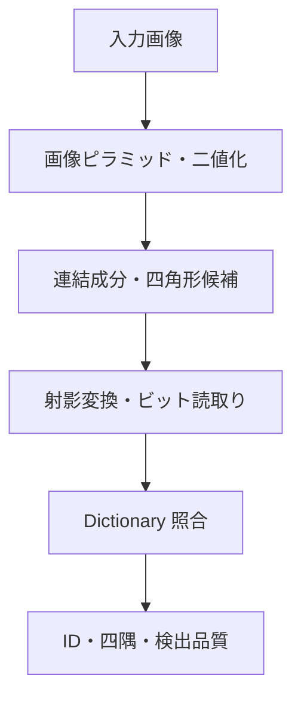

# ArUco3-CUDA

ArUco3-CUDA は、ArUco3 の高速検出戦略を CUDA で実装し、NVIDIA DGX Spark と Jetson Orin で有効性を評価するためのプロジェクトです。

> [!IMPORTANT]
> 検出は入力から ID・四隅の出力まで GPU 常駐で完結します。評価は合成 corpus のみで行っており、実画像での評価はまだです。OpenCV への提案は判断前です。

## 現状

- 検出の全 10 段が CUDA で動きます。`Detector` が host 同期なしで device 上の結果を返します。
- 評価対象は DGX Spark GB10、Jetson AGX Orin、GeForce RTX 5070 Ti の 3 機です。3 機とも 402 件の自動 test と Compute Sanitizer 4 tool が通ります。
- 正確性は合成 corpus 91 場面・真値 480 個で、3 経路 x 3 機のすべてで precision 100%、ArUco3 の下限以上のマーカーで recall 94.44% です ([正確性評価の結果](docs/accuracy-report.md))。
- 速度は 28 場面 x 3 経路 x 3 機で測りました。**CPU が有利な場面は残ります。** 640x480 かつ検出ありの場面では CPU が勝ちます ([Benchmark 報告](docs/benchmark-report.md))。

## 目的

- OpenCV の `cv::aruco::ArucoDetector` と比較可能な CUDA 実装を構築する。
- GPU 常駐、ユニファイドメモリ、転送込みの各経路を分離して評価する。
- CUDA が有利になる解像度、マーカー数、入力経路の境界を明らかにする。
- 有効性を確認できた段階で、OpenCV へのコントリビュートを検討する。

## 対象環境

| 環境 | GPU アーキテクチャ | CUDA Compute Capability | GPU の種別 | 主な役割 |
| --- | --- | --- | --- | --- |
| NVIDIA Jetson Orin | Ampere | 8.7 | 統合 | 実運用を想定した遅延・電力・メモリ評価 |
| NVIDIA DGX Spark GB10 | Blackwell | 12.1 | 統合 | 開発、解析、性能上限および移植性評価 |
| GeForce RTX 5070 Ti (GB203) | Blackwell | 12.0 | 単体 | discrete GPU での評価。転送費用と memory 種別の差を測る |

Jetson は当面 Orin 系を対象とします。Jetson Nano、Xavier、Thor の対応は未確定です。

統合 GPU の 2 機は host と device が同一物理 memory を共有するため、転送費用が discrete GPU と大きく異なります。単体 GPU を 1 機加えることで、測定結果を統合 GPU 固有のものと一般に成り立つものへ分けられるようにしています。

## 目標とする処理



姿勢推定は初期の対象外とし、検出後に OpenCV の `solvePnP` 等へ接続できる出力を目指します。

## 開発環境

DGX Spark と Jetson Orin で同じ手順を使うため、開発は container 上で行います。測定に使用した compiler を image と一体にするため、CUDA Toolkit のうち本 project が使用する package のみを image へ固定します。

```bash
cp docker/.env.example docker/.env
docker compose -f docker/compose.yaml build dgx-spark
docker compose -f docker/compose.yaml run --rm dgx-spark verify-environment.sh
docker compose -f docker/compose.yaml run --rm dgx-spark smoke-test.sh
```

build と test は container 内で行います。`portability` preset は `sm_87` と `sm_121` の両方を生成します。

```bash
docker compose -f docker/compose.yaml run --rm dgx-spark bash -c '
  cmake --preset portability && cmake --build --preset portability && ctest --preset portability'
```

詳細は [Docker 環境設計](docs/design/docker-environment.md) を参照してください。

## 評価方針

CUDA が常に CPU より速いとは仮定しません。次の経路を同一条件で比較します。

1. OpenCV ArUco3 CPU 実装
2. CUDA 実装（転送込み）
3. CUDA 実装（GPU 常駐入力）
4. CUDA / CPU ハイブリッド実装

評価指標は、処理時間、遅延分布、スループット、検出率、誤検出率、ID 一致率、四隅座標誤差、GPU メモリ使用量です。詳細は [評価計画](docs/evaluation-plan.md) を参照してください。

## 文書

- [プロジェクト概要](docs/project-overview.md)
- [アーキテクチャ](docs/architecture.md)
- [検出パイプライン設計](docs/design/detector-pipeline.md)
- [公開 API 草案](docs/design/public-api.md)
- [Docker 環境設計](docs/design/docker-environment.md)
- [host と device の間の memory 受け渡し](docs/design/memory-transfer.md)
- [実装計画](docs/implementation-plan.md)
- [評価計画](docs/evaluation-plan.md)
- [Benchmark 報告](docs/benchmark-report.md)
- [正確性評価の結果](docs/accuracy-report.md)
- [Dictionary 方針](docs/dictionaries.md)
- [ロードマップ](docs/roadmap.md)
- [知的財産・ライセンス方針](docs/ip-and-licensing.md)
- [Code Provenance 記録](docs/code-provenance.md)
- [ADR-0001: 独立リポジトリで先行実装する](docs/adr/0001-independent-implementation.md)
- [ADR-0002: build 基盤と対象環境の baseline を固定する](docs/adr/0002-toolchain-and-target-baseline.md)
- [ADR-0003: 四角形候補抽出は案 A を主案とする](docs/adr/0003-candidate-extraction-approach.md)
- [コントリビューション規約](CONTRIBUTING.md)

## ライセンス

本プロジェクトは [Apache License 2.0](LICENSE) で提供します。公式 ArUco の GPLv3 code はコピーまたは翻案しません。詳細は [知的財産・ライセンス方針](docs/ip-and-licensing.md) を参照してください。

実装根拠は ArUco3 論文と Apache-2.0 の OpenCV 4.x に限定します。定義済み Dictionary は GPLv3 の公式 ArUco 配布物から抽出せず、version と commit を固定した OpenCV 4.x のデータを正本として扱います。
