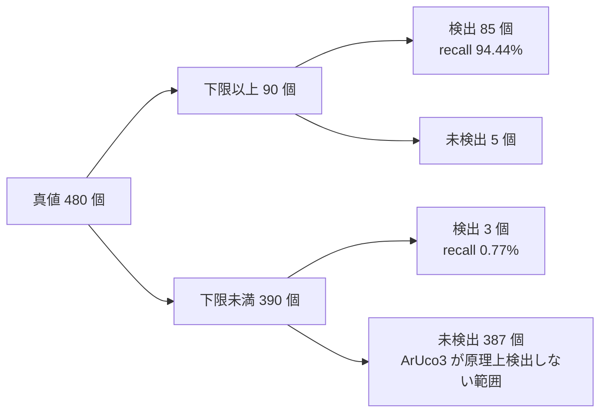

# 正確性評価の結果

## 目的

合成 corpus の ground truth に対して CPU 基準・Hybrid・CUDA-Resident の 3 経路を測り、[評価計画](evaluation-plan.md) が定める正確性指標を条件別に示します。end-to-end 時間の比較は [benchmark 結果まとめ](benchmark-report.md) が扱います。

## 対象範囲

- corpus preset `full` の 91 場面、真値 480 個のマーカーを対象とします。
- DGX Spark GB10、Jetson AGX Orin、GeForce RTX 5070 Ti の 3 機で測ります。統合 GPU 2 機と単体 GPU 1 機という構成です。
- Dictionary は `DICT_ARUCO_MIP_36h12` に固定します。
- 実画像は対象外です。評価は合成 corpus に限ります。

経路の呼称は [benchmark 結果まとめ](benchmark-report.md) に揃えます。`CPU` は OpenCV の CPU 実装、`Hybrid` は輪郭抽出から先を host で行う経路、`CUDA-Resident` は検出の全段を GPU 上で完結させる経路です。評価器の出力は `CUDA-Resident` を `CUDA` と表示します。

## 現状

### 全体

ArUco3 検出戦略を有効にした場合です。3 経路とも同じ 88 個のマーカーを検出します。四隅 RMSE と最大値は、この検出 88 件に対する値です。

| 機体 | 経路 | precision | recall (全体) | recall (下限以上) | rotation 一致 | 四隅 RMSE | 四隅 最大 |
| --- | --- | --- | --- | --- | --- | --- | --- |
| DGX Spark GB10 | CPU | 100.00% | 18.33% | 94.44% | 85/85 | 0.5184 px | 3.6351 px |
| DGX Spark GB10 | Hybrid | 100.00% | 18.33% | 94.44% | 85/85 | 0.5184 px | 3.6351 px |
| DGX Spark GB10 | CUDA-Resident | 100.00% | 18.33% | 94.44% | 85/85 | 0.4806 px | 1.0936 px |
| Jetson AGX Orin | CPU | 100.00% | 18.33% | 94.44% | 85/85 | 0.5184 px | 3.6351 px |
| Jetson AGX Orin | Hybrid | 100.00% | 18.33% | 94.44% | 85/85 | 0.5184 px | 3.6351 px |
| Jetson AGX Orin | CUDA-Resident | 100.00% | 18.33% | 94.44% | 85/85 | 0.4806 px | 1.0936 px |
| GeForce RTX 5070 Ti | CPU | 100.00% | 18.33% | 94.44% | 85/85 | 0.5042 px | 3.6351 px |
| GeForce RTX 5070 Ti | Hybrid | 100.00% | 18.33% | 94.44% | 85/85 | 0.5042 px | 3.6351 px |
| GeForce RTX 5070 Ti | CUDA-Resident | 100.00% | 18.33% | 94.44% | 85/85 | 0.4653 px | 1.0936 px |

precision は全 18 組合せで 100.00% です。false positive は 91 場面 x 3 経路 x 3 機のどこにも 1 件もなく、ID を誤った検出も 0 件です。rotation は、検出 88 件のうち ArUco3 の下限以上にある 85 件について真値と一致します。

RMSE の値が aarch64 の 2 機と x86_64 で異なるのは、**corpus 画像そのものが architecture 間で一致しないため**です。下の「corpus の再現性」を参照してください。同じ機の中で経路を比べる限り、この差は入りません。

### recall を 3 区分で示す理由

ArUco3 検出戦略は、縮小後の 1 辺が `minSideLengthCanonicalImg` を下回るマーカーを原理上検出しません。下限は元画像の長辺を L として `S + L * tau_i` で決まり、既定 (S=32、tau_i=0.05) では次の値になります。

| 解像度 | 検出できる 1 辺の下限 |
| --- | --- |
| 640x480 | 64 px |
| 1280x720 | 96 px |
| 1920x1080 | 128 px |
| 3840x2160 | 224 px |

corpus はこの下限を下回る大きさを意図的に含みます。したがって真値 480 個をそのまま母数にした recall は、実装の取りこぼしではなく戦略上の下限を測ることになります。母数の分かれ方は次のとおりです。



図の右下の 387 個が、全体 recall 18.33% を押し下げている実体です。区分ごとの値は次のとおりです。

| 区分 | 真値 | 検出 | recall |
| --- | --- | --- | --- |
| 全て | 480 | 88 | 18.33% |
| 下限以上 | 90 | 85 | 94.44% |
| 下限未満 | 390 | 3 | 0.77% |

実装の取りこぼしを表すのは 94.44% です。18.33% を単独で引用すると、戦略上の下限を実装の欠陥として読み違えることになります。下限未満で 3 件検出できているのは、下限が段差ではなく境界であり、ちょうど下回る大きさでは検出できる場合があるためです。

### 条件別 (下限以上のマーカーのみ)

DGX Spark GB10 の値です。CPU と CUDA-Resident の recall はすべての条件で一致します。

| 条件 | 真値 | recall | CPU 四隅 RMSE | CUDA-Resident 四隅 RMSE |
| --- | --- | --- | --- | --- |
| clean | 58 | 100.00% | 0.4910 px | 0.4911 px |
| rotation (37 度) | 4 | 100.00% | 0.3778 px | 0.3778 px |
| perspective (0.6) | 4 | 100.00% | 0.4778 px | 0.4775 px |
| blur (sigma 2.0) | 4 | 100.00% | 0.7052 px | 0.7020 px |
| noise (sigma 12) | 4 | 100.00% | 0.4257 px | 0.4257 px |
| illumination (0.8) | 4 | 100.00% | 0.3778 px | 0.3778 px |
| occlusion (25%) | 4 | 75.00% | 1.1497 px | 0.4722 px |
| border (はみ出し) | 4 | 75.00% | 0.3064 px | 0.3056 px |
| combined | 4 | 25.00% | 0.4317 px | 0.4215 px |

取りこぼしは 5 件で、内訳は複合劣化 3 件、遮蔽 1 件、境界はみ出し 1 件です。回転、射影歪み、ぼけ、noise、照度差は、単独では 1 件も落としません。落ちるのは劣化が重なった場合と、マーカーの一部が画像の外または遮蔽物の下にある場合です。

四隅 RMSE は、遮蔽を除けば両経路がほぼ同じ値になります。clean 条件では CPU 0.4910 px に対し CUDA-Resident 0.4911 px で CPU がわずかに小さく、noise と illumination と rotation では完全に同値です。差が付くのは遮蔽の 1 条件だけであり、これを一般的な優劣として読むべきではありません。

### CPU 基準との差異

同じ機で 91 場面を突き合わせた結果です。

| 機体 | Hybrid vs CPU | CUDA-Resident vs CPU |
| --- | --- | --- |
| DGX Spark GB10 | 91/91 枚一致、最大差 0.000 px | 90/91 枚一致、最大差 3.804 px |
| Jetson AGX Orin | 91/91 枚一致、最大差 0.000 px | 90/91 枚一致、最大差 3.804 px |
| GeForce RTX 5070 Ti | 91/91 枚一致、最大差 0.000 px | 90/91 枚一致、最大差 3.804 px |

Hybrid 経路は 3 機すべてで CPU 基準結果と完全に一致します。Hybrid は輪郭抽出から先を host で行うため、この結果は経路の構成から予想できるものです。

CUDA-Resident 経路で CPU 基準結果と食い違うのは 1 場面 1 件だけです。`occlusion_640x480` の ID 140 で、四隅が 3.804 px 違います。真値に対する誤差は CPU 3.6351 px、CUDA-Resident 1.0936 px であり、**この 1 件では CUDA-Resident の方が真値に近くなっています**。遮蔽で輪郭が途切れた候補に対し、2 つの実装が別の局所解へ収束したものです。ただし母数は 1 件であり、精度の優劣を主張できる標本ではありません。

### ArUco3 戦略と subpixel 補正を切った場合の差異

`--use-aruco3 0` は ArUco3 検出戦略と subpixel 補正を**同時に**切ります。この 2 つは本実装では独立に切り替えられません。縮小をやめるとマーカーがすべて検出下限を上回るため、**検出数そのものが変わります** (CPU 基準の検出は 88 件から 436 件へ増えます)。以下の件数は ArUco3 有効時と母数が異なることに注意してください。

| 機体 | CUDA-Resident vs CPU | 内訳 |
| --- | --- | --- |
| DGX Spark GB10 | 82/91 枚一致、最大差 1.414 px | 四隅ずれ 18 件、過検出 3 件 |
| Jetson AGX Orin | 82/91 枚一致、最大差 1.414 px | 四隅ずれ 18 件、過検出 3 件 |
| GeForce RTX 5070 Ti | 82/91 枚一致、最大差 1.414 px | 四隅ずれ 18 件、過検出 3 件 |

差はすべてちょうど 1.414 px、つまり sqrt(2) です。これは整数座標の四隅が斜めに 1 pixel ずれた場合の距離であり、四隅の推定方法の違いがそのまま現れています。本実装は極点探索、OpenCV は輪郭の多角形近似を使います (詳細は [検出パイプライン設計](design/detector-pipeline.md))。18 件のうち 16 件は blur 場面です。

**18 件が 1 件へ減るのは、subpixel 補正の効果だけではありません。** 母数が変わるためです。ArUco3 を有効にすると検出が 436 件から 88 件へ減り、18 件の四隅ずれのうち**そもそも検出対象として残るのは 6 件だけ**です (`blur_640x480` の 4 件、`occlusion_640x480` 1 件、`perspective_640x480` 1 件)。blur の残り 12 件は 1280x720 以上の場面にあり、縮小後の 1 辺が検出下限を下回るため検出されません。

**共通して残る 6 件で見ると、subpixel 補正は 5 件の 1.414 px を吸収し、遮蔽の 1 件だけが残ります。** これが補正の実際の効果です。

「過検出 3 件」は CPU が取りこぼしたマーカーを CUDA-Resident が検出したものです。3 件とも複合劣化の場面にあり、precision は 100% のままです。真値 480 個を母数とした補正なしの recall は次のとおりです。

| 機体 | CPU 検出 / recall | CUDA-Resident 検出 / recall |
| --- | --- | --- |
| DGX Spark GB10 | 436 / 90.83% | 439 / 91.46% |
| Jetson AGX Orin | 436 / 90.83% | 439 / 91.46% |
| GeForce RTX 5070 Ti | 435 / 90.62% | 438 / 91.25% |

補正なしでは、真値に対する四隅の誤差も CUDA-Resident の方が小さくなります。

| 機体 | CPU 四隅 RMSE | CUDA-Resident 四隅 RMSE |
| --- | --- | --- |
| DGX Spark GB10 | 0.8779 px | 0.8337 px |
| Jetson AGX Orin | 0.8779 px | 0.8337 px |
| GeForce RTX 5070 Ti | 0.8653 px | 0.8204 px |

ぼけ場面に限ると差が大きく、CPU 1.6282 px に対し CUDA-Resident 0.8068 px です。ぼけた辺では、多角形近似より極点探索の方が真値に近い四隅を返しています。ただし**この比較の母数は 16 マーカーしかありません**。傾向として扱い、結論にはしません。

### device memory

CUDA-Resident 経路の workspace です。3 機とも同じ値になります。

| 設定 | workspace 最大使用量 | 確保した容量 | 検出 91 回で増えた確保回数 |
| --- | --- | --- | --- |
| ArUco3 有効 | 17.51 MB | 22.69 MB | 0 回 |
| ArUco3 無効 | 414.51 MB | 414.51 MB | 0 回 |

検出中の `cudaMalloc` は 1 回もありません。確保は初期化時に済み、検出は確保済みの領域だけで動きます。

ArUco3 検出戦略を無効にすると必要量が 23.7 倍になります。画像を縮小しないため、segmentation と二値化を原寸で行うためです。最大値を決めるのは 3840x2160 の場面です。

### corpus の再現性

同じ seed から生成した corpus 画像が、**機体をまたぐと一致しません**。aarch64 の DGX Spark GB10 と x86_64 の GeForce RTX 5070 Ti では 91 場面のうち 54 場面が異なります。

**architecture の違いだけが原因ではありません。** benchmark の 28 場面で比べると、**同じ aarch64 の DGX Spark GB10 と Jetson AGX Orin の間でも 6 場面 (`combined` の 4 解像度、`blur_3840x2160`、`noise_3840x2160`) の hash が異なります**。この 2 機は OpenCV の version は同じですが、OS (Ubuntu 24.04 と 20.04)、CUDA Toolkit (13.0 と 11.4)、compiler が違います。

| 場面 | 異なる画素 | 最大差 | 平均差 |
| --- | --- | --- | --- |
| clean_1280x720_n4_s128 | 736 / 921600 (0.0799%) | 4 階調 | 0.00194 |
| blur_1280x720 | 672 / 921600 (0.0729%) | 1 階調 | 0.00073 |
| rotation_640x480 | 362 / 307200 (0.1178%) | 4 階調 | 0.00265 |

異なる画素は場面あたり 0.1% 前後にとどまり、階調差は最大でも 4 です。corpus 生成器は OpenCV の `warpPerspective` と `GaussianBlur` を使います。build 環境ごとに SIMD 経路と丸めが一致しないためと見ていますが、切り分けは済んでいません。**architecture ではなく build 環境の違いで説明する必要があります。**

**この差は機体をまたぐ数値の比較にだけ影響します。** 同じ機の中で CPU と CUDA-Resident を比べる測定には影響しません。両者は同じ画像を見ています。影響の大きさは、四隅 RMSE の 0.5184 px と 0.5042 px の差、すなわち 2.7% です。

### 実行環境

| 項目 | DGX Spark GB10 | Jetson AGX Orin | GeForce RTX 5070 Ti |
| --- | --- | --- | --- |
| OS | Ubuntu 24.04.4 LTS | Ubuntu 20.04.6 LTS | Ubuntu 24.04.4 LTS |
| architecture | aarch64 | aarch64 | x86_64 |
| CPU | Cortex-X925 x10 + A725 x10 | Cortex-A78AE x12 | Core Ultra 7 265 |
| GPU | NVIDIA GB10 (統合) | Orin (統合) | RTX 5070 Ti (単体) |
| Compute Capability | 12.1 | 8.7 | 12.0 |
| CUDA Toolkit | 13.0 | 11.4 | 13.0 |
| driver | 580.95.05 | 記録なし (注) | 610.43.02 |
| power mode | 指定なし | MAXN (0) | 指定なし |
| GPU 最大 clock | 3003 MHz | 1300 MHz | 3090 MHz |
| OpenCV | 4.14.0 (`0654a42e`) | 4.14.0 (`0654a42e`) | 4.14.0 (`0654a42e`) |

注: Jetson AGX Orin には `nvidia-smi` が無いため、driver version を同じ手順で取得できません。

power mode と clock は benchmark の測定結果 (`docs/measurements/2026-08-29-<機体>-sweep.jsonl`) の `environment` 行に記録します。正確性評価の結果は clock に依存しないため、評価器の出力には含めません。

## 目標

- 実画像データセットの注釈結果を真値として、同じ指標を同じ区分で出す。
- 差異のあった場面の可視化画像を成果物として保存する。
- corpus 生成を build 環境に依存しない形にするか、生成済み corpus を配布するかを決める。

## 未確定事項

- corpus 画像が architecture 間で一致しない原因。OpenCV の SIMD 経路を疑っているが、どの関数かは切り分けていない。
- 複合劣化での取りこぼし 3 件が、どの段で落ちているか。二値化、輪郭、Dictionary 照合のいずれかは特定していない。
- ぼけ場面で極点探索の方が真値に近い四隅を返す理由。母数が 16 マーカーしかなく、傾向以上のことは言えない。
- 1280x720 の 96 px マーカーの扱い。下限がちょうど 96 px であり、真値の実効辺長が丸めでわずかに下回るため「下限以上」の区分に入らない。境界の判定方法を決めていない。

## 付録: 測定の再現

```
# container 内で実行する。<preset> は機体ごとの build preset。
B=./build/<preset>/tools/evaluate/aruco3cuda_evaluate

# ArUco3 検出戦略を有効にした測定
$B --preset full --corpus-dir /tmp/c --output accuracy.json

# ArUco3 検出戦略を無効にした測定 (差異の出どころを切り分ける)
$B --preset full --corpus-dir /tmp/c --use-aruco3 0 --output accuracy-noaruco3.json
```

corpus はこの tool が seed から生成するため、事前の生成は要りません。生成に使う seed と preset は `aruco3cuda_corpusgen` と同じであり、同じ画像になります。

結果は `docs/measurements/2026-08-29-<機体>-accuracy{,-noaruco3}.{json,txt}` にあります。

## 関連

- [評価計画](evaluation-plan.md)
- [benchmark 結果まとめ](benchmark-report.md)
- [検出パイプライン設計](design/detector-pipeline.md)
- [対応 Dictionary](dictionaries.md)
- [正確性評価 CLI](../tools/evaluate/main.md)
- [正確性評価の指標](../tools/evaluate/accuracy.md)
