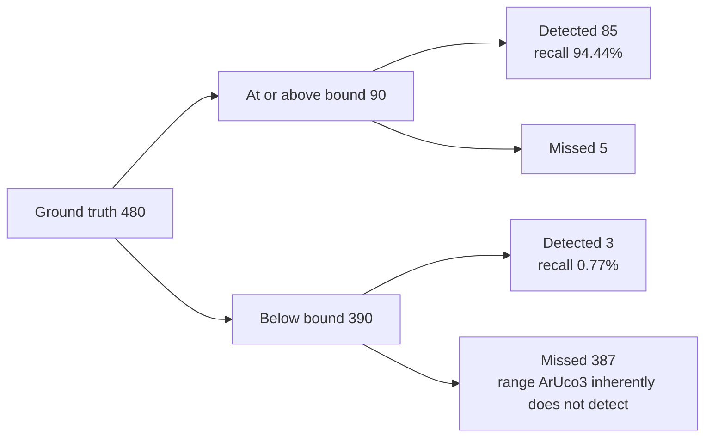

# Accuracy Evaluation Results

## Purpose

This document measures the three routes, CPU reference, Hybrid, and CUDA-Resident, against the ground truth of the synthetic corpus, and presents the accuracy metrics defined by the [evaluation plan](evaluation-plan.md) broken down by condition. Comparison of end-to-end times is handled by the [benchmark summary](benchmark-report.md).

## Scope

- The target is the 91 scenes of corpus preset `full`, with 480 ground truth markers.
- Measurements are taken on three machines: DGX Spark GB10, Jetson AGX Orin, and GeForce RTX 5070 Ti. The configuration is two integrated-GPU machines and one discrete-GPU machine.
- The dictionary is fixed to `DICT_ARUCO_MIP_36h12`.
- Real images are out of scope. The evaluation is limited to the synthetic corpus.

Route names follow the [benchmark summary](benchmark-report.md). `CPU` is OpenCV's CPU implementation, `Hybrid` is the route that performs everything from contour extraction onward on the host, and `CUDA-Resident` is the route that completes all detection stages on the GPU. The evaluator's output displays `CUDA-Resident` as `CUDA`.

## Current state

### Overall

These are the results with the ArUco3 detection strategy enabled. All three routes detect the same 88 markers. The columns of the table do not share one denominator, so each header names the division it belongs to. Precision, rotation match, corner RMSE, and corner max are over the 88 detections. Recall (overall) is over all 480 ground truth markers, and recall (at or above bound) is over the 90 ground truth markers at or above the ArUco3 bound. The evaluator does not define precision for the at-or-above-bound division, because a false positive has no ground truth marker to take a side length from.

| Machine | Route | precision (all detections) | recall (overall, 480 truth) | recall (at or above bound, 90 truth) | rotation match (all detections) | Corner RMSE (all detections) | Corner max (all detections) |
| --- | --- | --- | --- | --- | --- | --- | --- |
| DGX Spark GB10 | CPU | 100.00% | 18.33% | 94.44% | 88/88 | 0.5184 px | 3.6351 px |
| DGX Spark GB10 | Hybrid | 100.00% | 18.33% | 94.44% | 88/88 | 0.5184 px | 3.6351 px |
| DGX Spark GB10 | CUDA-Resident | 100.00% | 18.33% | 94.44% | 88/88 | 0.4806 px | 1.0936 px |
| Jetson AGX Orin | CPU | 100.00% | 18.33% | 94.44% | 88/88 | 0.5184 px | 3.6351 px |
| Jetson AGX Orin | Hybrid | 100.00% | 18.33% | 94.44% | 88/88 | 0.5184 px | 3.6351 px |
| Jetson AGX Orin | CUDA-Resident | 100.00% | 18.33% | 94.44% | 88/88 | 0.4806 px | 1.0936 px |
| GeForce RTX 5070 Ti | CPU | 100.00% | 18.33% | 94.44% | 88/88 | 0.5042 px | 3.6351 px |
| GeForce RTX 5070 Ti | Hybrid | 100.00% | 18.33% | 94.44% | 88/88 | 0.5042 px | 3.6351 px |
| GeForce RTX 5070 Ti | CUDA-Resident | 100.00% | 18.33% | 94.44% | 88/88 | 0.4653 px | 1.0936 px |

Precision is 100.00% across all 9 combinations of 3 routes x 3 machines. There is not a single false positive anywhere in 91 scenes x 3 routes x 3 machines, and there are zero detections with an incorrect ID. The evaluator counts a misread ID as a false positive as well as a false negative, so precision at 100.00% is what rules ID errors out. Rotation matches the ground truth for all 88 detections, and 85 of those 88 are at or above the ArUco3 bound. The 9 combinations cover only the ArUco3-enabled measurements. The ArUco3-disabled runs of the same 3 routes x 3 machines are a separate set of 9, reported under "Differences with the ArUco3 strategy and subpixel refinement turned off" below.

The RMSE values differ between the two aarch64 machines and the x86_64 machine **because the corpus images themselves do not match across architectures**. See "Corpus reproducibility" below. As long as routes are compared within the same machine, this difference does not enter.

### Why recall is presented in three divisions

The ArUco3 detection strategy inherently cannot detect markers whose side length after downscaling falls below `minSideLengthCanonicalImg`. With L as the long side of the original image, the bound is determined by `S + L * tau_i`, which with the defaults (S=32, tau_i=0.05) gives the following values.

| Resolution | Lower bound on the detectable side length |
| --- | --- |
| 640x480 | 64 px |
| 1280x720 | 96 px |
| 1920x1080 | 128 px |
| 3840x2160 | 224 px |

The evaluator classifies a ground truth marker as "at or above bound" when `side_px >= S + L * tau_i`, comparing the nominal side length of the marker against the bound (`tools/evaluate/main.cpp`, `record()`). `tau_i` is held as a `float`, and `0.05F` is slightly larger than 0.05, so the threshold actually compared against is slightly above the values in the table: 64.0000005, 96.0000010, 128.0000014, and 224.0000029 px. **A marker whose side length is exactly the value in the table therefore lands on the "below bound" side of the division.** The corpus contains 74 such markers.

The corpus deliberately includes sizes below this bound. Therefore recall computed with all 480 ground truth markers as the denominator measures the strategy's inherent bound rather than misses by the implementation. The denominator splits as follows.



The 387 at the bottom right of the diagram are what pushes the overall recall down to 18.33%. The values per division are as follows.

| Division | Ground truth | Detected | recall |
| --- | --- | --- | --- |
| All | 480 | 88 | 18.33% |
| At or above bound | 90 | 85 | 94.44% |
| Below bound | 390 | 3 | 0.77% |

The figure that represents misses by the implementation is 94.44%. Quoting 18.33% on its own leads to misreading the strategy's inherent bound as a defect of the implementation.

All 3 detections in the "below bound" division are markers sitting exactly on the bound of their resolution. The other 316 markers below the bound produce no detection at all.

| Resolution | Bound | Ground truth markers whose side is exactly the bound | Detected |
| --- | --- | --- | --- |
| 640x480 | 64 px | 21 (64 px side) | 2 |
| 1280x720 | 96 px | 32 (96 px side) | 1 |
| 1920x1080 | 128 px | 21 (128 px side) | 0 |
| 3840x2160 | 224 px | 0 (preset `full` has no 224 px side) | - |

These counts are derived by cross-checking the "By marker side length" and "By resolution" tables of `docs/measurements/2026-08-29-<machine>-accuracy.txt` against the scene list of preset `full`; the evaluator does not print the two breakdowns crossed with each other. The three routes agree on every cell. **A marker exactly at the bound is mostly not detected.** At 640x480 the downscale factor is exactly `S / (S + L * tau_i)` = 0.5, so a 64 px marker becomes exactly 32 px in the canonical image and whether it survives the resampling is marginal. This is the behavior the header comment of `minimum_detectable_side_px()` warns about.

### By condition (markers at or above the bound only)

These are the values for the DGX Spark GB10. The recall of CPU and CUDA-Resident matches under every condition. Every degradation condition contributes exactly 4 markers here, all of them from its 640x480 scene: the degradation scenes place 96 px markers, and at 1280x720 and above a 96 px side does not reach the bound, so those markers fall into the "below bound" division.

| Condition | Ground truth | recall | CPU corner RMSE | CUDA-Resident corner RMSE |
| --- | --- | --- | --- | --- |
| clean | 58 | 100.00% | 0.4910 px | 0.4911 px |
| rotation (37 degrees) | 4 | 100.00% | 0.3778 px | 0.3778 px |
| perspective (0.6) | 4 | 100.00% | 0.4778 px | 0.4775 px |
| blur (sigma 2.0) | 4 | 100.00% | 0.7052 px | 0.7020 px |
| noise (sigma 12) | 4 | 100.00% | 0.4257 px | 0.4257 px |
| illumination (0.8) | 4 | 100.00% | 0.3778 px | 0.3778 px |
| occlusion (25%) | 4 | 75.00% | 1.1497 px | 0.4722 px |
| border (clipping) | 4 | 75.00% | 0.3064 px | 0.3056 px |
| combined | 4 | 25.00% | 0.4317 px | 0.4215 px |

There are 5 misses, broken down into 3 from combined degradation, 1 from occlusion, and 1 from border clipping. Rotation, perspective distortion, blur, noise, and illumination differences drop not a single marker on their own. What is dropped are cases where degradations overlap and cases where part of the marker is outside the image or under an occluding object.

The corner RMSE is exactly equal for both routes in 3 of the 9 conditions: rotation, noise, and illumination. **It differs in the other 6.** Under clean, CPU is smaller by 0.0001 px (0.4910 px against 0.4911 px). Under perspective, blur, border, and combined, CUDA-Resident is smaller, but by at most 0.0102 px (combined, 0.4317 px against 0.4215 px); the other three differ by 0.0003, 0.0032, and 0.0008 px. Occlusion is the only condition where the difference is larger than the last displayed digits, 1.1497 px against 0.4722 px, and it rests on the 3 occlusion detections at or above the bound. Neither the small differences nor the occlusion one should be read as a general superiority.

### Differences from the CPU reference

These are the results of comparing 91 scenes on the same machine.

| Machine | Hybrid vs CPU | CUDA-Resident vs CPU |
| --- | --- | --- |
| DGX Spark GB10 | 91/91 images match, max difference 0.000 px | 90/91 images match, max difference 3.804 px |
| Jetson AGX Orin | 91/91 images match, max difference 0.000 px | 90/91 images match, max difference 3.804 px |
| GeForce RTX 5070 Ti | 91/91 images match, max difference 0.000 px | 90/91 images match, max difference 3.804 px |

The Hybrid route matches the CPU reference results exactly on all three machines. Because Hybrid performs everything from contour extraction onward on the host, this result is predictable from the structure of the route.

The CUDA-Resident route disagrees with the CPU reference results in only one detection in one scene. It is ID 140 in `occlusion_640x480`, where the corners differ by 3.804 px. The error against the ground truth is 3.6351 px for CPU and 1.0936 px for CUDA-Resident, so **in this one case CUDA-Resident is closer to the ground truth**. For a candidate whose contour was broken by occlusion, the two implementations converged to different local solutions. However, the denominator is a single case, and this is not a sample from which superiority in accuracy can be claimed.

### Differences with the ArUco3 strategy and subpixel refinement turned off

`--use-aruco3 0` turns off the ArUco3 detection strategy and subpixel refinement **at the same time**. In this implementation the two cannot be toggled independently. Since dropping the downscaling puts every marker above the detection bound, **the number of detections itself changes** (detections by the CPU reference increase from 88 to 436). Note that the counts below have a different denominator from the ArUco3-enabled case.

| Machine | CUDA-Resident vs CPU | Breakdown |
| --- | --- | --- |
| DGX Spark GB10 | 82/91 images match, max difference 1.414 px | 18 corner deviations, 3 extra detections |
| Jetson AGX Orin | 82/91 images match, max difference 1.414 px | 18 corner deviations, 3 extra detections |
| GeForce RTX 5070 Ti | 82/91 images match, max difference 1.414 px | 18 corner deviations, 3 extra detections |

Every difference is exactly 1.414 px, that is, sqrt(2). This is the distance of a diagonal one-pixel shift of integer-coordinate corners, and it is the difference in the corner estimation method appearing directly. This implementation uses extreme point search, while OpenCV uses polygon approximation of the contour (see [detection pipeline design](design/detector-pipeline.md) for details). Of the 18 cases, 16 are blur scenes.

**The reduction from 18 cases to 1 is not due to subpixel refinement alone.** It is also because the denominator changes. Enabling ArUco3 reduces detections from 436 to 88, and of the 18 corner deviations, **only 6 remain as detection targets at all** (4 in `blur_640x480`, 1 in `occlusion_640x480`, 1 in `perspective_640x480`). The remaining 12 blur cases are in scenes of 1280x720 or larger and are not detected, because their side length after downscaling falls below the detection bound.

**Looking at the 6 cases common to both, subpixel refinement absorbs 5 of the 1.414 px deviations, and only the single occlusion case remains.** This is the actual effect of the refinement.

The "3 extra detections" are markers that the CPU missed and CUDA-Resident detected. All 3 are in combined degradation scenes, and precision remains 100%. Recall without refinement, with 480 ground truth markers as the denominator, is as follows.

| Machine | CPU detections / recall | CUDA-Resident detections / recall |
| --- | --- | --- |
| DGX Spark GB10 | 436 / 90.83% | 439 / 91.46% |
| Jetson AGX Orin | 436 / 90.83% | 439 / 91.46% |
| GeForce RTX 5070 Ti | 435 / 90.62% | 438 / 91.25% |

Without refinement, the corner error against the ground truth is also smaller for CUDA-Resident.

| Machine | CPU corner RMSE | CUDA-Resident corner RMSE |
| --- | --- | --- |
| DGX Spark GB10 | 0.8779 px | 0.8337 px |
| Jetson AGX Orin | 0.8779 px | 0.8337 px |
| GeForce RTX 5070 Ti | 0.8653 px | 0.8204 px |

The difference is large when limited to blur scenes: 1.6282 px for CPU against 0.8068 px for CUDA-Resident. On blurred edges, extreme point search returns corners closer to the ground truth than polygon approximation does. However, **the denominator for this comparison is only 16 markers**. We treat it as a tendency, not a conclusion.

### Device memory

This is the workspace of the CUDA-Resident route. The values are the same on all three machines. The evaluator records bytes; **MB below is 10^6 bytes, not 2^20**, and the MiB (2^20) equivalent is given alongside.

| Configuration | Peak workspace usage | Allocated capacity | Increase in allocation count over 91 detections |
| --- | --- | --- | --- |
| ArUco3 enabled | 17,512,724 bytes = 17.51 MB (16.70 MiB) | 22,685,440 bytes = 22.69 MB (21.64 MiB) | 0 |
| ArUco3 disabled | 414,514,452 bytes = 414.51 MB (395.31 MiB) | 414,514,944 bytes = 414.51 MB (395.31 MiB) | 0 |

In the ArUco3 disabled row the usage and the capacity are not the same number; they differ by 492 bytes and both round to 414.51 MB.

There is not a single `cudaMalloc` during detection. Allocation is finished at initialization, and detection operates only within the already allocated region.

Disabling the ArUco3 detection strategy multiplies the peak usage by 23.7 (414,514,452 / 17,512,724). This is because the image is not downscaled, so segmentation and thresholding are performed at full scale. The maximum is determined by the 3840x2160 scenes.

### Corpus reproducibility

Corpus images generated from the same seed **do not match across machines**.

The only per-scene image hashes kept in `docs/measurements/` are the `image_sha256` fields of `2026-08-29-<machine>-sweep.jsonl`, and those cover the 28 benchmark scenes, not all 91. **The comparison below is therefore over 28 scenes.** For the remaining 63 scenes of preset `full` no hash was recorded, so how many of the 91 differ is not something these measurements can answer.

| Machine pair | Scenes whose hash differs, of the 28 benchmark scenes |
| --- | --- |
| DGX Spark GB10 vs GeForce RTX 5070 Ti (aarch64 vs x86_64) | 18 |
| Jetson AGX Orin vs GeForce RTX 5070 Ti (aarch64 vs x86_64) | 18 |
| DGX Spark GB10 vs Jetson AGX Orin (both aarch64) | 6 |

Across architectures the two aarch64 machines differ from the x86_64 machine in the same 18 scenes: all 4 `combined`, all 4 `noise`, 3 of the 4 `blur` (1280x720 and larger), and 7 of the 16 `clean` scenes.

**The architecture difference is not the only cause.** Among the same 28 scenes, **the hashes differ for 6 scenes (the 4 resolutions of `combined`, `blur_3840x2160`, and `noise_3840x2160`) even between the DGX Spark GB10 and the Jetson AGX Orin, both aarch64**. These two machines have the same OpenCV version, but differ in OS (Ubuntu 24.04 versus 20.04), CUDA Toolkit (13.0 versus 11.4), and compiler.

A pixel-level comparison of the differing scenes was not kept in `docs/measurements/`; only the hashes are on record, and a hash says that two images differ but not by how much. The magnitude of the difference is therefore not stated here. The corpus generator uses OpenCV's `warpPerspective` and `GaussianBlur`. We believe the cause is that SIMD paths and rounding do not agree across build environments, but the isolation has not been completed. **This needs to be explained by the difference in build environment, not architecture.**

**This difference affects only comparisons of numbers across machines.** It does not affect measurements comparing CPU and CUDA-Resident within the same machine. Both see the same image. The magnitude of the effect is the difference between corner RMSE 0.5184 px and 0.5042 px, that is, 2.7%.

### Execution environment

| Item | DGX Spark GB10 | Jetson AGX Orin | GeForce RTX 5070 Ti |
| --- | --- | --- | --- |
| OS | Ubuntu 24.04.4 LTS | Ubuntu 20.04.6 LTS | Ubuntu 24.04.4 LTS |
| architecture | aarch64 | aarch64 | x86_64 |
| CPU | Cortex-X925 x10 + A725 x10 | Cortex-A78AE x12 | Core Ultra 7 265 |
| GPU | NVIDIA GB10 (integrated) | Orin (integrated) | RTX 5070 Ti (discrete) |
| Compute Capability | 12.1 | 8.7 | 12.0 |
| CUDA Toolkit | 13.0 | 11.4 | 13.0 |
| driver | 580.95.05 | not recorded (see note) | 610.43.02 |
| power mode | not specified | MAXN (0) | not specified |
| GPU max clock | 3003 MHz | 1300 MHz | 3090 MHz |
| OpenCV | 4.14.0 (`0654a42e`) | 4.14.0 (`0654a42e`) | 4.14.0 (`0654a42e`) |

Note: The Jetson AGX Orin has no `nvidia-smi`, so the driver version cannot be obtained by the same procedure.

Power mode and clock are recorded in the `environment` line of the benchmark measurement results (`docs/measurements/2026-08-29-<machine>-sweep.jsonl`). The accuracy evaluation results do not depend on the clock, so they are not included in the evaluator's output.

## Goals

- Produce the same metrics in the same divisions, using the annotation results of a real-image dataset as ground truth.
- Save visualization images of the scenes with discrepancies as artifacts.
- Decide whether to make corpus generation independent of the build environment or to distribute a pre-generated corpus.

## Open questions

- The cause of corpus images not matching across architectures. We suspect OpenCV's SIMD paths, but have not isolated which function.
- At which stage the 3 misses under combined degradation are dropped. We have not identified whether it is thresholding, contours, or dictionary matching.
- Why extreme point search returns corners closer to the ground truth in blur scenes. With a denominator of only 16 markers, nothing beyond a tendency can be said.
- How to handle markers whose side length is exactly the bound (64 px at 640x480, 96 px at 1280x720, 128 px at 1920x1080). Their ground truth side length is exactly the nominal bound, but the threshold the evaluator compares against is a few times 10^-7 px larger because `tau_i` is a `float`, so they land in the "below bound" division. Whether the comparison should be made tolerant, and on which side of the division these markers belong, has not been settled.
- How much of the corpus differs across build environments. Hashes exist for the 28 benchmark scenes only, and no pixel-level comparison was retained.

## Appendix: Reproducing the measurements

```
# Run inside the container. <preset> is the build preset for the machine.
B=./build/<preset>/tools/evaluate/aruco3cuda_evaluate

# Measurement with the ArUco3 detection strategy enabled
$B --preset full --corpus-dir /tmp/c --output accuracy.json

# Measurement with the ArUco3 detection strategy disabled (isolates where the differences come from)
$B --preset full --corpus-dir /tmp/c --use-aruco3 0 --output accuracy-noaruco3.json
```

The corpus is generated from a seed by this tool, so no prior generation is required. The seed and preset used for generation are the same as `aruco3cuda_corpusgen`, producing the same images.

The results are in `docs/measurements/2026-08-29-<machine>-accuracy{,-noaruco3}.{json,txt}`.

## Across the bundled dictionaries

Every bundled dictionary was evaluated on all three machines with the same procedure as above: `aruco3cuda_evaluate --dictionary <name>`, the `full` preset, 91 scenes, seed 20260827. Seventeen runs per machine, about two minutes each machine. The data is in [docs/measurements](measurements/), one file per machine.

The corpus is regenerated with the dictionary under test, because the markers themselves differ. That is the limit of this comparison: a difference in recall between two dictionaries mixes the dictionary with the images it produced, and cannot be attributed to either.

### Results, CUDA route, markers at or above the ArUco3 lower bound

| Dictionary | Bits | Detected | Recall | Precision | Corner RMSE | Workspace peak |
| --- | --- | --- | --- | --- | --- | --- |
| `DICT_4X4_50` | 4 | 82 / 90 | 0.911 | 1.000 | 0.484 px | 14.51 MB |
| `DICT_4X4_100` | 4 | 82 / 90 | 0.911 | 1.000 | 0.484 px | 14.51 MB |
| `DICT_4X4_250` | 4 | 82 / 90 | 0.911 | 1.000 | 0.484 px | 14.51 MB |
| `DICT_4X4_1000` | 4 | 83 / 90 | 0.922 | 1.000 | 0.482 px | 14.51 MB |
| `DICT_5X5_50` | 5 | 83 / 90 | 0.922 | 1.000 | 0.483 px | 15.53 MB |
| `DICT_5X5_100` | 5 | 83 / 90 | 0.922 | 1.000 | 0.483 px | 15.53 MB |
| `DICT_5X5_250` | 5 | 83 / 90 | 0.922 | 1.000 | 0.483 px | 15.53 MB |
| `DICT_5X5_1000` | 5 | 82 / 90 | 0.911 | 1.000 | 0.484 px | 15.53 MB |
| `DICT_6X6_50` | 6 | 86 / 90 | 0.956 | 1.000 | 0.482 px | 16.70 MB |
| `DICT_6X6_100` | 6 | 84 / 90 | 0.933 | 1.000 | 0.482 px | 16.70 MB |
| `DICT_6X6_250` | 6 | 86 / 90 | 0.956 | 1.000 | 0.482 px | 16.70 MB |
| `DICT_6X6_1000` | 6 | 84 / 90 | 0.933 | 1.000 | 0.484 px | 16.70 MB |
| `DICT_7X7_50` | 7 | 85 / 90 | 0.944 | 1.000 | 0.481 px | 18.03 MB |
| `DICT_7X7_100` | 7 | 85 / 90 | 0.944 | 1.000 | 0.483 px | 18.03 MB |
| `DICT_7X7_250` | 7 | 85 / 90 | 0.944 | 1.000 | 0.481 px | 18.03 MB |
| `DICT_7X7_1000` | 7 | 87 / 90 | 0.967 | 1.000 | 0.519 px | 18.03 MB |
| `DICT_ARUCO_MIP_36h12` | 6 | 85 / 90 | 0.944 | 1.000 | 0.483 px | 16.70 MB |

### What holds everywhere

**Precision is 1.000 for all seventeen, on all three machines.** Not one false positive in 51 runs.

**Rotation agreement is 100%** in every run.

**Recall is identical on all three machines**, dictionary by dictionary, to the last digit. The implementation produces the same detections on Blackwell, Ampere, and a discrete GPU.

### What differs, and why

**Workspace peak scales with the marker size and with nothing else**: 14.51 MB at 4x4, 15.53 MB at 5x5, 16.70 MB at 6x6, 18.03 MB at 7x7, the same value for every dictionary of a given size regardless of its code count. That follows from the canonical patch being `(bits + 2 * border) * perspective_remove_pixel_per_cell` pixels on a side. It is the one structural difference between dictionaries that the measurements show cleanly.

**Corner RMSE differs by architecture, not by dictionary.** The two aarch64 machines agree exactly; the GeForce RTX 5070 Ti is lower by about 0.015 px for every dictionary. That is the corpus difference already recorded in the README: the same seed produces slightly different images on x86_64, so the ground truth the corners are measured against is not the same image.

**Recall varies from 0.911 to 0.967, and this should not be read as a ranking.** The same marker size spans 0.911 to 0.922 at 4x4 and 5x5, and 0.933 to 0.956 at 6x6, so the spread within one size is as large as the spread between sizes. With a corpus that changes along with the dictionary, this measurement cannot separate the two.

`DICT_7X7_1000` is the one outlier worth noting: 0.519 px RMSE with a 3.64 px maximum, against 0.48 px and about 1.0 px everywhere else. Whether one bad detection drives it has not been checked.

## See also

- [Evaluation plan](evaluation-plan.md)
- [Benchmark summary](benchmark-report.md)
- [Detection pipeline design](design/detector-pipeline.md)
- [Supported dictionaries](dictionaries.md)
- [Accuracy evaluation CLI](../tools/evaluate/main.md)
- [Accuracy evaluation metrics](../tools/evaluate/accuracy.md)
