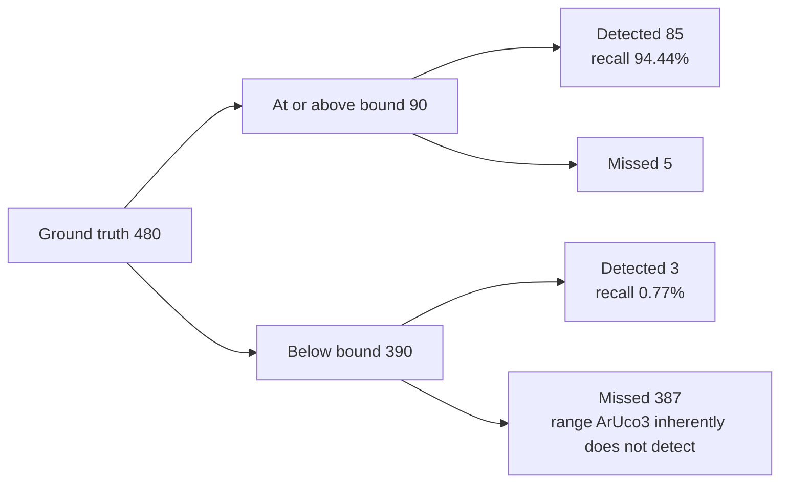

# Accuracy Evaluation Results

## Purpose

This document measures the three routes, CPU reference, Hybrid, and CUDA-Resident, against the ground truth of the synthetic corpus, and presents the accuracy metrics defined by the [evaluation plan](evaluation-plan.md) broken down by condition. Comparison of end-to-end times is handled by the [benchmark summary](benchmark-report.md).

## Scope

- The target is the 91 scenes of corpus preset `full`, with 480 ground truth markers.
- Measurements are taken on three machines: DGX Spark GB10, Jetson AGX Orin, and GeForce RTX 5070 Ti. The configuration is two integrated-GPU machines and one discrete-GPU machine.
- The dictionary is fixed to `DICT_ARUCO_MIP_36h12`.
- Real images are out of scope. The evaluation is limited to the synthetic corpus.

Route names follow the [benchmark summary](benchmark-report.md). `CPU` is OpenCV's CPU implementation, `Hybrid` is the route that performs everything from contour extraction onward on the host, and `CUDA-Resident` is the route that completes all detection stages on the GPU. The evaluator's output displays `CUDA-Resident` as `CUDA`.

## Current state

### Overall

These are the results with the ArUco3 detection strategy enabled. All three routes detect the same 88 markers. The corner RMSE and maximum are values over these 88 detections.

| Machine | Route | precision | recall (overall) | recall (at or above bound) | rotation match | Corner RMSE | Corner max |
| --- | --- | --- | --- | --- | --- | --- | --- |
| DGX Spark GB10 | CPU | 100.00% | 18.33% | 94.44% | 85/85 | 0.5184 px | 3.6351 px |
| DGX Spark GB10 | Hybrid | 100.00% | 18.33% | 94.44% | 85/85 | 0.5184 px | 3.6351 px |
| DGX Spark GB10 | CUDA-Resident | 100.00% | 18.33% | 94.44% | 85/85 | 0.4806 px | 1.0936 px |
| Jetson AGX Orin | CPU | 100.00% | 18.33% | 94.44% | 85/85 | 0.5184 px | 3.6351 px |
| Jetson AGX Orin | Hybrid | 100.00% | 18.33% | 94.44% | 85/85 | 0.5184 px | 3.6351 px |
| Jetson AGX Orin | CUDA-Resident | 100.00% | 18.33% | 94.44% | 85/85 | 0.4806 px | 1.0936 px |
| GeForce RTX 5070 Ti | CPU | 100.00% | 18.33% | 94.44% | 85/85 | 0.5042 px | 3.6351 px |
| GeForce RTX 5070 Ti | Hybrid | 100.00% | 18.33% | 94.44% | 85/85 | 0.5042 px | 3.6351 px |
| GeForce RTX 5070 Ti | CUDA-Resident | 100.00% | 18.33% | 94.44% | 85/85 | 0.4653 px | 1.0936 px |

Precision is 100.00% across all 18 combinations. There is not a single false positive anywhere in 91 scenes x 3 routes x 3 machines, and there are zero detections with an incorrect ID. Rotation matches the ground truth for the 85 of the 88 detections that are at or above the ArUco3 bound.

The RMSE values differ between the two aarch64 machines and the x86_64 machine **because the corpus images themselves do not match across architectures**. See "Corpus reproducibility" below. As long as routes are compared within the same machine, this difference does not enter.

### Why recall is presented in three divisions

The ArUco3 detection strategy inherently cannot detect markers whose side length after downscaling falls below `minSideLengthCanonicalImg`. With L as the long side of the original image, the bound is determined by `S + L * tau_i`, which with the defaults (S=32, tau_i=0.05) gives the following values.

| Resolution | Lower bound on the detectable side length |
| --- | --- |
| 640x480 | 64 px |
| 1280x720 | 96 px |
| 1920x1080 | 128 px |
| 3840x2160 | 224 px |

The corpus deliberately includes sizes below this bound. Therefore recall computed with all 480 ground truth markers as the denominator measures the strategy's inherent bound rather than misses by the implementation. The denominator splits as follows.



The 387 at the bottom right of the diagram are what pushes the overall recall down to 18.33%. The values per division are as follows.

| Division | Ground truth | Detected | recall |
| --- | --- | --- | --- |
| All | 480 | 88 | 18.33% |
| At or above bound | 90 | 85 | 94.44% |
| Below bound | 390 | 3 | 0.77% |

The figure that represents misses by the implementation is 94.44%. Quoting 18.33% on its own leads to misreading the strategy's inherent bound as a defect of the implementation. Three markers below the bound are detected because the bound is a boundary rather than a step, and markers that fall just below it can sometimes be detected.

### By condition (markers at or above the bound only)

These are the values for the DGX Spark GB10. The recall of CPU and CUDA-Resident matches under every condition.

| Condition | Ground truth | recall | CPU corner RMSE | CUDA-Resident corner RMSE |
| --- | --- | --- | --- | --- |
| clean | 58 | 100.00% | 0.4910 px | 0.4911 px |
| rotation (37 degrees) | 4 | 100.00% | 0.3778 px | 0.3778 px |
| perspective (0.6) | 4 | 100.00% | 0.4778 px | 0.4775 px |
| blur (sigma 2.0) | 4 | 100.00% | 0.7052 px | 0.7020 px |
| noise (sigma 12) | 4 | 100.00% | 0.4257 px | 0.4257 px |
| illumination (0.8) | 4 | 100.00% | 0.3778 px | 0.3778 px |
| occlusion (25%) | 4 | 75.00% | 1.1497 px | 0.4722 px |
| border (clipping) | 4 | 75.00% | 0.3064 px | 0.3056 px |
| combined | 4 | 25.00% | 0.4317 px | 0.4215 px |

There are 5 misses, broken down into 3 from combined degradation, 1 from occlusion, and 1 from border clipping. Rotation, perspective distortion, blur, noise, and illumination differences drop not a single marker on their own. What is dropped are cases where degradations overlap and cases where part of the marker is outside the image or under an occluding object.

Apart from occlusion, the corner RMSE is nearly the same value for both routes. Under the clean condition, CPU is slightly smaller at 0.4910 px against CUDA-Resident's 0.4911 px, and for noise, illumination, and rotation the values are exactly equal. A difference appears only in the single occlusion condition, and this should not be read as a general superiority.

### Differences from the CPU reference

These are the results of comparing 91 scenes on the same machine.

| Machine | Hybrid vs CPU | CUDA-Resident vs CPU |
| --- | --- | --- |
| DGX Spark GB10 | 91/91 images match, max difference 0.000 px | 90/91 images match, max difference 3.804 px |
| Jetson AGX Orin | 91/91 images match, max difference 0.000 px | 90/91 images match, max difference 3.804 px |
| GeForce RTX 5070 Ti | 91/91 images match, max difference 0.000 px | 90/91 images match, max difference 3.804 px |

The Hybrid route matches the CPU reference results exactly on all three machines. Because Hybrid performs everything from contour extraction onward on the host, this result is predictable from the structure of the route.

The CUDA-Resident route disagrees with the CPU reference results in only one detection in one scene. It is ID 140 in `occlusion_640x480`, where the corners differ by 3.804 px. The error against the ground truth is 3.6351 px for CPU and 1.0936 px for CUDA-Resident, so **in this one case CUDA-Resident is closer to the ground truth**. For a candidate whose contour was broken by occlusion, the two implementations converged to different local solutions. However, the denominator is a single case, and this is not a sample from which superiority in accuracy can be claimed.

### Differences with the ArUco3 strategy and subpixel refinement turned off

`--use-aruco3 0` turns off the ArUco3 detection strategy and subpixel refinement **at the same time**. In this implementation the two cannot be toggled independently. Since dropping the downscaling puts every marker above the detection bound, **the number of detections itself changes** (detections by the CPU reference increase from 88 to 436). Note that the counts below have a different denominator from the ArUco3-enabled case.

| Machine | CUDA-Resident vs CPU | Breakdown |
| --- | --- | --- |
| DGX Spark GB10 | 82/91 images match, max difference 1.414 px | 18 corner deviations, 3 extra detections |
| Jetson AGX Orin | 82/91 images match, max difference 1.414 px | 18 corner deviations, 3 extra detections |
| GeForce RTX 5070 Ti | 82/91 images match, max difference 1.414 px | 18 corner deviations, 3 extra detections |

Every difference is exactly 1.414 px, that is, sqrt(2). This is the distance of a diagonal one-pixel shift of integer-coordinate corners, and it is the difference in the corner estimation method appearing directly. This implementation uses extreme point search, while OpenCV uses polygon approximation of the contour (see [detection pipeline design](design/detector-pipeline.md) for details). Of the 18 cases, 16 are blur scenes.

**The reduction from 18 cases to 1 is not due to subpixel refinement alone.** It is also because the denominator changes. Enabling ArUco3 reduces detections from 436 to 88, and of the 18 corner deviations, **only 6 remain as detection targets at all** (4 in `blur_640x480`, 1 in `occlusion_640x480`, 1 in `perspective_640x480`). The remaining 12 blur cases are in scenes of 1280x720 or larger and are not detected, because their side length after downscaling falls below the detection bound.

**Looking at the 6 cases common to both, subpixel refinement absorbs 5 of the 1.414 px deviations, and only the single occlusion case remains.** This is the actual effect of the refinement.

The "3 extra detections" are markers that the CPU missed and CUDA-Resident detected. All 3 are in combined degradation scenes, and precision remains 100%. Recall without refinement, with 480 ground truth markers as the denominator, is as follows.

| Machine | CPU detections / recall | CUDA-Resident detections / recall |
| --- | --- | --- |
| DGX Spark GB10 | 436 / 90.83% | 439 / 91.46% |
| Jetson AGX Orin | 436 / 90.83% | 439 / 91.46% |
| GeForce RTX 5070 Ti | 435 / 90.62% | 438 / 91.25% |

Without refinement, the corner error against the ground truth is also smaller for CUDA-Resident.

| Machine | CPU corner RMSE | CUDA-Resident corner RMSE |
| --- | --- | --- |
| DGX Spark GB10 | 0.8779 px | 0.8337 px |
| Jetson AGX Orin | 0.8779 px | 0.8337 px |
| GeForce RTX 5070 Ti | 0.8653 px | 0.8204 px |

The difference is large when limited to blur scenes: 1.6282 px for CPU against 0.8068 px for CUDA-Resident. On blurred edges, extreme point search returns corners closer to the ground truth than polygon approximation does. However, **the denominator for this comparison is only 16 markers**. We treat it as a tendency, not a conclusion.

### Device memory

This is the workspace of the CUDA-Resident route. The values are the same on all three machines.

| Configuration | Peak workspace usage | Allocated capacity | Increase in allocation count over 91 detections |
| --- | --- | --- | --- |
| ArUco3 enabled | 17.51 MB | 22.69 MB | 0 |
| ArUco3 disabled | 414.51 MB | 414.51 MB | 0 |

There is not a single `cudaMalloc` during detection. Allocation is finished at initialization, and detection operates only within the already allocated region.

Disabling the ArUco3 detection strategy multiplies the required amount by 23.7. This is because the image is not downscaled, so segmentation and thresholding are performed at full scale. The maximum is determined by the 3840x2160 scenes.

### Corpus reproducibility

Corpus images generated from the same seed **do not match across machines**. Between the aarch64 DGX Spark GB10 and the x86_64 GeForce RTX 5070 Ti, 54 of the 91 scenes differ.

**The architecture difference is not the only cause.** Comparing the 28 benchmark scenes, **the hashes differ for 6 scenes (the 4 resolutions of `combined`, `blur_3840x2160`, and `noise_3840x2160`) even between the DGX Spark GB10 and the Jetson AGX Orin, both aarch64**. These two machines have the same OpenCV version, but differ in OS (Ubuntu 24.04 versus 20.04), CUDA Toolkit (13.0 versus 11.4), and compiler.

| Scene | Differing pixels | Max difference | Mean difference |
| --- | --- | --- | --- |
| clean_1280x720_n4_s128 | 736 / 921600 (0.0799%) | 4 gray levels | 0.00194 |
| blur_1280x720 | 672 / 921600 (0.0729%) | 1 gray level | 0.00073 |
| rotation_640x480 | 362 / 307200 (0.1178%) | 4 gray levels | 0.00265 |

The differing pixels stay at around 0.1% per scene, and the gray-level difference is at most 4. The corpus generator uses OpenCV's `warpPerspective` and `GaussianBlur`. We believe the cause is that SIMD paths and rounding do not agree across build environments, but the isolation has not been completed. **This needs to be explained by the difference in build environment, not architecture.**

**This difference affects only comparisons of numbers across machines.** It does not affect measurements comparing CPU and CUDA-Resident within the same machine. Both see the same image. The magnitude of the effect is the difference between corner RMSE 0.5184 px and 0.5042 px, that is, 2.7%.

### Execution environment

| Item | DGX Spark GB10 | Jetson AGX Orin | GeForce RTX 5070 Ti |
| --- | --- | --- | --- |
| OS | Ubuntu 24.04.4 LTS | Ubuntu 20.04.6 LTS | Ubuntu 24.04.4 LTS |
| architecture | aarch64 | aarch64 | x86_64 |
| CPU | Cortex-X925 x10 + A725 x10 | Cortex-A78AE x12 | Core Ultra 7 265 |
| GPU | NVIDIA GB10 (integrated) | Orin (integrated) | RTX 5070 Ti (discrete) |
| Compute Capability | 12.1 | 8.7 | 12.0 |
| CUDA Toolkit | 13.0 | 11.4 | 13.0 |
| driver | 580.95.05 | not recorded (see note) | 610.43.02 |
| power mode | not specified | MAXN (0) | not specified |
| GPU max clock | 3003 MHz | 1300 MHz | 3090 MHz |
| OpenCV | 4.14.0 (`0654a42e`) | 4.14.0 (`0654a42e`) | 4.14.0 (`0654a42e`) |

Note: The Jetson AGX Orin has no `nvidia-smi`, so the driver version cannot be obtained by the same procedure.

Power mode and clock are recorded in the `environment` line of the benchmark measurement results (`docs/measurements/2026-08-29-<machine>-sweep.jsonl`). The accuracy evaluation results do not depend on the clock, so they are not included in the evaluator's output.

## Goals

- Produce the same metrics in the same divisions, using the annotation results of a real-image dataset as ground truth.
- Save visualization images of the scenes with discrepancies as artifacts.
- Decide whether to make corpus generation independent of the build environment or to distribute a pre-generated corpus.

## Open questions

- The cause of corpus images not matching across architectures. We suspect OpenCV's SIMD paths, but have not isolated which function.
- At which stage the 3 misses under combined degradation are dropped. We have not identified whether it is thresholding, contours, or dictionary matching.
- Why extreme point search returns corners closer to the ground truth in blur scenes. With a denominator of only 16 markers, nothing beyond a tendency can be said.
- How to handle 96 px markers at 1280x720. The bound is exactly 96 px, and the effective side length of the ground truth falls slightly below it due to rounding, so they do not fall into the "at or above bound" division. The method for deciding the boundary has not been settled.

## Appendix: Reproducing the measurements

```
# Run inside the container. <preset> is the build preset for the machine.
B=./build/<preset>/tools/evaluate/aruco3cuda_evaluate

# Measurement with the ArUco3 detection strategy enabled
$B --preset full --corpus-dir /tmp/c --output accuracy.json

# Measurement with the ArUco3 detection strategy disabled (isolates where the differences come from)
$B --preset full --corpus-dir /tmp/c --use-aruco3 0 --output accuracy-noaruco3.json
```

The corpus is generated from a seed by this tool, so no prior generation is required. The seed and preset used for generation are the same as `aruco3cuda_corpusgen`, producing the same images.

The results are in `docs/measurements/2026-08-29-<machine>-accuracy{,-noaruco3}.{json,txt}`.

## See also

- [Evaluation plan](evaluation-plan.md)
- [Benchmark summary](benchmark-report.md)
- [Detection pipeline design](design/detector-pipeline.md)
- [Supported dictionaries](dictionaries.md)
- [Accuracy evaluation CLI](../tools/evaluate/main.md)
- [Accuracy evaluation metrics](../tools/evaluate/accuracy.md)
