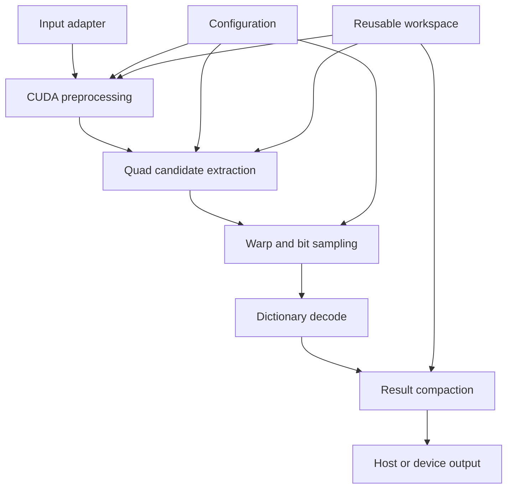

# アーキテクチャ

## 目的

ArUco3 検出を CUDA へ移植する際の責務分割、memory 境界、同期点、CPU 基準実装との関係を定義します。

## 対象範囲

検出器 core、OpenCV adapter、作業領域、設定、結果表現、評価用基準実装を対象とします。姿勢推定と ROS2 integration は対象外です。

## 現状

実装は存在しません。以下は目標アーキテクチャです。

## 目標

### モジュール境界

| モジュール | 責務 |
| --- | --- |
| core | CUDA による検出処理。OpenCV 型への依存を最小化する。 |
| adapter/opencv | `cv::Mat`、`cv::cuda::GpuMat`、OpenCV Dictionary との変換。 |
| reference | OpenCV ArUco3 CPU 実装の実行と比較結果生成。 |
| benchmark | 測定条件固定、warm-up、統計、環境情報保存。 |
| test | 合成画像、実画像、異常入力、境界値の自動検証。 |

### 処理段階

1. 入力画像の形式、寸法、stride、設定を検証する。
2. 最小マーカーサイズに応じた画像ピラミッドを構築する。
3. 二値化と連結成分解析から四角形候補を生成する。
4. 候補ごとに射影変換し、セルを sampling する。
5. border と payload を検証し、Dictionary と照合する。
6. 重複候補を整理し、ID、rotation、四隅、品質値を出力する。

### Memory 方針

- 呼出側から device pointer または `GpuMat` を受け取れるようにする。
- host 入力向け adapter は転送費用を明示的に測定できるようにする。
- 中間 buffer は reusable workspace に保持し、フレームごとの確保を避ける。
- 検出数は可変長のため、上限付き device buffer と最終 count を使用する。
- overflow は無言で切り捨てず、明示的な状態として返す。

### 非同期実行

- API は caller-owned CUDA Stream を受け取る。
- core は不要な `cudaDeviceSynchronize()` を行わない。
- host 結果が必要な API だけが必要な同期を発生させる。
- benchmark では CUDA event を使用し、カーネル時間と wall-clock を分離する。

### Hardware portability

- Jetson Orin は `sm_87`、DGX Spark GB10 は `sm_121`、GeForce RTX 5070 Ti (GB203) は `sm_120` として別々に build する。GB10 の実機が報告する Compute Capability は 12.1 であり、GB203 の 12.0 とは別 target になります。詳細は [ADR-0002](adr/0002-toolchain-and-target-baseline.md) を参照してください。
- algorithm とデータ表現は共通化する。
- Blackwell 固有機能は compile-time option または局所化した kernel specialization とする。
- common path を基準とし、機種固有経路には同じ正確性テストを適用する。

## 実装上の判断

- 初期 API は grayscale `CV_8UC1` 相当の入力へ限定する。
- 検出と姿勢推定を分離する。
- CPU と GPU の役割分担を固定せず、段階別の測定結果からハイブリッド経路を判断する。
- OpenCV CPU 実装の source code を直接 CUDA へ機械的にコピーせず、挙動と論文から独立実装する。

## 未確定事項

- 連結成分解析と contour tracing のどちらを主経路にするか。
- corner refinement の実行場所。
- result compaction に prefix sum、atomic counter、二段階収集のどれを使用するか。
- Dictionary を constant memory、global memory、texture のどこに配置するか。
- OpenCV adapter を同一 library に含めるか別 target にするか。

## 関連

- [検出パイプライン設計](design/detector-pipeline.md)
- [公開 API 草案](design/public-api.md)
- [実装計画](implementation-plan.md)
- [ADR-0002: build 基盤と対象環境の baseline を固定する](adr/0002-toolchain-and-target-baseline.md)
