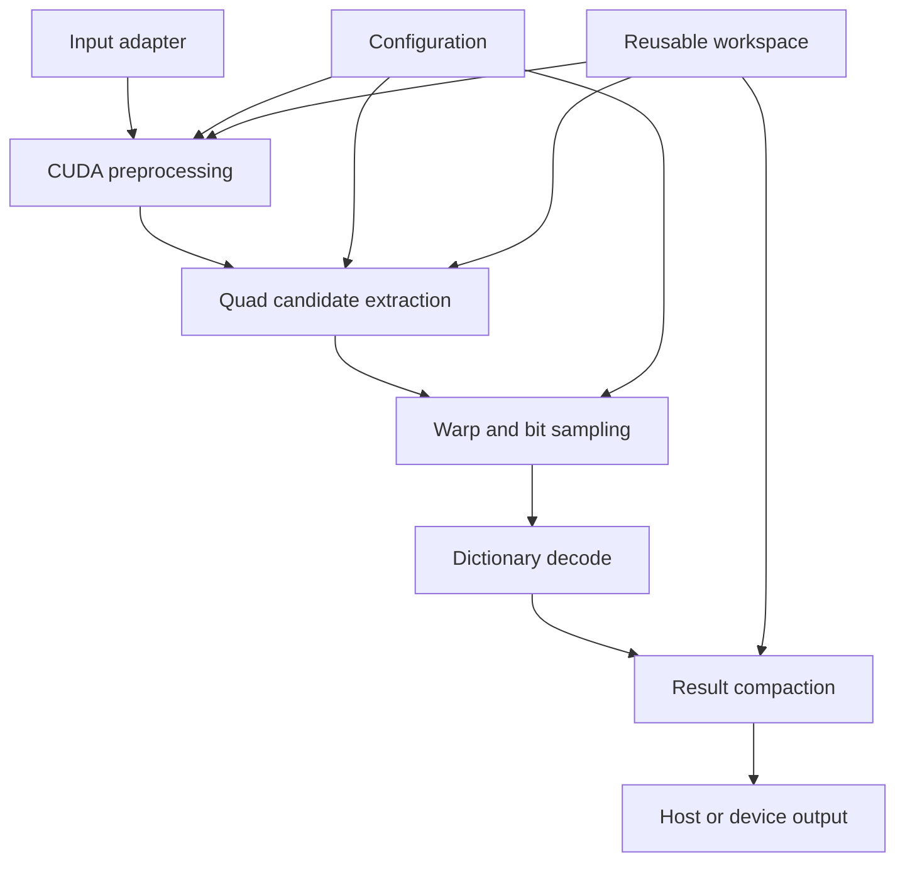

# Architecture

## Purpose

Define the division of responsibilities, the memory boundaries, the synchronization points, and the relationship to the CPU reference implementation when porting ArUco3 detection to CUDA.

## Scope

The scope covers the detector core, the workspace, configuration, the result representation, and the reference implementation and measurement harness used for evaluation. Pose estimation and ROS2 integration are out of scope.

## Current state

Detection is implemented in CUDA all the way from the input to the output of IDs and corners. `aruco3cuda::Detector` chains every stage into a single path and returns results on the device with no host synchronization. The design of each stage is in the [Detection pipeline design](design/detector-pipeline.md), and the public API is in [Public API](design/public-api.md).

The adapter for conversion to and from OpenCV types (`adapter/opencv`) is **not implemented**. The public API does not depend on OpenCV; it takes a device pointer directly as an `ImageViewU8`. The routes that use OpenCV are in `hybrid/` and `reference/`, which are for evaluation and are not part of the public API.

## Structure

### Module boundaries

These correspond to the actual directory structure.

| Module | Location | Responsibility | Public API? |
| --- | --- | --- | --- |
| core | `src/core/` | Detection processing in CUDA. Does not depend on OpenCV | Yes (`include/aruco3cuda/`) |
| dictionary | `src/dictionary/` | The packed codeword table and matching | Yes |
| util | `src/util/` | Shared code that depends on neither CUDA nor OpenCV | Partly (`include/aruco3cuda/util/`) |
| hybrid | `hybrid/` | A comparison route that runs candidate extraction on the GPU and everything after it on the CPU. Requires OpenCV | No |
| reference | `reference/` | Running the OpenCV ArUco3 CPU implementation and saving its results | No |
| bench | `bench/` | Fixing the measurement conditions, warm-up, statistics, and recording environment information | No |
| tools | `tools/` | Corpus generation, dictionary conversion, diff reporting, and accuracy evaluation | No |
| test | `test/` | Automated verification with synthetic images, malformed inputs, and boundary values | No |

`hybrid` and `reference` are instruments for measurement and comparison, not routes offered to users of the library. Both require OpenCV.

### Processing stages

1. Validate the input image format, dimensions, stride, and configuration.
2. Build an image pyramid according to the minimum marker size.
3. Generate quadrilateral candidates from thresholding and connected component analysis.
4. Apply a projective transform per candidate and sample the cells.
5. Verify the border and the payload, and match against the dictionary.
6. Clean up duplicate candidates and output the ID, rotation, corners, and quality value.

### Memory policy

- Take a device pointer from the caller as an `ImageViewU8`. Ownership stays with the caller.
- Separate the kind of input memory (pageable, pinned, managed, device-resident) as a measurement axis.
- Hold intermediate buffers in a reusable workspace, avoiding per-frame allocation.
- The detection count is variable, so a capped device buffer and a final count are used.
- Overflow is not silently truncated; it is returned as an explicit state.

### Asynchronous execution

- The API takes a caller-owned CUDA stream.
- The core does not perform unnecessary `cudaDeviceSynchronize()`.
- Only APIs that need results on the host cause the synchronization they need.
- The benchmark measures wall-clock time. Separating kernel time using CUDA events is not implemented.

### Hardware portability

- Jetson Orin is built as `sm_87`, DGX Spark GB10 as `sm_121`, and GeForce RTX 5070 Ti (GB203) as `sm_120`, each separately. The Compute Capability reported by the GB10 machine is 12.1, which is a different target from GB203's 12.0. See [ADR-0002](adr/0002-toolchain-and-target-baseline.md) for details.
- The algorithm and the data representation are kept common.
- Blackwell-specific features are handled as compile-time options or as localized kernel specializations.
- The common path is the baseline, and the same accuracy tests are applied to machine-specific routes.

## Design decisions

- The public API is limited to 8-bit grayscale input.
- Detection and pose estimation are separated. The output corners are in original-scale coordinates and can be passed directly to `solvePnP` and similar.
- The source code of the OpenCV CPU implementation is not copied mechanically; the implementation is written independently from observable behavior and the paper.
- Candidate extraction uses connected component labeling and extreme point search as its main route. The rationale is in [ADR-0003](adr/0003-candidate-extraction-approach.md).
- Corner refinement is done on the GPU. It directly determines ArUco3 accuracy, so delegating it to the CPU is not acceptable.
- Result compaction is done with our own 3-stage scan.
- The dictionary is kept device-resident in a packed representation with the 4 rotations pre-expanded.

## Open questions

- Whether to provide an adapter for conversion to and from OpenCV types, and if so, whether to include it in the same library or make it a separate target.
- Whether to change adaptive thresholding to an integral image approach.
- Recording per-stage kernel time using CUDA events.

## See also

- [Detection pipeline design](design/detector-pipeline.md)
- [Public API draft](design/public-api.md)
- [Implementation plan](implementation-plan.md)
- [ADR-0002: Fix the build foundation and target environment baseline](adr/0002-toolchain-and-target-baseline.md)
