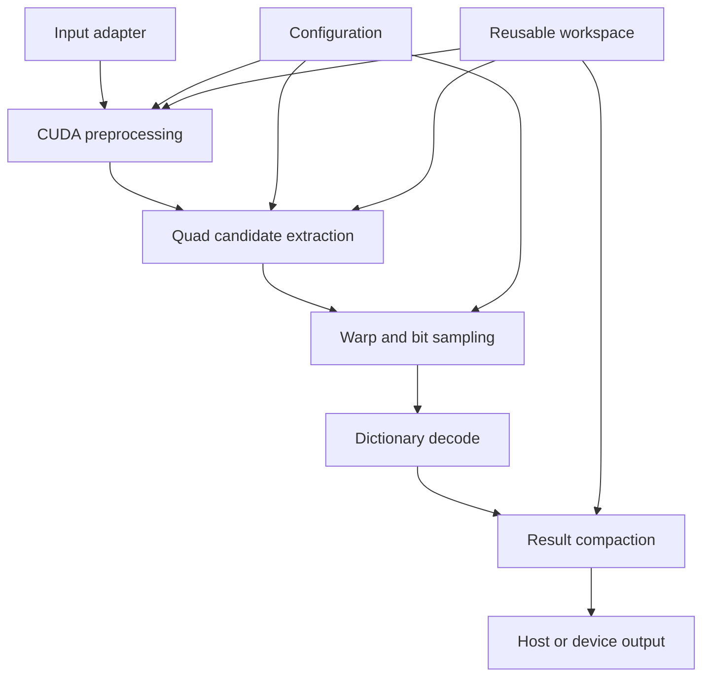

# アーキテクチャ

## 目的

ArUco3 検出を CUDA へ移植する際の責務分割、memory 境界、同期点、CPU 基準実装との関係を定義します。

## 対象範囲

検出器 core、作業領域、設定、結果表現、評価用の基準実装と測定 harness を対象とします。姿勢推定と ROS2 integration は対象外です。

## 現状

検出は入力から ID と四隅の出力まで CUDA で実装済みです。`aruco3cuda::Detector` が全段を 1 本に繋ぎ、host 同期なしで device 上の結果を返します。段ごとの設計は [検出パイプライン設計](design/detector-pipeline.md)、公開 API は [公開 API](design/public-api.md) にあります。

OpenCV 型との変換 adapter (`adapter/opencv`) は**実装していません**。公開 API は OpenCV へ依存せず、`ImageViewU8` として device pointer を直接受け取ります。OpenCV を使う経路は評価用の `hybrid/` と `reference/` にあり、公開 API には含みません。

## 構成

### モジュール境界

実際の directory 構成に対応します。

| module | 場所 | 責務 | 公開 API か |
| --- | --- | --- | --- |
| core | `src/core/` | CUDA による検出処理。OpenCV へ依存しない | はい (`include/aruco3cuda/`) |
| dictionary | `src/dictionary/` | packed codeword table と照合 | はい |
| util | `src/util/` | CUDA にも OpenCV にも依存しない共通処理 | 一部 (`include/aruco3cuda/util/`) |
| hybrid | `hybrid/` | 候補抽出まで GPU、以降を CPU で行う比較用経路。OpenCV を要する | いいえ |
| reference | `reference/` | OpenCV ArUco3 CPU 実装の実行と結果保存 | いいえ |
| bench | `bench/` | 測定条件の固定、warm-up、統計、環境情報の記録 | いいえ |
| tools | `tools/` | corpus 生成、Dictionary 変換、差分報告、正確性評価 | いいえ |
| test | `test/` | 合成画像、異常入力、境界値の自動検証 | いいえ |

`hybrid` と `reference` は測定と比較のための道具であり、library の利用者へ提供する経路ではありません。どちらも OpenCV を必要とします。

### 処理段階

1. 入力画像の形式、寸法、stride、設定を検証する。
2. 最小マーカーサイズに応じた画像ピラミッドを構築する。
3. 二値化と連結成分解析から四角形候補を生成する。
4. 候補ごとに射影変換し、セルを sampling する。
5. border と payload を検証し、Dictionary と照合する。
6. 重複候補を整理し、ID、rotation、四隅、品質値を出力する。

### Memory 方針

- 呼出側から device pointer を `ImageViewU8` として受け取る。所有権は呼出側に残る。
- 入力 memory の種別 (pageable、pinned、managed、device 常駐) を測定軸として分離する。
- 中間 buffer は reusable workspace に保持し、フレームごとの確保を避ける。
- 検出数は可変長のため、上限付き device buffer と最終 count を使用する。
- overflow は無言で切り捨てず、明示的な状態として返す。

### 非同期実行

- API は caller-owned CUDA Stream を受け取る。
- core は不要な `cudaDeviceSynchronize()` を行わない。
- host 結果が必要な API だけが必要な同期を発生させる。
- benchmark は wall-clock を測る。CUDA event による kernel 時間との分離は未実装である。

### Hardware portability

- Jetson Orin は `sm_87`、DGX Spark GB10 は `sm_121`、GeForce RTX 5070 Ti (GB203) は `sm_120` として別々に build する。GB10 の実機が報告する Compute Capability は 12.1 であり、GB203 の 12.0 とは別 target になります。詳細は [ADR-0002](adr/0002-toolchain-and-target-baseline.md) を参照してください。
- algorithm とデータ表現は共通化する。
- Blackwell 固有機能は compile-time option または局所化した kernel specialization とする。
- common path を基準とし、機種固有経路には同じ正確性テストを適用する。

## 実装上の判断

- 公開 API は 8-bit grayscale の入力へ限定する。
- 検出と姿勢推定を分離する。出力の四隅は原寸座標であり、`solvePnP` 等へそのまま渡せる。
- OpenCV CPU 実装の source code を機械的にコピーせず、観測できる挙動と論文から独立に実装する。
- 候補抽出は連結成分ラベリングと極点探索を主経路とする。根拠は [ADR-0003](adr/0003-candidate-extraction-approach.md) にある。
- corner refinement は GPU 上で行う。ArUco3 の精度に直結するため CPU への委譲を許容しない。
- result compaction は自前の 3 段 scan で行う。
- Dictionary は 4 回転を事前展開した packed 表現で device 常駐にする。

## 未確定事項

- OpenCV 型との変換 adapter を提供するか。提供する場合、同一 library に含めるか別 target にするか。
- 適応的二値化を integral image 方式へ変更するか。
- CUDA event による段ごとの kernel 時間の記録。

## 関連

- [検出パイプライン設計](design/detector-pipeline.md)
- [公開 API 草案](design/public-api.md)
- [実装計画](implementation-plan.md)
- [ADR-0002: build 基盤と対象環境の baseline を固定する](adr/0002-toolchain-and-target-baseline.md)
