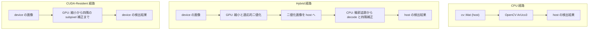
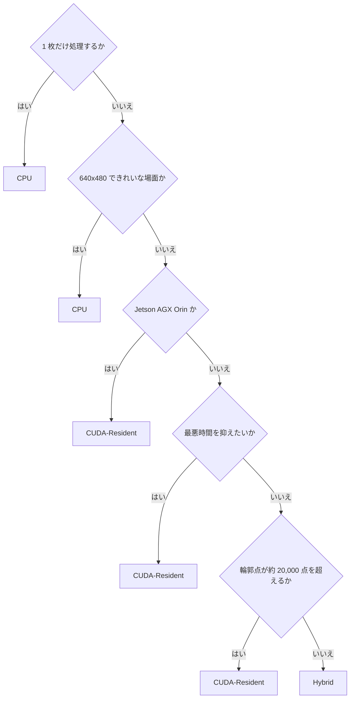

# Benchmark 報告: CPU / Hybrid / CUDA-Resident の比較

- 測定日: 2026-08-29
- 対象: 入力画像の縮小・二値化から四隅の subpixel 補正までを GPU 常駐で処理する実装
- 生の測定結果: `docs/measurements/`

## 目的

CPU 基準実装、Hybrid 経路、CUDA-Resident 経路の 3 経路について、[評価計画](evaluation-plan.md) が定める crossover point (CPU と CUDA の優位が入れ替わる条件) を示します。どの条件でどの経路を選ぶべきかを、測定値から判断できる形で提示することが目的です。

**CUDA が常に速いという前提は置きません。** CPU が勝つ条件を明示します。

## 対象範囲

| 経路 | 内容 | 測定区間 |
| --- | --- | --- |
| `CPU` | OpenCV ArUco3 (`detectMarkers`) | `cv::Mat` 入力から host の結果まで |
| `Hybrid` | GPU で縮小と適応的二値化、CPU で候補抽出と decode | device の画像から host の結果まで |
| `CUDA-Resident` | 縮小から四隅の subpixel 補正まで GPU 常駐 | `detect_async` の発行と stream の同期 |
| `CUDA-E2E` | host 入力の完全 GPU 経路 | host からの転送、発行、同期、結果の取り出し |

`CUDA-E2E` は入力 memory 種別の比較にだけ用います。3 経路の速度比較は `CPU`、`Hybrid`、`CUDA-Resident` で行います。

経路ごとの測定区間を図に示します。矢印は 1 frame ぶんのデータの流れです。



Hybrid は二値化画像を host へ戻す点が費用の中心で、CUDA-Resident は host 同期を持たない点が特徴です。

**この報告の結論はすべて合成 corpus で得たものです。** 実画像 corpus は整備しておらず、実画像で境界が動く可能性があります。

## 測定条件

| 項目 | 値 |
| --- | --- |
| 測定区間 | **検出のみ。画像の読み込みと checksum は含まない** |
| 反復 | 暖機 30 回、遅延 200 回、throughput 100 frame |
| 起動の費用 | 別に測定。1 process 1 画像で 3 回 |
| OpenCV thread | 1 |
| ASLR | 有効。container の権限では `setarch -R` を使えない |
| 独立実行 | 3 process。p50 の中央値を採り、実行間ばらつきを併記する |
| 分位点 | nearest-rank。補間しないため返る値は必ず実測値 |
| corpus | 合成 corpus の `full` preset から 28 場面 (解像度 4 種 x マーカー 0/1/4/16 枚 + blur / noise / combined 各 4 解像度) |
| Dictionary | `DICT_ARUCO_MIP_36h12` |
| ArUco3 検出戦略 | 有効。`minSideLengthCanonicalImg` = 32、`minMarkerLengthRatioOriginalImg` = 0.05 |

測定区間に PNG の復号を含めません。実時間処理では PNG を復号しないうえ、1 反復ごとに読み込むと測定区間の大半が復号になり、検出の end-to-end 時間の比較として成立しないためです。結果 JSONL の `schema_version` は 4 で、異なる version の結果は同じ key が違う区間を指すため混ぜて集計しません。

### 固定する CPU core

**性能 core へ固定します。** 性能 core と効率 core が混在する機では、どちらで測るかで CPU 経路の値が約 2 倍変わります。効率 core で測ると GPU 側の優位が実際より大きく出ます。

| 機体 | core 構成 | 測定に使う CPU |
| --- | --- | --- |
| DGX Spark GB10 | Cortex-X925 x10 (性能)、Cortex-A725 x10 (効率) | 5 (X925) |
| GeForce RTX 5070 Ti の機 | 4.80GHz x2、4.70GHz x6 (性能)、4.60GHz x12 (効率) | 2 (4.70GHz) |
| Jetson AGX Orin | Cortex-A78AE x12 (均一) | 0 |

DGX Spark の CPU 0 は効率 core、GeForce RTX 5070 Ti の機の CPU 0 は性能 core です。**番号だけで揃えると別種の core を比べることになります。**

### 入力 memory 種別

| 種別 | 入力 buffer | 測定区間で起きること |
| --- | --- | --- |
| `M-Device` | device 常駐 | 転送は測定区間の外。上流が GPU 上にある場合 |
| `M-Pageable` | `cv::Mat` の通常 memory | driver が中継へ写してから DMA する |
| `M-Pinned` | page-locked な host memory | DMA が直接読む。**写しは測定区間の外で 1 度だけ行う** |
| `M-Managed` | managed memory | **明示的な copy は無い。** device が触った時点で page が移送される |

`M-Pinned` の写しを測定区間の外へ出すのは、評価計画の軸が「**入力 buffer** の memory 種別」だからです。毎 frame 写すと、種別の差ではなく写しの費用を測ることになります。

### 対象機

| 機体 | GPU | CC | GPU 種別 | CPU | CUDA |
| --- | --- | --- | --- | --- | --- |
| DGX Spark GB10 | NVIDIA GB10 | 12.1 | 統合 | Cortex-X925 / A725 | 13.0 |
| Jetson AGX Orin | Orin | 8.7 | 統合 | Cortex-A78AE (MAXN) | 11.4 |
| GeForce RTX 5070 Ti | GeForce RTX 5070 Ti | 12.0 | **単体** | Intel Core Ultra 7 265 | 13.0 |

統合 GPU 2 機と単体 GPU 1 機という構成は、統合 GPU に固有の結果と一般に成り立つ結果を切り分けるためのものです。

## 現状

### 結果の要約

1. **3 経路は同じ検出結果を出します。** 28 場面 x 3 経路 x 3 機の全 252 組で検出数が一致します。座標の一致度は [正確性評価の結果](accuracy-report.md) にあります。
2. **CPU が CUDA-Resident を上回るのは 640x480 かつ検出が 1 件以上ある場面だけです。** 28 場面のうち DGX Spark 5 件、GeForce RTX 5070 Ti 4 件、Jetson AGX Orin 1 件です。
3. **ただしこれは経路を CUDA-Resident に固定した場合の話です。** DGX Spark と GeForce RTX 5070 Ti では、**CPU が Hybrid を上回る場面は 28 場面中 1 つもありません。** 場面ごとに速い方の GPU 経路を選べるなら、この 2 機で CPU が勝つ場面は無くなります。Jetson AGX Orin だけは、CPU が両経路を同時に上回る場面が 1 つあります (`clean_640x480_n1_s128`、CPU 0.870 ms に対し GPU の最良が 0.896 ms)。
4. **境界を決めるのは解像度でも候補数でもなく、二値化後の輪郭点数です。** 輪郭点 1e5 あたりの係数は CPU 2.48 から 5.35 ms、Hybrid 2.54 から 5.48 ms に対し、CUDA-Resident は 0.041 から 0.278 ms です。
5. **Hybrid の輪郭点係数は CPU とほぼ同じです。** 輪郭抽出から先を host で行うためで、ここが Hybrid と CUDA-Resident の本質的な違いです。
6. **CUDA-Resident の価値は「遅い場面が無い」ことです。** 場面による振れ幅は 3.4 から 4.1 倍で、CPU の 11.6 から 20.8 倍、Hybrid の 10.0 から 43.7 倍と比べて小さく収まります。
7. **単発の検出では CPU が桁違いに速いままです。** 1 枚目の結果が出るまで CPU は 2.2 から 6.1 ms、GPU 経路は 57.6 から 174.0 ms です。相殺には Hybrid で約 100 から 420 frame、CUDA-Resident で約 110 から 350 frame を要します。
8. **入力に managed memory を選んではいけません。** 単体 GPU で 6.4 から 30 倍遅くなります。統合 GPU では 1.01 から 1.22 倍にとどまりますが、速くはなりません。
9. **GPU 経路の実行間ばらつきは CPU 経路より 1 桁大きくなります。** 1 回だけ測った値で判断できません。

### どの経路がいつ速いか

CPU 経路が CUDA-Resident を上回る、または同着になる場面は次のとおりです。比は CPU を 1 とし、1 より大きいと CPU が速いことを示します。

| 機体 | 場面 | 検出 | CPU | CUDA-Resident | 比 |
| --- | --- | --- | --- | --- | --- |
| DGX Spark GB10 | clean_640x480_n16_s64 | 1 | 0.539 ms | 0.744 ms | **1.38** |
| DGX Spark GB10 | clean_640x480_n1_s128 | 1 | 0.416 ms | 0.568 ms | **1.36** |
| DGX Spark GB10 | clean_640x480_n4_s128 | 4 | 0.557 ms | 0.708 ms | **1.27** |
| DGX Spark GB10 | blur_640x480 | 4 | 0.539 ms | 0.636 ms | **1.18** |
| DGX Spark GB10 | clean_1280x720_n1_s128 | 1 | 0.606 ms | 0.606 ms | 1.00 |
| Jetson AGX Orin | clean_640x480_n1_s128 | 1 | 0.870 ms | 0.896 ms | **1.03** |
| GeForce RTX 5070 Ti | clean_640x480_n1_s128 | 1 | 0.226 ms | 0.388 ms | **1.72** |
| GeForce RTX 5070 Ti | clean_640x480_n16_s64 | 1 | 0.371 ms | 0.516 ms | **1.39** |
| GeForce RTX 5070 Ti | clean_640x480_n4_s128 | 4 | 0.376 ms | 0.470 ms | **1.25** |
| GeForce RTX 5070 Ti | blur_640x480 | 4 | 0.360 ms | 0.431 ms | **1.20** |

**CPU が上回るのは 640x480 かつ検出が 1 件以上ある場面です。** 同じ 640x480 でも検出 0 件なら CUDA-Resident が上回ります (比 0.38 から 0.58)。1280x720 以上では、マーカー 1 枚の同着 1 件を除きすべて CUDA-Resident が上回ります。

理由は、GPU が固定費を持ち仕事量に対して平坦であるのに対し、CPU が仕事量に比例するためです。仕事量が最も小さい 640x480 の検出あり場面では、GPU の固定費を仕事量が上回りません。

**この境界は合成 corpus 限定です。** 実画像では輪郭点数が合成 corpus より多い可能性が高く、その場合 crossover point は CPU に不利な側 (より小さい画像でも GPU が勝つ側) へ動きます。まだ確かめていません。

### 境界を決める量は輪郭点数

原寸の解像度は説明変数になりません。ArUco3 検出戦略は `fxfy = 32 / (32 + 0.05 x 長辺)` で縮小するため、**原寸が 27 倍変わっても segmentation 面は 2.2 倍しか変わりません**。

| 原寸 | segmentation | 画素数 |
| --- | --- | --- |
| 640x480 | 320x240 | 76,800 |
| 1280x720 | 427x240 | 102,480 |
| 1920x1080 | 480x270 | 129,600 |
| 3840x2160 | 549x309 | 169,641 |

四角形の候補数も説明変数になりません。`noise_1280x720` は**検出 0 件**でありながら、CPU 経路で最も重い場面の 1 つです。

効いているのは **二値化後の輪郭点数**です。`noise_1280x720` は 99,074 点、`clean_1280x720_n4` は 6,390 点で 15 倍違います。

#### 輪郭点数の数え方

輪郭点数は corpus 画像から次の手順で求めた値であり、測定 harness の出力には含まれません。**再現するにはこの手順を自分で実行する必要があります。**

1. corpus 画像へ ArUco3 の縮小率 `fxfy = S / (S + max(W,H) * tau)` を適用して segmentation 画像を作る。
2. `cv::adaptiveThreshold` を window 3、13、23 (`ADAPTIVE_THRESH_MEAN_C`、`THRESH_BINARY_INV`、定数 7) の 3 通りで適用する。
3. 各二値化画像へ `cv::findContours` を `RETR_LIST`、`CHAIN_APPROX_NONE` で適用し、全輪郭の点数を合計する。
4. 3 つの window の合計を、その場面の輪郭点数とする。

OpenCV の検出器が内部で行う処理と同じ設定です。**この数え方は本 repository の code には入っていません。** 回帰の入力 data も `docs/measurements/` には含めていないため、上の R2 と係数を読者がそのまま検算することはできません。

#### 回帰の結果

`時間 = b0 + b1 x segMpx + b2 x Mpx + b3 x [検出あり] + b4 x 検出数 + b5 x (輪郭点 / 1e5)` を 28 場面へ当てはめました。R2 は CPU 0.977 から 0.988、Hybrid 0.965 から 0.980、CUDA-Resident 0.894 から 0.973 です。

**輪郭点 1e5 あたりの係数**が経路を分けます。

| 機体 | CPU | Hybrid | CUDA-Resident | 比 (CPU / Resident) |
| --- | --- | --- | --- | --- |
| DGX Spark GB10 | 2.56 ms | 2.70 ms | **0.077 ms** | 33 倍 |
| Jetson AGX Orin | 5.35 ms | 5.48 ms | **0.278 ms** | 19 倍 |
| GeForce RTX 5070 Ti | 2.48 ms | 2.54 ms | **0.041 ms** | 60 倍 |

**Hybrid の係数は CPU とほぼ同じです。** Hybrid は前処理と二値化だけを GPU で行い、輪郭抽出から先を host で行うためです。CUDA-Resident だけが 19 から 60 倍小さく、これが 3 経路の本質的な違いです。

検出の有無による段差は CUDA-Resident にだけ現れます (+0.25 から +0.38 ms)。四隅の subpixel 補正と decode が検出 1 件目で立ち上がるためです。CPU と Hybrid では段差がほぼ 0 で、代わりに検出 1 件あたり 0.026 から 0.074 ms 増えます。

### 経路ごとの振れ幅

28 場面の最小と最大です。

| 機体 | CPU | Hybrid | CUDA-Resident |
| --- | --- | --- | --- |
| DGX Spark GB10 | 0.416 から 4.846 ms (**11.6 倍**) | 0.131 から 4.054 ms (**31.0 倍**) | 0.185 から 0.744 ms (**4.0 倍**) |
| Jetson AGX Orin | 0.832 から 12.123 ms (**14.6 倍**) | 0.870 から 8.712 ms (**10.0 倍**) | 0.483 から 1.630 ms (**3.4 倍**) |
| GeForce RTX 5070 Ti | 0.226 から 4.696 ms (**20.8 倍**) | 0.088 から 3.832 ms (**43.7 倍**) | 0.126 から 0.516 ms (**4.1 倍**) |

**CUDA-Resident は 3.4 から 4.1 倍しか振れません。** CPU は 11.6 から 20.8 倍、Hybrid は 10.0 から 43.7 倍振れます。最良時間ではなく最悪時間で設計する用途では、これが最大の利点になります。

### Hybrid と CUDA-Resident の切り替え

輪郭点数の少ない順に並べると、勝つ経路が切り替わる位置がはっきり出ます。括弧内は CUDA-Resident / Hybrid の比で、1 未満なら CUDA-Resident が速いことを示します。

| 場面 | 輪郭点 | DGX Spark | Jetson AGX Orin | RTX 5070 Ti |
| --- | --- | --- | --- | --- |
| clean_640x480_n0_s16 | 0 | Hybrid (1.42) | **Resident** (0.41) | Hybrid (1.44) |
| clean_1280x720_n0_s16 | 0 | Hybrid (1.97) | **Resident** (0.67) | **Resident** (0.94) |
| clean_1920x1080_n0_s16 | 0 | Hybrid (1.13) | **Resident** (0.76) | **Resident** (0.66) |
| clean_3840x2160_n0_s16 | 0 | **Resident** (0.71) | **Resident** (0.72) | **Resident** (0.32) |
| clean_3840x2160_n1_s128 | 583 | **Resident** (0.78) | **Resident** (0.74) | **Resident** (0.37) |
| clean_1920x1080_n1_s128 | 1,146 | Hybrid (1.22) | **Resident** (0.81) | **Resident** (0.83) |
| blur_3840x2160 | 1,460 | **Resident** (0.78) | **Resident** (0.74) | **Resident** (0.37) |
| clean_1280x720_n1_s128 | 1,587 | Hybrid (3.05) | **Resident** (0.83) | Hybrid (2.10) |
| clean_3840x2160_n4_s128 | 2,189 | **Resident** (0.75) | **Resident** (0.74) | **Resident** (0.38) |
| clean_640x480_n1_s128 | 2,612 | Hybrid (3.40) | **Resident** (0.71) | Hybrid (3.09) |
| blur_1920x1080 | 2,703 | Hybrid (1.22) | **Resident** (0.80) | **Resident** (0.81) |
| clean_3840x2160_n16_s64 | 3,669 | **Resident** (0.77) | **Resident** (0.73) | **Resident** (0.36) |
| blur_1280x720 | 3,902 | Hybrid (1.57) | **Resident** (0.79) | Hybrid (1.23) |
| clean_1920x1080_n4_s128 | 4,632 | Hybrid (1.62) | **Resident** (0.78) | **Resident** (0.85) |
| clean_1280x720_n4_s128 | 6,390 | Hybrid (2.09) | **Resident** (0.75) | Hybrid (1.42) |
| blur_640x480 | 6,840 | Hybrid (2.16) | **Resident** (0.67) | Hybrid (1.65) |
| clean_1920x1080_n16_s64 | 7,160 | Hybrid (1.49) | **Resident** (0.77) | **Resident** (0.76) |
| combined_1920x1080 | 8,237 | **Resident** (0.67) | **Resident** (0.53) | **Resident** (0.41) |
| combined_640x480 | 9,831 | Hybrid (1.55) | **Resident** (0.57) | Hybrid (1.07) |
| clean_640x480_n4_s128 | 10,178 | Hybrid (2.30) | **Resident** (0.66) | Hybrid (1.70) |
| clean_1280x720_n16_s64 | 10,893 | Hybrid (1.65) | **Resident** (0.59) | Hybrid (1.01) |
| clean_640x480_n16_s64 | 18,329 | Hybrid (2.56) | **Resident** (0.70) | Hybrid (1.92) |
| combined_3840x2160 | 27,461 | **Resident** (0.28) | **Resident** (0.34) | **Resident** (0.15) |
| combined_1280x720 | 31,181 | **Resident** (0.31) | **Resident** (0.24) | **Resident** (0.18) |
| noise_640x480 | 35,437 | **Resident** (0.49) | **Resident** (0.30) | **Resident** (0.35) |
| noise_1920x1080 | 59,902 | **Resident** (0.20) | **Resident** (0.19) | **Resident** (0.11) |
| noise_1280x720 | 99,074 | **Resident** (0.14) | **Resident** (0.16) | **Resident** (0.09) |
| noise_3840x2160 | 127,319 | **Resident** (0.14) | **Resident** (0.19) | **Resident** (0.07) |

**DGX Spark と GeForce RTX 5070 Ti では、輪郭点が約 20,000 点を超えると CUDA-Resident が勝ちます。** それ以下では Hybrid が速く、きれいな 640x480 では 2 から 3 倍の差がつきます。

**Jetson AGX Orin では全 28 場面で CUDA-Resident が勝ちます。** 3 機の中で CPU が最も弱いため、Hybrid の CPU 段が常に不利になります。

### 起動費用と相殺 frame 数

暖機後の分位点には現れない費用です。1 process 1 枚で測りました (1 process で複数枚を回すと 2 枚目以降は暖まった文脈を使うため、起動の費用が現れません)。1280x720 マーカー 4 枚、`M-Device` です。

| 機体 | 経路 | 1 枚目まで | 定常 | 相殺 frame |
| --- | --- | --- | --- | --- |
| DGX Spark GB10 | CPU | 3.3 ms | 0.699 ms | - |
| DGX Spark GB10 | Hybrid | 171.0 ms | 0.301 ms | 約 420 |
| DGX Spark GB10 | CUDA-Resident | 174.0 ms | 0.696 ms | **算出できない** |
| Jetson AGX Orin | CPU | 6.1 ms | 1.676 ms | - |
| Jetson AGX Orin | Hybrid | 57.6 ms | 1.144 ms | 約 100 |
| Jetson AGX Orin | CUDA-Resident | 69.8 ms | 1.077 ms | 約 110 |
| GeForce RTX 5070 Ti | CPU | 2.2 ms | 0.614 ms | - |
| GeForce RTX 5070 Ti | Hybrid | 66.1 ms | 0.295 ms | 約 200 |
| GeForce RTX 5070 Ti | CUDA-Resident | 70.0 ms | 0.421 ms | 約 350 |

**単発の検出や短い burst では CPU 経路が桁違いに速くなります。** 30 fps の連続処理なら数秒から十数秒で相殺しますが、1 枚だけ処理する用途では比べものになりません。

DGX Spark の CUDA-Resident で相殺 frame 数を出せないのは、この場面の定常が CPU とほぼ同じ (0.696 ms と 0.699 ms) だからです。**差が小さいときの相殺 frame 数は、割り算の分母が 0 に近づくため意味を持ちません。** 同じ機の 28 場面 sweep では 0.626 ms と 0.702 ms になり、約 2300 frame と出ます。この場面は DGX Spark にとって境界そのものです。

起動費用の内訳は機体で異なります。CUDA の文脈生成そのものは DGX Spark 17.0 ms、Jetson AGX Orin 20.6 ms に対し、GeForce RTX 5070 Ti は 180.4 ms と大きく出ます。文脈生成は実装側から減らせません。

### 入力 memory 種別の比較

`CUDA-E2E` 経路で 3 種を測りました。`M-Pageable` を 1 とする比を括弧に示します。

| 機体 | 場面 | M-Pageable | M-Pinned | M-Managed |
| --- | --- | --- | --- | --- |
| DGX Spark GB10 | 1280x720 マーカー 4 | 0.895 ms | 0.973 ms (1.09x) | 0.905 ms (1.01x) |
| DGX Spark GB10 | 3840x2160 マーカー 4 | 1.099 ms | 1.267 ms (1.15x) | **1.345 ms** (1.22x) |
| Jetson AGX Orin | 1280x720 マーカー 4 | 1.508 ms | 1.490 ms (0.99x) | 1.686 ms (1.12x) |
| Jetson AGX Orin | 3840x2160 マーカー 4 | 3.311 ms | **2.389 ms** (0.72x) | 3.449 ms (1.04x) |
| GeForce RTX 5070 Ti | 1280x720 マーカー 4 | 0.505 ms | 0.521 ms (1.03x) | **3.217 ms** (6.37x) |
| GeForce RTX 5070 Ti | 3840x2160 マーカー 4 | 0.812 ms | **0.715 ms** (0.88x) | **24.773 ms** (30.52x) |

**managed は単体 GPU で使ってはいけません。** GeForce RTX 5070 Ti では 6.4 倍から **30 倍**遅くなります。device が触るたびに page が host から移送されるためです。3840x2160 では 24.8 ms かかり、pageable の 0.812 ms と比べものになりません。

統合 GPU では managed の不利が小さくなります (DGX Spark で 1.01 から 1.22 倍、Jetson AGX Orin で 1.04 から 1.12 倍)。**それでも pageable より速くはなりません。**

**pinned は大きい画像でだけ効きます。** 3840x2160 で Jetson AGX Orin が 0.72 倍、GeForce RTX 5070 Ti が 0.88 倍になります。1280x720 では 3 機とも差がありません (0.99 から 1.09 倍)。転送量が小さいうちは、DMA が直接読める利点が検出そのものの時間に埋もれます。

DGX Spark では pinned が**遅くなります** (1.09 から 1.15 倍)。統合 GPU で PCIe を渡らないため DMA の利点が無く、page-locked な領域では CPU 側の cache の扱いが変わるためと見ています (未検証)。

| 状況 | 選ぶ種別 |
| --- | --- |
| 上流が GPU 上にある | `M-Device` (`CUDA-Resident` 経路) |
| host から毎 frame 送る。1280x720 程度 | `M-Pageable` |
| host から毎 frame 送る。3840x2160 で単体 GPU か Jetson AGX Orin | `M-Pinned` |
| 単体 GPU | **`M-Managed` を選ばない** |

この向きは、結果を device から host へ渡す方向の測定 ([host と device の間の memory 受け渡し](design/memory-transfer.md)) と一致します。入力方向では差がさらに大きく出ました。

**統合か単体かで分かれるのはこの軸だけです。** 速度の順位は統合か単体かではなく GPU の絶対性能で決まり、3 機とも同じ形の回帰式に乗ります。ただし機体が 3 台しかないため、一般化の可否は断定できません。

### 実行間のばらつきと測定上の注意

独立した 3 process の p50 の幅です。

| 機体 | CPU | Hybrid | CUDA-Resident |
| --- | --- | --- | --- |
| DGX Spark GB10 | 0.6% (最大 2.6%) | **17.7%** (最大 50.3%) | **14.1%** (最大 69.2%) |
| Jetson AGX Orin | 0.4% (最大 1.7%) | 3.5% (最大 29.1%) | 0.5% (最大 38.5%) |
| GeForce RTX 5070 Ti | 0.5% (最大 2.2%) | 0.4% (最大 6.3%) | 0.0% (最大 0.5%) |

**GPU 経路のばらつきは CPU 経路より 1 桁大きくなります。** とくに DGX Spark で顕著です。GPU の動作周波数を固定していないためと見ています (未検証)。

ここから、測定するときの規則が 2 つ導かれます。

- **1 回だけ測った値で判断してはいけません。** 独立した 3 process 以上の中央値を使います。この報告の値は、断りが無い限り 3 process の中央値です。
- **1 割程度の差は、版を分けた測定では判定できません。** ばらつきの幅がその差より広いためです。実装の前後を比べるときは、同一 session で交互に測ります。

Jetson AGX Orin の GPU 段は 0.64 から 2.54 ms と幅が大きく、同じ 1280x720 でもマーカー 1 枚で 0.914 ms、4 枚で 1.456 ms になります。他 2 機は 3840x2160 を除けば DGX Spark 0.12 から 0.27 ms、GeForce RTX 5070 Ti 0.07 から 0.20 ms に収まります。Jetson AGX Orin のこの不安定さの原因は特定できていません。

### 最適化の前後

現在の実装は、次の 3 つの変更を経ています。比較は同一 session で交互に測った 9 場面の set によるもので、上の 28 場面 sweep とは別の測定 set です。同じ場面でも数 % 異なります。

| 段階 | 内容 |
| --- | --- |
| Step 1 | 四隅の subpixel 補正を「1 thread が 1 隅」から「1 block が 1 隅、要素ごとに並列」へ |
| Step 2 | Otsu を 3 相に分け、逐次でなければならない漸化式だけを thread 0 に残す |
| Step 3 | 1 frame の発行列 (kernel 124 起動 + memset 1 個) を CUDA Graph へ畳む |

#### CUDA-Resident の end-to-end 時間 (最適化前 → 最適化後)

| 場面 | DGX Spark | Jetson AGX Orin | RTX 5070 Ti |
| --- | --- | --- | --- |
| 640x480 マーカー 4 | 1.234 → **0.730** ms | 1.684 → **1.106** ms | 0.698 → **0.470** ms |
| 1280x720 マーカー 1 | 1.339 → **0.637** ms | 1.692 → **1.027** ms | 0.779 → **0.395** ms |
| 1280x720 マーカー 4 | 1.351 → **0.687** ms | 1.820 → **1.111** ms | 0.808 → **0.417** ms |
| 1280x720 マーカー 16 | 1.491 → **0.811** ms | 2.176 → **1.383** ms | 0.938 → **0.518** ms |
| 1920x1080 マーカー 4 | 1.473 → **0.778** ms | 2.081 → **1.348** ms | 0.895 → **0.495** ms |
| 3840x2160 マーカー 4 | 1.672 → **0.757** ms | 2.677 → **1.753** ms | 1.043 → **0.490** ms |
| blur (検出 0) | 0.572 → **0.438** ms | 1.053 → **0.755** ms | 0.211 → **0.194** ms |
| noise (検出 0) | 0.700 → **0.492** ms | 1.250 → **0.945** ms | 0.224 → **0.208** ms |

#### CPU に対する比 (最適化前 → 最適化後、1 未満なら GPU が速い)

| 場面 | DGX Spark | Jetson AGX Orin | RTX 5070 Ti |
| --- | --- | --- | --- |
| 640x480 マーカー 4 | 2.23 → **1.32** | 1.32 → **0.87** | 1.86 → **1.25** |
| 1280x720 マーカー 1 | 2.23 → **1.06** | 1.21 → **0.73** | 1.52 → **0.77** |
| 1280x720 マーカー 4 | 1.94 → **0.98** | 1.08 → **0.66** | 1.32 → **0.68** |
| 1280x720 マーカー 16 | 1.28 → **0.69** | 0.70 → **0.45** | 0.81 → **0.45** |
| 1920x1080 マーカー 4 | 1.50 → **0.79** | 0.79 → **0.51** | 0.99 → **0.55** |
| 3840x2160 マーカー 4 | 0.99 → **0.45** | 0.46 → **0.30** | 0.60 → **0.28** |
| blur (検出 0) | 0.98 → **0.75** | 0.79 → **0.57** | 0.43 → **0.40** |
| noise (検出 0) | 0.26 → **0.18** | 0.21 → **0.16** | 0.08 → **0.08** |

**640x480 を除く場面で GPU が CPU を上回ります。** 640x480 マーカー 4 枚では DGX Spark 1.32、GeForce RTX 5070 Ti 1.25 で **CPU が速いまま**です (Jetson AGX Orin は 0.87 で GPU が上回ります)。最も仕事量が少ない場面であり、GPU の固定費を仕事量が上回りません。

#### 段階ごとの内訳 (1280x720 マーカー 4 枚)

| 段階 | DGX Spark | Jetson AGX Orin | RTX 5070 Ti |
| --- | --- | --- | --- |
| 最適化前 | 1.351 ms | 1.820 ms | 0.808 ms |
| Step 1 (四隅補正) | 1.046 ms | 1.630 ms | 0.550 ms |
| Step 2 (Otsu) | 0.937 ms | 1.467 ms | 0.436 ms |
| Step 3 (CUDA Graph) | 0.687 ms | 1.111 ms | 0.417 ms |

**丸めは 1 bit も変わっていません。** 四隅補正は逐語 oracle との bit 一致、Otsu は `cv::threshold` が返す閾値との整数一致 (256 件)、CUDA Graph は畳まない経路との結果一致で担保しています。段ごとの根拠は [検出パイプライン設計](design/detector-pipeline.md) にあります。

#### 何を最適化の対象にしたか

最適化前に、検出 1 件目で立ち上がる固定費を段別に切り分けました (DGX Spark、最小値基準の増分 783 us)。

| 段 | 実測 | 増分に占める割合 |
| --- | --- | --- |
| 四隅の subpixel 補正 | 335 us | **43%** |
| Otsu と border 検証 | 307 us | **39%** |
| 射影変換 (8x8 の LU を thread 0 が解く) | 18 us | 2% |
| decode の各段と統合 | 5 から 10 us | 1% |
| 説明できた小計 | 665 から 670 us | 85% |
| 説明できない残り | 113 から 118 us | 15% |

**四隅補正と Otsu がほぼ半々です。** 片方だけ直しても立ち上がりは半分しか消えません。待ち時間を決めているのは反復回数ではなく、**1 反復あたりの逐次な倍精度命令の数**です (実測の反復回数は 1 隅 1 段あたり 1.9 から 3.3 回で、上限 30 回の 10 分の 1)。四隅補正の逐次連鎖は 1 反復あたり 2299 命令 (121 要素 x 19 命令) からおよそ 140 命令へ、Otsu は 1 反復あたりの倍精度除算が 2 回から 1 回へ縮みました。

検出 0 件の場面では、残るのはほぼ kernel 起動の費用です。DGX Spark で 1 起動あたり **1.888 us**、124 起動で 234 us になり、**検出 0 件の最小値 427 us の 55%** に当たります。残る 193 us のうち名前を付けられるのは 110 us (縮小 pyramid の 1 段目 26 us、resize 9 us、適応的二値化 6 個で計 30 us 程度、ほか) で、**残り約 110 個の kernel は 1 個 2 から 7 us と 1 起動の費用と同じ桁です。この粒度では「起動の費用」と「実際の仕事」を分離できません。** GeForce RTX 5070 Ti の 1 起動あたりの費用は測っていません。

CUDA Graph へ畳んだ結果、host 側の発行時間は **0.241 ms から 0.023 ms** へ落ちました。端から端では 0.18 から 0.30 ms 縮んでいます。同じ kernel を同じ引数で同じ順に起動するだけなので、丸めが変わる余地は原理的にありません。危険は丸めではなく焼き込んだ参照の陳腐化で、入力の寸法・pitch・pointer が変わったときは graph を破棄します。**既定 stream (`nullptr`) は CUDA が捕獲を許さない**ため、その場合は 1 段ずつ発行します。

共有 memory を使う kernel では、**block 数を隅の上限ではなく SM 数から導きます**。上限をそのまま使うと 1 SM に載る block が限られ、起動が波に分かれます。3 機のうち Jetson AGX Orin でのみ大きく悪化する形の劣化であり、1 機だけでは気付けません。

#### Hybrid 経路の転送最適化

Hybrid では、8 回の同期転送を stream 上の非同期転送へ変え、受け取り先を pinned memory にしました。GPU 段は DGX Spark で 0.461 ms から 0.206 ms、GeForce RTX 5070 Ti で 0.386 ms から 0.116 ms へ下がりました。複製そのものより、8 回の blocking 呼び出しの費用 (1 回あたり約 25 us) が効いていました。

最適化後も GPU 段の約半分は転送です (DGX Spark で kernel 実行 0.099 ms、GPU 段全体 0.206 ms)。managed memory を使えば明示的な copy は消えますが、上の測定のとおり統合 GPU でも速くはなりません。

### Hybrid 経路の内訳 (9 場面)

Hybrid の GPU 段と CPU 段の内訳です。上の 28 場面 sweep とは別の測定 set で、比は CPU を 1 とし 1 未満なら Hybrid が速いことを示します。

#### DGX Spark GB10

| 場面 | CPU | Hybrid M-Device | 内 GPU 段 | 内 CPU 段 | 比 | M-Pageable | 比 |
| --- | --- | --- | --- | --- | --- | --- | --- |
| 640x480 マーカー 4 | 0.555 | 0.341 | 0.121 | 0.203 | 0.62 | 0.462 | 0.83 |
| 1280x720 マーカー 1 | 0.603 | 0.285 | 0.216 | 0.071 | **0.47** | 0.321 | 0.53 |
| 1280x720 マーカー 4 | 0.698 | 0.376 | 0.206 | 0.167 | 0.54 | 0.531 | 0.76 |
| 1280x720 マーカー 16 | 1.169 | 0.909 | 0.226 | 0.672 | 0.78 | 1.009 | 0.86 |
| 1920x1080 マーカー 4 | 0.979 | 0.497 | 0.268 | 0.239 | 0.51 | 0.701 | 0.72 |
| 3840x2160 マーカー 4 | 1.717 | 0.884 | 0.588 | 0.292 | 0.52 | 1.115 | 0.65 |
| ぼけ | 0.585 | 0.266 | 0.214 | 0.052 | **0.46** | 0.395 | 0.68 |
| noise | 2.702 | 2.437 | 0.225 | 2.227 | 0.90 | 2.743 | 1.02 |
| 複合劣化 | 1.571 | 1.323 | 0.234 | 1.079 | 0.84 | 1.479 | 0.94 |

#### GeForce RTX 5070 Ti

| 場面 | CPU | Hybrid M-Device | 内 GPU 段 | 内 CPU 段 | 比 | M-Pageable | 比 |
| --- | --- | --- | --- | --- | --- | --- | --- |
| 640x480 マーカー 4 | 0.375 | 0.275 | 0.066 | 0.209 | 0.73 | 0.292 | 0.78 |
| 1280x720 マーカー 1 | 0.514 | 0.188 | 0.116 | 0.071 | 0.37 | 0.227 | 0.44 |
| 1280x720 マーカー 4 | 0.610 | 0.295 | 0.116 | 0.179 | 0.48 | 0.335 | 0.55 |
| 1280x720 マーカー 16 | 1.147 | 0.874 | 0.117 | 0.758 | 0.76 | 0.899 | 0.78 |
| 1920x1080 マーカー 4 | 0.897 | 0.437 | 0.195 | 0.241 | 0.49 | 0.515 | 0.57 |
| 3840x2160 マーカー 4 | 1.736 | 0.823 | 0.599 | 0.223 | 0.47 | 1.116 | 0.64 |
| ぼけ | 0.489 | 0.159 | 0.116 | 0.043 | **0.32** | 0.198 | 0.40 |
| noise | 2.656 | 2.425 | 0.197 | 2.227 | 0.91 | 2.441 | 0.92 |
| 複合劣化 | 1.431 | 1.121 | 0.136 | 0.985 | 0.78 | 1.171 | 0.82 |

#### Jetson AGX Orin

| 場面 | CPU | Hybrid M-Device | 内 GPU 段 | 内 CPU 段 | 比 | M-Pageable | 比 |
| --- | --- | --- | --- | --- | --- | --- | --- |
| 640x480 マーカー 4 | 1.267 | 2.092 | 1.438 | 0.650 | 1.65 | 1.442 | 1.14 |
| 1280x720 マーカー 1 | 1.394 | 1.200 | 0.914 | 0.274 | 0.86 | 1.373 | 0.99 |
| 1280x720 マーカー 4 | 1.680 | 2.053 | 1.456 | 0.585 | 1.22 | 1.747 | 1.04 |
| 1280x720 マーカー 16 | 3.094 | 2.848 | 0.876 | 1.972 | 0.92 | 3.081 | 1.00 |
| 1920x1080 マーカー 4 | 2.622 | 2.592 | 1.632 | 0.819 | 0.99 | 2.431 | 0.93 |
| 3840x2160 マーカー 4 | 5.749 | 3.658 | 2.538 | 0.905 | **0.64** | 4.820 | 0.84 |
| ぼけ | 1.321 | 0.846 | 0.640 | 0.191 | **0.64** | 1.319 | 1.00 |
| noise | 5.842 | 5.659 | 0.770 | 4.857 | 0.97 | 6.013 | 1.03 |
| 複合劣化 | 3.393 | 3.146 | 0.758 | 2.388 | 0.93 | 3.521 | 1.04 |

Hybrid の CPU 段は場面の内容に強く依存します (0.04 から 2.2 ms)。GPU 段が比較的安定しているため、CPU 段が小さい場面ほど比が下がります。逆に候補が多い noise では CPU 段が 2.2 ms を占め、比は 0.90 前後にとどまります。ここが CUDA-Resident との分かれ目です。

単体 GPU でも `M-Device` と `M-Pageable` の差は小さく、GeForce RTX 5070 Ti で 1280x720 の差は 0.040 ms、3840x2160 で 0.293 ms です。統合 GPU の DGX Spark ではむしろ 1280x720 で 0.155 ms と大きく出ます。理由は特定できていません。

### 3 経路の使い分け

**「常に最速の経路」はありません。** 場面によって 3 経路の順位が入れ替わります。

| 条件 | 選ぶ経路 | 根拠 |
| --- | --- | --- |
| 単発の検出 (1 枚だけ) | **CPU** | 1 枚目の結果まで CPU 2.2 から 6.1 ms、GPU 経路 57.6 から 174.0 ms |
| 640x480 できれいな場面 (検出あり) | **CPU** | CPU 比 1.18 から 1.72 |
| Jetson AGX Orin での連続処理 | **CUDA-Resident** | 全 28 場面で Hybrid より速い |
| 輪郭が多い場面 (noise、複合劣化) | **CUDA-Resident** | 輪郭点 1e5 あたりの係数が CPU の 1/19 から 1/60 |
| きれいな場面かつ輪郭点 20,000 点未満 (DGX Spark、GeForce RTX 5070 Ti) | **Hybrid** | 640x480 で 2 から 3 倍速い |
| 最悪時間を抑えたい | **CUDA-Resident** | 場面による振れ幅が 3.4 から 4.1 倍。CPU は 11.6 から 20.8 倍 |

判断の流れを図に示します。連続処理を前提とし、輪郭点数は二値化後の値です。



輪郭点数を事前に知れない用途では、CUDA-Resident を既定にすると最悪時間が抑えられます。

## 目標

- 実画像 corpus で同じ 28 場面相当の測定を行い、crossover point が合成 corpus とどれだけ違うかを示す。
- CUDA event で段ごとの kernel 時間を記録し、host 同期を含む wall-clock と分離する。
- 起動費用を減らせるかを確かめる。CUDA の文脈生成は減らせないが、対象 architecture を 1 つに絞る、または cubin を事前に読み込むことで kernel の読み込みを短縮できる可能性がある。
- 640x480 より小さい場面を corpus へ加え、crossover point の内側を確かめる。
- 3840x2160 を超える解像度で、Jetson AGX Orin の Hybrid と CUDA-Resident の関係が変わるかを確かめる。

## 未確定事項

- GPU の動作周波数を固定して測るか、既定のまま測るか。DGX Spark の GPU 経路の実行間ばらつき (中央 14 から 18%) はこれで説明できる可能性があるが未検証。固定するなら `nvidia-smi --lock-gpu-clocks` の可否を機種ごとに確かめる必要がある。
- crossover point が corpus の下端 (640x480) にあるため、境界の内側を確かめられていない。
- 実画像では輪郭点数が合成 corpus より多い可能性が高く、その場合 crossover point は CPU に不利な側へ動く。今回の境界は合成 corpus 限定である。
- Jetson AGX Orin の GPU 段のばらつき (0.64 から 2.54 ms) の原因。
- DGX Spark で pinned が pageable より遅くなる理由。
- 単体 GPU の GeForce RTX 5070 Ti より統合 GPU の DGX Spark の方が `M-Device` と `M-Pageable` の差が大きく出る理由。
- Jetson AGX Orin の CUDA Toolkit は 11.4、他 2 機は 13.0 であり、toolkit version の影響を切り分けていない。
- GeForce RTX 5070 Ti の 1 kernel 起動あたりの費用は測っていない。
- 機体が 3 台であり、統合 GPU と単体 GPU の一般化の可否を断定できない。
- 輪郭点数を数える処理が本 repository に無く、回帰の入力 data も残していないため、R2 と係数を読者が検算できない。数え方は上に記したが、道具として提供していない。

## 測定の再現

```
# container 内で実行する。<preset> は dgx-spark / jetson-orin / rtx-blackwell のいずれか。
# <cpu> は性能 core の番号。
#   DGX Spark GB10 -> 5   GeForce RTX 5070 Ti の機 -> 2   Jetson AGX Orin -> 0
./build/<preset>/tools/corpusgen/aruco3cuda_corpusgen --preset full --seed 20260827 \
  --output-dir /tmp/benchcorpus --manifest /tmp/benchcorpus/manifest.json

B=./build/<preset>/bench/aruco3cuda_bench
COMMON="--warmup 30 --latency-iterations 200 --throughput-frames 100 --cpu-list <cpu> --threads 1"
# 28 場面。解像度 4 種 x マーカー 0/1/4/16 枚 + blur / noise / combined 各 4 解像度。
IMGS=""
for res in 640x480 1280x720 1920x1080 3840x2160; do
  for n in n0_s16 n1_s128 n4_s128 n16_s64; do
    IMGS="$IMGS --input /tmp/benchcorpus/clean_${res}_${n}.png"
  done
  for d in blur noise combined; do
    IMGS="$IMGS --input /tmp/benchcorpus/${d}_${res}.png"
  done
done

for run in 1 2 3; do
  taskset -c <cpu> $B $IMGS $COMMON --route CPU           --memory-mode N/A        >> results.jsonl
  taskset -c <cpu> $B $IMGS $COMMON --route Hybrid        --memory-mode M-Device   >> results.jsonl
  taskset -c <cpu> $B $IMGS $COMMON --route CUDA-Resident --memory-mode M-Device   >> results.jsonl
done

# 入力 memory 種別の比較は CUDA-E2E 経路で行う。
for run in 1 2 3; do
  for m in M-Pageable M-Pinned M-Managed; do
    taskset -c <cpu> $B $IMGS $COMMON --route CUDA-E2E --memory-mode $m >> results.jsonl
  done
done
python3 bench/aggregate.py results.jsonl
```

**測定の前に、次の 2 つを確かめてください。**

1. 同じ機で Compute Sanitizer が走っていないこと。同時に走らせると測定値が大きく張り付き、経路の比較が成立しません。`nvidia-smi --query-compute-apps=pid,name --format=csv` で他 process が無いことを確認します。
2. page cache を落とすこと。

```
sync && sudo sh -c 'echo 3 > /proc/sys/vm/drop_caches'
```

統合 GPU では device memory が host memory と同じものです。`cudaMemGetInfo` が返す「空き」は `MemFree` 相当であり、回収可能な page cache を含みません。page cache が育つと確保が失敗するだけでなく、測定値も揺れます。詳細は [host と device の間の memory 受け渡し](design/memory-transfer.md) にあります。

## 関連

- [評価計画](evaluation-plan.md)
- [正確性評価の結果](accuracy-report.md)
- [検出パイプライン設計](design/detector-pipeline.md)
- [host と device の間の memory 受け渡し](design/memory-transfer.md)
- [ADR-0002: build 基盤と対象環境の baseline を固定する](adr/0002-toolchain-and-target-baseline.md)
- [ADR-0003: 四角形候補抽出は案 A (連結成分と極点探索) を主案とする](adr/0003-candidate-extraction-approach.md)
- [測定 harness](../bench/benchmark_harness.md)
