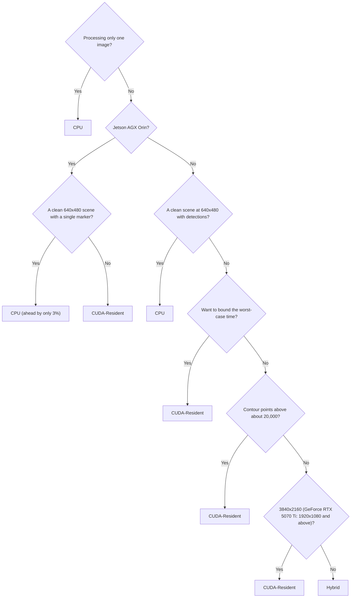

# Benchmark Report: CPU / Hybrid / CUDA-Resident Comparison

- Measurement date: 2026-08-29
- Subject: an implementation that keeps everything from input image downscaling and thresholding through corner subpixel refinement resident on the GPU
- Raw measurement results: `docs/measurements/`. That directory holds the 28-scene sweep, the startup measurement, the memory-mode comparison, and the accuracy evaluation. The 9-scene same-session set used in "Before and after optimization" and "Hybrid route breakdown", and the profiling runs behind the per-stage breakdowns, are **not** included in this repository, so the numbers taken from them cannot be re-derived by a reader. Each section below states which set it uses.

## Purpose

For the three routes — the CPU baseline implementation, the Hybrid route, and the CUDA-Resident route — this report gives the crossover point defined by the [evaluation plan](evaluation-plan.md) (the condition at which the advantage switches between CPU and CUDA). The goal is to present which route to choose under which conditions, in a form that can be judged from measured values.

**We do not assume that CUDA is always faster.** We state explicitly the conditions under which the CPU wins.

## Scope

| Route | Contents | Measured interval |
| --- | --- | --- |
| `CPU` | OpenCV ArUco3 (`detectMarkers`) | From `cv::Mat` input to the result on the host |
| `Hybrid` | Downscaling and adaptive thresholding on the GPU, candidate extraction and decode on the CPU | From the image on the device to the result on the host |
| `CUDA-Resident` | GPU-resident from downscaling through corner subpixel refinement | Issuing `detect_async` and synchronizing the stream |
| `CUDA-E2E` | The full GPU route with host input | Transfer from the host, issue, synchronization, and retrieval of the result |

`CUDA-E2E` is used only for comparing input memory types. The speed comparison of the three routes uses `CPU`, `Hybrid`, and `CUDA-Resident`.

The figure shows the measured interval for each route. The arrows are the data flow for one frame.


For Hybrid the center of the cost is returning the thresholded image to the host; what characterizes CUDA-Resident is that it has no host synchronization.

**All conclusions in this report were obtained on the synthetic corpus.** A real-image corpus has not been prepared, and the boundary may move on real images.

## Measurement conditions

| Item | Value |
| --- | --- |
| Measured interval | **Detection only. Image loading and checksums are not included** |
| Repetitions | 30 warmup, 200 latency. **Throughput was not measured**: `conditions.throughput_frames` is 0 and `throughput_fps` is null in every measurement row of every result JSONL |
| Startup cost | Measured separately. One image per process, three times |
| OpenCV threads | 1 |
| ASLR | Enabled. The container's privileges do not allow `setarch -R` |
| Independent runs | 3 processes. We take the median of the p50 values and report the run-to-run variance alongside |
| Percentiles | nearest-rank. No interpolation, so the value returned is always an actually measured one |
| corpus | 28 scenes selected from the `full` preset of the synthetic corpus (4 resolutions x 0/1/4/16 markers + blur / noise / combined at 4 resolutions each) |
| Dictionary | `DICT_ARUCO_MIP_36h12` |
| ArUco3 detection strategy | Enabled. `minSideLengthCanonicalImg` = 32, `minMarkerLengthRatioOriginalImg` = 0.05 |

The `n` in a scene name is the number of markers **placed**, not the number detected, and the `s` is the marker side in pixels. With the ArUco3 lower bound `32 + 0.05 x long side`, the placed side is at or below that bound in most of the higher-resolution scenes, so **20 of the 28 scenes detect nothing**; the remaining 8 detect 1 or 4 markers. The sweep is therefore a timing corpus, not a detection corpus.

The measured interval does not include PNG decoding. Real-time processing does not decode PNG, and loading the image once per iteration would make decoding the bulk of the measured interval, which would not hold up as a comparison of end-to-end detection time. The `schema_version` of the result JSONL is 4; results from a different version are not aggregated together, because the same keys refer to different intervals.

### Pinning the CPU core

**We pin to a performance core.** On machines that mix performance and efficiency cores, the value for the CPU route changes by about a factor of 2 depending on which one is measured. Measuring on an efficiency core makes the GPU side's advantage look larger than it is.

The cores of the DGX Spark GB10 alternate. In `lscpu`, CPU 0-4 and 10-14 are Cortex-A725 (max 2808/2860 MHz), and **CPU 5-9 and 15-19 are Cortex-X925 (max 3900/3978 MHz)**. CPU 5, which is used for the measurements, is a performance core. This mapping is also recorded in `cpu_topology` in the `environment` row of the measurement results as `Cortex-X925 x10 (cpu 5-9,15-19)`, so **which core was measured can be verified from the results**.

| Machine | Core configuration | CPU used for measurement |
| --- | --- | --- |
| DGX Spark GB10 | Cortex-A725 x10 (efficiency, cpu 0-4/10-14), Cortex-X925 x10 (performance, cpu 5-9/15-19) | 5 (X925, performance) |
| GeForce RTX 5070 Ti machine | 4.80GHz x2, 4.70GHz x6 (performance), 4.60GHz x12 (efficiency) | 2 (4.70GHz) |
| Jetson AGX Orin | Cortex-A78AE x12 (uniform) | 0 |

CPU 0 on the DGX Spark is an efficiency core, while CPU 0 on the GeForce RTX 5070 Ti machine is a performance core. **Matching by number alone means comparing different kinds of core.**

### Input memory types

| Type | Input buffer | What happens in the measured interval |
| --- | --- | --- |
| `M-Device` | Device-resident | The transfer is outside the measured interval. For when the upstream is on the GPU |
| `M-Pageable` | The ordinary memory of a `cv::Mat` | The driver copies into a staging area, then DMAs |
| `M-Pinned` | Page-locked host memory | DMA reads it directly. **The copy is done once, outside the measured interval** |
| `M-Managed` | Managed memory | **There is no explicit copy.** Pages migrate the moment the device touches them |

We move the `M-Pinned` copy outside the measured interval because the evaluation plan's axis is "the memory type of the **input buffer**". Copying every frame would measure the cost of the copy rather than the difference between types.

### Target machines

| Machine | GPU | CC | GPU type | CPU | CUDA |
| --- | --- | --- | --- | --- | --- |
| DGX Spark GB10 | NVIDIA GB10 | 12.1 | integrated | Cortex-X925 / A725 | 13.0 |
| Jetson AGX Orin | Orin | 8.7 | integrated | Cortex-A78AE (MAXN) | 11.4 |
| Jetson AGX Thor | NVIDIA Thor | 11.0 | integrated | Neoverse-V3AE x14 (MAXN) | 13.0 |
| GeForce RTX 5070 Ti | GeForce RTX 5070 Ti | 12.0 | **discrete** | Intel Core Ultra 7 265 | 13.0 |

The configuration of three integrated-GPU machines and one discrete-GPU machine is there to separate results specific to integrated GPUs from results that hold in general.

The Jetson AGX Thor was measured on 2026-08-31; the other three on 2026-08-29. Its files carry that date.

## Current state

### Summary of results

1. **The three routes produce the same detection results.** The detection counts agree across all 336 combinations of 28 scenes x 3 routes x 4 machines. **In 20 of the 28 scenes that count is 0**, so 240 of the 336 combinations are agreement on zero; the other 8 scenes detect 1 or 4 markers each. The degree of agreement in the coordinates is in [the accuracy evaluation results](accuracy-report.md).
2. **The CPU beats CUDA-Resident in small scenes with a low contour point count.** That is 5 of the 28 scenes on the DGX Spark, 4 on the GeForce RTX 5070 Ti, and 1 on the Jetson AGX Orin. **Resolution alone does not determine it.** Even at the same 640x480, `noise_640x480` has many contour points, and on the DGX Spark the CPU takes 1.406 ms against 0.612 ms for CUDA-Resident, making the GPU 2.3 times faster. Conversely, the 5 scenes on the DGX Spark include one 1280x720 scene.
3. **This, however, applies when the route is fixed to CUDA-Resident.** On the DGX Spark and the GeForce RTX 5070 Ti, **there is not a single scene out of the 28 where the CPU beats Hybrid.** If the faster GPU route can be chosen per scene, no scene remains where the CPU wins on these two machines. Only on the Jetson AGX Orin is there one scene where the CPU beats both routes at once (`clean_640x480_n1_s128`, CPU 0.870 ms against the best GPU result of 0.896 ms).
4. **What sets the boundary is neither resolution nor candidate count, but the contour point count after thresholding.** The coefficient per 1e5 contour points is 2.48 to 5.35 ms for the CPU and 2.54 to 5.48 ms for Hybrid, against 0.041 to 0.278 ms for CUDA-Resident.
5. **The contour point coefficient of Hybrid is nearly the same as the CPU's.** That is because everything from contour extraction onward runs on the host, and this is the essential difference between Hybrid and CUDA-Resident.
6. **The value of CUDA-Resident is that it has no slow scenes.** The spread across scenes is 3.4 to 4.1 times, which stays small compared with 11.6 to 20.8 times for the CPU and 10.0 to 43.7 times for Hybrid.
7. **For a single detection the CPU remains faster by an order of magnitude.** Time until the first image's result is 2.2 to 6.1 ms for the CPU and 57.6 to 174.0 ms for the GPU routes. Breaking even takes roughly 100 to 420 frames with Hybrid and roughly 110 to 350 frames with CUDA-Resident.
8. **Do not choose managed memory for input.** On a discrete GPU it is 6.4 to 30 times slower. On integrated GPUs it stays at 1.01 to 1.22 times, but it is never faster.
9. **The run-to-run variance of the GPU routes is an order of magnitude larger than that of the CPU route only on the DGX Spark** (0.6% against 17.7% and 14.1%). On the Jetson AGX Orin only Hybrid is larger (3.5% against 0.4%); CUDA-Resident is 0.5%, the same order as the CPU. On the GeForce RTX 5070 Ti both GPU routes are at or below the CPU route (0.4% and 0.0% against 0.5%). A single measurement is not enough to judge on the DGX Spark, or in the worst scenes on the Jetson AGX Orin.

### Which route is faster when

The scenes where the CPU route beats CUDA-Resident, or ties with it, are as follows. The ratio takes the CPU as 1; a value greater than 1 means the CPU is faster. **The Jetson AGX Thor has no such scene** and so appears nowhere in this table.

| Machine | Scene | Detections | CPU | CUDA-Resident | Ratio |
| --- | --- | --- | --- | --- | --- |
| DGX Spark GB10 | clean_640x480_n16_s64 | 1 | 0.539 ms | 0.744 ms | **1.38** |
| DGX Spark GB10 | clean_640x480_n1_s128 | 1 | 0.416 ms | 0.568 ms | **1.36** |
| DGX Spark GB10 | clean_640x480_n4_s128 | 4 | 0.557 ms | 0.708 ms | **1.27** |
| DGX Spark GB10 | blur_640x480 | 4 | 0.539 ms | 0.636 ms | **1.18** |
| DGX Spark GB10 | clean_1280x720_n1_s128 | 1 | 0.606 ms | 0.606 ms | 1.00 |
| Jetson AGX Orin | clean_640x480_n1_s128 | 1 | 0.870 ms | 0.896 ms | **1.03** |
| GeForce RTX 5070 Ti | clean_640x480_n1_s128 | 1 | 0.226 ms | 0.388 ms | **1.72** |
| GeForce RTX 5070 Ti | clean_640x480_n16_s64 | 1 | 0.371 ms | 0.516 ms | **1.39** |
| GeForce RTX 5070 Ti | clean_640x480_n4_s128 | 4 | 0.376 ms | 0.470 ms | **1.25** |
| GeForce RTX 5070 Ti | blur_640x480 | 4 | 0.360 ms | 0.431 ms | **1.20** |

**The CPU wins in scenes with a low contour point count.** Even at 640x480, `noise_640x480` and `combined_640x480` have many contour points and CUDA-Resident wins. At 1280x720 and above, CUDA-Resident wins everywhere except the single tie with one marker.

The reason is that the GPU has a fixed cost and is flat with respect to the amount of work, while the CPU scales with the amount of work. In the 640x480 scenes with detections, where the amount of work is smallest, the amount of work does not exceed the GPU's fixed cost.

**This boundary is limited to the synthetic corpus.** Real images are likely to have more contour points than the synthetic corpus, in which case the crossover point moves toward the side unfavorable to the CPU (the side where the GPU wins even on smaller images). We have not confirmed this yet.

### The quantity that sets the boundary is the contour point count

Native resolution is not an explanatory variable. Since the ArUco3 detection strategy downscales by `fxfy = 32 / (32 + 0.05 x long side)`, **a 27-fold change in native resolution changes the segmentation area by only 2.2 times**.

| Native | segmentation | Pixels |
| --- | --- | --- |
| 640x480 | 320x240 | 76,800 |
| 1280x720 | 427x240 | 102,480 |
| 1920x1080 | 480x270 | 129,600 |
| 3840x2160 | 549x309 | 169,641 |

The number of quadrilateral candidates is not an explanatory variable either. `noise_1280x720` has **zero detections** and yet is one of the heaviest scenes for the CPU route.

What matters is the **contour point count after thresholding**. `noise_1280x720` has 122,607 points and `clean_1280x720_n4` has 6,373, a 19-fold difference.

#### How the contour points are counted

The contour point count is a value derived from the corpus images by the following procedure; it is not part of the measurement harness output. **To reproduce it you must run this procedure yourself.**

1. Apply the ArUco3 downscale factor `fxfy = S / (S + max(W,H) * tau)` to the corpus image to produce the segmentation image.
2. Apply `cv::adaptiveThreshold` in three variants, with window 3, 13, and 23 (`ADAPTIVE_THRESH_MEAN_C`, `THRESH_BINARY_INV`, constant 7).
3. Apply `cv::findContours` to each thresholded image with `RETR_LIST` and `CHAIN_APPROX_NONE`, and sum the point counts of all contours.
4. Take the sum over the three windows as the contour point count for that scene.

These are the same settings the OpenCV detector uses internally, and they are read from `DetectorConfig` rather than repeated, so they cannot drift apart.

**The procedure is now a tool: `tools/contourcount`.** Its output for the 28 sweep scenes is committed as `docs/measurements/2026-08-31-contour-points-aarch64.json` and `-x86_64.json`, one per corpus, so the regression input can be regenerated and the coefficients below can be checked. Two corpora because the same seed produces slightly different images on the two architectures; the counts nonetheless agree to 0.002% in total, and to the point on the two headline scenes.

Two details of the downscale decide whether the count comes out right, and both were found the hard way while writing the tool. The factor is computed in `float` and the size rounded with `lrint`, as `detail::plan_scales` does, because a `double` lands on the other side of a rounding boundary and gives a size one pixel different. And it is the **size** that is handed to `cv::resize`, not the factor: OpenCV recomputes the interpolation coefficients as `dst / src` when given a size, and uses the factor as given when given a factor, so the two produce different pixels at the same output size. The detector takes the first path, as `src/core/preprocess.cu` says where it computes `inverse_scale = dst / src`. Passing the factor instead inflates the count by up to a factor of three on a high-texture scene, while leaving it exactly right at 640x480 and 1920x1080, where the size divides evenly and the two agree.

#### Regression results

We fit `time = b0 + b1 x segMpx + b2 x Mpx + b3 x [has detections] + b4 x detection count + b5 x (contour points / 1e5)` to the 28 scenes. R2 is 0.966 to 0.979 for the CPU, 0.886 to 0.953 for Hybrid, and 0.892 to 0.969 for CUDA-Resident.

**The coefficient per 1e5 contour points** is what separates the routes.

| Machine | CPU | Hybrid | CUDA-Resident | Ratio (CPU / Resident) |
| --- | --- | --- | --- | --- |
| DGX Spark GB10 | 1.70 ms | 1.79 ms | **0.050 ms** | 34x |
| Jetson AGX Orin | 3.55 ms | 3.63 ms | **0.182 ms** | 19x |
| Jetson AGX Thor | 2.70 ms | 2.92 ms | **0.100 ms** | 27x |
| GeForce RTX 5070 Ti | 1.64 ms | 1.67 ms | **0.027 ms** | 61x |

The three machines that had coefficients before keep them: recomputing from the committed input reproduces 2.558, 2.696 and 0.077 for the DGX Spark against the published 2.56, 2.70 and 0.077, and likewise on the other two. The R2 values match as well. What is new is that the input is committed and the counting is a tool, so this can now be checked rather than taken on trust, and the Jetson AGX Thor could be added at all.

**Hybrid's coefficient is nearly the same as the CPU's.** Hybrid runs only preprocessing and thresholding on the GPU and everything from contour extraction onward on the host. Only CUDA-Resident is 19 to 60 times smaller, and this is the essential difference between the three routes.

A step from the presence of detections appears only in CUDA-Resident (+0.25 to +0.38 ms), because corner subpixel refinement and decode start up at the first detection. In CPU and Hybrid the step is nearly 0; instead, each detection adds 0.026 to 0.074 ms.

### Spread per route

The minimum and maximum over the 28 scenes.

| Machine | CPU | Hybrid | CUDA-Resident |
| --- | --- | --- | --- |
| DGX Spark GB10 | 0.416 to 4.846 ms (**11.6x**) | 0.131 to 4.054 ms (**31.0x**) | 0.185 to 0.744 ms (**4.0x**) |
| Jetson AGX Orin | 0.832 to 12.123 ms (**14.6x**) | 0.870 to 8.712 ms (**10.0x**) | 0.483 to 1.630 ms (**3.4x**) |
| Jetson AGX Thor | 0.792 to 8.923 ms (**11.3x**) | 0.367 to 6.170 ms (**16.8x**) | 0.298 to 0.966 ms (**3.2x**) |
| GeForce RTX 5070 Ti | 0.226 to 4.696 ms (**20.8x**) | 0.088 to 3.832 ms (**43.7x**) | 0.126 to 0.516 ms (**4.1x**) |

**CUDA-Resident varies by only 3.2 to 4.1 times.** The CPU varies by 11.3 to 20.8 times and Hybrid by 10.0 to 43.7 times. For applications designed around worst-case rather than best-case time, this is its greatest advantage.

### Switching between Hybrid and CUDA-Resident

Sorted by ascending contour point count, the position where the winning route switches stands out clearly. The value in parentheses is the ratio of CUDA-Resident to Hybrid; below 1 means CUDA-Resident is faster.

| Scene | Contour points | DGX Spark | Jetson AGX Orin | RTX 5070 Ti |
| --- | --- | --- | --- | --- |
| clean_640x480_n0_s16 | 0 | Hybrid (1.42) | **Resident** (0.41) | Hybrid (1.44) |
| clean_1280x720_n0_s16 | 0 | Hybrid (1.97) | **Resident** (0.67) | **Resident** (0.94) |
| clean_1920x1080_n0_s16 | 0 | Hybrid (1.13) | **Resident** (0.76) | **Resident** (0.66) |
| clean_3840x2160_n0_s16 | 0 | **Resident** (0.71) | **Resident** (0.72) | **Resident** (0.32) |
| clean_3840x2160_n1_s128 | 583 | **Resident** (0.78) | **Resident** (0.74) | **Resident** (0.37) |
| clean_1920x1080_n1_s128 | 1,146 | Hybrid (1.22) | **Resident** (0.81) | **Resident** (0.83) |
| blur_3840x2160 | 1,460 | **Resident** (0.78) | **Resident** (0.74) | **Resident** (0.37) |
| clean_1280x720_n1_s128 | 1,587 | Hybrid (3.05) | **Resident** (0.83) | Hybrid (2.10) |
| clean_3840x2160_n4_s128 | 2,189 | **Resident** (0.75) | **Resident** (0.74) | **Resident** (0.38) |
| clean_640x480_n1_s128 | 2,612 | Hybrid (3.40) | **Resident** (0.71) | Hybrid (3.09) |
| blur_1920x1080 | 2,703 | Hybrid (1.22) | **Resident** (0.80) | **Resident** (0.81) |
| clean_3840x2160_n16_s64 | 3,669 | **Resident** (0.77) | **Resident** (0.73) | **Resident** (0.36) |
| blur_1280x720 | 3,902 | Hybrid (1.57) | **Resident** (0.79) | Hybrid (1.23) |
| clean_1920x1080_n4_s128 | 4,632 | Hybrid (1.62) | **Resident** (0.78) | **Resident** (0.85) |
| clean_1280x720_n4_s128 | 6,390 | Hybrid (2.09) | **Resident** (0.75) | Hybrid (1.42) |
| blur_640x480 | 6,840 | Hybrid (2.16) | **Resident** (0.67) | Hybrid (1.65) |
| clean_1920x1080_n16_s64 | 7,160 | Hybrid (1.49) | **Resident** (0.77) | **Resident** (0.76) |
| combined_1920x1080 | 8,237 | **Resident** (0.67) | **Resident** (0.53) | **Resident** (0.41) |
| combined_640x480 | 9,831 | Hybrid (1.55) | **Resident** (0.57) | Hybrid (1.07) |
| clean_640x480_n4_s128 | 10,178 | Hybrid (2.30) | **Resident** (0.66) | Hybrid (1.70) |
| clean_1280x720_n16_s64 | 10,893 | Hybrid (1.65) | **Resident** (0.59) | Hybrid (1.01) |
| clean_640x480_n16_s64 | 18,329 | Hybrid (2.56) | **Resident** (0.70) | Hybrid (1.92) |
| combined_3840x2160 | 27,461 | **Resident** (0.28) | **Resident** (0.34) | **Resident** (0.15) |
| combined_1280x720 | 31,181 | **Resident** (0.31) | **Resident** (0.24) | **Resident** (0.18) |
| noise_640x480 | 35,437 | **Resident** (0.49) | **Resident** (0.30) | **Resident** (0.35) |
| noise_1920x1080 | 59,902 | **Resident** (0.20) | **Resident** (0.19) | **Resident** (0.11) |
| noise_1280x720 | 99,074 | **Resident** (0.14) | **Resident** (0.16) | **Resident** (0.09) |
| noise_3840x2160 | 127,319 | **Resident** (0.14) | **Resident** (0.19) | **Resident** (0.07) |

**Above roughly 18,000 contour points, CUDA-Resident wins on all four machines.** On the recounted scale the highest count at which the CPU still wins anywhere is 18,330, on the GeForce RTX 5070 Ti. The figure was 20,000 on the old scale, and the two agree more closely than the change in the counts would suggest. Below that the winner is not decided by the contour point count alone, so **20,000 is a rough guide and not a boundary**. The table contains counterexamples in which CUDA-Resident wins far below it, and they are grouped by native resolution rather than by contour points.

- DGX Spark: the five 3840x2160 scenes below 20,000 points all go to CUDA-Resident (0.71 to 0.78) even though they have 0 to 3,669 points, and so does `combined_1920x1080` at 8,237 points (0.67).
- GeForce RTX 5070 Ti: every scene at 1920x1080 and above goes to CUDA-Resident, the lowest of them at 0 points; `clean_1280x720_n0_s16` (0 points) also goes to CUDA-Resident, but at 0.94 that is close to a tie.

Hybrid is faster below 20,000 points only at the lower resolutions: on the DGX Spark at 1920x1080 and below except `combined_1920x1080`, and on the GeForce RTX 5070 Ti at 1280x720 and below except `clean_1280x720_n0_s16`. On clean 640x480 the gap in Hybrid's favor reaches 2 to 3 times.

**On the Jetson AGX Thor, CUDA-Resident wins in all 28 scenes**, the only machine of the four where it does. On the Jetson AGX Orin it wins in 27 of the 28; the CPU takes `clean_640x480_n1_s128` by 3% (0.870 ms against 0.896 ms). Both have the weakest CPUs of the four, so Hybrid's CPU stage is at a disadvantage there.

### Startup cost and break-even frames

This is a cost that does not appear in the post-warmup percentiles. We measured it with one image per process (running several images in one process would let the second image onward use a warmed context, so the startup cost would not appear). 1280x720 with 4 markers, `M-Device`. This set is published as `docs/measurements/2026-08-29-*-startup.jsonl`, so the table below can be recomputed.

| Machine | Route | To the first image | Steady state | Break-even frames |
| --- | --- | --- | --- | --- |
| DGX Spark GB10 | CPU | 3.3 ms | 0.699 ms | - |
| DGX Spark GB10 | Hybrid | 171.0 ms | 0.301 ms | about 420 |
| DGX Spark GB10 | CUDA-Resident | 174.0 ms | 0.696 ms | **cannot be computed** |
| Jetson AGX Orin | CPU | 6.1 ms | 1.676 ms | - |
| Jetson AGX Orin | Hybrid | 57.6 ms | 1.144 ms | about 100 |
| Jetson AGX Orin | CUDA-Resident | 69.8 ms | 1.077 ms | about 110 |
| Jetson AGX Thor | CPU | 5.2 ms | 1.420 ms | - |
| Jetson AGX Thor | Hybrid | 93.2 ms | 0.561 ms | about 166 |
| Jetson AGX Thor | CUDA-Resident | 92.8 ms | 0.837 ms | about 111 |
| GeForce RTX 5070 Ti | CPU | 2.2 ms | 0.614 ms | - |
| GeForce RTX 5070 Ti | Hybrid | 66.1 ms | 0.295 ms | about 200 |
| GeForce RTX 5070 Ti | CUDA-Resident | 70.0 ms | 0.421 ms | about 350 |

**For a single detection or a short burst, the CPU route is faster by an order of magnitude.** Continuous processing at 30 fps breaks even within a few to a dozen or so seconds, but for applications that process only one image there is no comparison.

The reason no break-even frame count can be given for CUDA-Resident on the DGX Spark is that the steady state in this scene is almost the same as the CPU's (0.696 ms against 0.699 ms). **When the difference is small, the break-even frame count is meaningless, because the denominator of the division approaches 0.** In the 28-scene sweep on the same machine the values are 0.626 ms and 0.702 ms, which gives about 2300 frames. This scene is the boundary itself for the DGX Spark.

The breakdown of the startup cost differs by machine. CUDA context creation itself, taken as the median of `cuda_context_ms` recorded in the `environment` row of the measurement results, is 16.5 ms on the DGX Spark, 9.0 ms on the Jetson AGX Orin, and 67.9 ms on the GeForce RTX 5070 Ti (27 runs per machine). The variance is large: the Jetson AGX Orin ranges from 6.3 ms to 116.2 ms and the GeForce RTX 5070 Ti from 65.4 ms to 212.8 ms. The first process is not warmed up, so its value comes out large. Context creation cannot be reduced from the implementation side.

### Comparison of input memory types

We measured the three types on the `CUDA-E2E` route. The parentheses give the ratio with `M-Pageable` as 1.

**This comparison uses two scenes, not the 28-scene sweep.** The memory-mode JSONL holds 18 measurement rows per machine: 2 images x 3 memory modes x 3 processes. The two images are `clean_1280x720_n4_s128` and `clean_3840x2160_n4_s256`; the second has a marker side of 256 px, so it is **not** the `clean_3840x2160_n4_s128` of the sweep. Both detect 4 markers.

| Machine | Scene | M-Pageable | M-Pinned | M-Managed |
| --- | --- | --- | --- | --- |
| DGX Spark GB10 | 1280x720, 4 markers | 0.895 ms | 0.973 ms (1.09x) | 0.905 ms (1.01x) |
| DGX Spark GB10 | 3840x2160, 4 markers (s256) | 1.099 ms | 1.267 ms (1.15x) | **1.345 ms** (1.22x) |
| Jetson AGX Orin | 1280x720, 4 markers | 1.508 ms | 1.490 ms (0.99x) | 1.686 ms (1.12x) |
| Jetson AGX Orin | 3840x2160, 4 markers (s256) | 3.311 ms | **2.389 ms** (0.72x) | 3.449 ms (1.04x) |
| Jetson AGX Thor | 1280x720, 4 markers | 1.268 ms | 1.270 ms (1.00x) | 1.319 ms (1.04x) |
| Jetson AGX Thor | 3840x2160, 4 markers (s256) | 1.706 ms | 1.692 ms (0.99x) | 2.173 ms (1.27x) |
| GeForce RTX 5070 Ti | 1280x720, 4 markers | 0.505 ms | 0.521 ms (1.03x) | **3.217 ms** (6.37x) |
| GeForce RTX 5070 Ti | 3840x2160, 4 markers (s256) | 0.812 ms | **0.715 ms** (0.88x) | **24.773 ms** (30.52x) |

**Managed must not be used on a discrete GPU.** On the GeForce RTX 5070 Ti it is 6.4 times to **30 times** slower, because pages migrate from the host every time the device touches them. At 3840x2160 it takes 24.8 ms, which is no comparison to the 0.812 ms of pageable.

On integrated GPUs the disadvantage of managed is smaller (1.01 to 1.22 times on the DGX Spark, 1.04 to 1.12 times on the Jetson AGX Orin). **Even so, it is never faster than pageable.**

**Pinned helps only on large images.** At 3840x2160 the Jetson AGX Orin reaches 0.72x, the GeForce RTX 5070 Ti 0.88x, and the Jetson AGX Thor 0.99x. At 1280x720 there is no difference on any of the four machines (0.99 to 1.09 times). While the transfer volume is small, the advantage of DMA reading directly is buried in the detection time itself.

On the DGX Spark, pinned is **slower** (1.09 to 1.15 times). We believe this is because an integrated GPU does not cross PCIe, so there is no DMA advantage, and because page-locked regions change how the CPU-side cache is handled (unverified).

| Situation | Type to choose |
| --- | --- |
| The upstream is on the GPU | `M-Device` (the `CUDA-Resident` route) |
| Sending every frame from the host, around 1280x720 | `M-Pageable` |
| Sending every frame from the host, 3840x2160 on a discrete GPU or the Jetson AGX Orin | `M-Pinned` |
| Discrete GPU | **Do not choose `M-Managed`** |

This direction agrees with the measurements in the direction of passing results from the device to the host ([memory handoff between host and device](design/memory-transfer.md)). In the input direction the differences came out even larger.

**This is the only axis on which integrated and discrete split.** The ranking of speed is determined by the absolute performance of the GPU rather than by integrated versus discrete, and all four machines fit the same form of regression equation. With one discrete machine against three integrated ones, we still cannot state whether that generalizes.

### Run-to-run variance and measurement caveats

The relative range of the three p50 values, `(max - min) / min`, taken per scene over the three independent processes. The table gives the median over the 28 sweep scenes and the worst scene. The definition is written down here because it was not before, and recovering it from the numbers took four wrong guesses.

| Machine | CPU | Hybrid | CUDA-Resident |
| --- | --- | --- | --- |
| DGX Spark GB10 | 0.6% (max 2.6%) | **17.7%** (max 50.3%) | **14.1%** (max 69.2%) |
| Jetson AGX Orin | 0.4% (max 1.7%) | 3.5% (max 29.1%) | 0.5% (max 38.5%) |
| Jetson AGX Thor | 0.4% (max 1.8%) | 3.0% (max 55.6%) | 0.2% (max 0.8%) |
| GeForce RTX 5070 Ti | 0.5% (max 2.2%) | 0.4% (max 6.3%) | 0.0% (max 0.5%) |

**The variance of the GPU routes is an order of magnitude larger than that of the CPU route on the DGX Spark alone** (0.6% against 17.7% and 14.1%). The other three do not follow it: on the Jetson AGX Orin only Hybrid is larger (3.5% against 0.4%) while CUDA-Resident is 0.5%, the same order as the CPU; the Jetson AGX Thor behaves the same way (3.0% against 0.4%, with CUDA-Resident at 0.2%); and on the GeForce RTX 5070 Ti both GPU routes are at or below the CPU route. The Jetson AGX Orin medians hide its worst scene, where CUDA-Resident reaches 38.5% against 1.7% for the CPU, and the Thor hides a 55.6% scene on Hybrid.

#### The GPU clock explains the variance where it appears

The earlier text guessed that an unlocked GPU clock was the cause and marked the guess unverified. It has now been tested on the Jetson AGX Thor.

The GPU clock was pinned to its maximum through devfreq, `min_freq = max_freq` on `gpu-gpc-0`, holding 1575 MHz. Only the GPU: `jetson_clocks` would have pinned the CPU too and destroyed the control. The power mode stayed at MAXN, which is what every measurement here uses. MAXN sets a power budget and does not pin a clock; under it the GPU still scaled between 315 MHz and 1575 MHz.

The measurement that moves is the single-image one, where the process handles one 1280x720 image with 4 markers and the GPU starts cold. Within-run spread of that measurement:

| Route | p50, clock dynamic | p50, clock pinned | Spread, dynamic | Spread, pinned |
| --- | --- | --- | --- | --- |
| CPU (the control) | 1.420 ms | 1.424 ms | 1.6% | 1.6% |
| Hybrid | 0.561 ms | 0.529 ms | 5.3% | 6.4% |
| CUDA-Resident | 0.837 ms | 0.836 ms | **16.5%** | **5.5%** |

CUDA-Resident's spread falls to a third while its median moves by 0.1%, and the CPU route, which never touches the GPU, does not move at all. That is the control the earlier guess lacked.

**It only helps while the GPU is cold.** Repeating the 28-scene sweep with the clock pinned changes almost nothing: CUDA-Resident's median within-run spread goes from 0.9% to 0.8%. One process handles 28 images there, so the clock has ramped by the second image and there is nothing left to fix. In the single-image case the ramp is most of what is being measured.

This is a property of the measurement conditions rather than of the implementation. Pinning the clock is a way to measure repeatably; it is not a change to make in order to detect faster, because the medians do not move.

**The variance of the GPU routes is an order of magnitude larger than that of the CPU route on the DGX Spark** (0.6% against 17.7% and 14.1%), **and on the Jetson AGX Thor for CUDA-Resident** (1.6% against 16.5%). We believe this is because the GPU clock is not locked (unverified). The other two machines do not follow it: on the Jetson AGX Orin only Hybrid is larger (3.5% against 0.4%) while CUDA-Resident is 0.5%, the same order as the CPU, and on the GeForce RTX 5070 Ti both GPU routes are at or below the CPU route (0.4% and 0.0% against 0.5%). The Jetson AGX Orin medians hide its worst scene, where CUDA-Resident reaches 38.5% against 1.7% for the CPU.

Two rules for measuring follow from this. They are needed on the DGX Spark, and on the Jetson AGX Orin for the worst scenes; on the GeForce RTX 5070 Ti they cost nothing to keep.

- **Do not judge from a single measurement.** Use the median of three or more independent processes. Unless noted otherwise, the values in this report are medians over three processes.
- **A difference of around 10% cannot be decided by measurements taken in separate sessions.** The spread of the variance is wider than that difference. When comparing before and after an implementation change, measure them alternately within the same session.

The GPU stage of the Jetson AGX Orin has a wide range of 0.64 to 2.54 ms; even at the same 1280x720 it is 0.914 ms with 1 marker and 1.456 ms with 4. Excluding 3840x2160, the other two machines stay within 0.12 to 0.27 ms on the DGX Spark and 0.07 to 0.20 ms on the GeForce RTX 5070 Ti. The cause of this instability on the Jetson AGX Orin has not been identified.

### Before and after optimization

The current implementation has been through the following three changes. The comparison uses a set of 9 scenes measured alternately within the same session, a different measurement set from the 28-scene sweep above. Even the same scene differs by a few percent. **This set is not included in `docs/measurements/`, and no measurement file for the state before optimization exists there at all, so none of the numbers in this section can be checked against the published data.** For reference, the 28-scene sweep gives an after-optimization ratio to CPU of 0.89 / 0.63 / 0.68 (DGX Spark / Jetson AGX Orin / GeForce RTX 5070 Ti) for 1280x720 with 4 markers, and it contains no 3840x2160 scene with detections.

| Stage | Contents |
| --- | --- |
| Step 1 | Corner subpixel refinement changed from "one thread per corner" to "one block per corner, parallel over elements" |
| Step 2 | Otsu split into 3 phases, leaving on thread 0 only the recurrence that must be sequential |
| Step 3 | The issue sequence for one frame (124 kernel launches + 1 memset) folded into a CUDA Graph |

#### CUDA-Resident end-to-end time (before optimization → after optimization)

| Scene | DGX Spark | Jetson AGX Orin | RTX 5070 Ti |
| --- | --- | --- | --- |
| 640x480, 4 markers | 1.234 → **0.730** ms | 1.684 → **1.106** ms | 0.698 → **0.470** ms |
| 1280x720, 1 marker | 1.339 → **0.637** ms | 1.692 → **1.027** ms | 0.779 → **0.395** ms |
| 1280x720, 4 markers | 1.351 → **0.687** ms | 1.820 → **1.111** ms | 0.808 → **0.417** ms |
| 1280x720, 16 markers | 1.491 → **0.811** ms | 2.176 → **1.383** ms | 0.938 → **0.518** ms |
| 1920x1080, 4 markers | 1.473 → **0.778** ms | 2.081 → **1.348** ms | 0.895 → **0.495** ms |
| 3840x2160, 4 markers | 1.672 → **0.757** ms | 2.677 → **1.753** ms | 1.043 → **0.490** ms |
| blur (0 detections) | 0.572 → **0.438** ms | 1.053 → **0.755** ms | 0.211 → **0.194** ms |
| noise (0 detections) | 0.700 → **0.492** ms | 1.250 → **0.945** ms | 0.224 → **0.208** ms |

#### Ratio against the CPU (before optimization → after optimization; below 1 means the GPU is faster)

| Scene | DGX Spark | Jetson AGX Orin | RTX 5070 Ti |
| --- | --- | --- | --- |
| 640x480, 4 markers | 2.23 → **1.32** | 1.32 → **0.87** | 1.86 → **1.25** |
| 1280x720, 1 marker | 2.23 → **1.06** | 1.21 → **0.73** | 1.52 → **0.77** |
| 1280x720, 4 markers | 1.94 → **0.98** | 1.08 → **0.66** | 1.32 → **0.68** |
| 1280x720, 16 markers | 1.28 → **0.69** | 0.70 → **0.45** | 0.81 → **0.45** |
| 1920x1080, 4 markers | 1.50 → **0.79** | 0.79 → **0.51** | 0.99 → **0.55** |
| 3840x2160, 4 markers | 0.99 → **0.45** | 0.46 → **0.30** | 0.60 → **0.28** |
| blur (0 detections) | 0.98 → **0.75** | 0.79 → **0.57** | 0.43 → **0.40** |
| noise (0 detections) | 0.26 → **0.18** | 0.21 → **0.16** | 0.08 → **0.08** |

**The GPU beats the CPU in every scene except 640x480.** At 640x480 with 4 markers it is 1.32 on the DGX Spark and 1.25 on the GeForce RTX 5070 Ti, so **the CPU remains faster** (on the Jetson AGX Orin it is 0.87 and the GPU wins). This is the scene with the least work, and the amount of work does not exceed the GPU's fixed cost.

#### Breakdown by stage (1280x720, 4 markers)

| Stage | DGX Spark | Jetson AGX Orin | RTX 5070 Ti |
| --- | --- | --- | --- |
| Before optimization | 1.351 ms | 1.820 ms | 0.808 ms |
| Step 1 (corner refinement) | 1.046 ms | 1.630 ms | 0.550 ms |
| Step 2 (Otsu) | 0.937 ms | 1.467 ms | 0.436 ms |
| Step 3 (CUDA Graph) | 0.687 ms | 1.111 ms | 0.417 ms |

**Not a single bit of rounding has changed.** Corner refinement is guaranteed by bit-exact agreement with a verbatim oracle, Otsu by integer agreement with the threshold that `cv::threshold` returns (256 cases), and the CUDA Graph by agreement of results with the unfolded route. The rationale for each stage is in [the detection pipeline design](design/detector-pipeline.md).

#### What was targeted for optimization

Before optimizing, we separated by stage the fixed cost that starts up at the first detection (DGX Spark, an increment of 783 us over the minimum). These figures, and the per-launch and issue-time figures below, come from profiling runs against the pre-optimization implementation. **Those runs are not included in `docs/measurements/`, so this breakdown cannot be re-derived from the published data either.**

| Stage | Measured | Share of the increment |
| --- | --- | --- |
| Corner subpixel refinement | 335 us | **43%** |
| Otsu and border verification | 307 us | **39%** |
| Projective transform (thread 0 solves an 8x8 LU) | 18 us | 2% |
| Each decode stage and integration | 5 to 10 us | 1% |
| Subtotal explained | 665 to 670 us | 85% |
| Unexplained remainder | 113 to 118 us | 15% |

**Corner refinement and Otsu are roughly half and half.** Fixing only one of them removes only half of the startup. What determines the wait is not the iteration count but **the number of sequential double-precision instructions per iteration** (the measured iteration count is 1.9 to 3.3 per corner per stage, a tenth of the limit of 30). The sequential chain of corner refinement shrank from 2299 instructions per iteration (121 elements x 19 instructions) to roughly 140, and in Otsu the double-precision divisions per iteration shrank from 2 to 1.

In scenes with 0 detections, what remains is almost entirely kernel launch cost. On the DGX Spark it is **1.888 us** per launch, or 234 us for 124 launches, which amounts to **55% of the 427 us minimum for 0 detections**. Of the remaining 193 us, 110 us can be named (26 us for the first stage of the downscale pyramid, 9 us for resize, roughly 30 us in total for 6 adaptive thresholdings, and others), and **the remaining roughly 110 kernels take 2 to 7 us each, the same order as the cost of one launch. At this granularity we cannot separate "launch cost" from "actual work".** The per-launch cost on the GeForce RTX 5070 Ti has not been measured.

As a result of folding into a CUDA Graph, the host-side issue time fell from **0.241 ms to 0.023 ms**. End to end it shrank by 0.18 to 0.30 ms. Since it only launches the same kernels with the same arguments in the same order, there is in principle no room for the rounding to change. The danger is not rounding but staleness of the baked-in references: when the input dimensions, pitch, or pointers change, the graph is discarded. **CUDA does not allow capture on the default stream (`nullptr`)**, so in that case we issue one stage at a time.

For kernels that use shared memory, **the block count is derived from the SM count rather than from the upper bound on corners**. Using the upper bound directly limits how many blocks fit on one SM, splitting the launch into waves. This is a form of degradation that appears badly only on the Jetson AGX Orin out of the four machines, and a single machine would not reveal it.

#### Transfer optimization on the Hybrid route

In Hybrid, 8 synchronous transfers were changed to asynchronous transfers on a stream, and the destination was made pinned memory. The GPU stage fell from 0.461 ms to 0.206 ms on the DGX Spark and from 0.386 ms to 0.116 ms on the GeForce RTX 5070 Ti. What mattered was not the copies themselves but the cost of the 8 blocking calls (about 25 us each).

Even after optimization, about half of the GPU stage is transfers (on the DGX Spark, 0.099 ms of kernel execution against 0.206 ms for the whole GPU stage). Using managed memory would remove the explicit copies, but as the measurements above show, it is not faster even on an integrated GPU.

### Hybrid route breakdown (9 scenes)

A breakdown of the GPU stage and the CPU stage of Hybrid. This is a different measurement set from the 28-scene sweep above, and **it is not included in `docs/measurements/` either**; the ratio takes the CPU as 1, and below 1 means Hybrid is faster.

#### DGX Spark GB10

| Scene | CPU | Hybrid M-Device | of which GPU stage | of which CPU stage | Ratio | M-Pageable | Ratio |
| --- | --- | --- | --- | --- | --- | --- | --- |
| 640x480, 4 markers | 0.555 | 0.341 | 0.121 | 0.203 | 0.62 | 0.462 | 0.83 |
| 1280x720, 1 marker | 0.603 | 0.285 | 0.216 | 0.071 | **0.47** | 0.321 | 0.53 |
| 1280x720, 4 markers | 0.698 | 0.376 | 0.206 | 0.167 | 0.54 | 0.531 | 0.76 |
| 1280x720, 16 markers | 1.169 | 0.909 | 0.226 | 0.672 | 0.78 | 1.009 | 0.86 |
| 1920x1080, 4 markers | 0.979 | 0.497 | 0.268 | 0.239 | 0.51 | 0.701 | 0.72 |
| 3840x2160, 4 markers | 1.717 | 0.884 | 0.588 | 0.292 | 0.52 | 1.115 | 0.65 |
| blur | 0.585 | 0.266 | 0.214 | 0.052 | **0.46** | 0.395 | 0.68 |
| noise | 2.702 | 2.437 | 0.225 | 2.227 | 0.90 | 2.743 | 1.02 |
| combined degradation | 1.571 | 1.323 | 0.234 | 1.079 | 0.84 | 1.479 | 0.94 |

#### GeForce RTX 5070 Ti

| Scene | CPU | Hybrid M-Device | of which GPU stage | of which CPU stage | Ratio | M-Pageable | Ratio |
| --- | --- | --- | --- | --- | --- | --- | --- |
| 640x480, 4 markers | 0.375 | 0.275 | 0.066 | 0.209 | 0.73 | 0.292 | 0.78 |
| 1280x720, 1 marker | 0.514 | 0.188 | 0.116 | 0.071 | 0.37 | 0.227 | 0.44 |
| 1280x720, 4 markers | 0.610 | 0.295 | 0.116 | 0.179 | 0.48 | 0.335 | 0.55 |
| 1280x720, 16 markers | 1.147 | 0.874 | 0.117 | 0.758 | 0.76 | 0.899 | 0.78 |
| 1920x1080, 4 markers | 0.897 | 0.437 | 0.195 | 0.241 | 0.49 | 0.515 | 0.57 |
| 3840x2160, 4 markers | 1.736 | 0.823 | 0.599 | 0.223 | 0.47 | 1.116 | 0.64 |
| blur | 0.489 | 0.159 | 0.116 | 0.043 | **0.32** | 0.198 | 0.40 |
| noise | 2.656 | 2.425 | 0.197 | 2.227 | 0.91 | 2.441 | 0.92 |
| combined degradation | 1.431 | 1.121 | 0.136 | 0.985 | 0.78 | 1.171 | 0.82 |

#### Jetson AGX Orin

| Scene | CPU | Hybrid M-Device | of which GPU stage | of which CPU stage | Ratio | M-Pageable | Ratio |
| --- | --- | --- | --- | --- | --- | --- | --- |
| 640x480, 4 markers | 1.267 | 2.092 | 1.438 | 0.650 | 1.65 | 1.442 | 1.14 |
| 1280x720, 1 marker | 1.394 | 1.200 | 0.914 | 0.274 | 0.86 | 1.373 | 0.99 |
| 1280x720, 4 markers | 1.680 | 2.053 | 1.456 | 0.585 | 1.22 | 1.747 | 1.04 |
| 1280x720, 16 markers | 3.094 | 2.848 | 0.876 | 1.972 | 0.92 | 3.081 | 1.00 |
| 1920x1080, 4 markers | 2.622 | 2.592 | 1.632 | 0.819 | 0.99 | 2.431 | 0.93 |
| 3840x2160, 4 markers | 5.749 | 3.658 | 2.538 | 0.905 | **0.64** | 4.820 | 0.84 |
| blur | 1.321 | 0.846 | 0.640 | 0.191 | **0.64** | 1.319 | 1.00 |
| noise | 5.842 | 5.659 | 0.770 | 4.857 | 0.97 | 6.013 | 1.03 |
| combined degradation | 3.393 | 3.146 | 0.758 | 2.388 | 0.93 | 3.521 | 1.04 |

The CPU stage of Hybrid depends strongly on the content of the scene (0.04 to 2.2 ms). Because the GPU stage is comparatively stable, the smaller the CPU stage in a scene, the lower the ratio. Conversely, in noise, which has many candidates, the CPU stage accounts for 2.2 ms and the ratio stays around 0.90. This is the dividing line against CUDA-Resident.

Even on a discrete GPU the difference between `M-Device` and `M-Pageable` is small: on the GeForce RTX 5070 Ti it is 0.040 ms at 1280x720 and 0.293 ms at 3840x2160. On the integrated-GPU DGX Spark it comes out larger instead, 0.155 ms at 1280x720. The reason has not been identified.

### Choosing among the three routes


**There is no "always fastest route".** The ranking of the three routes changes with the scene.

| Condition | Route to choose | Rationale |
| --- | --- | --- |
| A single detection (one image only) | **CPU** | Time to the first result: CPU 2.2 to 6.1 ms, GPU routes 57.6 to 174.0 ms |
| Any scene on the Jetson AGX Thor | **CUDA-Resident** | It beats the CPU in all 28 scenes, the only machine of the four where that holds |
| A clean scene at 640x480 with detections, on the DGX Spark or the GeForce RTX 5070 Ti | **CPU** | CUDA-Resident / CPU is 1.18 to 1.72 |
| A clean scene at 640x480 with detections, on the Jetson AGX Orin | **CUDA-Resident**, except with a single marker | CUDA-Resident / CPU is 0.79 to 0.89 for `clean_640x480_n4_s128`, `clean_640x480_n16_s64`, and `blur_640x480`. Only `clean_640x480_n1_s128` favors the CPU, and by 3% (1.03) |
| Continuous processing on the Jetson AGX Orin | **CUDA-Resident** | Faster than Hybrid in all 28 scenes |
| Scenes with many contours (noise, combined degradation) | **CUDA-Resident** | The coefficient per 1e5 contour points is 1/19 to 1/60 of the CPU's |
| Fewer than about 20,000 contour points, at 1920x1080 and below on the DGX Spark or at 1280x720 and below on the GeForce RTX 5070 Ti | **Hybrid** | 2 to 3 times faster at clean 640x480. Above those resolutions CUDA-Resident wins even at low contour point counts |
| Wanting to bound the worst-case time | **CUDA-Resident** | The spread across scenes is 3.4 to 4.1 times; the CPU is 11.6 to 20.8 times |

The figure shows the decision flow. It assumes continuous processing, and the contour point count is the value after thresholding. **The 640x480 branch and the resolution branch differ by machine**, so the machine is asked first.



For applications where the contour point count cannot be known in advance, making CUDA-Resident the default keeps the worst-case time bounded.

## Goals

- Run the equivalent of the same 28 scenes on a real-image corpus and show how far the crossover point differs from the synthetic corpus.
- Record per-stage kernel time with CUDA events and separate it from the wall-clock time that includes host synchronization.
- Determine whether the startup cost can be reduced. CUDA context creation cannot be reduced, but narrowing the target architecture to one, or preloading the cubin, may shorten kernel loading.
- Add scenes smaller than 640x480 to the corpus and examine the inside of the crossover point.
- Determine whether the relationship between Hybrid and CUDA-Resident on the Jetson AGX Orin changes at resolutions above 3840x2160.

## Open questions

- Whether to measure with the GPU clock locked or left at the default. The run-to-run variance of the GPU routes on the DGX Spark (14 to 18% median) may be explained by this, but it is unverified. Locking would require checking per machine whether `nvidia-smi --lock-gpu-clocks` is possible.
- Because the crossover point sits at the bottom end of the corpus (640x480), the inside of the boundary has not been examined.
- Real images are likely to have more contour points than the synthetic corpus, in which case the crossover point moves toward the side unfavorable to the CPU. The boundary found here is limited to the synthetic corpus.
- The cause of the variance in the GPU stage of the Jetson AGX Orin (0.64 to 2.54 ms).
- The reason pinned is slower than pageable on the DGX Spark.
- The reason the difference between `M-Device` and `M-Pageable` comes out larger on the integrated-GPU DGX Spark than on the discrete-GPU GeForce RTX 5070 Ti.
- The CUDA Toolkit on the Jetson AGX Orin is 11.4 while the other three machines are on 13.0, and the influence of the toolkit version has not been separated out.
- The per-kernel-launch cost on the GeForce RTX 5070 Ti has not been measured.
- There is only one discrete-GPU machine against three integrated ones, so we cannot state whether the integrated-versus-discrete results generalize.

## Reproducing the measurements

The Jetson image changed on 2026-08-31, from `nvcr.io/nvidia/l4t-cuda:11.4.19-devel` to `ubuntu:20.04` with the CUDA packages installed from the L4T apt repository. `nvcc` is the same build either way, and the sweep was run again on the new image to confirm that: the median ratio against the numbers below is 1.000 over 84 route and scene pairs, on inputs that hash identically. The comparison and the one scene that moved are in [the 2026-08-31 update to ADR-0002](adr/0002-toolchain-and-target-baseline.md#re-measurement), and the data is in [docs/measurements](measurements/2026-08-31-jetson-orin-sweep-after-image-change.jsonl). The figures in this report are unchanged and still come from the 2026-08-29 runs.


```
# Run inside the container. <preset> is one of dgx-spark / jetson-orin / rtx-blackwell.
# <cpu> is the number of a performance core.
#   DGX Spark GB10 -> 5   GeForce RTX 5070 Ti host -> 2   Jetson AGX Orin -> 0
./build/<preset>/tools/corpusgen/aruco3cuda_corpusgen --preset full --seed 20260827 \
  --output-dir /tmp/benchcorpus --manifest /tmp/benchcorpus/manifest.json

B=./build/<preset>/bench/aruco3cuda_bench
# --throughput-frames 0 disables the throughput measurement. The harness defaults to 100,
# but the results in docs/measurements/ were taken with it off, so keep it at 0 to reproduce them.
COMMON="--warmup 30 --latency-iterations 200 --throughput-frames 0 --cpu-list <cpu> --threads 1"
# 28 scenes: 4 resolutions x 0/1/4/16 markers, plus blur / noise / combined at each of the 4 resolutions.
IMGS=""
for res in 640x480 1280x720 1920x1080 3840x2160; do
  for n in n0_s16 n1_s128 n4_s128 n16_s64; do
    IMGS="$IMGS --input /tmp/benchcorpus/clean_${res}_${n}.png"
  done
  for d in blur noise combined; do
    IMGS="$IMGS --input /tmp/benchcorpus/${d}_${res}.png"
  done
done

for run in 1 2 3; do
  taskset -c <cpu> $B $IMGS $COMMON --route CPU           --memory-mode N/A        >> results.jsonl
  taskset -c <cpu> $B $IMGS $COMMON --route Hybrid        --memory-mode M-Device   >> results.jsonl
  taskset -c <cpu> $B $IMGS $COMMON --route CUDA-Resident --memory-mode M-Device   >> results.jsonl
done

# The input memory type comparison is done on the CUDA-E2E route, on two scenes only --
# not on the 28 above. The 3840x2160 scene has a marker side of 256 px, not the 128 px
# of the sweep, so it is a different image from clean_3840x2160_n4_s128.
MEMIMGS="--input /tmp/benchcorpus/clean_1280x720_n4_s128.png"
MEMIMGS="$MEMIMGS --input /tmp/benchcorpus/clean_3840x2160_n4_s256.png"
for run in 1 2 3; do
  for m in M-Pageable M-Pinned M-Managed; do
    taskset -c <cpu> $B $MEMIMGS $COMMON --route CUDA-E2E --memory-mode $m >> results.jsonl
  done
done
python3 bench/aggregate.py results.jsonl
```

**Before measuring, confirm the following two things.**

1. That Compute Sanitizer is not running on the same machine. Running it at the same time pins the measured values high and invalidates the comparison of routes. Confirm that there are no other processes with `nvidia-smi --query-compute-apps=pid,name --format=csv`.
2. That the page cache is dropped.

```
sync && sudo sh -c 'echo 3 > /proc/sys/vm/drop_caches'
```

On an integrated GPU, device memory is the same thing as host memory. The "free" that `cudaMemGetInfo` returns corresponds to `MemFree` and does not include reclaimable page cache. When the page cache grows, not only can allocation fail, but the measured values also fluctuate. Details are in [memory handoff between host and device](design/memory-transfer.md).

## See also

- [Evaluation plan](evaluation-plan.md)
- [Accuracy evaluation results](accuracy-report.md)
- [Detection pipeline design](design/detector-pipeline.md)
- [Memory handoff between host and device](design/memory-transfer.md)
- [ADR-0002: Fix the build infrastructure and target environment baseline](adr/0002-toolchain-and-target-baseline.md)
- [ADR-0003: Adopt approach A (connected components and extreme point search) as the primary plan for quadrilateral candidate extraction](adr/0003-candidate-extraction-approach.md)
- [Measurement harness](../bench/benchmark_harness.md)
