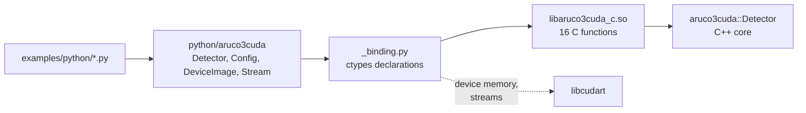

# C ABI and Python binding

## Purpose

Make the detector usable from outside C++ without giving up the properties that
justify the library: results that stay on the device, a workspace that is
allocated once, and a stream the caller owns.

Two layers do this. A C ABI (`include/aruco3cuda/c/aruco3cuda.h`, built as
`libaruco3cuda_c.so`) exposes the detector through plain C, and a Python package
(`python/aruco3cuda`) drives that ABI with `ctypes`. The Python side compiles
nothing.

## Scope

In scope: the detection path end to end, the built-in dictionaries, the
configuration, the host-side results, and the device pointers to the
device-side results.

Out of scope: the reference implementation, the benchmark harness, the corpus
generator, and anything else needing OpenCV. Those are instruments for
evaluation, not artifacts we ship.

## Current state

The Python package reaches the C++ core only through the C ABI. It also loads
the CUDA runtime directly, for the one thing the detector deliberately does not
do for its caller: allocating the device image and creating the stream.

- 16 functions are exported, and nothing else. The internal C++ symbols of the
  static libraries linked in are hidden with `--exclude-libs,ALL`; without it
  they were all re-exported, because `CXX_VISIBILITY_PRESET` covers only the
  shared library's own translation unit.
- The C enumerators are pinned to the C++ ones with `static_assert`, so
  reordering `Status` fails the build instead of renumbering every caller's
  error codes.
- No exception crosses the boundary. Unwinding through a C frame is undefined
  behavior, so every entry point catches and maps to
  `ARUCO3CUDA_STATUS_INTERNAL_ERROR`, the one status the C++ core never produces.
- The Python package depends on nothing outside the standard library. numpy is
  optional on the way in (anything supporting the buffer protocol is accepted)
  and unnecessary on the way out (results are plain Python objects).
- `DeviceImage` publishes `__cuda_array_interface__`, and `detect()` accepts
  anything that publishes it, so CuPy, PyTorch, and Numba arrays are handed over
  without a copy.
- The package is staged into `<build dir>/python` next to the shared object it
  loads, so a build tree works with `PYTHONPATH` alone.
- 32 Python tests run from `ctest`, split into the 21 that need no device and
  the 11 that do. The samples add 22 more, including three that compare the
  Python and C++ renderers byte for byte.

### Decisions

**A C ABI with ctypes rather than a pybind11 extension.** pybind11 would produce
less Python code, but it puts a third-party library and the Python development
headers into the build of a project that otherwise needs only CUDA, and it
produces a shared object tied to one Python version and ABI. A C ABI is built
once, works with any CPython 3, and is equally usable from Rust, Go, and C#. The
cost is that the ctypes mirror of each struct is written by hand.

**The mirror is tested, not trusted.** `test/python/test_binding.py` compares all
33 configuration defaults against `include/aruco3cuda/config.hpp` and separately
compares the declared field names against that list. Both were checked by
inserting a field into the ctypes struct alone: an insertion that moves later
fields fails the value comparison, and an insertion that lands in existing
alignment padding shifts nothing and is caught only by the name comparison.

**`detect()` takes device-resident input only.** Passing a host buffer raises
`TypeError` naming `DeviceImage.from_host`. Uploading silently per frame would
hide the transfer this library exists to avoid, and the Python API would then
teach the opposite of what the C++ one does.

**Results come back as plain objects, not numpy arrays.** Returning numpy would
be conventional for a vision library, but it would make numpy a hard requirement
for importing the package. Detections are bounded by `max_markers`, so the cost
of building a list is not on the path that matters. A caller who wants arrays can
read the device pointers from `device_detections()`.

**Enumerators use `ARUCO3CUDA_` rather than the repository's `kPascalCase`.**
Enumerators in a C header are global identifiers. This is the only place that
deviates, and it deviates because a global named `kOk` would be a defect.

## Goals

- Keep the C ABI stable enough to be worth calling from other languages. It is
  the published surface; the C++ classes are not.
- Keep the Python package free of dependencies, so that `import aruco3cuda`
  works on a machine with CUDA and nothing else.
- Keep the two sets of samples in step. `examples/` and `examples/python/` take
  the same options and print the same lines, and the tests compare their output,
  so neither can drift into being the one that is actually maintained.

## Open questions

- **Packaging.** The Python package is used from the build tree; `cmake
  --install` installs the shared object but not the `.py` files, and there is no
  `pyproject.toml`. Making it `pip install`-able means building a wheel that
  requires CUDA and covering three architectures, which was judged out of
  proportion to the current need.
- **ABI stability policy.** The `SOVERSION` is the project major version, which
  is 0. Nothing yet states what a consumer may rely on across releases.
- **No Windows.** `ARUCO3CUDA_C_API` has a `_WIN32` branch that expands to
  nothing, and `--exclude-libs` is GNU-linker specific. Neither has been tried,
  because the project targets Linux.
- **Coverage.** The Python package is not measured. gcov covers the C++ that
  `libaruco3cuda_c.so` is built from, but nothing measures the `.py` files.
