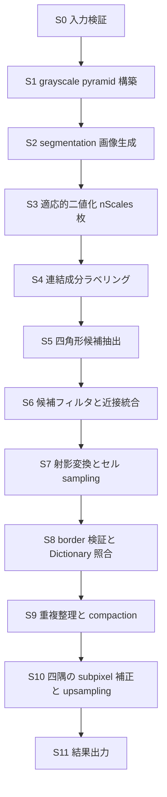
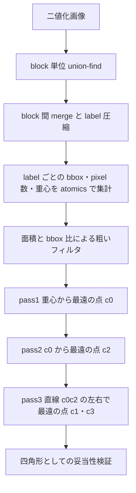

# 検出パイプライン設計

## 目的

ArUco3 検出戦略を CUDA へ分解する際の段階定義、段階ごとの並列化方針、可変長出力の扱い、同期点、CPU 基準結果との互換条件を定義します。

## 対象範囲

detector core の段階分解、各段階の GPU 適性評価、四角形候補抽出の設計案、workspace 設計、機種差の扱いを対象とします。姿勢推定、ChArUco board、AprilTag 専用経路は対象外です。

## 現状

CUDA 実装は存在しません。本書は設計案です。

互換対象である OpenCV 4.x の ArUco3 検出戦略については、Apache-2.0 の公開 header と source から次の観測仕様を確認しています。取得元と hash は [Code Provenance 記録](../code-provenance.md) を参照してください。

### OpenCV 4.x ArUco3 経路の観測仕様

| 記号 | 対応する parameter | 既定値 |
| --- | --- | --- |
| `S` | `minSideLengthCanonicalImg` | 32 |
| `tau_i` | `minMarkerLengthRatioOriginalImg` | 0.0 |
| `W`、`H` | 入力 grayscale の幅と高さ | - |

1. 縮小率を `fxfy = S / (S + max(W, H) * tau_i)` で求める。`useAruco3Detection` が false の場合は `fxfy = 1` とする。
2. `num_levels = (int)(log2(W * H / S^2) / 2)` 段の grayscale pyramid を、level ごとの scale 2 で構築する。
3. 四隅の upsampling 開始 level を `closest_pyr_image_idx = round(log2(1 / fxfy^2) / 2)` で求める。
4. `fxfy != 1` の場合、入力を `round(fxfy * W) x round(fxfy * H)` へ縮小する。候補抽出はこの segmentation 画像だけで行う。
5. 適応的二値化の window 数は `nScales = (winMax - winMin) / winStep + 1`。既定は window size 3、13、23 の 3 通り。
6. window ごとに二値化し、輪郭抽出と多角形近似で四角形候補を求め、全 window の候補を結合する。
7. 近接候補を `minMarkerDistanceRate` と `minGroupDistance` で grouping し、代表候補を残す。
8. 候補ごとに、辺長に対応する pyramid level で射影変換とセル sampling を行い、border 検証と Dictionary 照合をする。
9. ArUco3 有効時、corner refinement は subpixel 方式へ強制される。四隅は pyramid level を 1 段ずつ 2 倍しながら各 level で subpixel 補正され、window は最大辺が 1080 を超える場合 5、それ以外は 3 となる。
10. `useAruco3Detection` が true で `S == 0` かつ `tau_i == 0.0` の組み合わせは OpenCV 側で拒否される。

上記のうち縮小率と segmentation 画像 size は、CPU 基準 runner の自動テストで実測確認しています。1280x720、`S = 32`、`tau_i = 0.05` の場合、`fxfy = 0.3333` となり segmentation 画像は 427x240 になります。

ArUco3 が検出対象とする最小辺長は次の式で決まります。縮小後の辺長が `S` 以上である必要があることから導かれます。

```
side_px >= S + max(W, H) * tau_i
```

`tau_i` そのものが下限ではない点に注意が必要です。1280x720、`S = 32`、`tau_i = 0.05` の場合の下限は 96 pixel です。実測では 96 pixel のマーカーは検出されず、128 pixel は検出されました。境界値ちょうどでは再標本化の影響を受けます。

同一画像に対する CPU 基準実装の検出時間は、`tau_i = 0.05` で 1.112 ms、`tau_i = 0`（縮小なし）で 5.917 ms でした。検出された ID は両者で一致します。これは ArUco3 検出戦略が CPU 側でも有効に働くことを示すと同時に、`tau_i` の既定値 0.0 のままでは効果が得られないことを示します。

上記は互換性の基準であり、ground truth ではありません。`tau_i` の既定値は 0.0 であり、この場合 `fxfy = 1` となって縮小は発生しません。ArUco3 の速度効果を評価するには `tau_i` を明示的に設定する必要があります。

## 目標

### 前処理と OpenCV の一致度

WP-1.3 で S1 と S2 を実装し、OpenCV との差を実測しました。

| 段階 | OpenCV の対応処理 | 差 |
| --- | --- | --- |
| S1 pyramid | `buildPyramid` (`pyrDown`) | 全 level で完全一致 |
| S2 segmentation | `resize` の `INTER_LINEAR` | 最大 1 階調。不一致率は縮小率により 0 から 0.372 |

pyramid は `[1,4,6,4,1]` の整数演算であり、境界を `BORDER_REFLECT_101`、丸めを `(sum + 128) >> 8` とすることで完全に再現できます。四隅の subpixel 補正は pyramid 上で行われるため、ここが一致することは精度の前提になります。

segmentation は完全一致にできません。OpenCV の 8-bit `INTER_LINEAR` は `INTER_LINEAR_EXACT` と同じ結果を返し、その実体は `softdouble` による軟件浮動小数点と `ufixedpoint16` で構成された bit exact 経路です。平台間で同じ結果を得ることを目的とした設計であり、kernel 内で再現するにはこの 2 つの数値型を移植する必要があります。前処理段階の代償として見合わないため、1 階調の差を受け入れます。

この差が下流の適応的二値化で画素の白黒を入れ替える割合は、25% の画素へ無作為に 1 階調を加えた場合で 0.45% でした。Phase 2 の差異分類では、この分を候補抽出の設計差と区別して扱います。将来ビット単位の一致が必要になった場合は、係数表を host 側で OpenCV と同じ手順で計算して転送し、kernel は整数演算だけを行う構成が候補になります。

### 段階分解



### 段階ごとの並列化方針

| 段階 | 並列単位 | 主な手法 | GPU 適性 | 初期割当 |
| --- | --- | --- | --- | --- |
| S0 入力検証 | - | host 側の境界検証 | 対象外 | host |
| S1 pyramid | 出力 pixel | 分離型 downsample kernel を level ごとに起動 | 高 | Phase 1 |
| S2 segmentation | 出力 pixel | bilinear または area 縮小 | 高 | Phase 1 |
| S3 二値化 | 出力 pixel | integral image による定数時間 box mean、または shared memory の sliding window | 高 | Phase 1 |
| S4 ラベリング | pixel と label | block 単位 union-find と block 間 merge | 中 | Phase 2 |
| S5 候補抽出 | label | 極点探索による四隅推定 | 中 | Phase 2 |
| S6 フィルタ | 候補 | 述語評価と stream compaction | 高 | Phase 2 |
| S7 warp と sampling | 候補 | 1 候補 1 block、セル単位 sampling | 高 | Phase 3 |
| S8 Dictionary 照合 | 候補と codeword | packed codeword に対する popcount と最小値 reduction | 高 | Phase 3 |
| S9 重複整理 | 候補対 | sort と近接判定、compaction | 中 | Phase 3 |
| S10 四隅補正 | 四隅 | 1 corner 1 block の勾配法反復 | 中 | Phase 3 |
| S11 出力 | - | device buffer または host 転送 | - | Phase 1 |

S3 は既定で 3 通りの window size を評価します。CPU 実装では window ごとに輪郭抽出まで実行して結果を結合しますが、CUDA では S3 から S5 までを window 方向の 3 次元目として同時に処理し、S6 で統合する構成を初期案とします。

### 四角形候補抽出の設計案

S4 と S5 は、輪郭追跡が候補ごとに逐次的であるため、この pipeline で最も GPU に不向きな部分です。次の 3 案を比較対象とします。

| 案 | 内容 | 位置付け |
| --- | --- | --- |
| A | 連結成分ラベリングと極点探索で四隅を直接求める | 主案 |
| B | GPU 上で境界追跡を行い、多角形近似を適用する | 対案 |
| C | ラベリングまで GPU、四隅抽出を CPU へ委譲する | Phase 1 の基準かつ fallback |

#### 案 A の手順



1. マーカーの黒枠は、二値化画像上で内側に穴を持つ正方形の連結成分になります。極点探索は成分の全 pixel を対象にするため、穴を特別扱いする必要がありません。
2. 各 pass は距離と pixel index を 64-bit へ packing した `atomicMax` で実装し、label 単位に完全並列化します。
3. 四隅の順序を一定の回り方へ正規化し、`minCornerDistanceRate` と `minDistanceToBorder` に相当する条件で篩います。
4. 妥当性検証では、成分 pixel が推定四角形の内側へ収まる割合と、四角形面積に対する成分の bbox 占有率を確認します。CPU 実装の `polygonalApproxAccuracyRate` に相当する判定をここへ写像します。

#### 案 A の利点と制約

- 利点: 輪郭の順序付けと可変長 contour buffer が不要になり、label 単位で完全並列化できます。公式 ArUco GPLv3 実装の構造を移植しない独自設計として記録できます。
- 制約: 多角形近似そのものではないため、CPU 基準結果と候補集合が一致しない場合があります。特に、遮蔽で角が欠けた成分や、複数マーカーが接触して 1 成分になった場合の挙動が異なります。
- 判断: Phase 2 の完了条件として、CPU 基準結果との候補差異を「未検出」「過検出」「四隅ずれ」に分類し、案 A を継続するか案 B へ切り替えるかを ADR で決定します。

### 可変長出力と overflow

- 候補数と検出数は入力依存で可変です。上限付き device buffer と device 上の counter を使用します。
- 上限は `DetectorConfig` の `max_candidates_` と `max_markers_` から決め、source の固定値にしません。
- counter が上限を超えた場合は、書き込みを打ち切ったうえで overflow flag を立て、結果に明示的な状態値として返します。無言の切り捨てを行いません。
- compaction は、まず atomic counter による素朴な実装で正しさを固定し、Phase 4 で prefix sum 方式と比較します。

### workspace と memory 方針

- 想定する最大解像度、最大 pyramid 段数、`nScales`、候補上限から必要量を算出し、detector 生成時に一括確保します。
- フレームごとの `cudaMalloc` と `cudaFree` を行いません。入力解像度が変わった場合のみ再確保し、再確保が発生したことを統計として記録します。
- 中間 buffer は段階間で再利用し、同時に生存する必要がある buffer だけを別領域とします。
- DGX Spark GB10 と Jetson Orin はいずれも統合 GPU であり、host と device が同一物理 memory を共有します。pageable host、pinned host、managed、device 常駐の 4 経路を実装で選択でき、[評価計画](../evaluation-plan.md) で個別に測定できるようにします。

### 同期と stream

- 公開 API は caller 所有の `cudaStream_t` を受け取り、全 kernel をその stream へ発行します。
- core は `cudaDeviceSynchronize()` を呼びません。
- host 側で結果件数が必要になる時点でのみ同期が発生します。件数を host へ戻さずに済むよう、device 側の結果 buffer をそのまま返す API を用意します。
- benchmark では、段階ごとの CUDA event と wall-clock を分離して記録します。

### 機種差の扱い

- 共通経路を正本とし、`sm_87` と `sm_121` で同じアルゴリズムと同じ正確性テストを適用します。
- tile size、block size、shared memory 使用量、L2 を意識した分割は compile 時定数ではなく設定値とし、機種ごとに測定で決めます。
- `__CUDA_ARCH__` による分岐は kernel specialization として局所化し、共通経路の挙動を変えません。

## 実装上の判断

- 候補抽出は案 A を主案とし、案 C を Phase 1 の互換性基準かつ fallback として常に維持します。
- S3 から S5 までを window size 方向に同時実行し、CPU 実装のように window ごとの逐次結合を行いません。
- Dictionary 照合は 4 回転分を事前展開した packed codeword に対する popcount で行い、回転探索を分岐にしません。
- 四隅の subpixel 補正は、ArUco3 の精度に直結するため CPU 委譲を許容せず、Phase 3 で GPU 実装します。
- 入力は 8-bit grayscale に限定し、色変換は adapter の責務とします。

## 未確定事項

- 案 A の妥当性検証しきい値と、`polygonalApproxAccuracyRate` への写像方法。
- 連結成分ラベリングに 4 近傍と 8 近傍のどちらを使用するか。
- 二値化に integral image と sliding window のどちらが対象機で有利か。
- `detectInvertedMarker` 相当の白マーカー検出を初期 scope に含めるか。
- Dictionary を constant memory へ置く上限 size と、超過時の配置。
- S9 の重複整理を CPU 基準と同じ grouping 規則で実装するか、GPU 向けに再定義するか。

## 関連

- [アーキテクチャ](../architecture.md)
- [公開 API 草案](public-api.md)
- [実装計画](../implementation-plan.md)
- [評価計画](../evaluation-plan.md)
- [Code Provenance 記録](../code-provenance.md)
