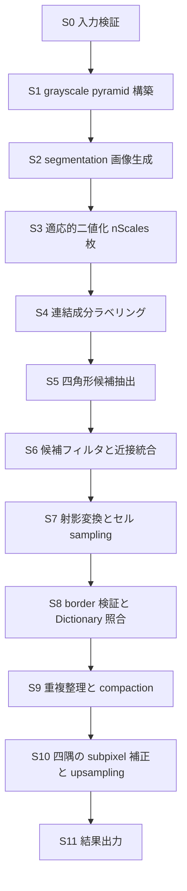
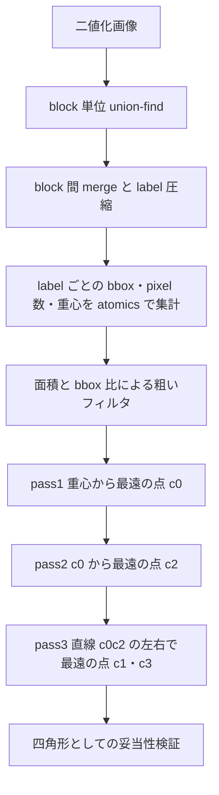

# 検出パイプライン設計

## 目的

ArUco3 検出戦略を CUDA へ分解する際の段階定義、段階ごとの並列化方針、可変長出力の扱い、同期点、CPU 基準結果との互換条件を定義します。

## 対象範囲

detector core の段階分解、各段階の GPU 適性評価、四角形候補抽出の設計案、workspace 設計、機種差の扱いを対象とします。姿勢推定、ChArUco board、AprilTag 専用経路は対象外です。

## 現状

S1 から S8 (前処理、二値化、連結成分ラベリング、四隅推定、候補の篩と統合、射影変換とセル sampling、Otsu と border 検証、Dictionary 照合) を CUDA で実装済みです。S9 以降 (重複整理、四隅の subpixel 補正、結果出力) は案 C のハイブリッド経路として CPU で実装しており、GPU 化は Phase 3 の続きです。

互換対象である OpenCV 4.x の ArUco3 検出戦略については、Apache-2.0 の公開 header と source から次の観測仕様を確認しています。取得元と hash は [Code Provenance 記録](../code-provenance.md) を参照してください。

### OpenCV 4.x ArUco3 経路の観測仕様

| 記号 | 対応する parameter | 既定値 |
| --- | --- | --- |
| `S` | `minSideLengthCanonicalImg` | 32 |
| `tau_i` | `minMarkerLengthRatioOriginalImg` | 0.0 |
| `W`、`H` | 入力 grayscale の幅と高さ | - |

1. 縮小率を `fxfy = S / (S + max(W, H) * tau_i)` で求める。`useAruco3Detection` が false の場合は `fxfy = 1` とする。
2. `num_levels = (int)(log2(W * H / S^2) / 2)` 段の grayscale pyramid を、level ごとの scale 2 で構築する。
3. 四隅の upsampling 開始 level を `closest_pyr_image_idx = round(log2(1 / fxfy^2) / 2)` で求める。
4. `fxfy != 1` の場合、入力を `round(fxfy * W) x round(fxfy * H)` へ縮小する。候補抽出はこの segmentation 画像だけで行う。
5. 適応的二値化の window 数は `nScales = (winMax - winMin) / winStep + 1`。既定は window size 3、13、23 の 3 通り。
6. window ごとに二値化し、輪郭抽出と多角形近似で四角形候補を求め、全 window の候補を結合する。
7. 近接候補を `minMarkerDistanceRate` と `minGroupDistance` で grouping し、代表候補を残す。
8. 候補ごとに、辺長に対応する pyramid level で射影変換とセル sampling を行い、border 検証と Dictionary 照合をする。
9. ArUco3 有効時、corner refinement は subpixel 方式へ強制される。四隅は pyramid level を 1 段ずつ 2 倍しながら各 level で subpixel 補正され、window は最大辺が 1080 を超える場合 5、それ以外は 3 となる。
10. `useAruco3Detection` が true で `S == 0` かつ `tau_i == 0.0` の組み合わせは OpenCV 側で拒否される。

上記のうち縮小率と segmentation 画像 size は、CPU 基準 runner の自動テストで実測確認しています。1280x720、`S = 32`、`tau_i = 0.05` の場合、`fxfy = 0.3333` となり segmentation 画像は 427x240 になります。

ArUco3 が検出対象とする最小辺長は次の式で決まります。縮小後の辺長が `S` 以上である必要があることから導かれます。

```
side_px >= S + max(W, H) * tau_i
```

`tau_i` そのものが下限ではない点に注意が必要です。1280x720、`S = 32`、`tau_i = 0.05` の場合の下限は 96 pixel です。実測では 96 pixel のマーカーは検出されず、128 pixel は検出されました。境界値ちょうどでは再標本化の影響を受けます。

同一画像に対する CPU 基準実装の検出時間は、`tau_i = 0.05` で 1.112 ms、`tau_i = 0`（縮小なし）で 5.917 ms でした。検出された ID は両者で一致します。これは ArUco3 検出戦略が CPU 側でも有効に働くことを示すと同時に、`tau_i` の既定値 0.0 のままでは効果が得られないことを示します。

上記は互換性の基準であり、ground truth ではありません。`tau_i` の既定値は 0.0 であり、この場合 `fxfy = 1` となって縮小は発生しません。ArUco3 の速度効果を評価するには `tau_i` を明示的に設定する必要があります。

## 目標

### 前処理と OpenCV の一致度

WP-1.3 で S1 と S2 を実装し、OpenCV との差を実測しました。

| 段階 | OpenCV の対応処理 | 差 |
| --- | --- | --- |
| S1 pyramid | `buildPyramid` (`pyrDown`) | 全 level で完全一致 |
| S2 segmentation | `resize` の `INTER_LINEAR` | 最大 1 階調。不一致率は縮小率により 0 から 0.372 |
| S3 適応的二値化 | `adaptiveThreshold` の `ADAPTIVE_THRESH_MEAN_C` と `THRESH_BINARY_INV` | 完全一致 |

pyramid は `[1,4,6,4,1]` の整数演算であり、境界を `BORDER_REFLECT_101`、丸めを `(sum + 128) >> 8` とすることで完全に再現できます。四隅の subpixel 補正は pyramid 上で行われるため、ここが一致することは精度の前提になります。

segmentation は完全一致にできません。OpenCV の 8-bit `INTER_LINEAR` は `INTER_LINEAR_EXACT` と同じ結果を返し、その実体は `softdouble` による軟件浮動小数点と `ufixedpoint16` で構成された bit exact 経路です。平台間で同じ結果を得ることを目的とした設計であり、kernel 内で再現するにはこの 2 つの数値型を移植する必要があります。前処理段階の代償として見合わないため、1 階調の差を受け入れます。

この差が下流の二値化へ与える影響は、S3 を実装したうえで実測しました。1280x720 を 427x240 へ縮小し、window 3、13、23 で二値化した場合、画素の白黒が入れ替わる割合は 0.039% から 0.054% です。無作為な 1 階調の付加を仮定した見積もりでは 0.45% でしたが、実際の差は構造を持ち、局所平均も同じ方向へ動くため影響はその 10 分の 1 に収まります。

Phase 2 の差異分類では、この分を候補抽出の設計差と区別して扱います。将来ビット単位の一致が必要になった場合は、係数表を host 側で OpenCV と同じ手順で計算して転送し、kernel は整数演算だけを行う構成が候補になります。

S3 は OpenCV と完全に一致します。平均は `boxFilter` を正規化ありで適用したものであり、境界は `BORDER_REPLICATE`、丸めは最近接偶数、判定は「画素 - 平均 <= -floor(定数)」で 255 とします。window の偶数は奇数へ切り上げます。行方向と列方向へ分けて合計するため、中間で丸めが入らず 2 次元の総和と同じ値になります。

### 案 C ハイブリッド経路と OpenCV の一致度

WP-1.5 で案 C を実装し、CPU 基準との差を実測しました。合成 12 場面 (マーカー数、辺長、面内回転、射影歪み、ぼけ、noise、照度勾配、解像度 640x480 から 1920x1080) と設定 3 通り (ArUco3 有効、OpenCV 既定、OpenCV 既定 + subpixel 補正) の計 36 比較で、未検出 0、過検出 0、四隅の最大差 0.0000 pixel です。マーカーを黒枠が囲む入れ子の場面でも一致します。DGX Spark と Jetson AGX Orin で同じ結果を得ました。

S2 に最大 1 階調の差があるにもかかわらず四隅まで一致するのは、二値化の反転が輪郭の頂点へ届いていないためです。将来の corpus で差が現れる可能性は残るため、テストは実測値そのものではなく 0.5 pixel の上限で判定します。

一致には S6 の近接統合を OpenCV と同じ規則にする必要がありました。S3 は window を 3 通り試すため、同じマーカーから少しずつ異なる候補が得られます。OpenCV は候補を周長の降順へ並べ、四隅の平均距離が `perimeter * minMarkerDistanceRate` 未満のものを 1 グループとし、グループ内で**最大周長**の候補を代表に選びます。代表を選ばずに最初に見つかった候補を残すと、最小 window 由来の小さい候補が残り、四隅が内側へ寄ります。1280x720 で辺 160 pixel のマーカーの場合、この差は原寸換算で 7.9 pixel でした。縮小率 1/3 の segmentation 上では 2.6 pixel であり、S2 の 1 階調差では説明できない大きさです。

代表以外の候補のうち代表から `minGroupDistance * moduleSize` より離れているものは捨てずに保持し、代表の識別が失敗した場合の代替として使います。あわせて候補の包含関係を木として持ち、内側の候補から識別して、マーカーが確定したらその外側 (親) を識別対象から外します。マーカーの黒枠は外周と内周の両方が候補になるため、この打ち切りが無いと同じマーカーを二重に数えます。

`useAruco3Detection` が有効な場合、OpenCV は corner refinement の指定を `CORNER_REFINE_SUBPIX` へ上書きします。縮小画像で得た四隅を原寸へ戻す手段が subpixel 補正しか無いためです。本 project も同じ上書きを行います。

### S7 射影変換と OpenCV の一致度

WP-3.1 で S7 を実装し、OpenCV の `getPerspectiveTransform` と `warpPerspective` を `INTER_NEAREST` で呼んだ場合と突き合わせました。

| 比較対象 | 不一致画素 |
| --- | --- |
| x86_64 の OpenCV | **0 / 40960** |
| aarch64 の OpenCV | 1 / 40960 (0.0024%) |

#### OpenCV 自身が機種間でビット一致しない

`warpPerspective` の `INTER_NEAREST` には経路が 3 つあります。

| 経路 | 選択条件 | 積和 |
| --- | --- | --- |
| `WarpPerspectiveLine_SSE4::processNN` | x86_64 で SSE4.1 が使える | 融合しない |
| `WarpPerspectiveLine_ProcessNN_CV_SIMD` | `CV_SIMD128_64F` が有効。aarch64 の NEON が該当 | `v_muladd` が `vfmaq_f64` へ落ちて**融合する** |
| scalar | 上記が使えない場合 | 融合しない |

同じ入力画像と同じ四隅に対する canonical 画像の SHA256 を 2 機で取ったところ、異なりました。

```
DGX Spark GB10 (aarch64)   0042a7b7c3a3b1263796c7d8
GeForce RTX 5070 Ti (x86)  b60c6c57a26e0910ba6d9cba
```

したがって「OpenCV と bit 単位で一致させる」は、機種を指定しない限り定義できません。

#### 本 project の選択

積和を融合しない側 (scalar と SSE4.1 の意味論) に合わせます。`cell_sample.cu` は `-fmad=false` で compile します。

- x86_64 の OpenCV とは完全に一致します。
- aarch64 の OpenCV とは、丸め境界のごく一部が異なります。実測で 40960 画素中 1 画素です。

融合する側へ合わせる選択もありえますが、その場合 x86_64 と一致しなくなります。どちらを選んでも片方とは合いません。融合しない側を選んだのは、scalar 経路が OpenCV の意味論の基準であり、SIMD の有無に依存しないためです。

#### 一致に効く細部

実装で守る必要がある点です。いずれも外すと丸め境界で参照画素が 1 つずれます。

1. 係数行列の `a[i][6]` と `a[i][7]` は**単精度の積**を倍精度へ広げる。倍精度で掛けると行列が相対 1.9e-3 までずれる。
2. 8 元 1 次方程式は部分ピボット付き Gauss 消去で解く。同値なら添字の小さい行を残す。消去は `d = -1/A[i][i]` を 1 度だけ作って掛ける。
3. 逆行列は 3x3 の余因子式で作る。余因子を先に作り、最後に `1/det` を掛ける。
4. 射影除算は逆数を先に取ってから掛ける。除算で書くと約 26% の画素で 1 ULP 異なる。
5. 丸めは最近接偶数丸め。`floor(v + 0.5)` は tie と負値の両方で誤る。
6. 分母が厳密に 0 のときは境界値ではなく入力の (0, 0) を参照する。

canonical の 1 辺が 32 以下なら、OpenCV の水平 block 分割 (`bw0`) は 1 辺と一致するため原点が常に 0 になり、部分和の順序を再現する必要はありません。既定設定と DICT_ARUCO_MIP_36h12 では 1 辺 32 です。1 辺が 64 を超える設定では分割の再現が要ります。

### S8 前半 Otsu と border 検証

WP-3.2 で canonical 画像からセル比を求め、外周セルの誤り数で候補を篩う部分を実装しました。3 機すべてで CPU 基準と完全に一致します (比 0 / 4096 セル、誤り数 0 / 64 候補)。

S7 と違い機種差が出ませんでした。この段の計算は次の 3 つで、いずれも SIMD の積和融合が結果へ届きません。

| 計算 | 型 | 融合の影響 |
| --- | --- | --- |
| 256 階調の histogram | 整数の計数 | なし |
| 内側領域の和と二乗和 | `int` の加算 (8-bit 画素なので厳密) | なし |
| Otsu の漸化式 | `double` | OpenCV も scalar で計算する |

`cv::meanStdDev` は母分散 (N で割る) を使い、平均を `S * (1/N)` と求めます。`S / N` ではありません。順序を変えると最終桁が変わるため、同じ順序で書いています。Otsu の閾値更新は厳密な大なりで、同値なら小さい階調が残ります。二値化は「画素 > 閾値」であり、等しい画素は 0 側です。

`cell_decode.cu` も `-fmad=false` で compile します。融合を許すと分散が `minOtsuStdDev` の境界でずれ、低分散の分岐 (全セルを 1.0 か 0.0 で埋める経路) へ入るかどうかが変わります。

CPU 基準が暗黙に使っていた「セル比を bit とみなす閾値 0.49」は、`DetectorConfig::valid_bit_threshold_` として明示しました。border 検証と Dictionary 照合の両方が同じ値を使います。

外周誤り数の上限は外周セル数ではなく `markerSize` の 2 乗に `maxErroneousBitsInBorderRate` を掛けた値です。既定 (36h12、border 1、rate 0.35) では 12 で、12 は通り 13 で落ちます。

### S8 後半 Dictionary 照合

WP-3.3 で照合を GPU へ移しました。全 250 ID の 4 回転 (1000 件) で CPU 基準とも OpenCV とも一致します。

OpenCV の `Dictionary::identify` には、bit 列を前提にすると再現できない規則が 2 つあります。

#### セル比は 1 つの bit 列へ潰せない

OpenCV は候補を 2 つの mask で表します。

| mask | 立つ条件 | 意味 |
| --- | --- | --- |
| `not0` | 比 > `validBitIdThreshold` | 黒ではない |
| `not1` | 比 < `1 - validBitIdThreshold` | 白ではない |

既定の閾値 0.49 では上限が 0.51 になります。比が 0.49 以下なら黒、0.51 以上なら白と決まりますが、**その間の比は両方の mask に立ち、期待する bit が 0 でも 1 でも誤りとして数えられます**。1 つの bit 列へ潰すとこの第 3 の状態が消え、境界にある候補の距離が変わります。

誤り数は次の式で求まります。分岐がないため、そのまま `__popcll` へ渡せます。

```
誤り = not0 ^ ((not0 ^ not1) & codeword)
```

`codeword` が 0 のとき右辺は `not0`、1 のとき `not1` になります。OpenCV は `hal::and8u` と `hal::normHamming` の組で同じ式を計算しています。

上限は float で求めます。OpenCV の `1 - validBitIdThreshold` は float 演算であり、倍精度で求めると閾値が 1 ULP 動きます。

#### 最小距離の ID ではなく、最初に条件を満たした ID を採る

OpenCV は ID の昇順に見て、許容距離 `int(maxCorrectionBits * errorCorrectionRate)` を満たした時点で打ち切ります。全 ID の最小距離を探すのではありません。

DICT_ARUCO_MIP_36h12 は収録間の最小距離が 12、許容距離が 3 なので、条件を満たす ID は高々 1 つであり両者は一致します。しかし規則としては別物であり、距離の小さい Dictionary では結果が変わります。

既存の `match_dictionary` は最小距離を返す API です。この違いを潰さないため、検出経路には別の `identify_marker` を用意しました。GPU 側は条件を満たした ID の `atomicMin` を取ることで、昇順の打ち切りと同じ結果を得ます。

回転は 4 つを順に見て、厳密な小なりで更新します。同値なら小さい回転が残り、距離 0 で打ち切ります。これも OpenCV と同じです。

### 段階分解



### 段階ごとの並列化方針

| 段階 | 並列単位 | 主な手法 | GPU 適性 | 初期割当 |
| --- | --- | --- | --- | --- |
| S0 入力検証 | - | host 側の境界検証 | 対象外 | host |
| S1 pyramid | 出力 pixel | 分離型 downsample kernel を level ごとに起動 | 高 | Phase 1 |
| S2 segmentation | 出力 pixel | bilinear または area 縮小 | 高 | Phase 1 |
| S3 二値化 | 出力 pixel | integral image による定数時間 box mean、または shared memory の sliding window | 高 | Phase 1 |
| S4 ラベリング | pixel と label | block 単位 union-find と block 間 merge | 中 | Phase 2 |
| S5 候補抽出 | label | 極点探索による四隅推定 | 中 | Phase 2 |
| S6 フィルタ | 候補 | 述語評価と stream compaction | 高 | Phase 2 |
| S7 warp と sampling | 候補 | 1 候補 1 block、セル単位 sampling | 高 | 実装済み (WP-3.1) |
| S8 border 検証 | 候補 | 1 候補 1 block、共有 memory の histogram と整数の和 | 高 | 実装済み (WP-3.2) |
| S8 Dictionary 照合 | 候補と codeword | packed codeword に対する popcount と最小値 reduction | 高 | 実装済み (WP-3.3) |
| S9 重複整理 | 候補対 | sort と近接判定、compaction | 中 | Phase 3 |
| S10 四隅補正 | 四隅 | 1 corner 1 block の勾配法反復 | 中 | Phase 3 |
| S11 出力 | - | device buffer または host 転送 | - | Phase 1 |

S3 は既定で 3 通りの window size を評価します。CPU 実装では window ごとに輪郭抽出まで実行して結果を結合しますが、CUDA では S3 から S5 までを window 方向の 3 次元目として同時に処理し、S6 で統合する構成を初期案とします。

### 四角形候補抽出の設計案

S4 と S5 は、輪郭追跡が候補ごとに逐次的であるため、この pipeline で最も GPU に不向きな部分です。次の 3 案を比較対象とします。

| 案 | 内容 | 位置付け |
| --- | --- | --- |
| A | 連結成分ラベリングと極点探索で四隅を直接求める | 主案。[ADR-0003](../adr/0003-candidate-extraction-approach.md) で確定 |
| B | GPU 上で境界追跡を行い、多角形近似を適用する | 未実装。案 A が要件を満たさなくなった場合に再検討 |
| C | ラベリングまで GPU、四隅抽出を CPU へ委譲する | Phase 1 の基準かつ fallback。差分検証に使い続ける |

#### 案 A の手順



1. マーカーの黒枠は、二値化画像上で内側に穴を持つ正方形の連結成分になります。極点探索は成分の全 pixel を対象にするため、穴を特別扱いする必要がありません。
2. 各 pass は距離と pixel index を 64-bit へ packing した `atomicMax` で実装し、label 単位に完全並列化します。
3. 四隅の順序を一定の回り方へ正規化し、`minCornerDistanceRate` と `minDistanceToBorder` に相当する条件で篩います。
4. 妥当性検証では、成分 pixel が推定四角形の内側へ収まる割合と、四角形面積に対する成分の bbox 占有率を確認します。CPU 実装の `polygonalApproxAccuracyRate` に相当する判定をここへ写像します。

#### 案 A の利点と制約

- 利点: 輪郭の順序付けと可変長 contour buffer が不要になり、label 単位で完全並列化できます。公式 ArUco GPLv3 実装の構造を移植しない独自設計として記録できます。
- 制約: 多角形近似そのものではないため、CPU 基準結果と候補集合が一致しない場合があります。特に、遮蔽で角が欠けた成分や、複数マーカーが接触して 1 成分になった場合の挙動が異なります。
- 判断: 案 A を主案とすることを [ADR-0003](../adr/0003-candidate-extraction-approach.md) で決定しました。ArUco3 有効時に案 C と候補集合が完全に一致し、四隅の差も 1.414 pixel 以内であることが根拠です。撤回条件も同 ADR にあります。

#### 案 A の実測 (WP-2.6)

合成 9 場面 x 設定 2 通りで案 C と突き合わせました。前処理と二値化は共通の入力であるため、計測から除いています。

| 設定 | 真値に対する検出 | 案 C だけが出した候補 | 案 A だけが出した候補 | 四隅の最大差 |
| --- | --- | --- | --- | --- |
| ArUco3 有効 (縮小画像で抽出) | 38/38 | 0 | 0 | 1.414 px |
| ArUco3 無効 (原寸で抽出) | 38/38 | 7 から 58 | 0 | 1.414 px |

ArUco3 無効で案 C の候補が多いのは、案 C が輪郭ごとに候補を作るためです。黒枠の外周と内周、内部セルの輪郭がそれぞれ候補になります。案 A は連結成分ごとに 1 つの四隅しか作らないため内周が現れません。ArUco3 有効では縮小により内周の周長が下限を下回り、案 C 側でも落ちるため差が出ません。

時間は場面の内容で優劣が変わります。DGX Spark、ArUco3 有効、マーカー 4 枚の素の場面で案 A 0.543 ms に対し案 C 0.168 ms、同じ場面へ noise を加えると案 A 0.530 ms に対し案 C 1.728 ms です。案 A は画素数でほぼ決まり、案 C は輪郭の数と長さに比例します。

#### 案 A の四角形らしさの判定

`polygonalApproxAccuracyRate` に相当する判定を 2 つの比へ写像しています。合成図形での実測値は次のとおりです。

| 形 | 内側比 | 辺の裏付け | 判定 |
| --- | --- | --- | --- |
| 正方形 (回転 11 通り) | 0.987 から 1.000 | 2.52 から 3.03 | 通す |
| 枠 (回転 4 通り) | 0.973 から 1.000 | 2.60 から 3.02 | 通す |
| 小さい枠 (辺 32) | 0.875 | 2.61 | 通す |
| 円 | 0.642 | 4.97 | 落とす |
| 楕円 | 0.639 | 3.99 | 落とす |
| 六角形 | 0.665 | 3.01 | 落とす |
| L 字 | 0.941 から 0.956 | 1.32 から 1.39 | 落とす |
| 十字 | 0.850 | 1.71 | 落とす |

内側比だけでは L 字と十字を、辺の裏付けだけでは円と楕円を落とせません。両方を課すことで分離できます。三角形は直線 c0c2 が 1 辺に重なり、片側に点が残らないため四隅が定まらず無効になります。

### 可変長出力と overflow

- 候補数と検出数は入力依存で可変です。上限付き device buffer と device 上の counter を使用します。
- 上限は `DetectorConfig` の `max_candidates_` と `max_markers_` から決め、source の固定値にしません。
- counter が上限を超えた場合は、書き込みを打ち切ったうえで overflow flag を立て、結果に明示的な状態値として返します。無言の切り捨てを行いません。
- compaction は、まず atomic counter による素朴な実装で正しさを固定し、Phase 4 で prefix sum 方式と比較します。

### workspace と memory 方針

- 想定する最大解像度、最大 pyramid 段数、`nScales`、候補上限から必要量を算出し、detector 生成時に一括確保します。
- フレームごとの `cudaMalloc` と `cudaFree` を行いません。入力解像度が変わった場合のみ再確保し、再確保が発生したことを統計として記録します。
- 中間 buffer は段階間で再利用し、同時に生存する必要がある buffer だけを別領域とします。
- DGX Spark GB10 と Jetson Orin はいずれも統合 GPU であり、host と device が同一物理 memory を共有します。pageable host、pinned host、managed、device 常駐の 4 経路を実装で選択でき、[評価計画](../evaluation-plan.md) で個別に測定できるようにします。

### 同期と stream

- 公開 API は caller 所有の `cudaStream_t` を受け取り、全 kernel をその stream へ発行します。
- core は `cudaDeviceSynchronize()` を呼びません。
- host 側で結果件数が必要になる時点でのみ同期が発生します。件数を host へ戻さずに済むよう、device 側の結果 buffer をそのまま返す API を用意します。
- benchmark では、段階ごとの CUDA event と wall-clock を分離して記録します。

### 機種差の扱い

- 共通経路を正本とし、`sm_87` と `sm_121` で同じアルゴリズムと同じ正確性テストを適用します。
- tile size、block size、shared memory 使用量、L2 を意識した分割は compile 時定数ではなく設定値とし、機種ごとに測定で決めます。
- `__CUDA_ARCH__` による分岐は kernel specialization として局所化し、共通経路の挙動を変えません。

## 実装上の判断

- 候補抽出は案 A を主案とし、案 C を Phase 1 の互換性基準かつ fallback として常に維持します。
- S3 から S5 までを window size 方向に同時実行し、CPU 実装のように window ごとの逐次結合を行いません。
- Dictionary 照合は 4 回転分を事前展開した packed codeword に対する popcount で行い、回転探索を分岐にしません。
- 四隅の subpixel 補正は、ArUco3 の精度に直結するため CPU 委譲を許容せず、Phase 3 で GPU 実装します。
- 入力は 8-bit grayscale に限定し、色変換は adapter の責務とします。

## 未確定事項

- 案 A の妥当性検証しきい値を実写でどう調整するか。現在の内側比 0.80 と辺の裏付け 2.0 は合成図形の実測に基づく。
- 二値化に integral image と sliding window のどちらが対象機で有利か。
- `detectInvertedMarker` 相当の白マーカー検出を初期 scope に含めるか。
- Dictionary を constant memory へ置く上限 size と、超過時の配置。
- S9 の重複整理を CPU 基準と同じ grouping 規則で実装するか、GPU 向けに再定義するか。

## 関連

- [アーキテクチャ](../architecture.md)
- [公開 API 草案](public-api.md)
- [実装計画](../implementation-plan.md)
- [評価計画](../evaluation-plan.md)
- [Code Provenance 記録](../code-provenance.md)
