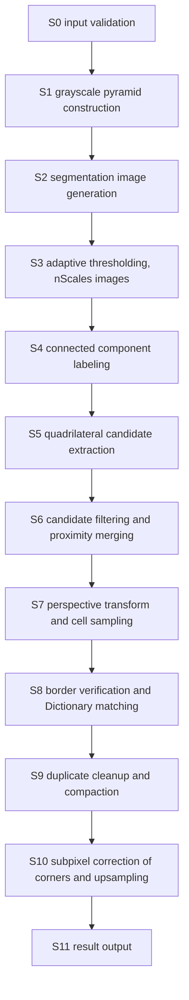
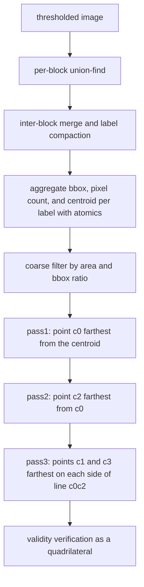

# Detection Pipeline Design

## Purpose

This document defines the stage breakdown used when decomposing the ArUco3 detection strategy onto CUDA, the parallelization approach for each stage, the handling of variable-length output, the synchronization points, and the compatibility conditions against the CPU baseline results.

## Scope

The scope covers the stage breakdown of the detector core, the GPU suitability assessment of each stage, the design options for quadrilateral candidate extraction, the workspace design, and the handling of machine differences. Pose estimation, ChArUco boards, and the AprilTag-specific route are out of scope.

## Current state

S1 through S11 are all implemented in CUDA. `aruco3cuda::Detector` chains them into a single path and returns results on the device without host synchronization. The degree of agreement with OpenCV differs by route. **The hybrid route matches on 91 of 91 images with a corner difference of 0.0000 px**, whereas **the GPU-resident route matches on 90 of 91 images, differing by 3.804 px on the single image with occlusion** (relative to the ground truth, the GPU side is the closer one). The details are in [the accuracy evaluation results](../accuracy-report.md).

For the ArUco3 detection strategy of OpenCV 4.x, which is the compatibility target, the following observed specification has been confirmed from the Apache-2.0 public headers and sources. For the retrieval sources and hashes, see [the Code Provenance record](../code-provenance.md).

### Observed specification of the OpenCV 4.x ArUco3 route

| Symbol | Corresponding parameter | Default |
| --- | --- | --- |
| `S` | `minSideLengthCanonicalImg` | 32 |
| `tau_i` | `minMarkerLengthRatioOriginalImg` | 0.0 |
| `W`, `H` | Width and height of the input grayscale | - |

1. Compute the downscale factor as `fxfy = S / (S + max(W, H) * tau_i)`. When `useAruco3Detection` is false, set `fxfy = 1`.
2. Build a grayscale pyramid of `num_levels = (int)(log2(W * H / S^2) / 2)` levels, with a scale of 2 per level.
3. Compute the level at which corner upsampling starts as `closest_pyr_image_idx = round(log2(1 / fxfy^2) / 2)`.
4. When `fxfy != 1`, downscale the input to `round(fxfy * W) x round(fxfy * H)`. Candidate extraction is performed only on this segmentation image.
5. The number of adaptive thresholding windows is `nScales = (winMax - winMin) / winStep + 1`. The default is the three window sizes 3, 13, and 23.
6. Threshold per window, obtain quadrilateral candidates by contour extraction and polygonal approximation, and merge the candidates from all windows.
7. Group nearby candidates using `minMarkerDistanceRate` and `minGroupDistance`, and keep a representative candidate.
8. For each candidate, perform the perspective transform and cell sampling at the pyramid level corresponding to the side length, then run border verification and Dictionary matching.
9. When ArUco3 is enabled, corner refinement is forced to the subpixel method. The corners are subpixel-corrected at each level while doubling one pyramid level at a time, and the window is 5 when the longest side exceeds 1080 and 3 otherwise.
10. The combination of `useAruco3Detection` being true with `S == 0` and `tau_i == 0.0` is rejected by OpenCV.

Of the above, the downscale factor and the segmentation image size have been confirmed by measurement in the automated tests of the CPU baseline runner. For 1280x720 with `S = 32` and `tau_i = 0.05`, `fxfy = 0.3333` and the segmentation image is 427x240.

The minimum side length that ArUco3 can detect is determined by the following expression. It follows from the requirement that the side length after downscaling be at least `S`.

```
side_px >= S + max(W, H) * tau_i
```

Note that `tau_i` itself is not the lower bound. For 1280x720 with `S = 32` and `tau_i = 0.05`, the lower bound is 96 pixels. In measurements, a 96 pixel marker was not detected, while a 128 pixel one was. Exactly at the boundary value, the result is affected by resampling.

For the same image, the detection time of the CPU baseline implementation was 1.112 ms at `tau_i = 0.05` and 5.917 ms at `tau_i = 0` (no downscaling). The detected IDs agree between the two. This shows that the ArUco3 detection strategy is effective on the CPU side as well, and at the same time that no benefit is obtained while `tau_i` is left at its default of 0.0.

The above is a compatibility baseline, not ground truth. The default value of `tau_i` is 0.0, in which case `fxfy = 1` and no downscaling occurs. Evaluating the speed benefit of ArUco3 requires setting `tau_i` explicitly.

## Goals

### Agreement of preprocessing with OpenCV

For S1 and S2, the differences from OpenCV have been measured.

| Stage | Corresponding OpenCV processing | Difference |
| --- | --- | --- |
| S1 pyramid | `buildPyramid` (`pyrDown`) | Exact match at every level |
| S2 segmentation | `INTER_LINEAR` of `resize` | At most 1 gray level. The mismatch rate ranges from 0 to 0.372 depending on the downscale factor |
| S3 adaptive thresholding | `ADAPTIVE_THRESH_MEAN_C` and `THRESH_BINARY_INV` of `adaptiveThreshold` | Exact match |

The pyramid is integer arithmetic with `[1,4,6,4,1]`, and it can be reproduced exactly by using `BORDER_REFLECT_101` at the borders and `(sum + 128) >> 8` for rounding. Since the subpixel correction of the corners is performed on the pyramid, agreement here is a precondition for accuracy.

Segmentation cannot be made an exact match. The 8-bit `INTER_LINEAR` of OpenCV returns the same result as `INTER_LINEAR_EXACT`, and its substance is a bit-exact path built from `softdouble` software floating point and `ufixedpoint16`. It is a design intended to obtain the same result across platforms, and reproducing it inside a kernel would require porting those two numeric types. This is not worth the cost for a preprocessing stage, so we accept the 1 gray level difference.

The effect of this difference on the downstream thresholding was measured after implementing S3. When 1280x720 is downscaled to 427x240 and thresholded with windows 3, 13, and 23, the fraction of pixels whose black/white flips ranges from 0.039% to 0.054%. An estimate assuming a random 1 gray level perturbation gave 0.45%, but the actual difference has structure and the local mean moves in the same direction, so the effect stays at one tenth of that.

In the classification of candidate differences, this amount is treated separately from design differences in candidate extraction. Should bit-level agreement become necessary in the future, one option is a configuration in which the coefficient tables are computed on the host by the same procedure as OpenCV and transferred, with the kernel performing only integer arithmetic.

S3 matches OpenCV exactly. The mean is `boxFilter` applied with normalization, the border is `BORDER_REPLICATE`, rounding is round-half-to-even, and the test is "pixel - mean <= -floor(constant)" for 255. An even window is rounded up to an odd one. Because the sums are taken separately in the row and column directions, no rounding enters in between and the value equals the two-dimensional total.

### Agreement of the option C hybrid route with OpenCV

For option C, the difference from the CPU baseline has been measured. Across 36 comparisons made up of 12 synthetic scenes (varying marker count, side length, in-plane rotation, projective distortion, blur, noise, illumination gradient, and resolution from 640x480 to 1920x1080) and 3 settings (ArUco3 enabled, OpenCV default, OpenCV default + subpixel correction), there were 0 missed detections, 0 extra detections, and a maximum corner difference of 0.0000 pixels. Scenes in which a marker is nested inside a surrounding black frame also match. The same results were obtained on DGX Spark and Jetson AGX Orin.

The reason the corners match despite the up to 1 gray level difference in S2 is that the thresholding flips do not reach the contour vertices. Since differences may still appear with a future corpus, the tests judge against an upper bound of 0.5 pixels rather than against the measured values themselves.

Agreement required making the proximity merging of S6 follow the same rule as OpenCV. Because S3 tries three windows, slightly different candidates are obtained from the same marker. OpenCV sorts the candidates in descending order of perimeter, groups those whose mean corner distance is below `perimeter * minMarkerDistanceRate`, and selects the candidate with the **largest perimeter** within the group as the representative. If no representative is selected and the first candidate found is kept instead, the small candidate originating from the smallest window remains and the corners move inward. For a marker with a 160 pixel side at 1280x720, this difference was 7.9 pixels in original-size terms. On the segmentation image at a downscale factor of 1/3 it is 2.6 pixels, a magnitude that the 1 gray level difference of S2 cannot explain.

Among the non-representative candidates, those farther from the representative than `minGroupDistance * moduleSize` are kept rather than discarded, and are used as alternatives when identification of the representative fails. In addition, the containment relations among the candidates are held as a tree; identification proceeds from the inner candidates, and once a marker is confirmed, its outer (parent) candidate is excluded from identification. Since both the outer and inner boundaries of a marker's black frame become candidates, without this suppression the same marker would be counted twice.

When `useAruco3Detection` is enabled, OpenCV overrides the corner refinement setting to `CORNER_REFINE_SUBPIX`, because subpixel correction is the only means of mapping corners obtained on the downscaled image back to the original size. This project does not override the setting. `Detector::initialize()` rejects the two combinations instead and returns `Status::kInvalidConfig`: `use_aruco3_detection_` enabled together with `corner_refine_method_ == kNone`, because the corners would stay in downscaled coordinates, and `use_aruco3_detection_` disabled together with `kSubpix`, because the pyramid then has a single level and the refinement never runs. Silently rewriting the setting would leave the caller's coordinate systems inconsistent without saying so.

### Agreement of the S7 perspective transform with OpenCV

For S7, we compared against calling OpenCV's `getPerspectiveTransform` and `warpPerspective` with `INTER_NEAREST`.

| Comparison target | Mismatching pixels |
| --- | --- |
| OpenCV on x86_64 | **0 / 40960** |
| OpenCV on aarch64 | 1 / 40960 (0.0024%) |

#### OpenCV itself does not match bit-for-bit across machines

`INTER_NEAREST` of `warpPerspective` has three routes.

| Route | Selection condition | Multiply-add |
| --- | --- | --- |
| `WarpPerspectiveLine_SSE4::processNN` | SSE4.1 is available on x86_64 | Not fused |
| `WarpPerspectiveLine_ProcessNN_CV_SIMD` | `CV_SIMD128_64F` is enabled; the NEON of aarch64 falls here | `v_muladd` lowers to `vfmaq_f64` and **is fused** |
| scalar | When neither of the above is available | Not fused |

Taking the SHA256 of the canonical image for the same input image and the same corners on two machines, the values differed.

```
DGX Spark GB10 (aarch64)   0042a7b7c3a3b1263796c7d8
GeForce RTX 5070 Ti (x86)  b60c6c57a26e0910ba6d9cba
```

Therefore "match OpenCV bit-for-bit" cannot be defined without specifying a machine.

#### The choice made in this project

We align with the non-fusing side (the semantics of scalar and SSE4.1). `cell_sample.cu` is compiled with `-fmad=false`.

- It matches OpenCV on x86_64 exactly.
- It differs from OpenCV on aarch64 in a very small part of the rounding boundary. In measurement, this is 1 pixel out of 40960.

Aligning with the fusing side is also possible, but it would then not match x86_64. Either choice fails to match one of the two. We chose the non-fusing side because the scalar route is the reference for OpenCV's semantics and does not depend on the presence of SIMD.

#### Details that matter for agreement

These are the points that the implementation must observe. Dropping any of them shifts the referenced pixel by one at a rounding boundary.

1. `a[i][6]` and `a[i][7]` of the coefficient matrix widen a **single-precision product** to double precision. Multiplying in double precision shifts the matrix by up to 1.9e-3 relative.
2. The 8-variable linear system is solved by Gaussian elimination with partial pivoting. On ties, the row with the smaller index is kept. The elimination forms `d = -1/A[i][i]` once and multiplies by it.
3. The inverse matrix is built with the 3x3 cofactor formula. The cofactors are formed first, and `1/det` is multiplied last.
4. The projective division takes the reciprocal first and then multiplies. Writing it as a division makes about 26% of the pixels differ by 1 ULP.
5. Rounding is round-half-to-even. `floor(v + 0.5)` is wrong for both ties and negative values.
6. When the denominator is exactly 0, the input at (0, 0) is referenced rather than a boundary value.

If one side of the canonical is at most 32, the horizontal block split of OpenCV (`bw0`) coincides with the side, so the origin is always 0 and there is no need to reproduce the ordering of the partial sums. With the default settings and DICT_ARUCO_MIP_36h12, the side is 32. Settings with a side greater than 64 require reproducing the split.

### First half of S8: Otsu and border verification

Cell ratios are computed from the canonical image, and candidates are filtered by the number of errors in the outer ring of cells. The three machines measured for this match the CPU baseline exactly (ratios 0 / 4096 cells, error counts 0 / 64 candidates).

Unlike S7, no machine difference appeared. The computations in this stage are the following three, and in none of them does SIMD multiply-add fusion reach the result.

| Computation | Type | Effect of fusion |
| --- | --- | --- |
| 256-level histogram | Integer counting | None |
| Sum and sum of squares of the inner region | `int` addition (exact, since the pixels are 8-bit) | None |
| Otsu recurrence | `double` | OpenCV computes it in scalar as well |

`cv::meanStdDev` uses the population variance (dividing by N) and computes the mean as `S * (1/N)`, not `S / N`. Since changing the order changes the last digit, we write it in the same order. The Otsu threshold update uses a strict greater-than, so on ties the smaller gray level is kept. The thresholding is "pixel > threshold", so equal pixels fall on the 0 side.

`cell_decode.cu` is also compiled with `-fmad=false`. Allowing fusion shifts the variance at the `minOtsuStdDev` boundary and changes whether the low-variance branch (the route that fills all cells with 1.0 or 0.0) is taken.

The threshold of 0.49 for treating a cell ratio as a bit, which the CPU baseline used implicitly, has been made explicit as `DetectorConfig::valid_bit_threshold_`. Both border verification and Dictionary matching use the same value.

The upper bound on the number of outer-ring errors is not the number of outer-ring cells but `markerSize` squared multiplied by `maxErroneousBitsInBorderRate`. With the defaults (36h12, border 1, rate 0.35) it is 12: 12 passes and 13 fails.

### Second half of S8: Dictionary matching

Matching is performed on the GPU. For all 250 IDs across 4 rotations (1000 cases), it matches both the CPU baseline and OpenCV.

OpenCV's `Dictionary::identify` has two rules that cannot be reproduced if a bit string is assumed.

#### Cell ratios cannot be collapsed into a single bit string

OpenCV represents a candidate with two masks.

| Mask | Condition to be set | Meaning |
| --- | --- | --- |
| `not0` | ratio > `validBitIdThreshold` | Not black |
| `not1` | ratio < `1 - validBitIdThreshold` | Not white |

With the default threshold of 0.49, the upper bound is 0.51. A ratio of 0.49 or below is determined black and 0.51 or above white, but **a ratio between the two sets both masks and is counted as an error whether the expected bit is 0 or 1**. Collapsing this into a single bit string erases that third state and changes the distance for candidates on the boundary.

The number of errors is obtained by the following expression. Since it is branch-free, it can be passed directly to `__popcll`.

```
error = not0 ^ ((not0 ^ not1) & codeword)
```

When `codeword` is 0, the right-hand side becomes `not0`; when it is 1, it becomes `not1`. OpenCV computes the same expression with the combination of `hal::and8u` and `hal::normHamming`.

The upper bound is computed in float. OpenCV's `1 - validBitIdThreshold` is a float operation, and computing it in double precision moves the threshold by 1 ULP.

#### The ID taken is the first one to satisfy the condition, not the one with the minimum distance

OpenCV scans IDs in ascending order and stops as soon as the allowed distance `int(maxCorrectionBits * errorCorrectionRate)` is satisfied. It does not search for the minimum distance over all IDs.

For DICT_ARUCO_MIP_36h12, the minimum distance between entries is 12 and the allowed distance is 3, so at most one ID satisfies the condition and the two agree. As rules, however, they are different, and for a dictionary with a smaller distance the result changes.

The existing `match_dictionary` is an API that returns the minimum distance. To avoid collapsing this distinction, a separate `identify_marker` was provided for the detection route. The GPU side takes the `atomicMin` of the IDs that satisfy the condition, obtaining the same result as the ascending-order suppression.

Rotations are examined in order over the four, updating on a strict less-than. On ties the smaller rotation is kept, and the scan stops at distance 0. This too is the same as OpenCV.

### S9 identification suppression and compaction

This stage runs on the GPU. **OpenCV has no stage called "duplicate removal."** Reading all of `detectMarkers`, we have confirmed that the only things running after `identifyCandidates` are corner refinement, the Multi dictionary-specific rejected cleanup, the inverse scaling by fxfy, and the duplication of the output. There is no ID-based duplicate removal anywhere, and if two markers with the same ID are present at separate positions, both are emitted.

Duplicates disappear as a result of identification suppression via the containment tree. Since both the outer and inner boundaries of a black frame become candidates, once a marker is found on the inner one, the candidate surrounding it can be left unidentified.

#### Containment tree

`selectedCandidates` is sorted in descending order of perimeter. OpenCV scans in descending order of index and, for each candidate, examines indices smaller than its own in descending order, making the first "candidate that surrounds it" that is found its parent.

```
parent[i] = max { j : j < i and i is inside j }   (-1 if none)
depth[j]  = max(depth[j], depth[i] + 1)
```

**`parent[i]` is the largest j, not the smallest j.** Since a smaller index means a larger perimeter, this means "the innermost among those that surround it." The propagation of depths must be done in descending order of index. Doing it in parallel would read depths that are not yet finalized.

The containment test is exactly `cv::pointPolygonTest` called with `measureDist = false`. If all four corners are inside or on the boundary, it is regarded as inside.

- **The boundary (return value 0) counts as inside.** There are three early returns — when a vertex coincides, when the point lies on a horizontal edge, and when it lies on a slanted edge — and none of them can be dropped.
- **A sign agreement test that assumes convexity cannot substitute for it.** The quadrilateral built by extreme point search can be concave, since the interior angle at c0 may be reflex. In measurement, 283 of 400 sets were concave.
- **The cross product is computed in 64-bit integers.** OpenCV uses double precision. If the coordinates are integers the signs match exactly, but in single precision the product of coordinate differences is rounded and the sign changes.

#### Suppression

OpenCV identifies from depth 0 onward and stops once the number of candidates reached covers the whole set.

```
depth = 0; counter = 0;
while (counter < ncandidates) {
    identify all v in depths[depth] and set was[v] = true
    for (v in depths[depth]) {
        if (identified) { walk up the ancestors, and for unvisited ones set was and counter++ }
        counter++;                     // unconditional, regardless of identification success
    }
    depth++;
}
```

There are two points to preserve.

1. **`was[]` is not consulted as a condition for skipping identification.** Even a candidate marked as an ancestor is identified normally once its depth is reached. The granularity of suppression is the depth, not the candidate.
2. **The reached count is double-counted.** A candidate counted as an ancestor is counted again when its own depth comes around. Since this works in the direction of stopping earlier, rewriting it into "strict per-candidate suppression" changes the result.

Because no depth is skipped, this scan **can be reduced to a single suppression depth**.

> Identified candidates = { v : depth[v] < stop_depth }

On the GPU, `stop_depth` is obtained by a sequential scan in a single block, and the rest becomes an ordinary compaction. Unlike the CPU route, "not performing identification" is not possible, because S7 and S8 on the GPU run unconditionally over all candidates. However, the identification result is a function of only the candidate's corners and the image and does not depend on the scan order, so if the results for all candidates are held in advance the scan can be reproduced afterward.

#### Output

The conditions for acceptance are that "the scan has reached it" and that "an ID is attached." The corners are emitted after undoing the rotation obtained from Dictionary matching.

```
new[i] = old[(i + 4 - rotation) % 4]
```

The undoing comes **before** subpixel correction (S10). OpenCV also undoes it immediately after identification and then calls the correction. Swapping the order would apply the correction to a different corner.

The output ordering preserves the candidate ordering as is. Since the merged candidates are in descending order of perimeter, the detections are also in descending order of perimeter. The final sorting is the responsibility of S11 and is not done in S9. Because the sorting on the CPU route runs after subpixel correction, sorting in S9 could change the order after the correction has moved the corners.

### S10 subpixel correction of the corners and restoration to original size

This stage runs on the GPU. It reproduces OpenCV's `findCornerInPyrImage` and `cv::cornerSubPix`.

#### Procedure for climbing the levels

```
corners *= scale_init                     // scale_init = width of the starting level / width of the segmentation
for (level = starting level - 1; level >= 0; --level) {
    corners *= 2
    cornerSubPix(pyramid[level], corners, window)
}
```

**The pyramid is built from the original size, before downscaling.** Since `buildPyramid` is called on the image before it is downscaled to the segmentation image, level 0 is the original size. By the time the climb finishes the corners are already in original-size coordinates, and the reciprocal of `fxfy` must not be applied separately. The inverse-scaling branch is not reached whether or not ArUco3 is in use.

**The window radius is determined by the size of the level, not by configuration.** It is `max(level width, level height) > 1080 ? 5 : 3`. `cornerRefinementWinSize` and `relativeCornerRefinmentWinSize` are used only on the route where ArUco3 is disabled.

#### One iteration

The weights are `exp(-((i-r)/r)^2) * exp(-((j-r)/r)^2)` evaluated in single precision. Since `zeroZone` is called with `Size(-1, -1)`, the branch that zeroes the center is not entered.

The patch is cut out with `getRectSubPix`. **This is not a straightforward bilinear interpolation.** It traverses a row from left to right, carrying the previous term multiplied by `(1-a)/a`.

```
prev = (1-a) * (b1*src[0] + b2*src[step])
for j:
    t = a12*src[j+1] + a22*src[j+1+step]
    dst[j] = prev + t
    prev = (float)(t * s)          // s = (1-a)/a in double precision
```

Mathematically it is the same as bilinear, but the rounding accumulates, so replacing it with the bilinear expression changes the values. When the window extends outside the image, a different route (`adjustRect`) is taken, and the area outside the rectangle is filled by interpolating the edge values in the vertical direction only.

The normal equations are in double precision and are accumulated one element at a time in row-major order. **Folding them in parallel changes the rounding and changes even the iteration count and whether the suppression is taken.** For that reason each of the five sums is accumulated on a single thread in ascending index order. The parallelism is placed inside the corner instead: **one block of 192 threads handles one corner**. The block gathers the patch and computes the per-element products into shared memory in parallel, five threads then fold the five chains, and thread 0 solves the 2x2 system and decides whether to iterate again. There are 4 corners per detection and at most 1024 detections, so the launch does not start one block per corner slot: a fixed number of blocks strides over the slots, and that number is derived from the SM count of the device.

The error is computed in single precision and then widened to double. `err = (dx*dx) + (dy*dy)` is a float operation, and its result goes into a `double err`.

#### How the iterative solver was verified

Unlike the preceding stages, a 1 ULP difference becomes a discrete difference. The iteration count changes by one, and if the branch that restores the initial position on convergence failure flips, the corners move by the window radius. For that reason the verification was split into two parts.

**First, that there is no transcription error.** An oracle transcribing `cv::cornerSubPix` and `cv::getRectSubPix` verbatim to the host is placed in the tests, and bit agreement is required. The oracle is compiled with `-ffp-contract=off`, giving it the same semantics as `-fmad=false` on the GPU side. Including degenerate inputs, the three machines measured for this matched 128/128.

**Second, the difference from OpenCV.** The difference from the actual `cv::cornerSubPix` varies by machine. On inputs close to real use, the three machines measured for this are within an RMSE of 0.000012 px, but on degenerate inputs where the determinant approaches 0, a difference of up to 6.72 px appears on aarch64. This is because the convergence-failure decision flips and is then doubled while climbing the levels. It is not an implementation error but the result of a rounding difference amplified into a discrete branch.

### Stage breakdown



### Parallelization approach per stage

| Stage | Unit of parallelism | Main technique | GPU suitability |
| --- | --- | --- | --- |
| S0 input validation | - | Boundary validation on the host | Out of scope (done on the host) |
| S1 pyramid | Output pixel | Launch a separable downsample kernel per level | High |
| S2 segmentation | Output pixel | Bilinear or area downscaling | High |
| S3 thresholding | Output pixel | Box mean from separable row sums followed by a column pass, both in global memory | High |
| S4 labeling | Pixel and label | Per-block union-find and inter-block merge | Medium |
| S5 candidate extraction | Label | Corner estimation by extreme point search | Medium |
| S6 filtering | Candidate | Predicate evaluation and stream compaction | High |
| S7 warp and sampling | Candidate | One block per candidate, per-cell sampling | High |
| S8 border verification | Candidate | One block per candidate, histogram in shared memory and integer sums | High |
| S8 Dictionary matching | Candidate and codeword | Popcount over packed codewords and a minimum reduction | High |
| S9 suppression and compaction | Candidate | Containment test per candidate, scan sequential in a single block, repacking by scan | Medium |
| S10 corner correction | Corner | One block per corner, striding over the corner slots; the accumulation of the normal equations is kept sequential | Medium |
| S11 output | - | Device buffer or host transfer | - |

S3 evaluates three window sizes by default. The CPU implementation runs everything up to contour extraction per window and merges the results, and the CUDA implementation keeps the same per-window sequence: `Detector::Impl::dispatch` issues S3 for each window in turn, then loops over the windows again running S4, S5 and the S6 predicate filter, appending each window's candidates to a single list. The sweeps stay on one stream because the buffers they work in are shared across windows -- the row-sum scratch of S3, and the labels, the statistics and the quads of S4 and S5 -- so sweeps issued to separate streams would overwrite each other. The proximity merge across windows happens in S6, after the loop.

### Design options for quadrilateral candidate extraction

S4 and S5 are the parts of this pipeline least suited to the GPU, because contour tracing is sequential per candidate. The following three options are the comparison targets.

| Option | Content | Positioning |
| --- | --- | --- |
| A | Obtain the corners directly by connected component labeling and extreme point search | Primary option. Settled in [ADR-0003](../adr/0003-candidate-extraction-approach.md) |
| B | Perform boundary tracing on the GPU and apply polygonal approximation | Not implemented. To be reconsidered if option A stops meeting the requirements |
| C | GPU up to labeling, delegating corner extraction to the CPU | Compatibility baseline and fallback. Kept in continued use for differential verification |

#### Procedure of option A



1. The black frame of a marker becomes a square connected component with a hole inside on the thresholded image. Since extreme point search targets all pixels of the component, there is no need to treat the hole specially.
2. Each pass is implemented with an `atomicMax` over the distance and the pixel index packed into 64 bits, fully parallelized per label.
3. The corner ordering is normalized to a fixed winding, and candidates are filtered by conditions corresponding to `minCornerDistanceRate` and `minDistanceToBorder`.
4. Validity verification checks the fraction of component pixels that fall inside the estimated quadrilateral, and the bbox occupancy of the component relative to the quadrilateral area. The decision corresponding to `polygonalApproxAccuracyRate` in the CPU implementation is mapped onto this.

#### Benefits and limitations of option A

- Benefit: Contour ordering and variable-length contour buffers become unnecessary, and full parallelization per label is possible. It can be recorded as an independent design that does not port the structure of the official ArUco GPLv3 implementation.
- Limitation: Since it is not polygonal approximation itself, the candidate set may not match the CPU baseline results. In particular, the behavior differs for components whose corners are missing due to occlusion, and for cases where multiple markers touch and become a single component.
- Conclusion: Making option A the primary option was decided in [ADR-0003](../adr/0003-candidate-extraction-approach.md). The grounds are that with ArUco3 enabled the candidate set matches option C exactly and the corner difference is within 1.414 pixels. The withdrawal conditions are in the same ADR.

#### Measurements of option A

Option A was compared against option C over 9 synthetic scenes x 2 settings. Since preprocessing and thresholding are common inputs, they are excluded from the measurement.

| Setting | Detections against ground truth | Candidates emitted only by option C | Candidates emitted only by option A | Maximum corner difference |
| --- | --- | --- | --- | --- |
| ArUco3 enabled (extraction on the downscaled image) | 38/38 | 0 | 0 | 1.414 px |
| ArUco3 disabled (extraction at original size) | 38/38 | 7 to 58 | 0 | 1.414 px |

The reason option C has more candidates with ArUco3 disabled is that option C creates a candidate per contour. The outer and inner boundaries of the black frame and the contours of the inner cells each become candidates. Since option A creates only one set of corners per connected component, no inner boundary appears. With ArUco3 enabled, downscaling puts the perimeter of the inner boundary below the lower bound, so it is dropped on the option C side as well and no difference appears.

Which is faster depends on the content of the scene. On DGX Spark with ArUco3 enabled, on a plain scene with 4 markers, option A takes 0.543 ms against 0.168 ms for option C; adding noise to the same scene gives 0.530 ms for option A against 1.728 ms for option C. Option A is determined almost entirely by the pixel count, while option C is proportional to the number and length of the contours.

#### Quadrilateral-likeness decision of option A

The decision corresponding to `polygonalApproxAccuracyRate` is mapped onto two ratios. The measured values on synthetic shapes are as follows.

| Shape | Inside ratio | Edge support | Decision |
| --- | --- | --- | --- |
| Square (11 rotations) | 0.987 to 1.000 | 2.52 to 3.03 | Pass |
| Frame (4 rotations) | 0.973 to 1.000 | 2.60 to 3.02 | Pass |
| Small frame (side 32) | 0.875 | 2.61 | Pass |
| Circle | 0.642 | 4.97 | Reject |
| Ellipse | 0.639 | 3.99 | Reject |
| Hexagon | 0.665 | 3.01 | Reject |
| L shape | 0.941 to 0.956 | 1.32 to 1.39 | Reject |
| Cross | 0.850 | 1.71 | Reject |

The inside ratio alone cannot reject the L shape and the cross, and the edge support alone cannot reject the circle and the ellipse. Imposing both separates them. For a triangle, the line c0c2 coincides with one side and no point remains on one side of it, so the corners are not determined and it becomes invalid.

### Variable-length output and overflow

- The candidate count and the detection count are input-dependent and variable. A bounded device buffer and a counter on the device are used.
- The bounds are determined from `max_candidates_` and `max_markers_` of `DetectorConfig`, not from fixed values in the source.
- If a counter exceeds its bound, writing is stopped, an overflow flag is raised, and it is returned in the result as an explicit status value. No silent truncation is performed.
- For compaction, correctness is first pinned down with a naive implementation using an atomic counter, after which it is compared with a prefix sum approach.

### Workspace and memory policy

- The required amount is computed from the assumed maximum resolution, maximum number of pyramid levels, `nScales`, and the candidate bound, and is allocated all at once when the detector is created.
- No per-frame `cudaMalloc` or `cudaFree` is performed. Reallocation happens only when the input resolution changes, and the occurrence of a reallocation is recorded as a statistic.
- Intermediate buffers are reused across stages, and only buffers that must be alive at the same time are given separate regions.
- DGX Spark GB10 and Jetson Orin both have integrated GPUs, where the host and device share the same physical memory. The four routes — pageable host, pinned host, managed, and device-resident — can be selected in the implementation, so that each can be measured individually in [the evaluation plan](../evaluation-plan.md).

### Synchronization and streams

- The public API takes a caller-owned `cudaStream_t` and issues all kernels to that stream.
- The per-frame path never calls `cudaDeviceSynchronize()`. `Detector::initialize()` calls it once, after uploading the dictionary from pageable host storage, so that the transfer is ordered against a `detect_async` issued on another stream, and the device self test in `run_device_self_test()` calls it to check its own kernel.
- Synchronization occurs only at the point where the host needs the result count. An API that returns the device-side result buffer as is is provided so that the count need not be brought back to the host.
- Benchmarks record wall-clock time only. Separating kernel time with CUDA events is not implemented.

### Handling of machine differences

- The common route is the authoritative one, and the same algorithm and the same accuracy tests are applied on `sm_87` and `sm_121`.
- The only machine-tuning value exposed as a setting is `cuda_block_dim_`, the block side of the 2D kernels. There are no settings for tile size, shared memory usage, or L2-aware partitioning. The one value derived per machine is the number of blocks the S10 refinement launches, taken from the SM count of the device. The reasoning for both is below.
- Branching on `__CUDA_ARCH__` is localized as kernel specialization and does not change the behavior of the common route.

## Design decisions

- Option A is the primary option for candidate extraction, and option C is always maintained as the compatibility baseline and fallback.
- S3 through S5 are executed per window in a serial loop on a single stream, as in the CPU implementation, because the scratch buffers of those stages are shared across windows. Each window appends to one candidate list, and the proximity merge happens in S6.
- Dictionary matching is done by popcount over packed codewords with the 4 rotations expanded in advance, so that the rotation search is not a branch.
- Subpixel correction of the corners is implemented on the GPU without permitting delegation to the CPU, because it is directly tied to the accuracy of ArUco3.
- The input is limited to 8-bit grayscale, and color conversion is the responsibility of the adapter.

### The decision not to make block size configurable

`DetectorConfig::cuda_block_dim_` is a setting that overrides the block side for 2D kernels, but **it reaches only 5 out of 12** (3 in `preprocess.cu` and 2 in `threshold.cu`). `labeling.cu`, `candidate_filter.cu`, and `quad_extract.cu` fix it at 16.

We will **neither** widen the reach nor remove the setting itself. In measurements sweeping 8 / 16 / 32 on the three machines measured at the time, **16 was optimal on every machine**, and 32 was 3 to 8% slower. There is no reason to change it even though it is exposed as a setting, and widening its reach would gain nothing.

To avoid redoing the same sweep, the measured facts are left here.

Among the machine-dependent values, the only one that actually mattered was the number of blocks launched for the S10 correction. That is not a setting but is **derived from the SM count of the device**. The details are in [Implementation structure and verification](../implementation-plan.md).

## Open questions

- How to tune the validity verification thresholds of option A on real images. The current inside ratio of 0.80 and edge support of 2.0 are based on measurements on synthetic shapes.
- Whether an integral image or a sliding window is advantageous for thresholding on the target machines.
- Whether to include white marker detection equivalent to `detectInvertedMarker` in the initial scope.
- The maximum size for placing the Dictionary in constant memory, and where to place it when that is exceeded.

## See also

- [Architecture](../architecture.md)
- [Public API draft](public-api.md)
- [Implementation plan](../implementation-plan.md)
- [Evaluation plan](../evaluation-plan.md)
- [Code Provenance record](../code-provenance.md)
