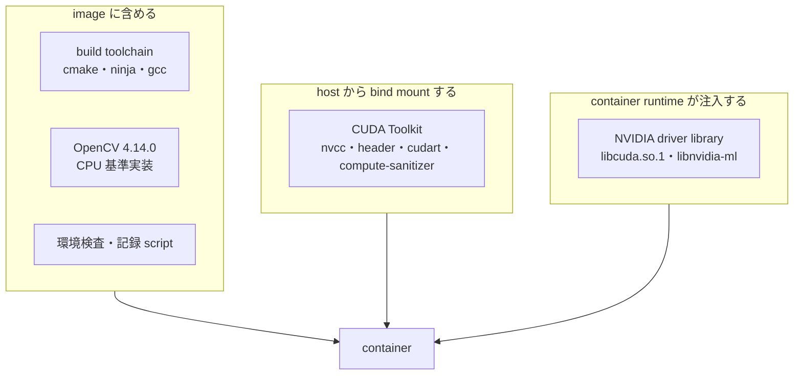
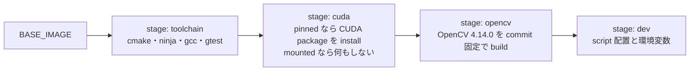

# Docker 環境設計

## 目的

DGX Spark と Jetson Orin で同じ手順の build、test、評価を行える container 環境を定義し、測定結果の再現に必要な環境情報を機械可読形式で残せるようにします。

## 対象範囲

開発 image の構成、CUDA Toolkit の供給方法、profile ごとの base image、環境検査、環境情報の記録を対象とします。CI service の選定と registry への配布は対象外です。

## 現状

開発機 DGX Spark で次を確認しています。

| 項目 | 値 |
| --- | --- |
| Docker | 28.3.3 |
| Docker Compose | v2.39.1 |
| NVIDIA Container Toolkit | 1.18.0 |
| 登録済み runtime | `runc`、`nvidia` |
| host CUDA Toolkit | 13.0、`/usr/local/cuda-13.0`、4.7 GB |
| `/usr/local/cuda` | `/etc/alternatives/cuda` を経由する多段 symlink |
| `lib64` | `targets/sbsa-linux/lib` への symlink |
| host glibc | 2.39 (Ubuntu 24.04) |

`dgx-spark` profile は構築と検証を完了しています。

| 項目 | 結果 |
| --- | --- |
| image size | 1.64 GB (`pinned`) / 1.27 GB (`mounted`) |
| `verify-environment.sh` | 全 5 項目合格 |
| `smoke-test.sh` | 合格。`sm_121` で compile した実行 file が GPU 上で動作し、OpenCV の ArUco3 検出戦略が期待どおり動く |
| OpenCV | 4.14.0 (`0654a42e1921`)、`WITH_CUDA=OFF` |

`pinned` と `mounted` の両方で環境検査と smoke test が合格することを確認しています。CUDA Toolkit 全体を含む `nvidia/cuda` の devel image を base にした場合、base だけで 5 GB を超えます。

`jetson-orin` profile も実機で構築と検証を完了しています。

| 項目 | 結果 |
| --- | --- |
| 実機 | Jetson AGX Orin Developer Kit、L4T R35.4.1 (JetPack 5.1.2)、CUDA 11.4 |
| image size | 5.0 GB |
| `verify-environment.sh` | 全 5 項目合格 |
| `smoke-test.sh` | 合格 |
| `ctest` | 75 件合格。Compute Sanitizer を含めて 79 件 |

image が DGX Spark の 1.64 GB より大きいのは、base image が `l4t-cuda:11.4.19-devel` であり CUDA 一式を含むためです。Jetson では NVIDIA の apt repository から必要な package だけを選ぶ構成が使えないため、この差は許容します。

## 目標

### 責務分担

CUDA に関わる要素を、image、host mount、container runtime の 3 つへ分けます。



| 要素 | 供給元 | 理由 |
| --- | --- | --- |
| build toolchain | image | version を固定したいが size が小さい |
| OpenCV | image | CPU 基準結果の正本であり、version 固定が最優先 |
| CUDA Toolkit | image (既定) または host の bind mount | 下記の 2 mode を選択する |
| NVIDIA driver | NVIDIA Container Toolkit の注入 | driver は host kernel と一致する必要がある |

### CUDA Toolkit の供給方式

| mode | 供給元 | image size | 位置付け |
| --- | --- | --- | --- |
| `pinned` (既定) | image へ必要な package のみ install | 1.64 GB | 測定を伴う実行はこちらを使う |
| `mounted` | host から read-only で bind mount | 1.27 GB | 手元での素早い試行 |

既定を `pinned` としたのは、測定に使用した compiler が image と一体になり、host の CUDA 更新によって benchmark 結果の比較可能性が失われないためです。[プロジェクト概要](../project-overview.md) の成功判定 3 は再現可能な build と測定手順を求めており、image が host 環境に依存する構成はこれを弱めます。

CUDA Toolkit 全体は 4.7 GB ありますが、内訳を実測すると 3.2 GB は cuBLAS、cuFFT、cuSOLVER、cuSPARSE、cuRAND であり、本 project では使用しません。必要なのは次の package のみで、`pinned` と `mounted` の差は 360 MB 程度に収まります。

| package | 用途 |
| --- | --- |
| `cuda-nvcc-13-0` | nvcc、cudart、CRT、NVVM、PTX compiler |
| `cuda-cccl-13-0` | CUB と Thrust。compaction と prefix sum で使用する |
| `cuda-sanitizer-13-0` | Compute Sanitizer |
| `cuda-nvtx-13-0` | 区間計測の注釈 |
| `cuda-cuobjdump-13-0`、`cuda-nvdisasm-13-0` | 生成 binary の architecture 確認 |
| `cuda-profiler-api-13-0` | profiler 連携の header |

install された package の正確な version は image 内の `/opt/aruco3cuda/cuda-provenance.json` へ記録し、`record-environment.sh` が出力する環境情報 JSON へ埋め込みます。

`mounted` mode は image が host 環境から独立しません。この依存を暗黙にしないため、`verify-environment.sh` は mode を表示し、`mounted` の場合は測定へ使用しないよう警告します。

### profile

| profile | base image | 対象 | `ARUCO3_CUDA_ARCH` | 開発 tool |
| --- | --- | --- | --- | --- |
| `dgx-spark` | `ubuntu:24.04` | DGX Spark GB10 | 121 | 含む |
| `jetson-orin` | `nvcr.io/nvidia/l4t-cuda:11.4.19-devel`（既定、上書き可） | Jetson AGX Orin | 87 | 含まない |

Jetson は `pinned` mode でも NVIDIA の CUDA apt repository を使わず、CUDA を含む `l4t-cuda` を base image とします。`install-cuda-toolkit.sh` は base image に CUDA が存在する場合 install を省略します。base image の tag は実機の JetPack へ合わせて `docker/.env` で指定します。

### Jetson 固有の設定

実機検証で必要になった設定です。いずれも Jetson でのみ必要で、DGX Spark には影響しません。

| 設定 | 理由 |
| --- | --- |
| `group_add` に video と debug の GID | Tegra の device node は `root:video` が 36 個、`root:debug` が 10 個で権限 0660。非 root 実行では補助グループが無いと開けない |
| `/var/lib/nvpmodel` と `/etc/nvpmodel.conf` の mount | `nvpmodel` の binary は container に無い。power mode は状態 file と定義 file から読む |
| `/etc/nv_tegra_release` の mount | L4T version の記録に使う |
| device tree の model file の mount | Docker は既定で `/sys/firmware` を mask するため、基板名を直接読めない |

補助グループを付与しないと、`cudaGetDeviceCount` が `NvRmMemInitNvmap failed with Permission denied` を経て `operation not supported` で失敗します。`libcuda.so.1` は注入されているため、driver の問題と紛らわしい失敗になります。

`mounted` mode では、host の CUDA Toolkit binary を container 内で実行するため、container の glibc が host CUDA Toolkit の要求 version 以上である必要があります。この場合の base image は JetPack 5.x なら `ubuntu:20.04`、JetPack 6.x なら `ubuntu:22.04` を指定します。

### image の構成



`toolchain` stage は、base image の CMake が 3.24 未満の場合にのみ Kitware の apt repository を追加します。Ubuntu 20.04 の CMake は 3.16 であり、[ADR-0002](../adr/0002-toolchain-and-target-baseline.md) の要求を満たさないためです。

`clang-format` と `clang-tidy` は `dgx-spark` profile にのみ含めます。base image ごとに LLVM の version が異なると同じ source に対する format 結果が変わり、差分確認が成立しなくなるためです。format と静的解析は開発 profile を正本とします。

### OpenCV の build 方針

- ArUco 検出は OpenCV 4.x では `objdetect` module に含まれるため、`opencv_contrib` は不要です。
- `BUILD_LIST` を `core,imgproc,imgcodecs,calib3d,objdetect` に限定し、GUI backend、動画入出力、python binding を無効にします。
- image build 時点では CUDA Toolkit が mount されていないため、`WITH_CUDA=OFF` で build します。CPU 基準実装にはこれで十分です。
- `cv::cuda::GpuMat` との相互変換が必要になる段階では、起動中の container 内で `build-opencv.sh --with-cuda --cuda-arch <arch> --prefix /opt/opencv-cuda` を実行し、named volume へ install します。
- 取得元 commit と build option は `/opt/opencv/share/aruco3cuda/opencv-provenance.json` へ記録し、環境情報 JSON へ埋め込みます。

### 使用方法

```bash
cp docker/.env.example docker/.env      # 実機に合わせて編集する

# pinned mode (既定)
docker compose -f docker/compose.yaml build dgx-spark
docker compose -f docker/compose.yaml run --rm dgx-spark verify-environment.sh
docker compose -f docker/compose.yaml run --rm dgx-spark smoke-test.sh
docker compose -f docker/compose.yaml run --rm dgx-spark record-environment.sh /workspace/env.json
docker compose -f docker/compose.yaml run --rm dgx-spark        # 対話 shell

# project の build と test
docker compose -f docker/compose.yaml run --rm dgx-spark bash -c '
  cmake --preset portability && cmake --build --preset portability && ctest --preset portability'

# mounted mode。compose.mounted.yaml を重ねる
docker compose -f docker/compose.yaml -f docker/compose.mounted.yaml build dgx-spark
docker compose -f docker/compose.yaml -f docker/compose.mounted.yaml run --rm dgx-spark verify-environment.sh
```

repository は `/workspace` へ bind mount します。build 出力は `build/` へ書き出し、`.gitignore` で除外します。named volume にしないのは、`compile_commands.json` を host 側の editor と language server から参照できるようにするためです。

container は `docker/.env` の `ARUCO3_UID` と `ARUCO3_GID` で指定した uid と gid で実行します。既定の root 実行では、bind mount した repository へ root 所有の file が作られ、host 側から削除も編集もできなくなるためです。

CUDA 対応 OpenCV を `/opt/opencv-cuda` へ install する場合のみ、その named volume へ書き込む権限が必要になります。この操作は `--user root` を明示して実行します。

```bash
docker compose -f docker/compose.yaml run --rm --user root dgx-spark \
  build-opencv.sh --with-cuda --cuda-arch 12.1 --prefix /opt/opencv-cuda
```

### 環境検査

CUDA Toolkit を mount 方式にすると、mount 漏れや version 不整合が build 時の不可解な失敗として現れます。`verify-environment.sh` は container 内で次を検査し、原因が分かる形で失敗させます。

1. CUDA Toolkit が使用でき `nvcc` が実行できる。
2. `nvcc` が `ARUCO3_CUDA_ARCH` の architecture に対応している。
3. `nvcc` と host compiler の組み合わせで実際に compile できる。
4. NVIDIA driver library が注入され、CUDA から device を列挙して kernel を実行できる。
5. OpenCV が install され provenance を読み取れる。

device の確認に `nvidia-smi` を使用しません。Jetson の L4T には `nvidia-smi` が存在しないため、両対象機で成立する CUDA runtime API の呼び出しで確認します。probe を compile して実行し、device 数、名前、Compute Capability、統合 GPU かどうかを取得します。`nvidia-smi` の有無は合否に含めず、補助情報として表示します。

`ARUCO3_VERIFY_ON_START=1` を設定すると、container 起動時に自動実行し、不合格なら起動を中止します。

`smoke-test.sh` は環境検査より踏み込み、`nvcc` が OpenCV を含む translation unit を compile でき、生成した実行 file が GPU 上で動作し、ArUco3 検出戦略が期待どおり動くところまでを確認します。これは container 環境の smoke test であり、project の unit test ではありません。project 側の test は WP-0.1 で `ctest` として整備します。

### 環境情報の記録

`record-environment.sh` は、[評価計画](../evaluation-plan.md) が要求する環境情報を JSON で出力します。GPU 名、Compute Capability、driver version、最大 SM clock、Jetson の power mode、CUDA Toolkit、gcc、CMake、OpenCV の version と commit を含みます。benchmark 結果はこの JSON と対にして保存します。

## 実装上の判断

- CUDA Toolkit を image へ固定する `pinned` を既定とします。本 project の成果物は比較測定であり、測定に使用した compiler が image と一体でなければ、後から結果を再現できません。必要な package のみに絞れば追加は 360 MB であり、再現性と釣り合いません。
- `mounted` を選択肢として残すのは、host の Toolkit を差し替えて素早く試す用途があるためです。この mode では image が host 環境から独立しないため、`verify-environment.sh` が mode を表示して測定へ使わないよう警告します。
- `mounted` mode では `/usr/local/cuda` が多段 symlink であるため、mount 元に実体の directory を指定します。symlink を mount すると container 内で解決できません。
- base image を profile ごとに分け、`nvidia/cuda` 系 image を base にしません。base を `ubuntu` にすることで、CUDA Toolkit の供給元が mount だけになり、image 内 Toolkit と mount Toolkit が混在する状態を避けられます。
- OpenCV を image へ含めるのは、これが CPU 基準結果の正本であり、測定間で version が変わってはならないためです。

## 未確定事項

- Jetson を JetPack 6.x へ更新する場合の base image tag と CUDA version。
- `pinned` mode の package version を patch 単位まで固定するか。現在は package 名で CUDA 13.0 系までを固定し、実際の version を provenance へ記録する方式です。
- Phase 4 の profiler (Nsight Systems、Nsight Compute) を image へ含めるか、host 側で実行するか。[ADR-0002](../adr/0002-toolchain-and-target-baseline.md) の未確定事項と同じです。
- CI を container 内で実行する際の runner の種類。
- image を registry へ配布するか、各機で build するか。
- benchmark 時に clock と power mode を固定する操作を container 内から行うか、host 側の手順とするか。
- `.devcontainer` を追加して editor 統合を提供するか。

## 関連

- [実装計画](../implementation-plan.md)
- [評価計画](../evaluation-plan.md)
- [ADR-0002: build 基盤と対象環境の baseline を固定する](../adr/0002-toolchain-and-target-baseline.md)
- [Code Provenance 記録](../code-provenance.md)
