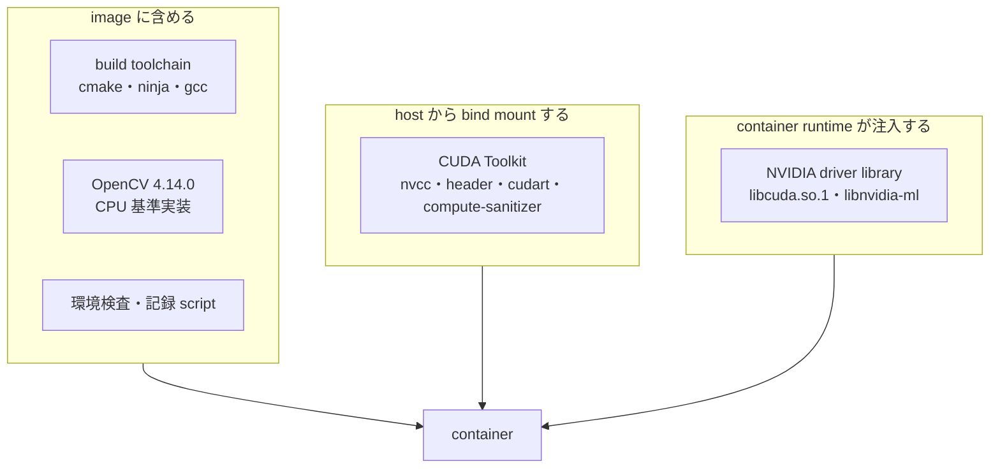
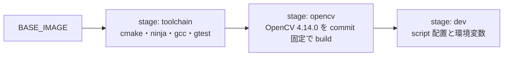

# Docker 環境設計

## 目的

DGX Spark と Jetson Orin で同じ手順の build、test、評価を行える container 環境を定義し、測定結果の再現に必要な環境情報を機械可読形式で残せるようにします。

## 対象範囲

開発 image の構成、CUDA Toolkit の供給方法、profile ごとの base image、環境検査、環境情報の記録を対象とします。CI service の選定と registry への配布は対象外です。

## 現状

開発機 DGX Spark で次を確認しています。

| 項目 | 値 |
| --- | --- |
| Docker | 28.3.3 |
| Docker Compose | v2.39.1 |
| NVIDIA Container Toolkit | 1.18.0 |
| 登録済み runtime | `runc`、`nvidia` |
| host CUDA Toolkit | 13.0、`/usr/local/cuda-13.0`、4.7 GB |
| `/usr/local/cuda` | `/etc/alternatives/cuda` を経由する多段 symlink |
| `lib64` | `targets/sbsa-linux/lib` への symlink |
| host glibc | 2.39 (Ubuntu 24.04) |

`dgx-spark` profile は構築と検証を完了しています。

| 項目 | 結果 |
| --- | --- |
| image size | 1.27 GB |
| `verify-environment.sh` | 全 5 項目合格 |
| `smoke-test.sh` | 合格。`sm_121` で compile した実行 file が GPU 上で動作し、OpenCV の ArUco3 検出戦略が期待どおり動く |
| OpenCV | 4.14.0 (`0654a42e1921`)、`WITH_CUDA=OFF` |

CUDA Toolkit を image へ含めた場合、base image だけで 5 GB を超えます。mount 方式により 1.27 GB に収まっています。

Jetson Orin 実機はまだ確認していません。開発機に存在する別 project の container image は JetPack 5.1.2 と CUDA 11.4 を示しており、Jetson 側が CUDA 11.4 系である可能性があります。確定は実機確認後とします。

## 目標

### 責務分担

CUDA に関わる要素を、image、host mount、container runtime の 3 つへ分けます。



| 要素 | 供給元 | 理由 |
| --- | --- | --- |
| build toolchain | image | version を固定したいが size が小さい |
| OpenCV | image | CPU 基準結果の正本であり、version 固定が最優先 |
| CUDA Toolkit | host の bind mount | 4 GB を超えるため image へ含めない |
| NVIDIA driver | NVIDIA Container Toolkit の注入 | driver は host kernel と一致する必要がある |

### profile

| profile | base image | 対象 | `ARUCO3_CUDA_ARCH` | 開発 tool |
| --- | --- | --- | --- | --- |
| `dgx-spark` | `ubuntu:24.04` | DGX Spark GB10 | 121 | 含む |
| `jetson-orin` | `ubuntu:20.04`（既定、上書き可） | Jetson Orin | 87 | 含まない |

base image を profile ごとに変えるのは、host の CUDA Toolkit binary を container 内で実行するためです。container の glibc が host CUDA Toolkit の要求 version 未満の場合、`nvcc` が起動しません。base image は host 側の CUDA Toolkit が想定する OS へ合わせます。

Jetson の base image と CUDA path は `docker/.env` で上書きします。JetPack 5.x は `ubuntu:20.04`、JetPack 6.x は `ubuntu:22.04` が対応します。

### image の構成



`toolchain` stage は、base image の CMake が 3.24 未満の場合にのみ Kitware の apt repository を追加します。Ubuntu 20.04 の CMake は 3.16 であり、[ADR-0002](../adr/0002-toolchain-and-target-baseline.md) の要求を満たさないためです。

`clang-format` と `clang-tidy` は `dgx-spark` profile にのみ含めます。base image ごとに LLVM の version が異なると同じ source に対する format 結果が変わり、差分確認が成立しなくなるためです。format と静的解析は開発 profile を正本とします。

### OpenCV の build 方針

- ArUco 検出は OpenCV 4.x では `objdetect` module に含まれるため、`opencv_contrib` は不要です。
- `BUILD_LIST` を `core,imgproc,imgcodecs,calib3d,objdetect` に限定し、GUI backend、動画入出力、python binding を無効にします。
- image build 時点では CUDA Toolkit が mount されていないため、`WITH_CUDA=OFF` で build します。CPU 基準実装にはこれで十分です。
- `cv::cuda::GpuMat` との相互変換が必要になる段階では、起動中の container 内で `build-opencv.sh --with-cuda --cuda-arch <arch> --prefix /opt/opencv-cuda` を実行し、named volume へ install します。
- 取得元 commit と build option は `/opt/opencv/share/aruco3cuda/opencv-provenance.json` へ記録し、環境情報 JSON へ埋め込みます。

### 使用方法

```bash
cp docker/.env.example docker/.env      # 実機に合わせて編集する

docker compose -f docker/compose.yaml build dgx-spark
docker compose -f docker/compose.yaml run --rm dgx-spark verify-environment.sh
docker compose -f docker/compose.yaml run --rm dgx-spark smoke-test.sh
docker compose -f docker/compose.yaml run --rm dgx-spark record-environment.sh /workspace/env.json
docker compose -f docker/compose.yaml run --rm dgx-spark        # 対話 shell

# project の build と test
docker compose -f docker/compose.yaml run --rm dgx-spark bash -c '
  cmake --preset portability && cmake --build --preset portability && ctest --preset portability'
```

repository は `/workspace` へ bind mount します。build 出力は `build/` へ書き出し、`.gitignore` で除外します。named volume にしないのは、`compile_commands.json` を host 側の editor と language server から参照できるようにするためです。

container は `docker/.env` の `ARUCO3_UID` と `ARUCO3_GID` で指定した uid と gid で実行します。既定の root 実行では、bind mount した repository へ root 所有の file が作られ、host 側から削除も編集もできなくなるためです。

CUDA 対応 OpenCV を `/opt/opencv-cuda` へ install する場合のみ、その named volume へ書き込む権限が必要になります。この操作は `--user root` を明示して実行します。

```bash
docker compose -f docker/compose.yaml run --rm --user root dgx-spark \
  build-opencv.sh --with-cuda --cuda-arch 12.1 --prefix /opt/opencv-cuda
```

### 環境検査

CUDA Toolkit を mount 方式にすると、mount 漏れや version 不整合が build 時の不可解な失敗として現れます。`verify-environment.sh` は container 内で次を検査し、原因が分かる形で失敗させます。

1. CUDA Toolkit が mount され `nvcc` が実行できる。
2. NVIDIA driver library が注入されている。
3. `nvcc` が `ARUCO3_CUDA_ARCH` の architecture に対応している。
4. `nvcc` と host compiler の組み合わせで実際に compile できる。
5. OpenCV が install され provenance を読み取れる。

`ARUCO3_VERIFY_ON_START=1` を設定すると、container 起動時に自動実行し、不合格なら起動を中止します。

`smoke-test.sh` は環境検査より踏み込み、`nvcc` が OpenCV を含む translation unit を compile でき、生成した実行 file が GPU 上で動作し、ArUco3 検出戦略が期待どおり動くところまでを確認します。これは container 環境の smoke test であり、project の unit test ではありません。project 側の test は WP-0.1 で `ctest` として整備します。

### 環境情報の記録

`record-environment.sh` は、[評価計画](../evaluation-plan.md) が要求する環境情報を JSON で出力します。GPU 名、Compute Capability、driver version、最大 SM clock、Jetson の power mode、CUDA Toolkit、gcc、CMake、OpenCV の version と commit を含みます。benchmark 結果はこの JSON と対にして保存します。

## 実装上の判断

- CUDA Toolkit を image へ含めません。host の Toolkit は 4.7 GB あり、profile を複数保持すると disk 使用量と転送時間が現実的でなくなります。driver と Toolkit の version 組み合わせを host 側で一元管理できる利点もあります。
- 代償として、image が host 環境から独立しなくなります。この依存を暗黙にしないため、`verify-environment.sh` による明示的な検査を必須の運用手順とします。
- `/usr/local/cuda` は多段 symlink であるため、mount 元には実体の directory を指定します。symlink を mount すると container 内で解決できません。
- base image を profile ごとに分け、`nvidia/cuda` 系 image を base にしません。base を `ubuntu` にすることで、CUDA Toolkit の供給元が mount だけになり、image 内 Toolkit と mount Toolkit が混在する状態を避けられます。
- OpenCV を image へ含めるのは、これが CPU 基準結果の正本であり、測定間で version が変わってはならないためです。

## 未確定事項

- Jetson Orin 実機の JetPack version。base image と CUDA path の既定値はこれを確認してから確定します。[ADR-0002](../adr/0002-toolchain-and-target-baseline.md) の未確定事項と同じです。
- CI を container 内で実行する際の runner の種類。
- image を registry へ配布するか、各機で build するか。
- benchmark 時に clock と power mode を固定する操作を container 内から行うか、host 側の手順とするか。
- `.devcontainer` を追加して editor 統合を提供するか。

## 関連

- [実装計画](../implementation-plan.md)
- [評価計画](../evaluation-plan.md)
- [ADR-0002: build 基盤と対象環境の baseline を固定する](../adr/0002-toolchain-and-target-baseline.md)
- [Code Provenance 記録](../code-provenance.md)
