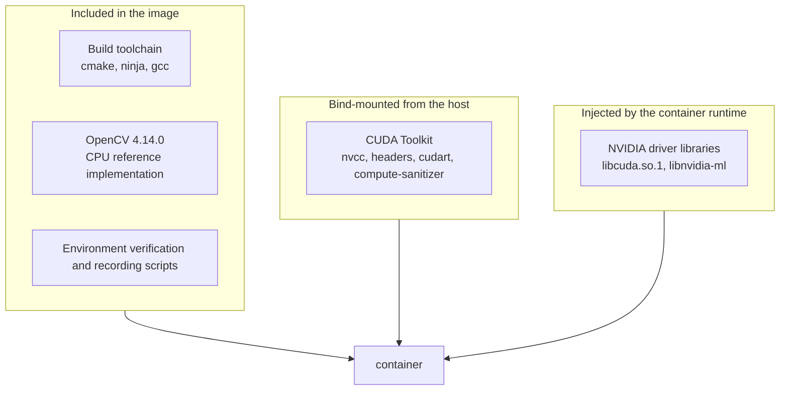
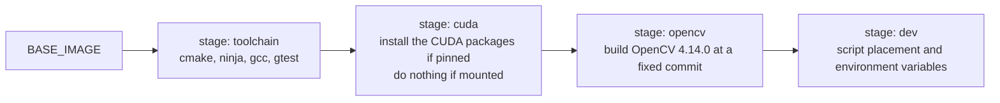

# Docker Environment Design

## Purpose

Define a container environment that runs the same build, test, and evaluation procedures on DGX Spark, Jetson Orin, and RTX Blackwell, and make it possible to record the environment information needed to reproduce measurements in a machine-readable form.

## Scope

The scope covers the composition of the development image, how the CUDA Toolkit is supplied, the base image for each profile, environment verification, and the recording of environment information. Choosing a CI service and distributing through a registry are out of scope.

## Current state

The following has been confirmed on the DGX Spark development machine.

| Item | Value |
| --- | --- |
| Docker | 28.3.3 |
| Docker Compose | v2.39.1 |
| NVIDIA Container Toolkit | 1.18.0 |
| Registered runtimes | `runc`, `nvidia` |
| Host CUDA Toolkit | 13.0, `/usr/local/cuda-13.0`, 4.7 GB |
| `/usr/local/cuda` | A multi-level symlink that goes through `/etc/alternatives/cuda` |
| `lib64` | A symlink to `targets/sbsa-linux/lib` |
| Host glibc | 2.39 (Ubuntu 24.04) |

The `dgx-spark` profile has been built and verified.

| Item | Result |
| --- | --- |
| Image size | 1.65 GB (`pinned`) / 1.28 GB (`mounted`) |
| `verify-environment.sh` | All 5 checks pass |
| `smoke-test.sh` | Pass. An executable compiled for `sm_121` runs on the GPU, and the OpenCV ArUco3 detection strategy behaves as expected |
| OpenCV | 4.14.0 (`0654a42e1921`), `WITH_CUDA=OFF` |

Environment verification and the smoke test have been confirmed to pass in both `pinned` and `mounted`. When an `nvidia/cuda` devel image containing the full CUDA Toolkit is used as the base, the base alone exceeds 5 GB.

Preparation of the machine for the `rtx-blackwell` profile is complete.

| Item | Value |
| --- | --- |
| GPU | NVIDIA GeForce RTX 5070 Ti, Compute Capability 12.0, 16303 MiB |
| NVIDIA driver | 610.43.02 (`nvidia-driver-610-open`) |
| Kernel | 6.8.0-138-generic |
| Docker | 29.7.2 (official repository) |
| NVIDIA Container Toolkit | 1.20.0 |

Because Secure Boot is enabled, the kernel module comes from the Canonical-signed prebuilt package (`linux-modules-nvidia-610-open-generic-hwe-22.04`). A module built with DKMS is unsigned and is not loaded after a reboot. This package installs the module for the latest HWE kernel, so the kernel switches on the reboot that follows the installation.

The base image and CUDA packages for this profile are identical to `dgx-spark`. With the container side aligned, the only difference between the measurements is the hardware. Only `ARUCO3_CUDA_REPO_ARCH` changes, to `x86_64`. The two existing machines use `sbsa` (aarch64).

The `jetson-orin` profile has also been built and verified on the machine itself.

| Item | Result |
| --- | --- |
| Machine | Jetson AGX Orin Developer Kit, L4T R35.4.1 (JetPack 5.1.2), CUDA 11.4 |
| Image size | 726 MB |
| `verify-environment.sh` | All 5 checks pass |
| `smoke-test.sh` | Pass |
| `ctest` | Pass, with the `native` preset. The suite registers 520 tests; the `sanitizer` preset additionally registers the 4 Compute Sanitizer tools against 2 executables, that is 8 entries |

The `portability` preset cannot be used on this machine. CUDA 11.4 supports up to `sm_87`, so the preset fails while CMake is still testing the compiler:

```
nvcc fatal : Unsupported gpu architecture 'compute_120'
```

Use `native` or `jetson-orin` here. The registered test count is the same either way, because it does not depend on the target architecture.

This image is smaller than DGX Spark's 1.64 GB because `INSTALL_DEV_TOOLS=0` leaves out the development tools and because CUDA 11.4 packages are smaller than the 13.0 ones: the eight selected packages and their dependencies install 176 MB, against about 300 MB on DGX Spark.

It was 5.0 GB until 2026-08-31, when the base image changed from `nvcr.io/nvidia/l4t-cuda:11.4.19-devel` to `ubuntu:20.04` with the packages installed from the L4T apt repository. The old base carried the whole 3.7 GB Toolkit, of which cuBLAS, cuFFT, cuSOLVER, cuSPARSE, cuRAND, and cuDLA are never called from this project. `nvcc` is `V11.4.315` build `cuda_11.4.r11.4/compiler.31964100_0` either way, so this changed the packaging and not the compiler. See [the 2026-08-31 update to ADR-0002](../adr/0002-toolchain-and-target-baseline.md#2026-08-31-update-building-the-jetson-image-from-ubuntu-and-the-l4t-apt-repository).

## Goals

### Division of responsibilities

The CUDA-related elements are split three ways: into the image, a host mount, and the container runtime.



| Element | Source | Reason |
| --- | --- | --- |
| Build toolchain | Image | The version must be fixed, and the size is small |
| OpenCV | Image | It is the authoritative source of the CPU reference results, so fixing the version takes priority |
| CUDA Toolkit | Image (default) or a bind mount from the host | Choose between the two modes below |
| NVIDIA driver | Injection by the NVIDIA Container Toolkit | The driver must match the host kernel |

### How the CUDA Toolkit is supplied

| Mode | Source | Image size | Role |
| --- | --- | --- | --- |
| `pinned` (default) | Install only the required packages into the image | 1.64 GB | Use this for any run that involves measurement |
| `mounted` | Bind-mounted read-only from the host | 1.28 GB | Quick local experiments. Behaviour and performance are not guaranteed |

`pinned` is the default because the compiler used for a measurement then travels with the image, so a CUDA update on the host cannot destroy the comparability of benchmark results. Success criterion 3 in the [Project overview](../project-overview.md) calls for a reproducible build and measurement procedure, and a configuration where the image depends on the host environment weakens it.

The full CUDA Toolkit is 4.7 GB, but measuring the breakdown shows that 3.2 GB of it is cuBLAS, cuFFT, cuSOLVER, cuSPARSE, and cuRAND, none of which this project uses. Only the following packages are needed, which keeps the difference between `pinned` and `mounted` to roughly 360 MB.

| Package | Use |
| --- | --- |
| `cuda-nvcc-13-0` | nvcc, cudart, CRT, NVVM, PTX compiler |
| `cuda-cccl-13-0` | The CCCL headers (CUB, Thrust, libcu++) that ship with the toolkit. This project includes none of them: compaction and the prefix sum are written by hand in `src/core/scan.cu` and `src/core/candidate_filter.cu`. Whether the build still succeeds with this package removed has not been tested |
| `cuda-sanitizer-13-0` | Compute Sanitizer |
| `cuda-nvtx-13-0` | Annotations for interval measurement |
| `cuda-cuobjdump-13-0`, `cuda-nvdisasm-13-0` | Checking the architecture of the generated binary |
| `cuda-profiler-api-13-0` | Headers for profiler integration |

The exact versions of the installed packages are recorded in `/opt/aruco3cuda/cuda-provenance.json` inside the image and embedded into the environment information JSON that `record-environment.sh` emits.

In `mounted` mode the image is not independent of the host environment. So that this dependency does not stay implicit, `verify-environment.sh` displays the mode and, in `mounted`, warns against using it for measurement.

**Behaviour and performance in `mounted` mode are not guaranteed.** The Toolkit comes from the host, so the container is not reproducible, and the version can differ from the one `pinned` installs: on the GeForce RTX 5070 Ti it does, 13.2 against 13.0. All three profiles are available in this mode because a user who already has the Toolkit installed should not have to carry a second copy in the image, but the guarantees the three machines verify apply to `pinned`. What is checked for `mounted` is that each profile builds and that the test suite passes, which was done on 2026-08-31. The suite registered 455 tests then; it registers 520 now, and the mounted profiles have not been re-run against the larger suite:

| Profile | Image size | Host Toolkit in use | Same as `pinned`? | Tests |
| --- | --- | --- | --- | --- |
| `dgx-spark` | 1.28 GB | 13.0 (V13.0.88) | Yes | 455/455 |
| `jetson-orin` | 540 MB | 11.4 (V11.4.315) | Yes | 455/455 |
| `rtx-blackwell` | 2.16 GB | 13.2 (V13.2.86) | **No**, `pinned` installs 13.0 | 455/455 |

The GeForce RTX 5070 Ti is where the difference bites. Its host runs a newer Toolkit than the one this project pins, so a measurement taken in `mounted` mode there would not be comparable with the recorded results, and the mode carries no warning that says so beyond the one `verify-environment.sh` prints.

### Syncing to the machines

To build and measure the same commit on all three machines, sync with `tools/sync-to-host.sh`.

```
tools/sync-to-host.sh tobeta@<host>
```

The exclude patterns are fixed relative to the root of the sending side. Writing something like `build*` also matches `docker/scripts/build-opencv.sh`, which is then not transferred, and the image build fails with a missing file. Because rsync does not delete excluded files on the receiving side, an old file that arrived once stays there and is easy to overlook. This mix-up actually caused the image build to fail on one machine, while another machine was left holding an old file.

After the transfer, the script confirms that the checksums of every git-tracked file match on the destination. A mistake in an exclude pattern silently produces files that are never transferred, so both the file count and the checksums are checked.

### Profiles

| Profile | Base image | Target | `ARUCO3_CUDA_ARCH` | Development tools |
| --- | --- | --- | --- | --- |
| `dgx-spark` | `ubuntu:24.04` | DGX Spark GB10 | 121 | Included |
| `jetson-orin` | `ubuntu:20.04` (default, overridable) | Jetson AGX Orin | 87 | Not included |
| `jetson-thor` | `ubuntu:24.04` (default, overridable) | Jetson AGX Thor | 110 | Not included |
| `rtx-blackwell` | `ubuntu:24.04` | GeForce RTX 5070 Ti (GB203) | 120 | Included |

All three profiles start from a plain `ubuntu` image and install the CUDA packages from an NVIDIA apt repository. Jetson uses a different repository from the other two: the CUDA build for Tegra is published at `repo.download.nvidia.com/jetson`, not at `developer.download.nvidia.com`. `ARUCO3_CUDA_REPO_FLAVOR` selects between them, because they differ in more than a URL. The CUDA repository ships a `cuda-keyring` package; the L4T repository publishes an armored key that has to be dearmored into its own keyring and bound to the source with `signed-by`.

Only the `common` component of the L4T repository is added. The CUDA packages are there, while `t234` holds the board support package and the L4T driver, and the driver is injected at run time by the NVIDIA Container Toolkit. Adding `t234` would put packages within apt's reach that must not end up in this image.

The two Tegra profiles differ in every respect that reaches the build: `jetson-orin` is L4T r35.4 on Ubuntu 20.04 with CUDA 11.4 and `sm_87`, `jetson-thor` is L4T r38.4 on Ubuntu 24.04 with CUDA 13.0 and `sm_110`. Only the repository flavour is shared, and the Thor uses the same `13-0` package names as the DGX Spark and RTX Blackwell profiles. The Thor host carries no CUDA Toolkit, so `mounted` mode is not available there.

`ARUCO3_JETSON_L4T_SUITE` and `ARUCO3_THOR_L4T_SUITE` must match the L4T release on their device, and default to `r35.4` and `r38.4`. `r35.4` is JetPack 5.1.2. Set it in `docker/.env` when the machine is on a different release; JetPack 6.x is the `r36` series and also needs `ubuntu:22.04` as the base image.

`install-cuda-toolkit.sh` still skips the installation when the base image already contains CUDA. No profile takes that path now, but `BASE_IMAGE` is overridable, so an image such as `l4t-jetpack` still works.

### Jetson-specific settings

These settings turned out to be necessary during verification on the machine. All of them are needed only on Jetson and have no effect on DGX Spark.

| Setting | Reason |
| --- | --- |
| The video and debug GIDs in `group_add` | Tegra has 36 device nodes owned by `root:video` and 10 by `root:debug`, all with permissions 0660. A non-root process cannot open them without the supplementary groups |
| Mounting `/var/lib/nvpmodel` and `/etc/nvpmodel.conf` | The `nvpmodel` binary is not in the container. The power mode is read from the state file and the definition file |
| Mounting `/etc/nv_tegra_release` | Used to record the L4T version |
| Mounting the device tree model file | Docker masks `/sys/firmware` by default, so the board name cannot be read directly |

Without the supplementary groups, `cudaGetDeviceCount` fails with `operation not supported` after `NvRmMemInitNvmap failed with Permission denied`. Since `libcuda.so.1` is injected, the failure looks confusingly like a driver problem.

In `mounted` mode the host's CUDA Toolkit binaries run inside the container, so the container's glibc must be at least the version the host CUDA Toolkit requires. The base image is the same `ubuntu:20.04` that `pinned` mode uses for JetPack 5.x, and `ubuntu:22.04` for JetPack 6.x.

The GeForce RTX 5070 Ti is the one profile whose base image differs between the two modes: `ubuntu:24.04` when pinned, `ubuntu:22.04` when mounted, because that host runs Ubuntu 22.04. A newer container would satisfy the glibc requirement as well, but matching the host keeps the mounted binaries on the userspace they were built for.

### Image structure



The `toolchain` stage adds Kitware's apt repository only when the CMake in the base image is older than 3.24. CMake on Ubuntu 20.04 is 3.16, which does not meet the requirement in [ADR-0002](../adr/0002-toolchain-and-target-baseline.md).

`clang-format` and `clang-tidy` are included only in the `dgx-spark` profile. If the LLVM version differed between base images, the formatting result for the same source would change and diff review would break down. The development profile is the authority for formatting and static analysis.

### OpenCV build policy

- ArUco detection is part of the `objdetect` module in OpenCV 4.x, so `opencv_contrib` is not needed.
- `BUILD_LIST` is limited to `core,imgproc,imgcodecs,calib3d,objdetect`, and GUI backends, video I/O, and the Python bindings are disabled.
- The CUDA Toolkit is not mounted at image build time, so the build uses `WITH_CUDA=OFF`. That is sufficient for the CPU reference implementation.
- When conversion to and from `cv::cuda::GpuMat` becomes necessary, run `build-opencv.sh --with-cuda --cuda-arch <arch> --prefix /opt/opencv-cuda` inside the running container and install into a named volume.
- The source commit and build options are recorded in `/opt/opencv/share/aruco3cuda/opencv-provenance.json` and embedded into the environment information JSON.

### Usage

```bash
cp docker/.env.example docker/.env      # edit to match the machine

# pinned mode (default)
docker compose -f docker/compose.yaml build dgx-spark
docker compose -f docker/compose.yaml run --rm dgx-spark verify-environment.sh
docker compose -f docker/compose.yaml run --rm dgx-spark smoke-test.sh
docker compose -f docker/compose.yaml run --rm dgx-spark record-environment.sh /workspace/env.json
docker compose -f docker/compose.yaml run --rm dgx-spark        # interactive shell

# Build and test the project
docker compose -f docker/compose.yaml run --rm dgx-spark bash -c '
  cmake --preset portability && cmake --build --preset portability && ctest --preset portability'

# mounted mode: overlay compose.mounted.yaml
docker compose -f docker/compose.yaml -f docker/compose.mounted.yaml build dgx-spark
docker compose -f docker/compose.yaml -f docker/compose.mounted.yaml run --rm dgx-spark verify-environment.sh
```

The repository is bind-mounted at `/workspace`. Build output goes to `build/` and is excluded by `.gitignore`. A named volume is not used, so that `compile_commands.json` can be read by the editor and language server on the host.

The container runs with the uid and gid given by `ARUCO3_UID` and `ARUCO3_GID` in `docker/.env`. Under the default root execution, root-owned files would be created in the bind-mounted repository and the host could neither delete nor edit them.

**Set them whenever the host user is not uid 1000**, which is the compose default. The Jetson AGX Thor is such a host: its login user is uid 2002. With the wrong uid the container cannot write into the bind-mounted `build/`, and CMake reports it as

```
CMake Error: Unable to (re)create the private pkgRedirects directory
```

which names neither permissions nor the user. The other three machines all run uid 1000 and never showed this.

Write permission on the named volume is needed only when installing the CUDA-enabled OpenCV into `/opt/opencv-cuda`. That operation is run with an explicit `--user root`.

```bash
docker compose -f docker/compose.yaml run --rm --user root dgx-spark \
  build-opencv.sh --with-cuda --cuda-arch 12.1 --prefix /opt/opencv-cuda
```

### Environment verification

With the CUDA Toolkit supplied by mount, a missing mount or a version mismatch shows up as an inscrutable build failure. `verify-environment.sh` checks the following inside the container and fails in a way that makes the cause clear.

1. The CUDA Toolkit is available and `nvcc` can run.
2. `nvcc` supports the architecture given by `ARUCO3_CUDA_ARCH`.
3. The combination of `nvcc` and the host compiler can actually compile.
4. The NVIDIA driver libraries are injected, and CUDA can enumerate devices and launch a kernel.
5. OpenCV is installed and its provenance can be read.

`nvidia-smi` is not used to check the device. L4T on Jetson has no `nvidia-smi`, so the check uses CUDA runtime API calls, which work on both target machines. A probe is compiled and run to obtain the device count, name, Compute Capability, and whether the GPU is integrated. The presence of `nvidia-smi` is not part of the pass/fail decision; it is displayed as supplementary information.

Setting `ARUCO3_VERIFY_ON_START=1` runs the verification automatically at container startup and aborts startup on failure.

`smoke-test.sh` goes further than environment verification: it confirms that `nvcc` can compile a translation unit that includes OpenCV, that the resulting executable runs on the GPU, and that the ArUco3 detection strategy behaves as expected. This is a smoke test of the container environment, not the project's unit tests. The project's own tests are run with `ctest`.

### Recording environment information

`record-environment.sh` emits the environment information required by the [Evaluation plan](../evaluation-plan.md) as JSON. It includes the GPU name, Compute Capability, maximum SM clock, the Jetson power mode, the L4T release and board name, and the versions and commits of the CUDA Toolkit, gcc, CMake, and OpenCV. Benchmark results are stored paired with this JSON.

The GPU name and Compute Capability come from `nvidia-smi` where it exists, and from `query-device-info.sh` where it does not. L4T on the Jetson AGX Orin has no `nvidia-smi`, and until 2026-08-31 those two fields were written out empty there. `query-device-info.sh` compiles a small probe against the CUDA runtime and reports the device count, the name and the Compute Capability as `key=value` lines, following `query-platform-info.sh`'s convention that an item which cannot be obtained is omitted rather than padded with an empty string.

The answer from `nvidia-smi` is checked before it is trusted: a field it does not support is reported as an English sentence on standard output rather than as an error, so a Compute Capability that does not read as one sends the pair to the probe instead. When neither source answers, the fields stay empty and `gpu.probe_error` records why - `no CUDA device was found`, `nvcc is not present, so the device probe cannot be built`, and so on. An empty field with nothing to explain it is what let this gap sit unnoticed through a full round of measurements.

The probe launches no kernel, which is the one place it differs from the probe `verify-environment.sh` compiles. Deciding whether the environment works is that script's job and a launch is the point of it; reporting what the device is does not need one, and making the identity depend on a launch would put the empty fields back on a machine that can enumerate its device but not run code built for it. With no kernel there is also no cubin to match, so the compile takes no `-arch` flag - CUDA 11.4 on the Jetson AGX Orin has neither `-arch=native` nor `-arch=all`, and `ARUCO3_CUDA_ARCH` is the profile's architecture, not the device's.

The driver version is deliberately not filled in this way. Where `nvidia-smi` exists it is the display driver version, such as `580.95.05`; the CUDA runtime can only offer `cudaDriverGetVersion`, which is a different quantity, and on Jetson the equivalent of "which driver" is the L4T release, already recorded as `gpu.platform_release`. Guessing a value into that field would be worse than leaving it empty.

## Design decisions

- `pinned`, which fixes the CUDA Toolkit into the image, is the default. The deliverable of this project is comparative measurement, and unless the compiler used for a measurement travels with the image, the results cannot be reproduced later. Narrowed down to only the required packages, the addition is 360 MB on DGX Spark and 176 MB on Jetson Orin, which does not outweigh reproducibility. `mounted` would make the Jetson image 540 MB instead of 726 MB; 186 MB is not worth giving up a self-contained image for.
- `mounted` is kept as an option because there is a use for swapping the host's Toolkit and trying something quickly, and because a user who already has it installed should not have to carry a second copy in the image. All three profiles are offered in this mode. In this mode the image is not independent of the host environment, so `verify-environment.sh` displays the mode and warns against using it for measurement, and neither behaviour nor performance is guaranteed.
- In `mounted` mode, `/usr/local/cuda` is a multi-level symlink, so the mount source is set to the real directory. A mounted symlink cannot be resolved inside the container.
- The base image is chosen per profile and is a plain `ubuntu` image rather than an `nvidia/cuda` or `l4t-cuda` one. This keeps the apt repository as the single source of the CUDA Toolkit, so there is never a Toolkit in the base image and a second one installed on top of it, and in `mounted` mode the mount is the only source.
- OpenCV is included in the image because it is the authoritative source of the CPU reference results and its version must not change between measurements.

## Open questions

- The base image, the L4T suite, and the CUDA package versions if Jetson is updated to JetPack 6.x. The suite is pinned to `r35.4`, so this is a deliberate change rather than something that follows automatically.
- Whether to pin the package versions in `pinned` mode down to the patch level. Currently the package names fix things to the CUDA 13.0 line, and the actual versions are recorded in the provenance.
- Whether to include the profilers (Nsight Systems, Nsight Compute) in the image or run them on the host. This is the same open question as in [ADR-0002](../adr/0002-toolchain-and-target-baseline.md).
- The kind of runner to use when running CI inside a container.
- Whether to distribute images through a registry or build them on each machine.
- Whether fixing the clock and power mode for benchmarking is done from inside the container or as a host-side procedure.
- Whether to add a `.devcontainer` for editor integration.

## See also

- [Implementation plan](../implementation-plan.md)
- [Evaluation plan](../evaluation-plan.md)
- [ADR-0002: Fix the build foundation and target environment baseline](../adr/0002-toolchain-and-target-baseline.md)
- [Code provenance records](../code-provenance.md)
