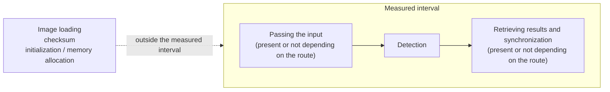

# Evaluation Plan

## Purpose

This document defines how we evaluate the correctness, performance, device memory usage, and portability of the CUDA implementation under reproducible conditions. We do not assume that CUDA is always faster than the CPU; showing the conditions under which the CPU wins, with the same precision, is part of the purpose.

This document defines how we measure. The results themselves are in the [Benchmark Report](benchmark-report.md) and the [Accuracy Evaluation Results](accuracy-report.md).

## Scope

The comparison baseline is the OpenCV ArUco3 detection strategy (CPU), and the subject of comparison is the CUDA implementation in this repository. We measure on the following four machines.

| Machine | Architecture | GPU | GPU type | CC | CUDA |
| --- | --- | --- | --- | --- | --- |
| DGX Spark GB10 | aarch64 | NVIDIA GB10 | Integrated | 12.1 | 13.0 |
| Jetson AGX Orin | aarch64 | Orin | Integrated | 8.7 | 11.4 |
| Jetson AGX Thor | aarch64 | NVIDIA Thor | Integrated | 11.0 | 13.0 |
| GeForce RTX 5070 Ti | x86_64 | RTX 5070 Ti | Discrete | 12.0 | 13.0 |

The configuration of three integrated-GPU machines and one discrete-GPU machine lets us separate results specific to integrated GPUs from results that hold generally. On an integrated GPU, the host and the device share the same physical memory, so transfer costs differ from a discrete GPU. In our measurements, however, transfer cost is small even on the discrete GPU, and it comes out larger on the integrated-GPU DGX Spark GB10. We have not identified the reason. Input memory kind does divide integrated and discrete clearly: managed memory is 6.4 to 30 times slower on the discrete GPU, while on integrated GPUs it stays within 1.01 to 1.27 times.

The input is a synthetic corpus. We do not handle real-image datasets. Pose estimation is also out of scope.

## Current state

The synthetic corpus generator, the CPU reference runner, the measurement harness for four routes, and the accuracy evaluator against ground truth are all in place, and we can measure under the conditions below. The device-resident input route is measured on all four machines. The routes that take host input are used for comparing input memory kinds.

### Routes compared

| ID | Route | Measured interval |
| --- | --- | --- |
| `CPU` | OpenCV ArUco3 | From `cv::Mat` input to obtaining the result |
| `Hybrid` | Preprocessing and thresholding on the GPU, candidate extraction and decode on the CPU | Each stage and synchronization measured separately |
| `CUDA-Resident` | CUDA route with device-resident input | From an image on the GPU to results on the device |
| `CUDA-E2E` | CUDA route with host input | Includes upload, detection, download, and synchronization |

The route identifiers are the same strings that appear in the measurement result JSONL. We use them as they are during aggregation, without renaming.

### Input memory kinds

The memory kind of the input buffer is recorded as a measurement axis independent of the route.

| Symbol | Memory kind | What happens in the measured interval |
| --- | --- | --- |
| `M-Pageable` | Pageable host memory | The driver copies into a staging buffer, then DMAs |
| `M-Pinned` | Page-locked host memory | DMA reads directly. The copy into page-locked memory happens once, outside the measured interval |
| `M-Managed` | Managed memory | There is no explicit copy. Pages migrate the moment the device touches them, and the synchronization and cache costs remain |
| `M-Device` | Device-resident | For when the upstream processing is on the GPU |

We place the `M-Pinned` copy outside the measured interval because this axis measures the **kind of the input buffer**, not the cost of the copy. Copying every frame would bury the difference between kinds in the cost of the copy.

### Measured interval

We measure detection only. Image loading and checksums are not included. Real-time processing does not decode PNG, and if we loaded the image on every iteration, decoding would dominate the measured interval and the comparison would no longer be a comparison of detection time.

Initialization and memory allocation are excluded from the measured interval, but they are not discarded: we record them as a separate item. On the CUDA routes, context creation and kernel loading incur a cost several hundred times the steady state, once per process. Looking only at post-warmup percentiles hides this cost and makes it impossible to compare single detections or short bursts.

### Input conditions

| Item | Value |
| --- | --- |
| Resolution | 640x480, 1280x720, 1920x1080, 3840x2160 |
| Image format | 8-bit grayscale |
| Marker count | 0, 1, 4, 16 |
| Marker side length | 16, 32, 64, 128, 256 pixels in the clean scenes, 96 pixels in the degraded scenes |
| Degradation conditions | Rotation, projective distortion, blur, noise, illumination difference, partial occlusion, image border, and all of them combined |
| Dictionary | Fixed to `DICT_ARUCO_MIP_36h12` |

These are the conditions of the `full` preset of the corpus generator. Combinations in which the markers would not fit in the image are skipped, so not every marker count and side length occurs at every resolution; the preset yields 91 scenes in total.

The policy for widening dictionary support is in the [Dictionary Policy](dictionaries.md). The corpus generation rules and how ground truth is derived are in the [corpus generator](../tools/corpusgen/corpus_generator.md).

Corpus images generated with the same seed differ across build environments. Per-scene hashes were kept only for the 28 benchmark scenes: 18 of those differ between aarch64 and x86_64, and 6 differ between the two aarch64 machines, so the instruction set alone does not explain it. How many of the 91 scenes differ, and by how much, is not recorded. This does not affect comparisons within the same machine, but when comparing corner errors across machines, we take this difference into account.

### Measurement conditions

| Item | How it is decided |
| --- | --- |
| CPU core | Fixed by core type, not by core number |
| OpenCV thread count | Fixed to 1 |
| Percentile | Nearest-rank. No interpolation |
| Independent runs | The same condition is run multiple times as independent processes |
| Outliers | Not removed. The full distribution is kept |

We fix the CPU core by type because on machines that mix performance cores and efficiency cores, matching only the core number means comparing cores of different types. CPU 0 on the DGX Spark GB10 is an efficiency core, while CPU 0 on the GeForce RTX 5070 Ti machine is a performance core, and the value for the CPU route changes by roughly a factor of 2 depending on which one we measure.

We use nearest-rank percentiles so that the returned value is always one of the actual measurements. Interpolation makes the aggregation method implementation-dependent, and comparisons across environments no longer hold.

We run multiple times as independent processes because percentiles within a single run do not capture the variation caused by per-process memory layout. Run-to-run variance can be an order of magnitude larger on the GPU routes than on the CPU route (it is on the DGX Spark; it is not on the GeForce RTX 5070 Ti), so we always report it alongside the results, per machine. When we want to isolate a change in a before-and-after comparison, we disable ASLR with `setarch -R` and record that we did so.

### Accuracy metrics

- Precision and recall
- Number of false positives
- ID and rotation agreement rate
- RMSE and maximum error of the corner coordinates
- Detection rate by marker side length, angle, and degradation condition
- Number of differences from the CPU reference, and the differing images

The CPU reference result is a compatibility baseline, not ground truth. For the synthetic corpus, we also use the true values from generation time as ground truth.

We report recall in three categories. The ArUco3 detection strategy inherently cannot detect markers whose side, after downscaling, falls below a lower limit. The corpus deliberately includes sizes below this limit, so the overall recall is dominated by that limit. Unless we separate overall, at or above the limit, and below the limit, we cannot distinguish misses by the implementation from the limits of the strategy. The definitions of the metrics are in the [Accuracy Evaluation Metrics](../tools/evaluate/accuracy.md).

### Performance metrics

- `T_kernel`: Kernel time measured with CUDA events
- `T_end_to_end`: Wall-clock time from input preparation to obtaining the result
- Latency: p50, p95, p99
- Throughput: frames/s during continuous processing
- Peak device memory usage, and the number of allocations per frame
- Time until the first image produces a result, and the time taken by CUDA context creation
- CPU utilization, GPU utilization, and power consumption where obtainable on the target machine

We do not currently record `T_kernel`. The per-stage times are wall-clock values that include host synchronization, which makes them the same kind of value as `T_end_to_end`. We do not mix the two in aggregation.

### Measurement procedure

1. Record the hardware, OS, CUDA, driver, compiler, OpenCV, power mode, and clocks. Also record the CPU core configuration, the cores used for the measurement, and the ASLR state.
2. Pin the CPU by core type. The Jetson used is the AGX Orin Developer Kit, with power mode MAXN. Specify with `--cpu-list` and keep a record in the results of which cores were used.
3. Fix the input and the detector parameters. For the ArUco3 detection strategy settings, also record the effective value of the downscale factor `fxfy`. The default of `minMarkerLengthRatioOriginalImg` is 0.0, in which case no downscaling occurs even with `useAruco3Detection` enabled.
4. Separate initialization and memory allocation from the measured interval, and record them as a separate item.
5. Measure after warmup. Record the warmup and iteration counts in the results.
6. Do not remove outliers; keep the aggregation method and the full distribution.
7. Run the same condition multiple times as independent processes, and report the run-to-run variance.
8. **Determine the crossover point, including the conditions where the CPU is faster.** Do not report only the favorable side.
9. Check that the CPU reference measurements are not off by an order of magnitude. The reporter of [OpenCV Issue #27118](https://github.com/opencv/opencv/issues/27118) cites reference values whose environment and settings are unknown. These are not a pass criterion; treat them as a sanity check for questioning the measurement conditions.

The commands needed for reproduction are in the Reproducing the measurements sections of the [Benchmark Report](benchmark-report.md) and the [Accuracy Evaluation Results](accuracy-report.md). The design of the measurement harness is in the [Measurement Harness](../bench/benchmark_harness.md), and running the CPU reference is covered in the [CPU Reference Runner](../reference/reference_runner.md).

### Conditions the evaluation must satisfy

- The accuracy results reproduce stably under the target conditions.
- Compute Sanitizer detects no memory errors and no races.
- The same test corpus passes on all four machines.
- The performance results state the measured interval and the synchronization points explicitly.
- We can explain both the conditions where CUDA wins and the conditions where the CPU wins.

For the synthetic corpus, the above are satisfied. Reproducibility on real images remains future work.

### Deliverables

- Machine-readable environment information and measurement results (`docs/measurements/`)
- Aggregate tables and graphs
- Images that differ from the CPU reference
- Reproduction commands
- The benchmark report and the accuracy evaluation results

Large images and videos are not committed directly to the Git repository; we record their storage location and checksum in a manifest.

## Goals

- Produce the same metrics using annotations of a real-image dataset as ground truth.
- Measure per-stage kernel time with CUDA events and record it separately from wall-clock.
- Confirm the crossover point on real images. The boundary obtained on the synthetic corpus is dominated by contour point count, and it may move on real images.
- Add scenes smaller than 640x480 and resolutions above 4K to the corpus, and check both inside and outside the boundary.
- Measure detections per unit of power consumption on the machines where it can be obtained.

## Open questions

- Whether to lock the GPU clock frequency during measurement or measure at the default. If we lock it, we need to check per model whether `nvidia-smi --lock-gpu-clocks` is possible.
- Whether a comparison with the CPU route fixed to 1 thread is enough on its own. We have not compared against a multi-threaded CPU route.
- The terms under which a real-image dataset can be obtained and distributed.
- The acceptable corner coordinate error, and numeric criteria for the performance improvement rate.
- The reason corpus images do not match across architectures.
- The effect of the CUDA Toolkit version difference (11.4 on the Jetson, 13.0 on the other two machines) on the measurements. We have not isolated it.

## See also

- [Benchmark Report](benchmark-report.md)
- [Accuracy Evaluation Results](accuracy-report.md)
- [Roadmap](roadmap.md)
- [Detection Pipeline Design](design/detector-pipeline.md)
- [Memory Transfer Between Host and Device](design/memory-transfer.md)
- [Measurement Harness](../bench/benchmark_harness.md)
- [Accuracy Evaluation CLI](../tools/evaluate/main.md)
- [ADR-0002: Fix the build infrastructure and target environment baseline](adr/0002-toolchain-and-target-baseline.md)
