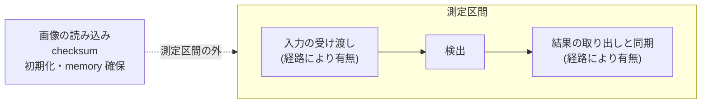

# 評価計画

## 目的

CUDA 実装の正確性、性能、device memory 使用量、移植性を、再現可能な条件で評価するための方法を定めます。CUDA が常に CPU より速いとは仮定せず、CPU が有利な条件を同じ精度で示すことを目的に含みます。

本書は測り方の定義です。得られた結果は [Benchmark 報告](benchmark-report.md) と [正確性評価の結果](accuracy-report.md) にあります。

## 対象範囲

比較の基準は OpenCV の ArUco3 検出戦略 (CPU) であり、比較対象は本 repository の CUDA 実装です。次の 3 機で測ります。

| 機体 | architecture | GPU | GPU の種別 | CC | CUDA |
| --- | --- | --- | --- | --- | --- |
| DGX Spark GB10 | aarch64 | NVIDIA GB10 | 統合 | 12.1 | 13.0 |
| Jetson AGX Orin | aarch64 | Orin | 統合 | 8.7 | 11.4 |
| GeForce RTX 5070 Ti | x86_64 | RTX 5070 Ti | 単体 | 12.0 | 13.0 |

統合 GPU 2 機と単体 GPU 1 機という構成は、統合 GPU 固有の結果と一般に成り立つ結果を切り分けるためです。統合 GPU では host と device が同一物理 memory を共有するため、転送の費用が単体 GPU と異なります。ただし実測では単体 GPU でも転送費用は小さく、統合 GPU の DGX Spark GB10 の方が大きく出ています。理由は特定できていません。入力 memory の種別では統合と単体がはっきり分かれ、managed memory は単体 GPU で 6.4 から 30 倍遅く、統合 GPU では 1.01 から 1.22 倍にとどまります。

入力は合成 corpus です。実画像データセットは扱いません。姿勢推定も対象外です。

## 現状

合成 corpus 生成器、CPU 基準 runner、4 経路の測定 harness、ground truth との正確性評価器がそろっており、下記の条件で測定できます。device 常駐入力の経路は 3 機で測っています。host 入力を含む経路は、入力 memory 種別の比較に用いています。

### 比較する経路

| ID | 経路 | 測定区間 |
| --- | --- | --- |
| `CPU` | OpenCV ArUco3 | `cv::Mat` 入力から結果取得まで |
| `Hybrid` | GPU で前処理と二値化、CPU で候補抽出と decode | 各段と同期を個別に計測 |
| `CUDA-Resident` | device 常駐入力の CUDA 経路 | GPU 上の画像から device 上の結果まで |
| `CUDA-E2E` | host 入力の CUDA 経路 | upload、検出、download、同期を含む |

経路の識別子は測定結果 JSONL に現れる文字列と同じです。集計時に読み替えず、そのまま使います。

### 入力 memory の種別

入力 buffer の memory 種別は、経路とは独立した測定軸として記録します。

| 記号 | memory 種別 | 測定区間で起きること |
| --- | --- | --- |
| `M-Pageable` | pageable host memory | driver が中継へ写してから DMA する |
| `M-Pinned` | page-locked host memory | DMA が直接読む。page-locked への写しは測定区間の外で 1 度だけ行う |
| `M-Managed` | managed memory | 明示的な copy は無い。device が触った時点で page が移送され、同期と cache の費用は残る |
| `M-Device` | device 常駐 | 上流処理が GPU 上にある場合 |

`M-Pinned` の写しを測定区間の外へ置くのは、この軸が測るのが**入力 buffer の種別**であって写しの費用ではないためです。毎 frame 写すと種別の差が写しの費用に埋もれます。

### 測定区間

測定するのは検出だけです。画像の読み込みと checksum は含みません。実時間処理では PNG を復号しないうえ、1 反復ごとに読み込むと復号が測定区間を支配し、検出時間の比較として成立しないためです。

初期化と memory 確保は測定区間から外しますが、捨てずに別項目として記録します。CUDA 経路は文脈の生成と kernel の読み込みで、定常状態の数百倍の費用が process ごとに 1 度発生します。暖機後の分位点だけを見るとこの費用が現れず、単発の検出や短い burst での比較ができません。

### 入力条件

| 項目 | 値 |
| --- | --- |
| 解像度 | 640x480、1280x720、1920x1080、3840x2160 |
| 画像形式 | 8-bit grayscale |
| マーカー数 | 0、1、4、16、上限近傍 |
| マーカー辺長 | 8、16、32、64、128 pixel 以上 |
| 劣化条件 | 回転、射影歪み、ぼけ、noise、照度差、部分遮蔽、画像境界 |
| Dictionary | `DICT_ARUCO_MIP_36h12` に固定 |

対応 Dictionary を広げる方針は [Dictionary 方針](dictionaries.md) にあります。corpus の生成規則と ground truth の求め方は [corpus 生成器](../tools/corpusgen/corpus_generator.md) にあります。

同じ seed で生成した corpus 画像は、aarch64 と x86_64 で 91 場面中 54 場面が一致しません。差は画素の 0.1% 未満、最大 4 階調です。同一 architecture 内の比較には影響しませんが、architecture をまたいで四隅の誤差を比べる場合はこの差を考慮します。

### 測定条件

| 項目 | 決め方 |
| --- | --- |
| CPU core | 種別で固定する。番号では固定しない |
| OpenCV の thread 数 | 1 に固定する |
| 分位点 | nearest-rank。補間しない |
| 独立実行 | 同一条件を独立した process として複数回実行する |
| 外れ値 | 削除しない。全分布を保存する |

CPU core を種別で固定するのは、性能 core と効率 core が混在する機で、番号だけを揃えると別種の core を比べることになるためです。DGX Spark GB10 の CPU 0 は効率 core、GeForce RTX 5070 Ti の機の CPU 0 は性能 core であり、どちらで測るかで CPU 経路の値は約 2 倍変わります。

分位点を nearest-rank にするのは、返る値が必ず実測値のいずれかになるようにするためです。補間すると集計方法が実装依存になり、環境をまたぐ比較が成立しません。

独立した process で複数回実行するのは、1 回の実行内の分位点が process ごとの memory 配置による変動を捉えないためです。実行間ばらつきは GPU 経路の方が CPU 経路より 1 桁大きく、結果には必ず併記します。前後比較で変化を切り分けたい場合は `setarch -R` で ASLR を無効にし、その旨を記録します。

### 正確性指標

- precision と recall
- false positive 数
- ID と rotation の一致率
- 四隅座標の RMSE と最大誤差
- マーカー辺長、角度、劣化条件ごとの検出率
- CPU 基準との差異件数および差異画像

CPU 基準の結果は互換性の基準であって、ground truth ではありません。合成 corpus では生成時の真値を ground truth として併用します。

recall は 3 区分で示します。ArUco3 検出戦略は、縮小後の 1 辺が下限を下回るマーカーを原理上検出しません。corpus はこの下限を下回る大きさを意図的に含むため、全体の recall は下限に支配されます。全体、下限以上、下限未満を分けないと、実装の取りこぼしと戦略上の限界を区別できません。指標の定義は [正確性評価の指標](../tools/evaluate/accuracy.md) にあります。

### 性能指標

- `T_kernel`: CUDA event で測るカーネル時間
- `T_end_to_end`: 入力準備から結果取得までの wall-clock
- latency: p50、p95、p99
- throughput: 連続処理時の frame/s
- device memory の最大使用量と、frame ごとの確保回数
- 1 枚目の結果が出るまでの時間と、CUDA の文脈生成にかかる時間
- CPU 使用率、GPU 使用率、対象機で取得できる消費電力

`T_kernel` は現在記録していません。段ごとの時間は host 同期を含む wall-clock であり、`T_end_to_end` と同じ性質の値です。両者を混ぜて集計しません。

### 測定手順

1. hardware、OS、CUDA、driver、compiler、OpenCV、power mode、clock を記録する。CPU の core 構成、測定に使った core、ASLR の状態も記録する。
2. CPU を core 種別で固定する。使用する Jetson は AGX Orin Developer Kit、power mode は MAXN とする。`--cpu-list` で指定し、どの core を使ったかを結果へ残す。
3. 入力と detector parameters を固定する。ArUco3 検出戦略の設定は、縮小率 `fxfy` の実効値も併せて記録する。`minMarkerLengthRatioOriginalImg` の既定値は 0.0 であり、この場合は `useAruco3Detection` を有効にしても縮小が起きない。
4. 初期化と memory 確保を測定区間から分離し、別項目として記録する。
5. 暖機の後に測定する。暖機と反復の回数は結果へ記録する。
6. 外れ値を削除せず、集計方法と全分布を保存する。
7. 同一条件を独立した process として複数回実行し、実行間ばらつきを報告する。
8. **CPU が速い条件を含めて crossover point を求める。** 有利な側だけを報告しない。
9. CPU 基準の測定値が桁違いに外れていないかを確かめる。[OpenCV Issue #27118](https://github.com/opencv/opencv/issues/27118) の報告者は環境と設定が不明な参考値を挙げている。これは合格基準ではなく、測定条件を疑うための sanity check として扱う。

再現に必要な command は [Benchmark 報告](benchmark-report.md) と [正確性評価の結果](accuracy-report.md) の測定の再現節にあります。測定 harness の設計は [測定 harness](../bench/benchmark_harness.md)、CPU 基準の実行は [CPU 基準 runner](../reference/reference_runner.md) にあります。

### 評価が満たすべき条件

- 正確性の結果が対象条件で安定して再現する。
- Compute Sanitizer で memory error と race が検出されない。
- 3 機すべてで同一の test corpus が通る。
- 性能結果に測定範囲と同期点が明記されている。
- CUDA が有利な条件と、CPU が有利な条件の両方を説明できる。

合成 corpus に対しては上記を満たしています。実画像に対する再現性は今後の課題です。

### 成果物

- machine-readable な環境情報と測定結果 (`docs/measurements/`)
- 集計表とグラフ
- CPU 基準との差異画像
- 再現 command
- benchmark 報告と正確性評価の結果

大容量の画像や動画は Git repository へ直接 commit せず、保存先と checksum を manifest へ記録します。

## 目標

- 実画像データセットの注釈結果を真値として、同じ指標を出す。
- CUDA event で段ごとのカーネル時間を測り、wall-clock と分離して記録する。
- crossover point を実画像で確かめる。合成 corpus で得た境界は輪郭点数に支配されており、実画像では動く可能性がある。
- 640x480 より小さい場面と、4K を超える解像度を corpus へ加え、境界の内側と外側を確かめる。
- 消費電力あたりの検出数を、取得できる機体で測る。

## 未確定事項

- 測定時に GPU の動作周波数を固定するか、既定のまま測るか。固定するなら `nvidia-smi --lock-gpu-clocks` の可否を機種ごとに確かめる必要がある。
- CPU 経路を 1 thread に固定した比較だけで足りるか。多 thread の CPU 経路とは比較していない。
- 実画像データセットの入手条件と配布条件。
- 許容する四隅座標の誤差と、性能改善率の数値基準。
- corpus 画像が architecture 間で一致しない原因。
- CUDA Toolkit の version 差 (Jetson は 11.4、他 2 機は 13.0) が測定値へ与える影響。切り分けていない。

## 関連

- [Benchmark 報告](benchmark-report.md)
- [正確性評価の結果](accuracy-report.md)
- [ロードマップ](roadmap.md)
- [検出パイプライン設計](design/detector-pipeline.md)
- [host と device の間の memory 受け渡し](design/memory-transfer.md)
- [測定 harness](../bench/benchmark_harness.md)
- [正確性評価 CLI](../tools/evaluate/main.md)
- [ADR-0002: build 基盤と対象環境の baseline を固定する](adr/0002-toolchain-and-target-baseline.md)
