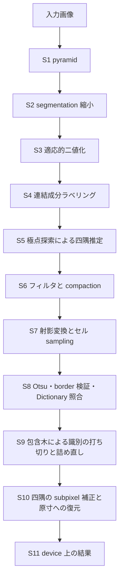

# 実装の構成と検証

## 目的

本 repository の CUDA 実装について、検出をどの段へ分けたか、各段が何を保証するか、なぜその設計を選んだかを 1 箇所へまとめます。設計判断の根拠と検証の方法を残し、後から同じ検討をやり直さずに済む状態にすることが目的です。

## 対象範囲

検出の段構成、主要な設計判断、検証戦略、coverage、測定上の注意を対象とします。性能と正確性の数値は [benchmark 結果まとめ](benchmark-report.md) と [正確性評価の結果](accuracy-report.md) が正本であり、本文では判断の根拠に必要な範囲だけを引きます。姿勢推定は対象外です。評価は合成 corpus に限ります。

## 現状

### できること

- 入力画像の縮小と二値化から、候補抽出、Dictionary 照合、四隅の subpixel 補正まで (S1 から S10) を GPU 上で完結します。結果は device buffer のまま参照でき (S11)、`Detector::detect_async` は host 同期なしで返ります。host 側で使う場合は `download()` で取り出します。
- 1 frame の kernel 発行列は CUDA Graph へ畳んでいます。
- 検出中に device memory を確保しません。workspace の最大使用量は ArUco3 検出戦略が有効で 17.51 MB、無効で 414.51 MB です。合成 corpus 91 場面を検出しても確保回数は増えません。
- 下の 3 機すべてで自動 test 402 件が通ります。Compute Sanitizer は memcheck / racecheck / initcheck / synccheck の 4 tool を 2 つの実行 file へ掛け、8 件が 3 機すべてで通ります。

| 機体 | architecture | GPU | Compute Capability | CUDA | CPU |
| --- | --- | --- | --- | --- | --- |
| DGX Spark GB10 | aarch64 | NVIDIA GB10 (統合) | 12.1 | 13.0 | Cortex-X925 x10 + Cortex-A725 x10 |
| Jetson AGX Orin | aarch64 | Orin (統合) | 8.7 | 11.4 | Cortex-A78AE x12 (MAXN) |
| GeForce RTX 5070 Ti | x86_64 | RTX 5070 Ti (単体) | 12.0 | 13.0 | Core Ultra 7 265 |

統合 GPU 2 機と単体 GPU 1 機という構成は、統合 GPU 固有の結果と一般に成り立つ結果を切り分けるためのものです。

正確性は 3 経路 x 3 機の全 18 組合せで precision 100% であり、false positive と ID 誤りは 0 件です。ArUco3 検出戦略は縮小後の 1 辺が下限を下回るマーカーを原理上検出しないため、recall は corpus 全体で 18.33%、下限以上のマーカーに限れば 94.44% です。速度は検出のみを測った end-to-end 時間を 28 場面 x 3 経路 x 3 機で比べています。画像の読み込みと checksum は測定区間に含みません。合成 corpus では CPU が有利なのは 640x480 かつ検出が 1 件以上ある場面だけです。実画像では輪郭点数が増えて境界が動く可能性がありますが、確かめていません。

### 検出の段構成

入力から ID と四隅までを次の順に処理します。すべて device 上で走り、段の間で host へ戻しません。



各段が何を保証するかは次のとおりです。「bit 一致」は、CPU 基準または OpenCV を逐語で写した oracle と 1 bit も違わないことを test で固定していることを指します。

| 段 | 内容 | 保証 |
| --- | --- | --- |
| S1 | pyramid の生成 | OpenCV の `buildPyramid` と全 level で bit 一致 |
| S2 | segmentation 画像への縮小 | 最大 1 階調の差を許容する。OpenCV の `INTER_LINEAR` は `softdouble` と `ufixedpoint16` によるソフトウェア浮動小数点の bit exact 経路であり、kernel へ移していない |
| S3 | 適応的二値化 | OpenCV の `adaptiveThreshold` と bit 一致。行方向と列方向へ分けて積むため中間の丸めが入らない |
| S4 | 連結成分ラベリング | label は root の線形 index の昇順に採番し、atomics の到着順に依存しない |
| S5 | 極点探索による四隅推定 | 四隅が定まらない成分 (1 画素、幅 1 画素の直線) を無効として落とす |
| S6 | 四角形らしさの判定と compaction | 候補上限を超えた場合は `kCandidateOverflow` を返して打ち切る |
| S7 | 射影変換とセル sampling | 積和を融合しない側へ揃える。x86_64 の OpenCV と byte 単位で一致し、aarch64 では OpenCV 側が NEON の融合積和を使うためわずかに残差が出る |
| S8 前半 | Otsu と border 検証 | `minOtsuStdDev` と border 誤り率の境界で CPU 基準と判定が一致する。機種差は出ない |
| S8 後半 | Dictionary 照合 | 全 ID の 4 回転について ID・回転・距離が CPU 基準とも OpenCV とも一致する |
| S9 | 包含木と識別の打ち切り | 包含判定が `cv::pointPolygonTest` と一致し、打ち切りの結果が CPU 基準と一致する |
| S10 | 四隅の subpixel 補正と原寸への復元 | 逐語 oracle と 3 機すべてで bit 一致。実際の `cv::cornerSubPix` とは許容差で見る |
| S11 | 結果の出力 | host 同期なしで device 上の結果を参照できる |

段ごとの詳細と、互換対象である OpenCV 4.x の観測仕様は [検出パイプライン設計](design/detector-pipeline.md) にあります。

### 主要な設計判断

#### 候補抽出は連結成分ラベリングと極点探索で行う

二値化画像を host へ戻して CPU の輪郭追跡で四隅を求める経路 (Hybrid) と比べ、GPU 上のラベリングと極点探索は場面の内容によって時間がほとんど変わりません。速度は場面により優劣が入れ替わりますが、遅い場面が無いことを採用の理由としています。決定と撤回条件は [ADR-0003](adr/0003-candidate-extraction-approach.md) にあります。

欠点は 2 つあります。OpenCV は代表候補の識別が失敗したとき同じ group の別候補を試す経路 (`closeContours`) を持ちますが、この方式には対応する経路がありません。また四隅の推定方法が OpenCV の多角形近似と違うため、subpixel 補正を切ると差はすべて sqrt(2) = 1.414 px になります。整数座標の四隅が斜めに 1 pixel ずれた距離であり、補正がこの違いを吸収して差異を 18 件から 1 件へ減らします。

ラベリングは 8 近傍とします。OpenCV の `findContours` が前景を 8 連結として辿るため、4 近傍では対角にのみ接する前景が別成分になって候補が割れます。label 統計の配列は label 数の上限 `ceil(W/2) * ceil(H/2)` で確保します。8 近傍では別成分どうしが縦横斜めのいずれでも接せないため 1 画素飛ばしの配置が上限であり、上限で確保すれば統計側に溢れの経路を持たずに済みます。

四角形らしさの判定には 2 つの比が要ります。成分画素が推定四角形へ収まる割合だけでは L 字と十字を落とせず、各辺の近くにある成分画素の数だけでは円を落とせません。両方を要求して既定値をその間に置いています。

#### 近接候補の grouping まで写さないと四隅が一致しない

適応的二値化は window を 3 通り試すため、同じマーカーから少しずつ違う候補が得られます。OpenCV は識別の前に候補を周長の降順へ並べ、近接するものを 1 グループにまとめ、グループ内で最大周長の候補を代表に選びます。この grouping を省いて識別後に ID と位置で重複を落とすと、最小 window 由来の小さい候補が残って四隅が内側へ寄り、原寸へ戻した時点で無視できない差になります。grouping、包含関係の木、親候補の識別打ち切りまで写して差が 0 になります。

#### 重複除去という段は存在しない

`detectMarkers` には ID による重複除去がありません。同じ ID のマーカーが離れた位置に 2 枚あれば 2 件とも出ます。重複が消えるのは包含木による識別の打ち切りの結果です。黒枠の外周と内周が両方候補になるため、内側でマーカーが見つかったらそれを囲む候補は識別せずに済ませます。GPU 化にあたって外せない規則は 4 つあります。

1. `parent[i]` は `j < i` を満たす最大の j です。index は周長の降順なので「囲むもののうち最も内側」を意味します。
2. 段数の伝播は index の降順に行います。並列にすると、まだ確定していない段数を読みます。
3. 包含判定は `pointPolygonTest` の crossing number をそのまま写し、境界を内側として扱います。極点探索で作る四角形は凹になりうるため、凸性を仮定した符号一致では代用できません。交差積は 64 bit 整数で計算します。
4. 到達数の二重計上を保ちます。祖先として数えた候補を、自分の段に来たときもう一度数えます。打ち切りを早める方向に働くため、候補単位の厳密な抑止へ書き換えると結果が変わります。

#### Dictionary 照合には見落としやすい規則が 2 つある

セル比を 1 つの bit 列へ潰せません。OpenCV は「黒ではない」(比が閾値より大きい) と「白ではない」(比が 1 - 閾値より小さい) の 2 つの mask を作ります。既定の閾値 0.49 では両方に立つ比が存在し、bit が 0 でも 1 でも誤りとして数えられます。1 つの bit 列へ潰すとこの第 3 の状態が消えます。誤り数は分岐なしに求まります。

```
誤り = not_black ^ ((not_black ^ not_white) & codeword)
```

もう 1 つは、最小距離の ID ではなく条件を満たした最初の ID を採ることです。OpenCV は ID の昇順に見て、許容距離を満たした時点で打ち切ります。`DICT_ARUCO_MIP_36h12` は収録間の最小距離が許容距離より大きいため両者は一致しますが、規則としては別物です。GPU 側は条件を満たした ID の `atomicMin` で同じ結果を得ます。

#### 支持する設定の組み合わせを 2 つに絞る

| `use_aruco3_detection_` | `corner_refine_method_` | 可否 |
| --- | --- | --- |
| true | kSubpix | 可。四隅は原寸 |
| false | kNone | 可。縮小しないため原寸 |
| true | kNone | 拒否。四隅が縮小後の座標のまま残る |
| false | kSubpix | 拒否。段が 1 つしかなく補正が走らない |

縮小後の座標を原寸へ戻す処理は S10 の段登りにしかありません。ArUco3 検出戦略を有効にして補正を切ると、四隅が segmentation 座標のまま出ます。逆に無効では pyramid が 1 段しかなく、段登りが 1 度も回りません。どちらも黙って通すと座標系が食い違うため、`initialize` が `kInvalidConfig` で拒否します。OpenCV 自身は ArUco3 有効時に `cornerRefinementMethod` を SUBPIX へ無条件で上書きするため、本実装も同じ上書きを設定の側で明示します。

#### workspace は 2 本に分け、確保量は正方形の上界から求める

Dictionary は frame をまたいで生きるため専用の arena に置き、残りの段は frame ごとに `reset()` して切り出し直します。切り出しは host の計算だけで CUDA API を呼ばないため、frame ごとに回しても確保回数は 1 のままです。`allocate()` は容量が足りなくても自動で拡張しません。自動拡張は frame ごとの確保を静かに生むためです。

確保量は上限の寸法をそのまま入れても求まりません。縮小率は `fxfy = S / (S + max(W, H) * tau)` であり分母に長辺が入るため、上限より小さい入力の方が segmentation 画像が大きくなることがあります。`fxfy * W` は `W` について単調増加なので、正方形として計算した幅と高さをそれぞれの上界に使います。

#### 結果は面ごとの並び (SoA) で持つ

`DeviceDetections` は四隅を `float2` の配列ではなく面ごとの float 配列で持ちます。S5 から S10 までが同じ添字の規則で一貫しており、S10 は同じ添字で in-place に書き戻すためです。公開 header が `vector_types.h` へ依存しない利点もあります。

#### 丸めを固定する

`cell_decode.cu` は `-fmad=false` で compile します。融合を許すと分散が `minOtsuStdDev` の境界でずれ、低分散の分岐へ入るかどうかが変わります。S7 も積和を融合しない側へ揃えています。OpenCV 自身が機種間で bit 一致しないため、どちらへ揃えるかを決めておかないと機種ごとに基準が変わります。

#### 起動費用は kernel の数と形で減らす

完全 GPU 経路は固定費が高く、仕事量に対して平坦です。段別に切り分けると、固定費の大半は S10 の四隅補正と S8 前半の Otsu が占め、検出 0 件の場面では kernel 起動そのものが最小値の半分近くを占めます。これに対して 3 つ手を入れました。

- S10 の補正を隅ごとの並列から要素ごとの並列へ変える。
- Otsu の閾値計算を 3 相へ分ける。重心の集計と分離度の探索は要素ごとに独立なので並列にし、漸化式だけを 1 thread の逐次で回す。
- 1 frame の発行列を CUDA Graph へ畳む。

丸めは 1 bit も変わりません。CPU 比 (1 未満が GPU 有利) の変化は次のとおりです。

| 場面 | DGX Spark | Jetson AGX Orin | RTX 5070 Ti |
| --- | --- | --- | --- |
| 1280x720 マーカー 4 枚 | 1.94 → 0.98 | 1.08 → 0.66 | 1.32 → 0.68 |
| 3840x2160 マーカー 4 枚 | 0.99 → 0.45 | 0.46 → 0.30 | 0.60 → 0.28 |

それでも 640x480 で検出がある場面では CPU が速いままです。境界を決めるのは解像度でも候補数でもなく二値化後の輪郭点数で、輪郭点 1e5 あたりの係数は CPU 2.48 から 5.35 ms、CUDA-Resident 0.041 から 0.278 ms です。Hybrid の係数は CPU とほぼ同じ (2.54 から 5.48 ms) で、輪郭抽出から先を host で行うためです。

#### 機に依存する値は設定ではなく device 属性から導く

block size は 8 / 16 / 32 を振った実測で 3 機とも 16 が最良でした。設定として露出しても変える理由がないため、`cuda_block_dim_` の既定値のままにしています。代わりに S10 の補正で起こす block 数を、SM 数の 2 倍と仕事量の上限の小さい方から決めます。効果は控えめですが、固定値をやめること自体に意味があります。隅の上限をそのまま block 数にしていたときは、SM 数の少ない Jetson AGX Orin で大きく悪化しました。共有 memory を使う kernel では、1 SM に載る block が限られて起動が波に分かれるためです。SM 数の桁が違う機を足したときに同じ事故が構造的に起きなくなります。

### 検証戦略

| 層 | 対象 | 実行頻度 |
| --- | --- | --- |
| unit | 型、設定検証、host 側の境界処理、kernel 単体 | 全 commit |
| conformance | Dictionary の ID 数、markerSize、4 回転 codeword、訂正境界 | 全 commit |
| differential | CPU 基準結果との ID・rotation・四隅の比較 | 全 commit |
| robustness | 0 マーカー、上限超過、非連続 pitch、ROI、極小画像、null pointer、memory 空間の不一致 | 全 commit |
| cli | CLI の引数解析。正常系、異常系、境界値を実行 file の起動で検証 | 全 commit |
| doc | 公開 API の Doxygen 要件の充足を機械検査 | 全 commit |
| sanitizer | Compute Sanitizer の 4 mode | `ctest -L sanitizer` |
| coverage | C0 と C1 の測定と未達理由の確認 | 変更時 |
| benchmark | end-to-end 時間と latency 分布 | 変更時 |

bit 一致を要求する対象と許容差で見る対象を分けています。pyramid、適応的二値化、Dictionary 照合、Dictionary の生成物、S10 の逐語 oracle との比較は bit 一致です。segmentation の 1 階調差、S7 の aarch64 での残差、実際の `cv::cornerSubPix` との差、四隅の RMSE は許容差で見ます。

S10 の検証を 2 段に分けているのは、この段だけ浮動小数の演算順序が結果へ離散的に効くためです。1 ULP の差が反復回数を 1 回変え、収束不良で初期位置へ戻す分岐の採否を反転させます。そこで第 1 に、`cv::cornerSubPix` と `cv::getRectSubPix` を host へ逐語で写した oracle と bit 一致することを要求します。oracle は `-ffp-contract=off` で compile し、GPU 側の `-fmad=false` と意味論を揃えます。第 2 に、実際の OpenCV との差を許容差で見ます。退化した入力では aarch64 で収束不良の判定が反転し、窓の半径の分だけ四隅が動きます。丸めの差が離散的な分岐へ増幅された結果であり、同じ入力で oracle とは bit 一致しています。実運用に近い入力では 3 機とも RMSE が十分小さく収まります。

差分レポートは CPU 基準と評価対象を同じ画像へ適用し、差異を未検出・過検出・ID 不一致・rotation 不一致・四隅ずれの 5 種類へ分類します。対応付けは ID ではなく重心の近さで行います。ID で対応を取ると、ID を読み違えた場合に未検出と過検出が 1 件ずつ計上され、実際に起きたことが読み取れなくなるためです。rotation 不一致は、四隅の並びを巡回させると許容差内に収まる場合として判定します。`detectMarkers` は回転量を返さず回転を四隅の並びへ畳み込むため、これが回転の差を見る唯一の手段です。

CPU 基準は互換性の oracle であって ground truth ではありません。基準自身が取りこぼしたマーカーは差異として現れないため、合成 corpus の真値と突き合わせる経路を `tools/evaluate` として別に持たせています。

`tools/check_doxygen.py` は公開ヘッダの宣言を列挙し、規約が求める 7 要素 (目的、引数、戻り値、所有権、同期動作、入力例、出力例) の欠落を検出します。所有権と同期動作が class 全体で共通する場合は、class の Doxygen へその旨を明記して member 側の記載に代えます。同一の記述を member ごとに複写すると冗長になるためです。

Compute Sanitizer の実行では、意図的に CUDA API を失敗させる test を suite 名で除外します。除外しないと意図した失敗が指摘として現れ、本物の問題が埋もれます。racecheck は既定では block の完了まで解析を溜めるため、共有 memory を多く使う kernel があると解析の状態が上限に達します。単体 GPU 機では `--force-synchronization-limit 1` を指定します。

規則を写した実装は、規則を壊しても test が通らないことまで確認します。上に挙げた包含木の 4 規則には変異を実際に注入し、すべてが test で捕まることを確かめています。

### カバレッジ

`coverage` preset で C0 と C1 を測ります。`cmake --build build/coverage --target coverage-report` が `ctest` を実行してから `gcovr` で集計します。C0 と C1 は 100% を目標としますが到達していません。対象は C++ の翻訳単位のみで、`.cu` は nvcc が compile するため gcov の計測に入りません。`src/core` の kernel だけでなく、同じ file にある host 側の `reserve_*` と `*_workspace_bytes` も計測外です。これらは `test/reference` の各 test から正常系・異常系ともに呼ばれ、引数不正と容量不足の経路も test で固定していますが、行として数えられていません。

未到達行の内訳は次のとおりです。

| 分類 | 内容 | 扱い |
| --- | --- | --- |
| 外部資源の獲得失敗 | `popen` の失敗、`ofstream` の書き込み失敗、`cudaMalloc` の失敗 | 対象外。故障注入の仕組みが無いと再現できない |
| OpenCV 内部の失敗 | `cv::imwrite` の失敗、`getPerspectiveTransform` の異常入力 | 対象外。OpenCV 側の内部状態に依存し、外から誘発できない |
| CUDA API の失敗経路 | `cudaGetDeviceProperties` や `cudaMemcpy` の失敗 | 対象外。`check_cuda` の記録経路自体は別 test で検証している |
| 到達不能な防御的分岐 | 順位の下限、列挙に無い値の既定処理 | 対象外。仕様上到達しないが、将来の変更に対する防御として残す |
| CUDA device code | 自己診断用の kernel | gcov は device code を計測できない。入力分割と境界値で経路を確認する |
| 候補 grouping の代替経路 | `close_contours_` を使う再識別 | 対象外。代表候補の識別が失敗し、かつ同一 group に離れた候補が残る場面を合成で作れていない |
| 同一 ID の並び替え | 検出結果の整列で ID が等しい場合の比較 | 対象外。合成 corpus は 1 場面に同じ ID を置かない |

`main.cpp` の CLI 層は `test/cli/` の ctest から実行 file を起動して測定に含めています。

### 測定上の注意

**CPU の core 種別を固定します。** DGX Spark GB10 は性能 core と効率 core の混成であり、同じ条件でも効率 core へ割り当てられると 2 倍近く遅くなります。固定しない測定は割り当て次第で二極化し、GPU 側の優位が実際より大きく見えます。Jetson AGX Orin は均一構成のためこの影響を受けません。

**address space の無作為化 (ASLR) の状態を結果へ記録します。** 全解像度を扱う CPU 経路では、process ごとの memory 配置の違いだけで p50 が動きます。1 回の実行内の分位点はこの変動を捉えないため、独立した複数 process の中央値と実行間ばらつきを併せて見ます。GPU 経路の実行間ばらつきは CPU 経路より 1 桁大きく、DGX Spark では CPU 0.6% に対し Hybrid 17.7%、CUDA-Resident 14.1% です。

**1 割程度の差は別 session の比較で判断できません。** 各版の分布の幅が版どうしの差より広いため、同一 session で交互に測る必要があります。

**差が小さいとき、起動費用の相殺 frame 数は意味を持ちません。** GPU 経路は 1 枚目の結果が出るまでに時間がかかります (DGX Spark で Hybrid 171.0 ms、CUDA-Resident 174.0 ms、CPU 3.3 ms)。相殺に要する frame 数は起動費用の差を定常時間の差で割った値ですが、DGX Spark の 1280x720 マーカー 4 枚では定常時間が CPU 0.699 ms に対し CUDA-Resident 0.696 ms しか違わず、分母が測定のばらつきに埋もれます。相殺 frame 数は定常差が十分大きい場面でのみ意味を持ちます。

**統合 GPU では page cache が memory の判定に影響します。** device memory と host memory が同一であるため、`cudaMemGetInfo` が返す空きは host 側の空き memory に相当します。page cache が育つと確保に失敗し、測定値も揺れます。測定の前に page cache を落としてください。

**入力の memory 種別を測定軸として分けます。** managed memory は単体 GPU で 6.4 から 30 倍遅く、統合 GPU でも 1.01 から 1.22 倍にとどまり、pageable より速くなりません。

**外れ値を削除せず全分布を保存します。** 測定条件は機械可読形式で結果へ併記し、有利な結果だけが残らないようにします。CUDA Toolkit は開発 container の image へ固定し、version を環境情報へ記録します。compiler が image と分離していると、測定結果を後から再現できません。

## 目標

- 実画像 corpus で正確性と速度を測り、crossover point がどこへ動くかを確かめる。
- 段ごとの時間を CUDA event で測り、host 同期を含む wall-clock と分離して記録する。
- `.cu` を含めた coverage を測る手段を用意する。
- 640x480 で検出がある場面の固定費をさらに下げる。

## 未確定事項

- 実画像で候補 grouping の代替経路 (`close_contours_`) が必要になるか。合成 corpus では該当する場面を作れていない。
- DGX Spark で `M-Pinned` が `M-Pageable` より遅い理由。統合 GPU で DMA の利点が無いことは説明できるが、遅くなる分の説明が付いていない。
- 対応 Dictionary をどの順で広げるか。方針は [Dictionary 方針](dictionaries.md) にある。
- corpus へ実画像を含める場合の入手条件と配布条件。

## 関連

- [ロードマップ](roadmap.md)
- [アーキテクチャ](architecture.md)
- [検出パイプライン設計](design/detector-pipeline.md)
- [公開 API](design/public-api.md)
- [Docker 環境設計](design/docker-environment.md)
- [memory 転送設計](design/memory-transfer.md)
- [評価計画](evaluation-plan.md)
- [benchmark 結果まとめ](benchmark-report.md)
- [正確性評価の結果](accuracy-report.md)
- [Dictionary 方針](dictionaries.md)
- [知的財産・ライセンス方針](ip-and-licensing.md)
- [Code Provenance 記録](code-provenance.md)
- [ADR-0002: build 基盤と対象環境の baseline を固定する](adr/0002-toolchain-and-target-baseline.md)
- [ADR-0003: 四角形候補抽出は案 A を主案とする](adr/0003-candidate-extraction-approach.md)
