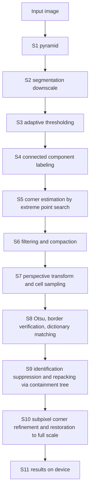

# Implementation Structure and Verification

## Purpose

This document collects in one place, for the CUDA implementation in this repository, how detection is divided into stages, what each stage guarantees, and why each design was chosen. The goal is to record the rationale behind the design decisions and the verification methods, so that the same investigation does not have to be redone later.

## Scope

The scope covers the stage structure of detection, the main design decisions, the verification strategy, coverage, and cautions regarding measurement. The [benchmark summary](benchmark-report.md) and the [accuracy evaluation results](accuracy-report.md) are authoritative for the performance and accuracy numbers; this document quotes only what is needed to support its conclusions. Pose estimation is out of scope. The evaluation is limited to the synthetic corpus.

## Current state

### What works

- Everything from downscaling and thresholding the input image through candidate extraction, dictionary matching, and subpixel refinement of the corners (S1 through S10) completes on the GPU. The results can be referenced while still in device buffers (S11), and `Detector::detect_async` returns without host synchronization. To use them on the host, retrieve them with `download()`.
- When the caller passes an explicit stream, the kernel launch sequence for one frame is folded into a CUDA Graph. CUDA does not allow capture on the legacy default stream, so passing `nullptr` issues the kernels one stage at a time.
- No device memory is allocated during detection. Peak workspace usage is 17.51 MB with the ArUco3 detection strategy enabled and 414.51 MB with it disabled. Detecting all 91 scenes of the synthetic corpus does not increase the allocation count.
- Two sample programs live under `examples/`. `generate_marker` renders a marker from the built-in dictionary and `detect_image` runs the full pipeline on it, so the public API has a runnable path that needs neither a camera nor an image library. Both are covered by the CLI tests, including the generate-then-detect round trip and the boundary where a marker below the ArUco3 lower bound is missed. `examples/CMakeLists.txt` also configures standalone against an installed package, which is the only form that exercises `find_package`.
- The detector is reachable from outside C++. `libaruco3cuda_c.so` exposes 16 C functions, and the `python/aruco3cuda` package drives them with `ctypes`, so the Python side compiles nothing and needs no dependency outside the standard library. `examples/python/` mirrors the C++ samples option for option, and the tests compare their output. See [C ABI and Python binding](design/c-abi-and-python.md).
- All 523 automated tests pass on all four machines below. Compute Sanitizer applies its four tools (memcheck / racecheck / initcheck / synccheck) to two executables, and all 8 combinations pass on all four machines.

| Machine | Architecture | GPU | Compute Capability | CUDA | CPU |
| --- | --- | --- | --- | --- | --- |
| DGX Spark GB10 | aarch64 | NVIDIA GB10 (integrated) | 12.1 | 13.0 | Cortex-X925 x10 + Cortex-A725 x10 |
| Jetson AGX Orin | aarch64 | Orin (integrated) | 8.7 | 11.4 | Cortex-A78AE x12 (MAXN) |
| Jetson AGX Thor | aarch64 | Thor (integrated) | 11.0 | 13.0 | Neoverse-V3AE x14 (MAXN) |
| GeForce RTX 5070 Ti | x86_64 | RTX 5070 Ti (discrete) | 12.0 | 13.0 | Core Ultra 7 265 |

The configuration of three integrated-GPU machines and one discrete-GPU machine is there to separate results specific to integrated GPUs from results that hold in general.

For accuracy, precision is 100% across all 12 combinations of 3 routes x 4 machines, with zero false positives and zero ID errors. Because the ArUco3 detection strategy inherently cannot detect markers whose side length after downscaling falls below the lower bound, recall is 18.33% over the whole corpus and 94.44% when limited to markers at or above that bound. For speed, end-to-end times measuring detection only are compared across 28 scenes x 3 routes x 4 machines. Image loading and checksums are not part of the measured interval. On the synthetic corpus, the CPU beats CUDA-Resident in 5 of the 28 scenes on the DGX Spark, 4 on the GeForce RTX 5070 Ti, 1 on the Jetson AGX Orin, and none on the Jetson AGX Thor. What governs this is the contour point count after thresholding rather than the resolution: the 5 scenes on the DGX Spark include one at 1280x720, while `noise_640x480` and `combined_640x480` go to the GPU. On real images the contour point count may increase and move the boundary, but we have not verified this.

### Detection stage structure

Input is processed into IDs and corners in the following order. Every step runs on the device, with no return to the host between stages.



What each stage guarantees is as follows. "Bit-identical" means that tests pin the result to differ by not a single bit from the CPU reference or from an oracle transcribed verbatim from OpenCV.

| Stage | Content | Guarantee |
| --- | --- | --- |
| S1 | Pyramid generation | Bit-identical to OpenCV's `buildPyramid` at every level |
| S2 | Downscale to the segmentation image | A difference of at most 1 gray level is tolerated. OpenCV's `INTER_LINEAR` is a bit-exact software floating-point path built on `softdouble` and `ufixedpoint16`, and has not been ported to a kernel |
| S3 | Adaptive thresholding | Bit-identical to OpenCV's `adaptiveThreshold`. Accumulation is split into row and column directions, so no intermediate rounding occurs |
| S4 | Connected component labeling | Labels are numbered in ascending order of the root's linear index, independent of the arrival order of atomics |
| S5 | Corner estimation by extreme point search | Components whose corners cannot be determined (a single pixel, a one-pixel-wide line) are marked invalid and dropped |
| S6 | Squareness test and compaction | If the candidate limit is exceeded, `kCandidateOverflow` is returned and processing is suppressed |
| S7 | Perspective transform and cell sampling | Aligned to the non-fused multiply-add side. Matches x86_64 OpenCV byte for byte; on aarch64 a slight residual appears because OpenCV uses NEON fused multiply-add |
| S8 first half | Otsu and border verification | Decisions match the CPU reference at the boundaries of `minOtsuStdDev` and the border error rate. No machine-to-machine differences appear |
| S8 second half | Dictionary matching | ID, rotation, and distance match both the CPU reference and OpenCV for all 4 rotations of every ID |
| S9 | Containment tree and identification suppression | Containment decisions match `cv::pointPolygonTest`, and the suppression results match the CPU reference |
| S10 | Subpixel corner refinement and restoration to full scale | Bit-identical to the verbatim oracle on all four machines. Compared against actual `cv::cornerSubPix` with a tolerance |
| S11 | Result output | Results on the device can be referenced without host synchronization |

Per-stage details and the observed behavior of OpenCV 4.x, the compatibility baseline, are in [detection pipeline design](design/detector-pipeline.md).

### Main design decisions

#### Candidate extraction uses connected component labeling and extreme point search

Compared with the route that copies the thresholded image back to the host and finds the corners with CPU contour tracing (Hybrid), labeling and extreme point search on the GPU take almost the same time regardless of scene content. Which is faster varies by scene, but the absence of slow scenes is the reason for adopting it. The decision and the conditions for reversing it are in [ADR-0003](adr/0003-candidate-extraction-approach.md).

There are two drawbacks. OpenCV has a route (`closeContours`) that tries other candidates in the same group when identification of the representative candidate fails; this approach has no corresponding route. Also, because the corner estimation method differs from OpenCV's polygon approximation, turning off subpixel refinement makes every difference sqrt(2) = 1.414 px. That is the distance of a diagonal one-pixel shift of integer-coordinate corners, and the refinement absorbs this difference, reducing the discrepancies from 18 to 1.

Labeling uses 8-connectivity. Because OpenCV's `findContours` traces the foreground as 8-connected, 4-connectivity would place foreground pixels that touch only diagonally into separate components and split candidates. The label statistics array is allocated at the upper bound on the label count, `ceil(W/2) * ceil(H/2)`. With 8-connectivity, distinct components cannot touch vertically, horizontally, or diagonally, so an every-other-pixel arrangement is the upper bound; allocating at that bound removes the need for an overflow path on the statistics side.

The squareness test needs two ratios. The fraction of component pixels that fall inside the estimated quadrilateral alone cannot reject L shapes and crosses, and the count of component pixels near each edge alone cannot reject circles. Both are required, with the defaults placed between them.

#### The corners do not match unless grouping of nearby candidates is also transcribed

Adaptive thresholding tries three window sizes, so slightly different candidates are obtained from the same marker. Before identification, OpenCV sorts candidates in descending order of perimeter, collects nearby ones into a single group, and selects the candidate with the largest perimeter in the group as the representative. If this grouping is skipped and duplicates are instead removed by ID and position after identification, small candidates originating from the smallest window survive, the corners shift inward, and the difference becomes non-negligible once restored to full scale. Transcribing grouping, the containment relation tree, and the identification suppression of parent candidates brings the difference to zero.

#### There is no deduplication stage

`detectMarkers` has no deduplication by ID. If two markers with the same ID are at separate positions, both are reported. Duplicates disappear as a consequence of identification suppression via the containment tree. Because both the outer and inner edges of the black border become candidates, once a marker is found inside, the candidate surrounding it need not be identified. Four rules cannot be dropped when moving this to the GPU.

1. `parent[i]` is the largest j satisfying `j < i`. Since indices are in descending order of perimeter, this means "the innermost of those that enclose it."
2. Depth propagation proceeds in descending index order. Doing it in parallel would read depths that are not yet settled.
3. The containment test transcribes the crossing number of `pointPolygonTest` as is, treating the boundary as inside. Quadrilaterals produced by extreme point search can be concave, so a sign-agreement test that assumes convexity cannot substitute for it. Cross products are computed in 64-bit integers.
4. The double counting of the reach count is preserved. A candidate counted as an ancestor is counted again when its own depth is reached. Since this works in the direction of suppressing earlier, rewriting it as strict per-candidate suppression changes the results.

#### Dictionary matching has two rules that are easy to overlook

Cell ratios cannot be collapsed into a single bit string. OpenCV builds two masks: "not black" (ratio greater than the threshold) and "not white" (ratio less than 1 - threshold). At the default threshold of 0.49 there are ratios that set both, and they are counted as errors whether the bit is 0 or 1. Collapsing into a single bit string eliminates this third state. The error count is obtained without branching.

```
error = not_black ^ ((not_black ^ not_white) & codeword)
```

The other rule is that the first ID satisfying the condition is taken, not the ID with the minimum distance. OpenCV scans IDs in ascending order and stops as soon as the allowed distance is satisfied. For `DICT_ARUCO_MIP_36h12` the minimum distance among the entries is greater than the allowed distance, so the two agree, but as rules they are distinct. The GPU side obtains the same result with an `atomicMin` over the IDs satisfying the condition.

#### Supported configuration combinations are narrowed to two

| `use_aruco3_detection_` | `corner_refine_method_` | Allowed |
| --- | --- | --- |
| true | kSubpix | Allowed. Corners are at full scale |
| false | kNone | Allowed. No downscaling, so full scale |
| true | kNone | Rejected. Corners would remain in post-downscale coordinates |
| false | kSubpix | Rejected. There is only one stage, so refinement never runs |

The processing that restores post-downscale coordinates to full scale exists only in the stage climb of S10. Enabling the ArUco3 detection strategy and turning off refinement emits corners still in segmentation coordinates. Conversely, with it disabled the pyramid has only one level, so the stage climb never runs. Since silently allowing either would leave the coordinate systems inconsistent, `initialize` rejects them with `kInvalidConfig`. OpenCV itself unconditionally overwrites `cornerRefinementMethod` with SUBPIX when ArUco3 is enabled; this implementation does not overwrite the setting, because rewriting it silently would leave the caller's coordinate systems inconsistent without saying so.

#### The workspace is split into two, and the allocation size is derived from a square upper bound

Because the dictionary lives across frames, it is placed in a dedicated arena, while the remaining stages are re-carved with `reset()` every frame. Carving involves only host-side computation and calls no CUDA API, so the allocation count stays at 1 even when run every frame. `allocate()` does not automatically grow when capacity is insufficient, because automatic growth would silently produce per-frame allocations.

The allocation size cannot be obtained by simply plugging in the maximum dimensions. The downscale factor is `fxfy = S / (S + max(W, H) * tau)`, and since the long side appears in the denominator, an input smaller than the maximum can yield a larger segmentation image. Because `fxfy * W` is monotonically increasing in `W`, the width and height computed as a square are used as the respective upper bounds.

#### Results are held as separate planes (SoA)

`DeviceDetections` holds the corners as per-plane float arrays rather than an array of `float2`. This is because S5 through S10 are consistent in their indexing convention, and S10 writes back in place at the same index. It also has the advantage that the public headers do not depend on `vector_types.h`.

#### Rounding is pinned

`cell_decode.cu` is compiled with `-fmad=false`. Allowing fusion shifts the variance at the `minOtsuStdDev` boundary, changing whether the low-variance branch is taken. S7 is likewise aligned to the non-fused multiply-add side. Since OpenCV itself is not bit-identical across machines, without deciding which side to align to, the reference would vary by machine.

#### Startup cost is reduced through the number and shape of kernels

The fully-GPU route has a high fixed cost that is flat with respect to the amount of work. Broken down by stage, most of the fixed cost is taken by the S10 corner refinement and the S8 first-half Otsu, and in scenes with zero detections the kernel launches themselves account for nearly half of the minimum value. Three changes were made in response.

- Change the S10 refinement from per-corner parallelism to per-element parallelism.
- Split the Otsu threshold computation into three phases. Accumulating the centroid and searching for the separation measure are independent per element, so they are parallelized, and only the recurrence is run sequentially on one thread.
- Fold the launch sequence for one frame into a CUDA Graph. This takes effect only when the caller passes an explicit stream; the default stream cannot be captured.

Rounding does not change by a single bit. The changes in the ratio to CPU (below 1 favors the GPU) are as follows.

| Scene | DGX Spark | Jetson AGX Orin | RTX 5070 Ti |
| --- | --- | --- | --- |
| 1280x720, 4 markers | 1.94 → 0.98 | 1.08 → 0.66 | 1.32 → 0.68 |
| 3840x2160, 4 markers | 0.99 → 0.45 | 0.46 → 0.30 | 0.60 → 0.28 |

These come from the 9-scene set that the [benchmark summary](benchmark-report.md) measures alternately within a single session, not from the 28-scene sweep. **That set is not included in `docs/measurements/`, and there is no measurement file at all for the state before optimization, so a reader cannot re-derive these ratios from the published data.** The 28-scene sweep, which is published, gives 0.89 on the DGX Spark, 0.63 on the Jetson AGX Orin, and 0.68 on the GeForce RTX 5070 Ti for 1280x720 with 4 markers after optimization; it contains no 3840x2160 scene with detections, so the 3840x2160 row has no counterpart there.

Even so, at 640x480 with 4 markers the CPU remains faster on the DGX Spark and the GeForce RTX 5070 Ti (1.32 and 1.25); on the Jetson AGX Orin the GPU wins there (0.87). What determines the boundary is neither the resolution nor the candidate count but the contour point count after thresholding: the coefficient per 1e5 contour points is 2.48 to 5.35 ms for CPU and 0.041 to 0.278 ms for CUDA-Resident. Hybrid's coefficient is nearly the same as the CPU's (2.54 to 5.48 ms), because it performs everything from contour extraction onward on the host.

#### Machine-dependent values are derived from device attributes rather than configuration

In measurements sweeping block sizes of 8 / 16 / 32, 16 was the best on the three machines measured at the time. Since there is no reason to change it even if it were exposed as a setting, `cuda_block_dim_` is left at its default. Instead, the number of blocks launched for the S10 refinement is determined as the smaller of twice the SM count and the upper bound on the amount of work. The effect is modest, but doing away with a fixed value has value in itself. When the corner upper bound was used directly as the block count, the Jetson AGX Orin, with its smaller SM count, degraded significantly. In kernels that use shared memory, the number of blocks that fit on one SM is limited, so launches split into waves. Adding a machine with an SM count of a different order of magnitude will no longer cause the same accident structurally.

### Verification strategy

| Layer | Target | Frequency |
| --- | --- | --- |
| unit | Types, configuration validation, host-side boundary handling, individual kernels | Every commit |
| conformance | Dictionary ID count, markerSize, 4-rotation codewords, correction boundaries | Every commit |
| differential | Comparison of ID, rotation, and corners against the CPU reference results | Every commit |
| robustness | Zero markers, exceeding limits, non-contiguous pitch, ROI, tiny images, null pointers, memory space mismatches | Every commit |
| cli | CLI argument parsing. Normal, abnormal, and boundary cases verified by launching the executable | Every commit |
| doc | Machine check that the public API satisfies the Doxygen requirements | Every commit |
| sanitizer | The 4 Compute Sanitizer modes | `ctest -L sanitizer` |
| coverage | Measuring C0 and C1 and confirming the reasons for shortfalls | On change |
| benchmark | End-to-end time and latency distribution | On change |

Targets requiring bit-identical results are separated from those checked with a tolerance. The pyramid, adaptive thresholding, dictionary matching, the dictionary's generated data, and the comparison of S10 against the verbatim oracle are bit-identical. The 1-gray-level segmentation difference, the S7 residual on aarch64, the difference from actual `cv::cornerSubPix`, and the corner RMSE are checked with a tolerance.

The S10 verification is split into two levels because this stage alone has floating-point operation order affecting the result discretely. A 1 ULP difference changes the iteration count by one and flips whether the branch that reverts to the initial position on convergence failure is taken. So, first, we require bit-identical results against an oracle that transcribes `cv::cornerSubPix` and `cv::getRectSubPix` verbatim onto the host. The oracle is compiled with `-ffp-contract=off` to align its semantics with `-fmad=false` on the GPU side. Second, the difference from actual OpenCV is checked with a tolerance. With degenerate inputs, the convergence-failure decision flips on aarch64 and the corners move by the window radius. This is a rounding difference amplified into a discrete branch, and for the same input the result is bit-identical to the oracle. For inputs closer to real use, the RMSE stays sufficiently small on the three machines measured for this.

The differential report applies the CPU reference and the evaluation target to the same image and classifies discrepancies into five kinds: missed detection, extra detection, ID mismatch, rotation mismatch, and corner deviation. Correspondence is established by centroid proximity rather than by ID. If correspondence were taken by ID, a misread ID would be counted as one missed detection plus one extra detection, making what actually happened unreadable. A rotation mismatch is decided as the case where cyclically shifting the corner ordering brings it within tolerance. Because `detectMarkers` does not return a rotation amount and instead folds rotation into the corner ordering, this is the only way to see rotation differences.

The CPU reference is a compatibility oracle, not ground truth. Markers that the reference itself misses do not appear as discrepancies, so a separate route that checks against the synthetic corpus's ground truth is provided as `tools/evaluate`.

`tools/check_doxygen.py` enumerates the declarations in the public headers and detects missing items among the 7 elements the convention requires (purpose, arguments, return value, ownership, synchronization behavior, input example, output example). When ownership and synchronization behavior are common across an entire class, this is stated in the class's Doxygen in place of describing it on each member, because copying identical text onto every member would be redundant.

In Compute Sanitizer runs, tests that intentionally make CUDA APIs fail are excluded by suite name. Without excluding them, the intended failures show up as reports and bury real problems. By default racecheck accumulates analysis until block completion, so with kernels that use a lot of shared memory the analysis state reaches its limit. `--force-synchronization-limit 1` is therefore passed to racecheck unconditionally, on every machine: `cmake/Aruco3CudaSanitizer.cmake` sets it for the racecheck tool without branching on the machine. It was RTX Blackwell that made it necessary. The finer synchronization stretches the run time, so the racecheck timeout is raised from 600 s to 1800 s.

For implementations that transcribe a rule, we also confirm that breaking the rule makes the tests fail. Mutations were actually injected into the four containment tree rules listed above, and all of them were confirmed to be caught by the tests.

### Coverage

C0 and C1 are measured with the `coverage` preset. `cmake --build build/coverage --target coverage-report` runs `ctest` and then aggregates with `gcovr`. C0 and C1 target 100% but have not reached it. Only C++ translation units are covered; `.cu` files are compiled by nvcc and therefore fall outside gcov's measurement. Not only the kernels in `src/core` but also the host-side `reserve_*` and `*_workspace_bytes` in the same files are outside the measurement. These are called from each test in `test/reference` in both normal and abnormal cases, and the invalid-argument and insufficient-capacity paths are pinned by tests, but they are not counted as lines.

The breakdown of unreached lines is as follows.

| Category | Content | Handling |
| --- | --- | --- |
| Failure to acquire external resources | `popen` failure, `ofstream` write failure, `cudaMalloc` failure | Out of scope. Cannot be reproduced without a fault injection mechanism |
| Failures inside OpenCV | `cv::imwrite` failure, abnormal input to `getPerspectiveTransform` | Out of scope. Depends on OpenCV's internal state and cannot be induced from outside |
| CUDA API failure paths | Failure of `cudaGetDeviceProperties` or `cudaMemcpy` | Out of scope. The `check_cuda` recording path itself is verified by separate tests |
| Unreachable defensive branches | Lower bound on rank, default handling for values not in the enumeration | Out of scope. Unreachable by specification, but kept as a defense against future changes |
| CUDA device code | Kernels for self-diagnosis | gcov cannot measure device code. Paths are confirmed through input partitioning and boundary values |
| Alternate route for candidate grouping | Re-identification using `close_contours_` | Out of scope. We have not been able to synthesize a scene where identification of the representative candidate fails and separated candidates remain in the same group |
| Reordering of identical IDs | The comparison for equal IDs when sorting detection results | Out of scope. The synthetic corpus never places the same ID twice in one scene |

The CLI layer in `main.cpp` is included in the measurement by launching the executable from the ctest cases in `test/cli/`.

### Cautions regarding measurement

**Pin the CPU core type.** The DGX Spark GB10 mixes performance and efficiency cores, and being assigned to an efficiency core makes it nearly twice as slow under the same conditions. Measurements without pinning become bimodal depending on the assignment, making the GPU's advantage look larger than it is. The Jetson AGX Orin has a uniform configuration and is not affected.

**Record the state of address space layout randomization (ASLR) with the results.** On the CPU route, which handles all resolutions, p50 moves from nothing more than per-process differences in memory layout. Percentiles within a single run do not capture this variation, so the median across independent processes is examined together with the run-to-run variance. On the DGX Spark, run-to-run variance on the GPU routes is an order of magnitude larger than on the CPU route: 17.7% for Hybrid and 14.1% for CUDA-Resident, against 0.6% for CPU. The other two machines do not behave that way, so the variance has to be reported per machine rather than assumed for the GPU routes.

**Differences on the order of 10% cannot be judged by comparing separate sessions.** Because each version's distribution is wider than the difference between versions, they must be measured alternately within the same session.

**When the difference is small, the break-even frames for the startup cost carry no meaning.** The GPU routes take time before the first frame's result is produced (on the DGX Spark, 171.0 ms for Hybrid, 174.0 ms for CUDA-Resident, and 3.3 ms for CPU). The number of frames needed to break even is the difference in startup cost divided by the difference in steady-state time, but for 1280x720 with 4 markers on the DGX Spark, the steady-state time differs by only 0.696 ms for CUDA-Resident against 0.699 ms for CPU, and the denominator is buried in measurement variance. Break-even frames carry meaning only in scenes where the steady-state difference is large enough.

**On integrated GPUs, the page cache affects memory decisions.** Because device memory and host memory are the same, the free amount returned by `cudaMemGetInfo` corresponds to the free host memory. As the page cache grows, allocation fails and measured values fluctuate. Drop the page cache before measuring.

**Separate the input's memory type as a measurement axis.** Managed memory is 6.4 to 30 times slower on discrete GPUs, and even on integrated GPUs it stays at 1.01 to 1.27 times, never faster than pageable.

**Preserve the entire distribution without removing outliers.** Measurement conditions are recorded alongside the results in a machine-readable format so that only favorable results do not survive. The CUDA Toolkit is pinned to the development container image, and the version is recorded in the environment information. If the compiler were separated from the image, the measurement results could not be reproduced later.

## Goals

- Measure accuracy and speed on a real-image corpus and confirm where the crossover point moves.
- Measure per-stage times with CUDA events and record them separately from wall-clock time that includes host synchronization.
- Provide a means to measure coverage including `.cu` files.
- Further reduce the fixed cost in 640x480 scenes with detections.

## Open questions

- Whether the alternate route for candidate grouping (`close_contours_`) becomes necessary on real images. We have not been able to create a matching scene in the synthetic corpus.
- Why `M-Pinned` is slower than `M-Pageable` on the DGX Spark. That DMA offers no advantage on an integrated GPU can be explained, but the amount of the slowdown has not been accounted for.
- In what order to expand the supported dictionaries. The policy is in [dictionary policy](dictionaries.md).
- The acquisition and distribution conditions if real images are included in the corpus.

## See also

- [Roadmap](roadmap.md)
- [Architecture](architecture.md)
- [Detection pipeline design](design/detector-pipeline.md)
- [Public API](design/public-api.md)
- [Docker environment design](design/docker-environment.md)
- [Memory transfer design](design/memory-transfer.md)
- [Evaluation plan](evaluation-plan.md)
- [Benchmark summary](benchmark-report.md)
- [Accuracy evaluation results](accuracy-report.md)
- [Dictionary policy](dictionaries.md)
- [Intellectual property and licensing policy](ip-and-licensing.md)
- [Code provenance record](code-provenance.md)
- [ADR-0002: Pin the build infrastructure and target environment baseline](adr/0002-toolchain-and-target-baseline.md)
- [ADR-0003: Adopt option A as the primary approach for quadrilateral candidate extraction](adr/0003-candidate-extraction-approach.md)
