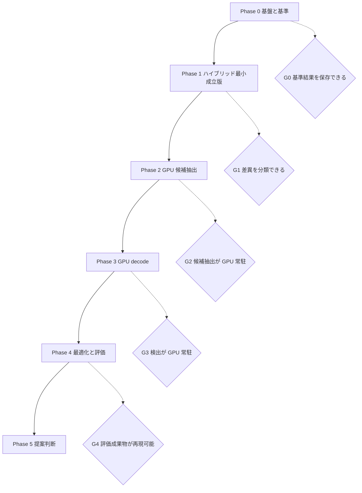
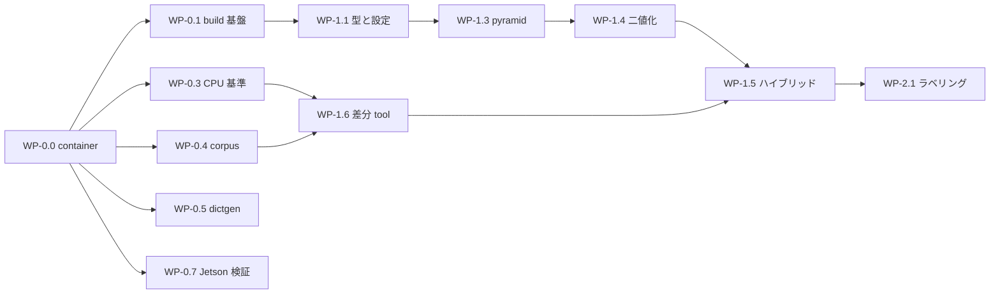

# 実装計画

## 目的

[ロードマップ](roadmap.md) の Phase 定義を、着手可能な作業単位、成果物、完了条件、依存関係へ分解し、設計・実装・評価を同じ前提で進められる状態にします。

## 対象範囲

Phase 0 から Phase 4 までの作業単位、repository 構成、開発 container 環境、検証戦略、評価計画への追加提案、リスクを対象とします。Phase 5 の upstream 提案作業は判断条件のみを扱います。日程と担当は対象外です。

## 現状

- Phase 0 の全作業単位 WP-0.0 から WP-0.7 が完了しました。開発 container、CMake build 基盤、`ctest`、Compute Sanitizer 経路、format と静的解析、CPU 基準 runner、合成 corpus 生成器、Dictionary 変換 tool、benchmark harness が DGX Spark と Jetson AGX Orin の両方で動作します。
- core は build 基盤の疎通確認に必要な最小構成のみです。CUDA 検出器、adapter、benchmark harness、データセットはありません。
- 開発機は DGX Spark GB10 です。実測値と build baseline の決定案は [ADR-0002](adr/0002-toolchain-and-target-baseline.md) にまとめています。
- Jetson Orin 実機はこの環境から参照できていません。JetPack version と power mode は未確認です。
- 開発機に OpenCV、`clang-format`、`ninja` が install されていません。`compute-sanitizer` は使用できます。これらは host へ直接 install せず、開発 container 側で供給します。
- Docker 28.3.3、Docker Compose v2.39.1、NVIDIA Container Toolkit 1.18.0 が利用可能で、`nvidia` runtime が登録済みです。
- 開発 container 環境は `dgx-spark` profile を構築済みで、CUDA Toolkit を image へ固定する `pinned` mode と host から mount する `mounted` mode の両方で環境検査と smoke test が合格しています。設計は [Docker 環境設計](design/docker-environment.md) を参照してください。
- 互換対象である OpenCV 4.x の ArUco3 経路の観測仕様は [検出パイプライン設計](design/detector-pipeline.md) に記録済みです。

### 着手前の blocker

| ID | blocker | 解消方法 | 影響する作業単位 |
| --- | --- | --- | --- |
| B1 | OpenCV が開発機に無い | WP-0.0 の image へ 4.14.0 を commit 固定で build して含める。`dgx-spark` profile で解消済み | WP-0.2 以降のほぼ全て |
| B2 | Jetson Orin の環境が未確認 | 実機の JetPack、CUDA、power mode を確認し ADR-0002 の未確定事項を閉じる。解消済み | WP-0.7、WP-4.4 |
| B3 | `clang-format` が無い | WP-0.0 の `dgx-spark` profile へ含める。解消済み | WP-0.1 |
| B4 | test corpus と ground truth が無い | WP-0.4 で生成器を作る | Phase 1 以降の正確性評価 |

B1 と B3 を host への直接 install ではなく container で解消するのは、DGX Spark と Jetson Orin で同じ手順を使い、測定結果へ環境情報を機械可読形式で残すためです。

B2 は WP-0.7 で解消しました。実機は Jetson AGX Orin Developer Kit、L4T R35.4.1 (JetPack 5.1.2)、CUDA 11.4 です。CUDA Toolkit の最低 version を 11.4 とする決定は [ADR-0002](adr/0002-toolchain-and-target-baseline.md) に記録しました。

## 目標

### 全体構成



### repository 構成案

```
ArUco3-CUDA/
├── CMakeLists.txt             作成済み
├── CMakePresets.json          作成済み。profile ごとの architecture を切り替える
├── cmake/                     作成済み。build option、警告、Compute Sanitizer target
├── docker/                    開発 container。profile ごとの image と環境検査 script
├── include/aruco3cuda/        公開 header。OpenCV へ依存しない
│   └── opencv/                adapter の公開 header
├── src/
│   ├── core/                  作成済み。kernel と host 制御。段階ごとに file を分ける
│   ├── util/                  作成済み。CUDA にも OpenCV にも依存しない共通処理
│   ├── dictionary/            作成済み。packed table と照合。generated/ は生成物
│   ├── dictionary/            packed table と loader
│   └── adapter/opencv/        cv::Mat / cv::cuda::GpuMat 変換
├── tools/
│   ├── dictgen/               作成済み。OpenCV から packed codeword を生成する
│   ├── corpusgen/             作成済み。ground truth 付き合成画像生成器
│   └── report/                作成済み。差異分類と集計
├── hybrid/                    作成済み。案 C のハイブリッド経路
├── reference/                 作成済み。OpenCV CPU 基準 runner
├── bench/                     作成済み。測定 harness と集計 script
├── test/
│   ├── unit/                  型、設定検証、kernel 単体
│   ├── conformance/           Dictionary 互換
│   ├── differential/          CPU 基準との差分
│   └── robustness/            異常入力、境界値、overflow
├── data/manifest/             データセットの所在と checksum のみ
└── docs/
```

大容量の画像と動画は repository へ commit せず、`data/manifest/` に保存先と checksum を記録します。

### 作業単位

`規模` は相対的な目安であり、日程ではありません。日程は [ロードマップ](roadmap.md) の未確定事項のままです。

#### Phase 0: 基盤と基準

| ID | 内容 | 成果物 | 完了条件 | 依存 | 規模 |
| --- | --- | --- | --- | --- | --- |
| WP-0.0 | 開発 container。CUDA Toolkit の供給を pinned と mounted から選べる 2 profile、環境検査 script、環境情報記録 script、環境 smoke test | `docker/**`、[Docker 環境設計](design/docker-environment.md) | `dgx-spark` profile の image が build でき、`verify-environment.sh` と `smoke-test.sh` が合格する。`jetson-orin` profile は WP-0.7 で確認する | - | M |
| WP-0.1 | CMake project、C++17、`sm_87` と `sm_121`、warning、`clang-format`、静的解析、`ctest` 骨格 | `CMakeLists.txt`、`CMakePresets.json`、`cmake/**`、`.clang-format`、`.clang-tidy` | 空 library と smoke test が両 architecture 向けに build でき `ctest` が通る。達成済み | WP-0.0 | M |
| WP-0.2 | OpenCV 4.14.0 の commit 固定 build と provenance 記録 | `docker/scripts/build-opencv.sh`、image 内 provenance JSON | 再現可能に build でき、version と commit が環境情報 JSON へ出力される | WP-0.0 | S |
| WP-0.3 | CPU 基準 runner | `reference/**`、`aruco3cuda_reference_runner` | 同一入力に対し決定的な ID と四隅、および環境情報を保存できる。達成済み | WP-0.2 | M |
| WP-0.4 | 合成 corpus 生成器 | `tools/corpusgen`、manifest | seed 固定で再生成でき、四隅の ground truth を持つ corpus が得られる。達成済み | WP-0.2 | M |
| WP-0.5 | Dictionary 変換 tool と互換テスト | `tools/dictgen`、`src/dictionary`、生成 table | [Dictionary 方針](dictionaries.md) の検証 1 から 5 が自動テストで通る。達成済み | WP-0.2 | M |
| WP-0.6 | benchmark harness 骨格 | `bench/**`、`aggregate.py` | CPU 経路の p50・p95・p99 と環境情報を機械可読形式で保存できる。達成済み | WP-0.3、WP-0.0 | M |
| WP-0.7 | Jetson Orin profile の実機検証 | `docker/.env` の既定値確定、[ADR-0002](adr/0002-toolchain-and-target-baseline.md) の更新 | Jetson 実機で image が build でき、環境検査が合格し、CUDA Toolkit の最低 version が確定する。達成済み | B2、WP-0.0 | M |

G0 の完了条件: 同一入力に対する CPU 基準結果と環境情報を保存でき、CUDA 側の空実装が両 profile の container 内で build とテストを通ること。**達成済み**。

規約準拠の作業後に P0 の検証を全項目やり直し、結果が変わっていないことを確認しました。

| 検証項目 | 再検査の結果 |
| --- | --- |
| 環境検査 | 両機で全項目合格 |
| build | DGX Spark で `sm_87` と `sm_121`、Jetson で `sm_87` |
| `ctest` | 両機 155 件。Compute Sanitizer 込みで 159 件 |
| smoke test の四隅 | `(399.57, 259.57)` と `(559.43, 419.43)`。両機一致、当初の記録と一致 |
| `fxfy` と segmentation | 0.3333、427x240。当初の記録と一致 |
| corpus の checksum | `clean_1280x720_n1_s128` が `ac79179c8e8b`。当初の記録と一致 |
| Dictionary の生成物 | `dictgen --check` が byte 単位で一致 |
| CPU 経路の測定値 | Jetson は一致。DGX Spark の ArUco3 無効のみ変化。原因は測定条件の固定不足であり、下記に記録した |

corpus の manifest は `schema_version` を 2 へ上げました。単位を名前へ示す規約に合わせて key を改名したため破壊的変更です。benchmark の JSONL は現在 3 です。2 で測定条件の項目を追加し、3 で段階時間を追加するとともに CPU 経路の測定区間から画像の読み込みを外しました。

WP-0.7 で判明し修正した、実機でしか現れない問題を記録します。

| 問題 | 症状 | 対応 |
| --- | --- | --- |
| 環境検査が `nvidia-smi` に依存していた | Jetson には `nvidia-smi` が無く、正常な環境で不合格になる | device 確認を CUDA runtime API の probe へ置き換えた |
| Tegra の device node に権限が無い | `libcuda.so.1` は見えるのに `cudaGetDeviceCount` が `NvRmMemInitNvmap failed with Permission denied` で失敗する | 非 root 実行の container へ video と debug の補助 GID を付与した |
| `nvpmodel` が container に無い | 評価計画が必須とする power mode が空のまま記録される | 状態 file と定義 file を mount し、取得元の差を script へ集約した |
| Docker が `/sys/firmware` を mask する | 基板名を取得できない。Orin は AGX と NX で性能が大きく異なる | device tree の model file を個別に mount した |
| `jetson-orin` の test preset が無い | `ctest --preset jetson-orin` が preset 一覧を表示して終わる | 全 configure preset に build と test preset を対応させた |

WP-0.1 の検証結果は次のとおりです。`libaruco3cuda.a` に `sm_87` と `sm_121` の両方の code が含まれることを `cuobjdump --list-elf` で確認しています。

| 確認項目 | 結果 |
| --- | --- |
| `sm_87` と `sm_121` の同時 build | 成功 |
| `ctest` | 12 件全て合格 |
| Compute Sanitizer 4 mode を含む `ctest` | 16 件全て合格 |
| `format-check` | 差分なし |
| `clang-tidy` | 指摘なし |

WP-0.3 の検証結果は次のとおりです。

| 確認項目 | 結果 |
| --- | --- |
| 合成マーカーの検出 | ID と四隅が描画位置と 1 pixel 以内で一致 |
| 決定性 | `--omit-timing` 指定時、同一入力から byte 単位で同じ JSON |
| ArUco3 の縮小率 | 1280x720、`S=32`、`tau_i=0.05` で `fxfy=0.3333`、segmentation 427x240 |
| ArUco3 の効果 | 同一画像・同一検出結果で 5.917 ms から 1.112 ms |
| `ctest` | 35 件全て合格。Compute Sanitizer を含めて 39 件 |

`rotation` は OpenCV の `detectMarkers` が独立した値として返さないため、出力へ含めていません。marker rotation は四隅の並び順として表現されるため、比較は四隅の順序で行います。

WP-0.4 と WP-0.5 の検証結果は次のとおりです。

| 確認項目 | 結果 |
| --- | --- |
| corpus の決定性 | 同じ seed から manifest と画像 checksum が一致 |
| ground truth の妥当性 | CPU 基準実装の検出結果と四隅が 1.5 pixel 以内で一致 |
| Dictionary 適合性 | 250 ID 全 4 回転の codeword が OpenCV の `bytesList` と一致 |
| Dictionary 訂正境界 | bit 反転に対する accept / reject が OpenCV の `identify()` と一致 |
| 最小 Hamming 距離 | 再計算値 12。公称値と一致 |
| 生成物の再現性 | `dictgen --check` が既存 file と byte 単位で一致 |
| `ctest` | 61 件全て合格。Compute Sanitizer を含めて 65 件 |

WP-0.6 と WP-0.7 の実測結果は次のとおりです。1280x720、マーカー 4 個、OpenCV thread 1、CPU 経路、遅延 200 回、独立した process として 5 回実行した結果です。CPU は性能 core へ固定しています。

| 機体 | 条件 | fxfy | p50 中央値 | p50 範囲 | p95 | p99 | throughput |
| --- | --- | --- | --- | --- | --- | --- | --- |
| DGX Spark GB10 | ArUco3 有効 (`tau_i = 0.05`) | 0.3333 | 2.198 ms | 2.198 - 2.202 (0.2%) | 2.204 ms | 2.206 ms | 455 frame/s |
| DGX Spark GB10 | ArUco3 無効 | 1.0000 | 7.035 ms | 6.998 - 7.169 (2.4%) | 7.647 ms | 7.714 ms | 142 frame/s |
| Jetson AGX Orin | ArUco3 有効 (`tau_i = 0.05`) | 0.3333 | 4.387 ms | 4.382 - 4.389 (0.1%) | 4.423 ms | 4.492 ms | 228 frame/s |
| Jetson AGX Orin | ArUco3 無効 | 1.0000 | 13.432 ms | 13.392 - 13.476 (0.6%) | 13.695 ms | 14.080 ms | 74 frame/s |

検出結果は全条件で 4 個と一致します。ArUco3 検出戦略の効果は DGX Spark で 3.2 倍、Jetson AGX Orin で 3.1 倍です。同一条件での機体差は Jetson を基準として DGX Spark が約 0.5 倍の時間です。Jetson の power mode は MAXN、GPU 最大 clock は 1300 MHz です。

これらは CPU 基準側の値であり、CUDA 経路との比較は Phase 1 以降に行います。

#### 測定条件を固定しないと値が再現しない

規約準拠の作業後に P0 の測定値を再検査したところ、DGX Spark の ArUco3 無効の値が当初記録した 7.570 ms から動きました。原因を調べた結果、追加した検証処理ではなく測定条件の固定不足でした。追加した `validate_config` の費用は 1 回あたり 20.7 ns であり、7 ms の検出に対して 0.0003% です。

判明した要因は 2 つです。

**CPU core の種別**: DGX Spark GB10 は Cortex-X925 が 10 個 (cpu 5-9、15-19、最大約 4.0 GHz) と Cortex-A725 が 10 個 (cpu 0-4、10-14、最大約 2.86 GHz) の混成です。同じ条件でも効率 core へ割り当てられると 1.64 倍遅くなります。core を固定しない測定は、割り当て次第で二極化します。Jetson AGX Orin は Cortex-A78AE 12 個の均一構成であり、この影響を受けません。当初の Jetson の値が再測定でも一致したのはこのためです。

**address space の無作為化 (ASLR)**: 全解像度を扱う CPU 経路では、process ごとの memory 配置の違いだけで p50 が 9% 変動します。`setarch -R` で無効化すると 8 回の実行が完全に同じ値になることを確認しました。1 回の実行内の分位点はこの変動を捉えません。

対応として、benchmark harness へ `--cpu-list` を追加し、CPU の core 構成、実際の親和性、ASLR の状態を測定結果へ記録するようにしました。`aggregate.py` は同一条件の複数実行をまとめ、実行間ばらつきを表示します。

合成マーカーの検出四隅は DGX Spark と Jetson AGX Orin で一致しました。CPU 基準実装の結果が機体に依存しないことを示します。

ArUco3 が検出対象とする最小辺長は `tau_i` そのものではなく `S + L * tau_i` で決まります。`S` は `minSideLengthCanonicalImg`、`L` は画像の長辺です。1280x720、`S = 32`、`tau_i = 0.05` の場合は 96 pixel が下限であり、実測では 96 pixel は検出されず 128 pixel は検出されました。corpus の manifest は各マーカーの `side_ratio` を記録し、どの `tau_i` で検出対象になるかを後から判断できるようにしています。

#### Phase 1: ハイブリッド最小成立版

WP-1.6 の差分レポート tool は、CPU 基準と評価対象を同じ画像へ適用し、差異を未検出・過検出・ID 不一致・rotation 不一致・四隅ずれの 5 種類へ分類します。対応付けは ID ではなく重心の近さで行います。ID で対応を取ると、ID を読み違えた場合に未検出と過検出が 1 件ずつ計上され、実際に起きたこと (同じマーカーの ID を誤った) が読み取れなくなるためです。rotation 不一致は、四隅の並びを巡回させると許容差内に収まる場合として判定します。OpenCV の `detectMarkers` は回転量を返さず、回転を四隅の並びへ畳み込むため、この判定が回転の差を見る唯一の手段になります。

WP-1.5 の案 C ハイブリッド経路は、GPU で pyramid・segmentation・適応的二値化を行い、二値化画像と pyramid を host へ戻して、候補抽出から decode までを CPU で行います。合成 12 場面 x 設定 3 通り (ArUco3 有効、OpenCV 既定、OpenCV 既定 + subpixel 補正) の計 36 比較で、CPU 基準との差は未検出 0、過検出 0、四隅の最大差 0.0000 pixel でした。DGX Spark と Jetson AGX Orin の双方で同じ結果です。

四隅が一致するには、近接候補の grouping を OpenCV と同じにする必要がありました。適応的二値化は window を 3 通り試すため、同じマーカーから少しずつ違う候補が得られます。OpenCV は識別の前に候補を周長の降順へ並べ、近接するものを 1 グループにまとめ、グループ内で最大周長の候補を代表に選びます。当初はこの grouping を省き識別後に ID と位置で重複を落としていましたが、最小 window 由来の小さい候補が残るため四隅が内側へ寄り、原寸へ戻した時点で 7.9 pixel の差になりました。OpenCV と同じ grouping、包含関係の木、親候補の識別打ち切りまで実装した結果、差は 0 になりました。この作業は当初 WP-2.5 に置いていたものを前倒ししたものです。

あわせて、OpenCV が `useAruco3Detection` 有効時に補正方法の指定を `CORNER_REFINE_SUBPIX` へ上書きすることを実装へ反映し、ArUco3 無効時の subpixel 補正 (window をセル 1 辺から決める経路) も実装しました。

WP-1.1 では [公開 API 草案](design/public-api.md) の未確定事項を 3 件解決しました。公開 aggregate の field にも末尾 `_` を付けること、検証は `Status` を返し理由を任意の out 引数で受け取ること、画像の失敗に `kInvalidImage` を割り当てることです。

WP-1.4 の適応的二値化は OpenCV の `adaptiveThreshold` と完全に一致しました。3 通りの window と 3 種類の画像寸法、5 種類の定数のいずれでも不一致は 0 です。行方向と列方向へ分けて合計するため中間で丸めが入らず、2 次元の総和と同じ値になります。

あわせて WP-1.3 で受け入れた resize の 1 階調差の下流影響を実測しました。1280x720 を 427x240 へ縮小して二値化した場合、画素の白黒が入れ替わる割合は 0.039% から 0.054% です。無作為な 1 階調の付加を仮定した見積もり 0.45% の 10 分の 1 に収まりました。実際の差は構造を持ち、局所平均も同じ方向へ動くためです。

WP-1.3 では pyramid が OpenCV の `buildPyramid` と全 level で完全一致しました。segmentation は最大 1 階調の差が残ります。OpenCV の 8-bit `INTER_LINEAR` が `softdouble` と `ufixedpoint16` による bit exact 経路であり、kernel 内での再現にこの 2 つの数値型の移植が必要になるためです。差の影響と扱いは [検出パイプライン設計](design/detector-pipeline.md) に記録しました。

WP-1.2 の workspace は bump pointer 方式の arena です。段階ごとの buffer をここから切り出し、フレームの先頭で `reset()` を呼びます。`allocate()` は容量が足りなくても自動で拡張しません。自動拡張はフレームごとの確保を招き、規約が避けよと定める状態を静かに作るためです。容量は `ensure_capacity()` で初期化時に確保します。

完了条件は統計で確認します。100 フレーム分の `reset()` と切り出しを繰り返しても `allocation_count_` が 1 のまま、`reallocation_count_` と `exhausted_count_` が 0 のままであることをテストで固定しました。`MemorySpace` を引数に取るため、評価計画が求める device、pinned host、managed の 3 経路を同じ arena の実装で測れます。

| ID | 内容 | 成果物 | 完了条件 | 依存 | 規模 |
| --- | --- | --- | --- | --- | --- |
| WP-1.1 | 公開型、設定、`validate()` | `include/aruco3cuda/{types,config}.hpp`、`src/core/{types,config}.cpp` | 設定の矛盾と不正な画像 view を境界で拒否するテストが通る。達成済み | WP-0.1 | S |
| WP-1.2 | workspace 所有と再確保統計 | `include/aruco3cuda/workspace.hpp`、`src/core/workspace.cpp` | フレームごとの確保が発生しないことをテストで確認できる。達成済み | WP-1.1 | M |
| WP-1.3 | S1 pyramid と S2 segmentation の kernel | `src/core/preprocess.{hpp,cu}` | OpenCV の縮小結果との差が定めた許容内に収まる。達成済み | WP-1.2 | M |
| WP-1.4 | S3 適応的二値化 kernel | `src/core/threshold.{hpp,cu}` | 3 通りの window size で CPU 基準の二値化と一致率が許容内。完全一致を達成 | WP-1.3 | M |
| WP-1.5 | 案 C ハイブリッド経路 | `hybrid/hybrid_detector.{hpp,cpp}` | 合成画像の基本条件で ID と四隅を取得できる。36 比較で四隅の差 0.0000 pixel を達成 | WP-1.4、WP-0.3 | M |
| WP-1.6 | 差分レポート tool | `tools/report` | 差異を未検出・過検出・ID 不一致・rotation 不一致・四隅ずれへ分類できる。達成済み | WP-1.5 | S |

G1 の完了条件: 合成画像の基本条件で ID と四隅を取得でき、CPU 基準結果との差異が分類できること。**達成済み**。ID と四隅は WP-1.5 で取得でき、差異の分類は WP-1.6 の `aruco3cuda_report` が行います。合成 corpus に対する一致は `cli.report.matches_reference` として ctest へ登録し、差異が出れば test が失敗します。

#### Phase 2 完了後に前倒しした測定

Phase 3 へ進む前に、hybrid 経路を測定 harness へ配線して CPU 基準と比べました。Phase 4 の WP-4.5 に予定していた crossover 報告の一部を前倒ししたものです。理由は、Phase 2 まで進んだ時点で end-to-end の比較が 1 つも無く、CUDA 化に投資を続ける判断材料が無かったためです。

このとき、既存の CPU 測定が検出時間を測っていないことが分かりました。`measure_image` が 1 反復ごとに `cv::imread` と `sha256_file` を呼んでおり、測定区間の 58% から 85% が PNG の復号でした。読み込みを初期化側へ移し、`schema_version` を 3 へ上げています。version 2 以前の結果は同じ key が違う区間を指すため、混ぜて集計できません。

測定に使う CPU core の種別も取り違えていました。DGX Spark の CPU 0 は効率 core (Cortex-A725) であり、性能 core (Cortex-X925) で測り直すと CPU 経路は約 2 倍速くなります。効率 core で測ると GPU 側の優位が実際より大きく見えます。3840x2160 で 2.17 倍と 1.45 倍の差があり、結論の印象が変わります。

3 機を性能 core で測った結果、hybrid の優位は限定的でした。DGX Spark と RTX 5070 Ti はいずれも比 0.69 から 0.99 で、最良でも 1.45 倍です。転送を測定区間へ含めるとほぼ消えます。Jetson Orin では全条件で CPU が速く、比は 1.19 から 2.00 です。GPU 段を kernel 実行と host への転送へ分けて測ると、転送が 58% から 92% を占めます。1499 KB を 8 回の同期転送で戻しており、decode が CPU にあるためだけに発生する費用です。kernel 実行そのものは DGX Spark で 0.083 ms、RTX 5070 Ti で 0.033 ms しかありません。現在の測定は hybrid という中間形態に支配されており、GPU 経路の実力を示していません。Phase 3 で decode を GPU へ移すことを優先します。詳細と判断は [benchmark 報告](benchmark-report.md) にあります。

#### Phase 2: GPU 候補抽出

WP-2.1 のラベリングは 8 近傍とします。OpenCV の `findContours` が前景を 8 連結として辿るためであり、4 近傍にすると対角にのみ接する前景が別成分になって候補が割れます。label は root の線形 index の昇順に 0 起点の連番で振ります。atomics の到着順に依存する採番だと実行ごとに label が変わり、下流の結果を比較できません。

WP-2.2 の統計配列は label 数の上限 `ceil(W/2) * ceil(H/2)` で確保します。8 近傍では別成分どうしが縦横斜めのいずれでも接せないため、1 画素飛ばしの配置が上限になります。上限で確保すれば溢れが起きず、統計の側に溢れの経路を持たなくて済みます。

WP-2.3 の四隅推定は、合成図形で回転 6 通りの正方形に対し最大 0.48 pixel の差でした。射影で歪んだ四角形、穴を持つ枠、複数成分でも 1.5 pixel 以内です。直線の片側に点が無い成分は四隅が定まらないため無効とします。1 画素の成分と幅 1 画素の直線がこれにあたります。

WP-2.4 の四角形らしさの判定には 2 つの比が要ります。内側比 (成分画素が推定四角形へ収まる割合) だけでは L 字 0.94 と十字 0.85 を落とせず、辺の裏付け (各辺の近くにある成分画素の数) だけでは円 4.97 を落とせません。通すべき形は内側比 0.875 以上かつ辺の裏付け 2.52 以上、落とすべき形は内側比 0.665 以下または辺の裏付け 1.71 以下であり、既定値をその間に置きました。

WP-2.6 の比較では、ArUco3 有効時に案 A と案 C の候補集合が完全に一致しました。四隅の差はぼけを加えた場面の 1.414 pixel が最大です。速度は場面によって優劣が入れ替わり、素の場面では案 C が 3 倍、noise を含む場面では案 A が 3 倍速くなります。案 A の時間が場面の内容にほとんど依らないことが決定の主な理由です。詳細と撤回条件は [ADR-0003](adr/0003-candidate-extraction-approach.md) にあります。

| ID | 内容 | 成果物 | 完了条件 | 依存 | 規模 |
| --- | --- | --- | --- | --- | --- |
| WP-2.1 | S4 連結成分ラベリング | `src/core/labeling.{hpp,cu}` | 既知 label 画像に対し CPU 実装と label 集合が一致する。達成済み | WP-1.4 | L |
| WP-2.2 | label 統計の集計 | `src/core/labeling.{hpp,cu}` | bbox、pixel 数、重心が CPU 集計と一致する。達成済み | WP-2.1 | S |
| WP-2.3 | S5 極点探索による四隅推定 | `src/core/quad_extract.{hpp,cu}` | 合成マーカーで四隅を許容誤差内に推定できる。回転正方形で最大 0.48 pixel | WP-2.2 | L |
| WP-2.4 | S6 フィルタと compaction と overflow | `src/core/candidate_filter.{hpp,cu}`、`scan.{hpp,cu}` | 上限超過時に `kCandidateOverflow` を返し結果を打ち切ることをテストで確認できる。達成済み | WP-2.3 | M |
| WP-2.5 | 近接候補の統合 | `src/core/candidate_group.{hpp,cu}` | CPU 基準の grouping との差異を分類できる。達成済み | WP-2.4 | S |
| WP-2.6 | 案 A と案 C の比較 spike | `test/reference/test_candidate_comparison.cpp`、[ADR-0003](adr/0003-candidate-extraction-approach.md) | 差異と速度の両面から主案を決定し ADR へ記録する。達成済み | WP-2.5、WP-1.6 | M |

G2 の完了条件: 候補抽出まで GPU 常駐で完結し、CPU 基準との差異を分類でき、案の選択が ADR に記録されていること。**達成済み**。候補抽出は二値化画像を host へ戻さずに完結します。差異は `CandidateComparisonTest.plan_a_versus_plan_c` が場面ごとに分類して表へ出します。案の選択は [ADR-0003](adr/0003-candidate-extraction-approach.md) に記録しました。

#### Phase 3: 射影変換の一致度

WP-3.1 で S7 を実装しました。OpenCV との一致を確かめる過程で、**OpenCV 自身が機種間でビット一致しない**ことが分かりました。`warpPerspective` の `INTER_NEAREST` には経路が 3 つあり、aarch64 では NEON の積和融合を使う SIMD 経路、x86_64 では融合しない SSE4.1 経路が選ばれます。同じ入力に対する canonical 画像の SHA256 が 2 機で異なることを実測しました。

本実装は融合しない側へ合わせています。x86_64 の OpenCV とは 40960 画素中 0 画素、aarch64 の OpenCV とは 1 画素が異なります。詳細は [検出パイプライン設計](design/detector-pipeline.md) にあります。

#### Phase 3 の前に前倒しした最適化 (WP-4.1 の一部)

転送が GPU 段の 58% から 92% を占めるという測定を受け、hybrid 経路の転送を先に最適化しました。8 回の同期転送を stream 上の非同期転送へ変え、受け取り先を pinned memory にしています。

計画では WP-4.1 を WP-3.6 依存としていました。完全 GPU 経路を前提にした依存であり、hybrid 経路の転送には当てはまりません。

正確性は不変です (36 比較で四隅の差 0.0000 pixel)。1280x720 マーカー 4 枚での比は次のように変わりました。

| 機体 | 最適化前 | 最適化後 |
| --- | --- | --- |
| DGX Spark GB10 | 0.91 | 0.54 |
| RTX 5070 Ti | 0.92 | 0.48 |
| Jetson AGX Orin | 2.00 | 1.22 |

GPU 段のうち kernel 実行は DGX Spark で 0.099 ms、GPU 段全体は 0.206 ms です。残り半分は依然として転送であり、Phase 3 で decode を GPU へ移せば消えます。

#### WP-3.2 の実測

セル比と border 検証を GPU へ移しました。判定は Otsu の閾値と標準偏差の境界で CPU と一致します。

| 機体 | HAL | 比の不一致セル | border 誤り数の不一致 |
| --- | --- | --- | --- |
| DGX Spark GB10 | carotene + KleidiCV | 0 / 4096 | 0 / 64 |
| Jetson AGX Orin | carotene + KleidiCV | 0 / 4096 | 0 / 64 |
| RTX 5070 Ti | IPP | 0 / 4096 | 0 / 64 |

WP-3.1 の射影変換と違い、機種差が出ませんでした。Otsu の入力は 8-bit の histogram であり、平均と分散も整数の和から求めるため、SIMD 経路の積和融合が結果へ届く場所がないためです。丸めが効くのは histogram から閾値を求める倍精度の漸化式だけで、ここは OpenCV も scalar で計算します。

同じ理由で `cell_decode.cu` も `-fmad=false` で compile しています。融合を許すと分散が `minOtsuStdDev` の境界でずれ、低分散の分岐へ入るかどうかが変わります。

#### WP-3.3 の実測

Dictionary 照合を GPU へ移しました。全 250 ID の 4 回転 (1000 件) で、CPU 基準とも OpenCV とも ID・回転・距離が完全に一致します。3 機すべてで同じ結果です。

比が閾値の近くにある場合を別に検証しました。1000 件のうち 233 件が「黒とも白とも決まらないセル」を含み、61 件が不採用になります。ここも不一致 0 です。

実装にあたり、OpenCV の `Dictionary::identify` に 2 つの見落としやすい規則があることが分かりました。

**セル比は 1 つの bit 列へ潰せません。** OpenCV は「黒ではない」(比 > 閾値) と「白ではない」(比 < 1 - 閾値) の 2 つの mask を作ります。既定の閾値 0.49 では、0.49 より大きく 0.51 より小さい比が両方に立ち、bit が 0 でも 1 でも誤りとして数えられます。1 つの bit 列へ潰すとこの第 3 の状態が消えます。誤り数は次の式で分岐なしに求まります。

```
誤り = not_black ^ ((not_black ^ not_white) & codeword)
```

**最小距離の ID ではなく、条件を満たした最初の ID を採ります。** OpenCV は ID の昇順に見て、許容距離を満たした時点で `break` します。DICT_ARUCO_MIP_36h12 は収録間の最小距離が 12、許容距離が 3 なので両者は一致しますが、規則としては別物です。既存の `match_dictionary` は最小距離を返すため、検出経路には新しい `identify_marker` を使います。GPU 側は満たした ID の `atomicMin` で同じ結果を得ます。

#### WP-3.4 の実測と、S9 の正体

**OpenCV に「重複除去」という段階は存在しません。** `detectMarkers` を全行読み、`identifyCandidates` より後に走るのは corner refinement、Multi dictionary 専用の rejected 掃除、fxfy の逆スケール、出力の複製だけであることを確認しました。ID による重複除去はどこにもありません。同じ ID のマーカーが離れた位置に 2 枚あれば 2 件とも出ます。

重複が消えるのは**包含木による識別の打ち切り**の結果です。黒枠の外周と内周が両方候補になるため、内側でマーカーが見つかったら、それを囲む候補は識別せずに済ませます。WP-3.4 で GPU 化したのはこの機構です。

| 検証 | 結果 |
| --- | --- |
| 包含判定 対 `cv::pointPolygonTest` | 400 組で不一致 0 (うち凹な四角形 283 件) |
| 木と打ち切り 対 CPU 基準 (乱数の入れ子鎖) | 60 通りで不一致 0 (打ち切りが起きた 28 件) |
| 木と打ち切り 対 CPU 基準 (乱数の森) | 80 通りで不一致 0 (枝分かれ 39 件、二重計上 8 件) |

外さずに実装する必要があった規則は 4 つです。

1. **`parent[i]` は `j < i` を満たす最大の j**。最小ではありません。index は周長の降順なので、「囲むもののうち最も内側」という意味になります。
2. **段数の伝播は index の降順**。並列にすると、まだ確定していない段数を読みます。
3. **包含判定は `pointPolygonTest` の crossing number をそのまま移す**。境界 (戻り値 0) は内側です。極点探索で作る四角形は凹になりうるため、凸性を仮定した符号一致では代用できません。交差積は 64 bit 整数で計算します。
4. **到達数の二重計上を保つ**。祖先として数えた候補を、自分の段に来たときもう一度数えます。これは打ち切りを早める方向に働くため、「候補単位の厳密な抑止」へ書き換えると結果が変わります。

実装後に 4 観点の敵対的レビューを掛け、23 件の指摘のうち 11 件を確定として反映しました。主なものは workspace 必要量の doc が実際と 768 から 8192 byte 違っていたこと、および上記 4 規則のうち 2 つが「わざと壊しても test が通る」状態だったことです。**7 種類の変異を実際に注入し、すべてが test で捕まることを確認しています。**

#### WP-3.5 の実測と、反復解法をどう検証したか

S10 は `cv::cornerSubPix` の反復解法をそのまま再現する段です。これまでの段と違い、**浮動小数の演算順序が結果へ離散的に効きます**。1 ULP の差が反復回数を 1 回変え、収束不良で初期位置へ戻す分岐の採否を反転させます。後者は窓の半径 (5) だけ四隅を動かします。

そのため検証を 2 段に分けました。

**第 1 の gate: 写し間違いが無いこと。** `cv::cornerSubPix` と `cv::getRectSubPix` を host へ逐語で写した oracle を test 内に置き、GPU がそれと bit 一致することを要求します。oracle は `-ffp-contract=off` で compile し、GPU 側の `-fmad=false` と同じ意味論にします。行列式が 0 に近くなる退化した入力を含めて **3 機すべてで 128/128 が bit 一致**しました。

**第 2 の gate: OpenCV との差。** 実際の `cv::cornerSubPix` との差は機種で変わります。

| 入力 | DGX Spark GB10 (aarch64) | Jetson AGX Orin (aarch64) | RTX 5070 Ti (x86_64) |
| --- | --- | --- | --- |
| 実運用に近い場面 (16 隅) | 16/16 一致 | 16/16 一致 | 12/16、最大 0.000031 px |
| 初期位置を ±1 ずらす (96 隅) | 96/96 一致 | 96/96 一致 | 96/96 一致 |
| 退化を含む ±6 (128 隅) | 91/128、最大 6.72 px | 91/128、最大 6.72 px | 123/128、最大 0.012 px |

退化した入力で aarch64 の最大差が 6.72 px に達するのは、収束不良の判定が反転したためです。窓の半径 5 の段で戻すか戻さないかが分かれ、段を 1 つ登るときに 2 倍されます。これは丸めの差が離散的な分岐へ増幅された結果であり、実装の誤りではありません。同じ入力で oracle とは bit 一致しています。

実運用に近い入力では 3 機とも RMSE 0.000012 px 以下であり、完了条件を満たします。

#### 仕様のうち見落としやすい点

- **窓の半径は設定ではなく段の大きさで決まります。** OpenCV は ArUco3 経路で `max(段の幅, 段の高さ) > 1080 ? 5 : 3` とします。`cornerRefinementWinSize` と `relativeCornerRefinmentWinSize` は ArUco3 が無効な経路でしか使われません。
- **pyramid は縮小前の原寸から作ります。** `buildPyramid` は segmentation 画像へ縮小する**前**の画像に対して呼ばれます。段 0 が原寸であるため、段を登り切った時点で四隅は原寸の座標になります。
- **`fxfy` の逆数を掛けてはいけません。** 逆スケールの分岐 (`cornerRefinementMethod != CORNER_REFINE_SUBPIX && fxfy != 1.f`) は、ArUco3 有効なら第 1 項が偽、無効なら `fxfy` が厳密に 1 なので第 2 項が偽であり、到達しません。
- **`getRectSubPix` は素直な双一次補間ではありません。** 1 行を左から右へ辿り、直前の項に `(1-a)/a` を掛けて持ち回ります。数学的には同じですが丸めが積み上がるため、双一次の式で置き換えると値が変わります。
- **誤差は単精度で求めてから倍精度へ広げます。** `err = (cI2.x-cI.x)*(cI2.x-cI.x) + ...` は float 演算であり、その結果が `double err` へ入ります。

#### WP-3.6 の実測: 全経路が繋がった

S1 から S10 を 1 本に繋いだ公開 API の検出器を作りました。**GPU 経路だけで OpenCV と同じ検出結果が出ます。**

| 項目 | 結果 |
| --- | --- |
| OpenCV との四隅の差 | 3 機とも **0.0000 px** |
| detect_async の発行時間 | 0.19 から 0.42 ms |
| workspace | 13.5 MB、確保は **1 回だけ** |

完了条件の「host 同期なしで参照できる」は、**実際に同期していないことを test で証明**しました。専用 stream へ 800 ms 前後を占有する kernel を先に積み、その後ろへ `detect_async` を積んで、戻った直後の `cudaStreamQuery` が `cudaErrorNotReady` を返すことを確かめています。発行に掛かるのは 0.2 ms 前後で、占有の完了までの時間の半分未満であることも併せて要求しています。

#### 設計で決めたこと

**支持する設定の組み合わせを 2 つに絞りました。**

| `use_aruco3_detection_` | `corner_refine_method_` | 可否 |
| --- | --- | --- |
| true | kSubpix | 可。四隅は原寸 |
| false | kNone | 可。縮小しないため原寸 |
| true | kNone | **拒否**。四隅が縮小後の座標のまま残る |
| false | kSubpix | **拒否**。段が 1 つしかなく補正が走らない |

縮小後の座標を原寸へ戻す処理は S10 の段登りにしかありません。ArUco3 有効で補正を切ると、四隅が segmentation 座標のまま出ます。逆に ArUco3 無効では pyramid が 1 段しかなく、`for (level = 開始段 - 1; ...)` が 1 度も回りません。どちらも黙って通すと座標系が食い違うため、`initialize` が `kInvalidConfig` で拒否します。

**workspace は 2 本に分けました。** Dictionary は frame をまたいで生きるため専用の arena に置き、残りの 13 段は frame ごとに `reset` して切り出し直します。切り出しは host の計算だけで CUDA API を呼ばないため、frame ごとに回しても確保回数は 1 のままです。

**確保量は上限の寸法から計算できません。** 縮小率は `fxfy = S / (S + max(W, H) * tau)` であり、分母に長辺が入ります。上限 1000x4000 の設定で 1000x1000 を入れると、上限で計算した segmentation (138x552) より大きい 390x390 になります。`fxfy * W` は `W` について単調増加なので、正方形として計算した幅と高さをそれぞれの上界に使います。

**`DeviceDetections` は面ごとの並び (SoA) にしました。** 草案は `float2*` の AoS でしたが、S5 から S10 までが `(corner * capacity) + index` で一貫しており、S10 は同じ添字で in-place に書き戻します。AoS へ変えると bit 一致まで検証済みの kernel を書き直すことになります。公開 header が `vector_types.h` へ依存しなくなる利点もあります。

#### Phase 3: GPU decode

| ID | 内容 | 成果物 | 完了条件 | 依存 | 規模 |
| --- | --- | --- | --- | --- | --- |
| WP-3.1 | S7 射影変換とセル sampling | `src/core/cell_sample.{hpp,cu}` | 既知 homography で正しいセル値を得られる。x86_64 の OpenCV と byte 単位で一致、aarch64 では 40960 画素中 1 画素が異なる。達成済み | WP-2.6 | M |
| WP-3.2 | S8 前半 Otsu と border 検証 | `src/core/cell_decode.{hpp,cu}` | `minOtsuStdDev` と `maxErroneousBitsInBorderRate` の境界で CPU と判定が一致する。3 機すべてで比の不一致 0 セル、誤り数の不一致 0 件。達成済み | WP-3.1 | M |
| WP-3.3 | S8 後半 Dictionary 照合 | `src/core/dictionary_match.{hpp,cu}` | 全 ID と 4 回転で CPU と同じ ID・rotation・距離を返す。3 機すべてで 1000 件の不一致 0。達成済み | WP-3.2、WP-0.5 | M |
| WP-3.4 | S9 重複整理と compaction | `src/core/candidate_tree.{hpp,cu}`、`src/core/detection_emit.{hpp,cu}` | 重複入力に対し CPU と同じ代表候補を選ぶか、差異を説明できる。包含判定は `cv::pointPolygonTest` と 400 組で一致、打ち切りは乱数の森 80 通りで一致。達成済み | WP-3.3 | M |
| WP-3.5 | S10 四隅の subpixel 補正と upsampling | `src/core/corner_refine.{hpp,cu}` | 四隅 RMSE が CPU 基準に対する許容内に収まる。実運用に近い入力では RMSE 0.000012 px 以下、逐語 oracle とは 3 機すべてで bit 一致。達成済み | WP-3.4 | L |
| WP-3.6 | device 常駐出力 API と検出器 | `include/aruco3cuda/detections.hpp`、`detector.hpp`、`src/core/detector.cpp` | host 同期なしで検出結果を参照できることをテストで確認できる。占有 kernel を先に積み `cudaStreamQuery` が `cudaErrorNotReady` を返すことで実証。達成済み | WP-3.5 | M (当初 S) |
| WP-3.7 | benchmark へ CUDA 経路を追加 | `bench`、[benchmark 結果まとめ](benchmark-report.md) | `Route::kCudaResident` を測定でき、測定範囲と同期点が結果に残る。3 機で測定済み。達成済み | WP-3.6 | M |

G3 の完了条件: ID と四隅の出力まで GPU 経路で完結し、`CUDA-Resident` 経路が測定可能であること。**達成済み**です。前半は WP-3.6 (3 機とも OpenCV との四隅の差 0.0000 px)、後半は WP-3.7 (3 機で測定し [benchmark 結果まとめ](benchmark-report.md) に記録) で満たしました。

#### WP-3.7 の実測: 完全 GPU 経路は固定費が高い

CPU に対する比 (1 未満なら GPU が速い) は場面で大きく変わります。

| 場面 | DGX Spark | Jetson Orin | RTX 5070 Ti |
| --- | --- | --- | --- |
| 640x480 マーカー 4 | 2.22 | 1.32 | 1.85 |
| 1280x720 マーカー 4 | 1.93 | 1.08 | 1.32 |
| 3840x2160 マーカー 4 | 0.97 | 0.46 | 0.60 |
| noise 1280x720 | 0.26 | 0.21 | **0.08** |

GPU は固定費が高く仕事量に対して平坦、CPU は仕事量に比例します。したがって仕事が多い場面で GPU が勝ちます。

固定費の内訳は WP-4.1 の調査で段別に切り分けました。増分 783 us (DGX Spark、最小値基準) のうち **S10 の四隅補正が 43%、S8 前半の Otsu が 39%** でほぼ半々です。当初この節で「固定費の正体は S10」と書きましたが不完全でした。検出 0 件の 427 us (最小値) は **55% が kernel 起動の費用**です (124 起動 x 1.888 us)。詳細は [benchmark 結果まとめ](benchmark-report.md) にあります。

なお `cuda_config_from_reference` は `use_corner_subpix_refinement_` (既定 false) をそのまま `kNone` へ写していました。OpenCV は ArUco3 有効時に `cornerRefinementMethod` を SUBPIX へ無条件に上書きするため、CPU 基準は指定に関わらず補正しています。写す側も同じ上書きをするよう直しました。

**過去の Hybrid の測定は影響を受けていません。** `HybridDetector` は同じ上書きを内部で持っており (`use_aruco3_detection_ || corner_refine_method_ == kSubpix`)、渡された `kNone` を無視して補正していました。今回の修正は、上書きを内部に隠さず設定へ現すためのものです。新しい `Detector` は組み合わせを検証するため、隠れた上書きを許しません。

#### WP-4.1 の実測: 全場面・全機で GPU が CPU を上回った

固定費の内訳 (S10 43%、Otsu 39%、残りは kernel 起動) に沿って 3 段階で手を入れました。CPU 比の変化です。

| 場面 | DGX Spark | Jetson Orin | RTX 5070 Ti |
| --- | --- | --- | --- |
| 640x480 マーカー 4 | 2.23 → **1.32** | 1.32 → **0.87** | 1.86 → **1.25** |
| 1280x720 マーカー 4 | 1.94 → **0.98** | 1.08 → **0.66** | 1.32 → **0.68** |
| 1280x720 マーカー 16 | 1.28 → **0.69** | 0.70 → **0.45** | 0.81 → **0.45** |
| 3840x2160 マーカー 4 | 0.99 → **0.45** | 0.46 → **0.30** | 0.60 → **0.28** |
| noise 1280x720 | 0.26 → **0.18** | 0.21 → **0.16** | 0.08 → **0.08** |

**640x480 を除くすべての場面で GPU が CPU を上回りました。** 640x480 は最も仕事量が少なく、DGX Spark で 1.32、RTX で 1.25 が残ります。Jetson は 0.87 で上回りました。

段階ごとの内訳 (1280x720 マーカー 4 枚) です。

| 段階 | DGX Spark | Jetson Orin | RTX 5070 Ti |
| --- | --- | --- | --- |
| WP-4.1 前 | 1.351 ms | 1.820 ms | 0.808 ms |
| Step 1 (S10 の要素並列化) | 1.046 ms | 1.630 ms | 0.550 ms |
| Step 2 (Otsu の 3 相化) | 0.937 ms | 1.467 ms | 0.436 ms |
| Step 3 (CUDA Graph) | 0.687 ms | 1.111 ms | 0.417 ms |

**丸めは 1 bit も変わっていません。** 各段の詳細と、途中で踏んだ失敗 (最初の S10 実装が Jetson で 7 倍悪化した件) は [benchmark 結果まとめ](benchmark-report.md) にあります。

#### Phase 4: 最適化と評価

| ID | 内容 | 成果物 | 完了条件 | 依存 | 規模 |
| --- | --- | --- | --- | --- | --- |
| WP-4.1 | kernel 起動数と待ち時間の最適化 | `src/core`、`bench`、[benchmark 結果まとめ](benchmark-report.md) | 最適化前後で正確性が不変であり、変化を測定値で示せる。**達成済み。** 転送の非同期化、S10 の要素並列化、Otsu の 3 相化、CUDA Graph 化を入れ、全場面・全機で GPU が CPU を上回った。丸めは不変 | WP-3.6 (転送の非同期化は hybrid 経路で先行実施) | L (当初 M) |
| WP-4.2 | memory 経路 4 種の実装と測定 | `hybrid/device_image.{hpp,cpp}`、`bench`、[benchmark 結果まとめ](benchmark-report.md) | pageable、pinned、managed、device 常駐を別結果として記録できる。**達成済み。** 3 機で測定し、discrete GPU での managed が 6.4 から 30 倍遅いことを確認 | WP-3.6 | M |
| WP-4.3 | 機種別 tuning | `src/core/corner_refine.{hpp,cu}` | **完了条件を変更した。** 当初は「設定から上書きできる」だったが、測定の結果 block size は 3 機とも 16 が最適で設定にする価値が無かった。代わりに「機に依存する値は device 属性から導き、固定値を残さない」とする。達成済み | WP-4.1 | S |
| WP-4.4 | Jetson Orin での全評価 | `tools/evaluate`、[正確性評価の結果](accuracy-report.md) | 同一 corpus が通り、環境情報と power mode が記録されている。**達成済み。** 91 場面・真値 480 個を 3 経路 x 3 機で測り、precision、recall、rotation 一致率、四隅 RMSE、device memory を条件別に記録した | B2、WP-4.3 | L |
| WP-4.5 | crossover point の報告 | [benchmark 結果まとめ](benchmark-report.md) の crossover と判断の節 | CPU が有利な条件を含めて境界を示せる。**達成済み。** 28 場面 x 3 経路 x 3 機で測り、境界を決める量が segmentation 画素数と輪郭点数であることを回帰 (R2 0.89 から 0.99) で示した | WP-4.4 | M |
| WP-4.6 | Compute Sanitizer 全経路 | `cmake/Aruco3CudaSanitizer.cmake` | memcheck、racecheck、initcheck、synccheck で指摘が無い。**達成済み。** 3 機すべてで 8 件通過。`--leak-check full` と `--report-api-errors all` も追加 | WP-4.1 | M |

#### WP-4.4 の結論: false positive 0 件、取りこぼしは複合劣化に集中

正確性の指標を出す仕組みが無かったため、`tools/evaluate` を作りました。差分
レポート (WP-1.6) は CPU 基準を基準に据えます。基準は互換性の oracle であって
ground truth ではないため、**基準自身が取りこぼしたマーカーは差異として現れません。**
真値と突き合わせる経路を別に持たせました。

corpus preset `full` の 91 場面、真値 480 個を 3 経路 x 3 機で測りました。

- **precision は 3 経路 x 3 機のすべてで 100%** です。false positive は 1 件も
  ありません。ID を誤った検出も 0 件、rotation は検出した 85 件すべてで一致します。
- **recall は ArUco3 の下限以上のマーカーで 94.44%** です。全体の recall 18.33% は
  戦略上の下限に支配されており、実装の取りこぼしを表しません。corpus は下限を
  下回る大きさを意図的に含みます。
- **取りこぼし 5 件は複合劣化 3 件、遮蔽 1 件、境界はみ出し 1 件です。** 回転、
  射影歪み、ぼけ、noise、照度差は単独では 1 件も落としません。
- **hybrid 経路は 3 機すべてで CPU と完全に一致します** (91/91 枚、最大差 0.000 px)。
- **CUDA 経路の差異は 1 場面 1 件だけです** (90/91 枚、3.804 px)。遮蔽で輪郭が
  途切れた候補であり、**真値に対しては CUDA の方が近くなっています** (CPU 3.6351 px、
  CUDA 1.0936 px)。
- **検出中の `cudaMalloc` は 91 回の検出で 0 回**でした。workspace の最大使用量は
  ArUco3 有効で 17.51 MB、無効で 414.51 MB です。

subpixel 補正を切ると、差異はすべて **ちょうど sqrt(2) = 1.414 px** になります。
整数座標の四隅が斜めに 1 pixel ずれた距離であり、四隅の推定方法の違い (極点探索と
多角形近似) がそのまま出ています。**補正はこの違いを吸収し、18 件を 1 件へ減らします。**

副産物として、**同じ seed の corpus 画像が aarch64 と x86_64 で一致しない**ことが
判りました。91 場面のうち 54 場面が異なり、差は 0.1% 未満の画素で最大 4 階調です。
architecture をまたぐ数値の比較にのみ影響し、同じ機の中で CPU と CUDA を比べる
測定には影響しません。

詳細は [正確性評価の結果](accuracy-report.md) にあります。

#### WP-4.5 の結論: CPU が勝つのは 640x480 かつ検出ありのときだけ

corpus の 28 場面を 3 経路 x 3 回 x 3 機で測りました。**CPU が勝つのは 640x480 かつ検出が 1 件以上ある場面だけ**で、28 場面中 DGX Spark 5 件、RTX 5070 Ti 4 件、Jetson AGX Orin 1 件です。同じ 640x480 でも検出 0 件なら GPU が勝ちます。

**境界を決めているのは解像度でも候補数でもありません。** ArUco3 の縮小により、原寸が 27 倍変わっても segmentation 面は 2.2 倍しか変わりません。候補数も説明変数になりません (`noise_1280x720` は検出 0 件なのに CPU で最も重い場面の 1 つ)。効いているのは**二値化後の輪郭点数**です。

回帰 (R2 は CPU 0.977 から 0.988、CUDA-Resident 0.894 から 0.973) で、輪郭点 1e5 あたりの係数は次のようになりました。

| 機体 | CPU | Hybrid | CUDA-Resident |
| --- | --- | --- | --- |
| DGX Spark GB10 | 2.56 ms | 2.70 ms | **0.077 ms** |
| Jetson AGX Orin | 5.35 ms | 5.48 ms | **0.278 ms** |
| RTX 5070 Ti | 2.48 ms | 2.54 ms | **0.041 ms** |

**Hybrid の係数は CPU とほぼ同じ**です。輪郭抽出から先を CPU で行うためです。ここが 3 経路の本質的な違いであり、使い分けの基準になります。

結果として場面による振れ幅が経路で大きく違います。**CUDA-Resident は 3.4 から 4.1 倍しか振れません** (CPU 11.6 から 20.8 倍、Hybrid 10.0 から 43.7 倍)。**GPU 経路の価値は平均の速さより「遅い場面が無い」ことにあります。**

詳細と 3 経路の使い分け規則は [benchmark 結果まとめ](benchmark-report.md) にあります。

#### WP-4.3 の判断: 設定を増やさず device 属性から導く

当初の完了条件は「block size 等が source の固定値でなく設定から上書きできる」でした。**測定の結果、この条件を満たしても価値が無いことが分かったため、条件を変更しました。**

**block size は 3 機とも 16 が最適でした。** `cuda_block_dim_` (前処理と二値化へ届く) と、labeling / candidate_filter / quad_extract が固定している 16 を独立に振った実測です。8 と 32 はどちらも悪化し、32 は 3 から 8% 遅くなります。設定として露出しても、変える理由がありません。

なお現状の `cuda_block_dim_` は 2 次元 kernel 12 個のうち 5 個にしか届いていません。届く範囲を広げても、上の測定から得るものがないため**そのままにします**。この事実を [検出パイプライン設計](design/detector-pipeline.md) へ記録し、後から同じ sweep をやり直さないようにします。

代わりに、**機に依存する値を device 属性から導く**形にしました。S10 の補正で起こす block 数を、SM 数の 2 倍と仕事量の上限 (マーカー 16 枚 = 64 隅) の小さい方にします。

| 機体 | SM 数 | block 数 | 効果 (同一 session の交互測定) |
| --- | --- | --- | --- |
| Jetson AGX Orin | 16 | 32 | 検出 0 件 -6.0%、マーカー 4 枚 -3.3%、16 枚 -1.3% |
| DGX Spark GB10 | 20 | 40 | **差は雑音の中** |
| RTX 5070 Ti | 70 | 64 (上限) | 変化なし |

効果は控えめです。それでも入れる理由は、固定値をやめること自体にあります。隅の上限 (4096) をそのまま block 数にしていたとき Jetson で 7 倍遅くなりました。SM 数の桁が違う機を足したときに同じ事故が構造的に起きなくなります。

**測り方について。** 最初は別 session で前後を比べ、DGX で 11.7% の改善が出たと読みました。**これは誤りでした。** 同一 session で交互に測り直すと差は雑音の中で、8 回反復しても中央値の向きが run ごとに入れ替わります。各版の分布 (0.59 から 0.71 ms) が版どうしの差より広いためです。**この規模の差を別 session の比較で判断してはいけません。**

#### WP-4.6 の実測: 3 機で Compute Sanitizer が通った

| 機体 | racecheck | 4 tool 全体 |
| --- | --- | --- |
| DGX Spark GB10 | 通過 | 8 / 8 |
| Jetson AGX Orin | 81.5 s | 8 / 8 |
| RTX 5070 Ti | 643.8 s | 8 / 8 |

**これまで DGX Spark でしか sanitizer を走らせていませんでした。** 3 機で確かめたところ、RTX Blackwell の racecheck が失敗しました。`--force-synchronization-limit 1` を足すと通ります。racecheck は既定では block の完了まで解析を溜めるため、共有 memory を多く使う kernel があると解析の状態が上限に達します。

あわせて次を入れました。

- `--leak-check full` と `--report-api-errors all` — 資源の漏れと握り潰した CUDA API error を継続的に見る。現状 0 件
- racecheck の timeout を 600 s から 1800 s へ (RTX の実測 643.8 s に対し旧設定では間に合わない)
- `RUN_SERIAL` と `LABELS "sanitizer"` — GPU の取り合いを避け、`ctest -L sanitizer` で選べるようにする

CI は本 repository にまだありません。完了条件の「CI target」は、`ctest -L sanitizer` として 1 command で走る形を用意することで代えます。CI を立てる時期は未確定事項のままです。

G4 の完了条件: [評価計画](evaluation-plan.md) の成果物が揃い、再現手順で同じ結果が得られること。

### 推奨する着手順



critical path は WP-0.0 から WP-0.1、WP-1.1、WP-1.3、WP-1.4、WP-1.5 を経て WP-2.1 へ至る経路です。WP-0.0 が全ての起点になるため最優先で着手します。WP-0.3 から WP-0.5、および WP-0.7 は WP-0.0 の完了後に並行して進められます。WP-0.2 は WP-0.0 の image build 手順そのものへ統合されます。

### 検証戦略

| 層 | 対象 | 実行頻度 |
| --- | --- | --- |
| unit | 型、設定検証、host 側の境界処理、kernel 単体 | 全 commit |
| conformance | Dictionary の ID 数、markerSize、4 回転 codeword、訂正境界 | 全 commit |
| differential | CPU 基準結果との ID・rotation・四隅の比較 | 全 commit |
| robustness | 0 マーカー、上限超過、非連続 pitch、ROI、極小画像、null pointer、memory 空間の不一致 | 全 commit |
| cli | CLI の引数解析。正常系、異常系、境界値を実行 file の起動で検証 | 全 commit |
| doc | 公開 API の Doxygen 要件の充足を機械検査 | 全 commit |
| sanitizer | Compute Sanitizer の 4 mode | 日次または PR |
| coverage | C0 と C1 の測定と未達理由の確認 | Phase 完了時 |
| benchmark | カーネル時間と end-to-end 時間、latency 分布 | 変更時と Phase 完了時 |

`tools/check_doxygen.py` が公開ヘッダの宣言を列挙し、規約が求める 7 要素 (目的、引数、戻り値、所有権、同期動作、入力例、出力例) の欠落を検出します。`ctest` から実行するため、宣言を追加したときに記載漏れへ気付けます。

所有権と同期動作が class 全体で共通する場合は、class の Doxygen へ「全ての public member 関数に適用される」と明記することで member 側の記載に代えます。同一の記述を member ごとに複写すると、規約が避けよと定める「処理の言い換え」に近い冗長さを生み、可読性を損なうためです。検査もこの扱いに従います。

Compute Sanitizer の実行では、意図的に CUDA API を失敗させる test を suite 名で除外します。Compute Sanitizer は意図の有無に関わらず全ての API エラーを報告するため、除外しないと意図した失敗が指摘として現れ、本物の問題を埋もれさせます。

差分テストは CPU 基準結果を互換性の基準として扱い、ground truth は合成 corpus の生成時情報を使用します。両者が食い違う場合は、差異を分類したうえで CPU 基準側の挙動として記録します。

CUDA device code は host coverage と別に、入力分割と境界値で実行経路を確認します。対象は、overflow 経路、`minOtsuStdDev` 未満の候補、border 誤り上限、回転 4 種、pyramid の最上位と最下位 level です。

### カバレッジの現状と未達理由

`coverage` preset で C0 と C1 を測定します。`cmake --build build/coverage --target coverage-report` が `ctest` を実行してから `gcovr` で集計します。

| 指標 | 現状 | 目標 |
| --- | --- | --- |
| C0 (line) | 89.5% (3112 / 3477) | 100% |
| C1 (decision) | 81.5% (892 / 1094) | 100% |
| function | 99.1% (209 / 211) | 100% |

この値は C++ の翻訳単位のみを対象とします。`.cu` は nvcc が compile するため gcov の計測に入りません。`src/core` の kernel だけでなく、同じ file にある host 側の `reserve_*` と `*_workspace_bytes` も計測外です。これらは `test/reference` の各 test から正常系・異常系ともに呼ばれており、引数不正と容量不足の経路も test で固定していますが、行として数えられていません。計測対象を `.cu` へ広げる手段は Phase 4 で検討します。

規約は 100% を目標とし、未達の場合は対象外理由の記録を求めます。未到達 365 行の内訳は次のとおりです。

| 分類 | 内容 | 扱い |
| --- | --- | --- |
| 外部資源の獲得失敗 | `popen` の失敗、`ofstream` の書き込み失敗、`cudaMalloc` の失敗 | 対象外。故障注入の仕組みが無いと再現できない。仕組みの導入は Phase 4 で検討する |
| OpenCV 内部の失敗 | `cv::imwrite` の失敗、`getPerspectiveTransform` の異常入力 | 対象外。OpenCV 側の内部状態に依存し、外から誘発できない |
| CUDA API の失敗経路 | `cudaGetDeviceProperties` や `cudaMemcpy` の失敗 | 対象外。`check_cuda` の記録経路自体は `test_cuda_check.cpp` で検証済み |
| 到達不能な防御的分岐 | `percentile_nearest_rank` の順位下限、列挙に無い値の既定処理 | 対象外。仕様上到達しないが、将来の変更に対する防御として残す |
| CUDA device code | `fill_squares_kernel`、`invert_kernel` | gcov は device code の実行経路を計測できない。規約の定めどおり入力分割と境界値で確認する。自己診断の要素数を block size の倍数にしないことで、範囲外判定の分岐も実行される |
| 候補 grouping の代替経路 | `close_contours_` を使う再識別 | 対象外。代表候補の識別が失敗し、かつ同一 group に離れた候補が残る場面を合成で作れていない。実機 corpus の導入時に再評価する |
| 同一 ID の並び替え | 検出結果の整列で ID が等しい場合の比較 | 対象外。合成 corpus は 1 場面に同じ ID を置かない |

`main.cpp` の CLI 層は `test/cli/` の ctest から実行 file を起動して測定に含めています。未到達分は上記の外部資源の失敗経路が中心です。

この表は Phase の完了ごとに更新します。上の値は Phase 1 完了時点のものです。

### 評価計画へ反映した変更

[評価計画](evaluation-plan.md) へ次の 3 点を反映済みです。理由をここへ記録します。

#### 1. memory 経路を測定軸へ加える

DGX Spark GB10 は `integrated` を 1 と報告し、host と device が同一物理 memory を共有します。Jetson Orin も同様の構成です。このため `CUDA-E2E` と `CUDA-Resident` の差は、discrete GPU の場合より小さくなることが見込まれます。現在の 4 経路に加えて、pageable host、pinned host、managed、device 常駐の 4 通りを独立した測定軸として記録します。

あわせて、得られた crossover point は統合 GPU 環境の結果であり、discrete GPU へは一般化できないことを benchmark report へ明記します。OpenCV への提案時には、利用者の多くが discrete GPU を使う点が判断材料になります。

#### 2. ArUco3 の既定値に関する測定条件を明記する

OpenCV の `minMarkerLengthRatioOriginalImg` の既定値は 0.0 であり、この場合 `useAruco3Detection` を有効にしても縮小率は 1 になります。ArUco3 検出戦略の効果を測るには、この値を明示的に設定した条件で測定する必要があります。測定条件へ縮小率 `fxfy` の実効値を記録する項目を追加しました。

#### 3. 外部報告値を sanity check の基準に使う

OpenCV Issue #27118 の報告者は、CPU 実装の処理時間として 640x480 で約 50 ms、1920x1080 で約 150 ms を挙げています。これは環境と設定が不明な参考値ですが、こちらの CPU 基準測定が桁違いに離れた場合は測定条件を疑う材料になります。基準値としてではなく sanity check として記録します。

### リスクと対策

| ID | リスク | 影響 | 対策 |
| --- | --- | --- | --- |
| R1 | 案 A の四隅推定が CPU 基準と一致せず、差異が許容できない | Phase 2 の手戻り | 案 C を fallback として維持し、WP-2.6 で判断する |
| R2 | 統合 GPU では転送費用が小さく、CPU 有利の条件が広い | 成功判定 2 を満たせない | CPU が有利な条件も成果物として報告する。crossover point の提示自体を成果と位置付ける |
| R3 | 四隅精度が subpixel 補正の実装差で劣化する | 成功判定 1 を満たせない | WP-3.5 を最重要作業とし、pyramid level ごとの誤差を分解して記録する |
| R4 | Jetson Orin の環境差で build または測定が再現しない | 成功判定 3 を満たせない | B2 を Phase 0 の間に解消し、環境情報を測定結果へ必ず埋め込む |
| R5 | Dictionary data の由来を説明できない状態で取り込む | ライセンス上の問題 | WP-0.5 で hash と変換手順を [Code Provenance 記録](code-provenance.md) へ残す |
| R6 | 測定条件の差で有利な結果だけが残る | 評価の信頼性低下 | 外れ値を削除せず全分布を保存し、条件を機械可読形式で併記する |
| R8 | compiler が image と分離していると測定結果を後から再現できない | 成功判定 3 を満たせない | CUDA Toolkit を image へ固定する `pinned` mode を既定とし、version を環境情報へ記録する |
| R7 | patent clearance が未実施のまま商用検討が進む | 事業判断の遅延 | [知的財産・ライセンス方針](ip-and-licensing.md) の手順を Phase 4 完了までに開始する |

## 未確定事項

- 各作業単位の担当、開始日、完了日。
- 案 A の妥当性検証しきい値と、CPU 基準との候補差異の許容範囲。
- 四隅座標誤差と性能改善率の合格基準の数値。[評価計画](evaluation-plan.md) の未確定事項と同じ。
- CUDA Toolkit の最低 version。[ADR-0002](adr/0002-toolchain-and-target-baseline.md) の未確定事項と同じ。
- CI を実行する環境。開発機、Jetson 実機、外部 runner のどれを使うか。
- corpus に実画像を含める時期と、その入手・配布条件。
- DGX Spark で `M-Pinned` が `M-Pageable` より 1.09 から 1.15 倍遅い理由。統合 GPU で DMA の利点が無いことは説明できるが、遅くなる分の説明が付いていない。

## 関連

- [ロードマップ](roadmap.md)
- [アーキテクチャ](architecture.md)
- [検出パイプライン設計](design/detector-pipeline.md)
- [公開 API 草案](design/public-api.md)
- [Docker 環境設計](design/docker-environment.md)
- [評価計画](evaluation-plan.md)
- [Benchmark 報告](benchmark-report.md)
- [ADR-0002: build 基盤と対象環境の baseline を固定する](adr/0002-toolchain-and-target-baseline.md)
- [ADR-0003: 四角形候補抽出は案 A を主案とする](adr/0003-candidate-extraction-approach.md)
