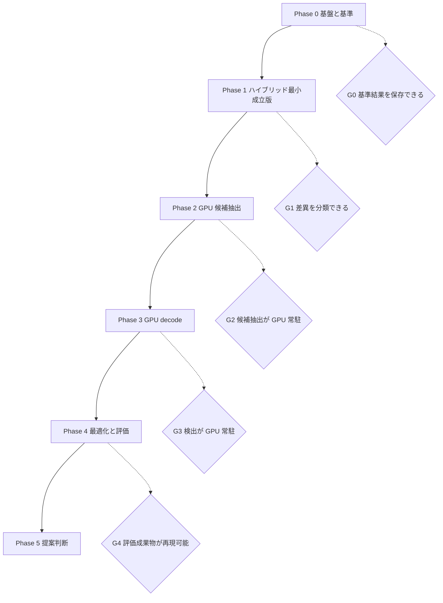
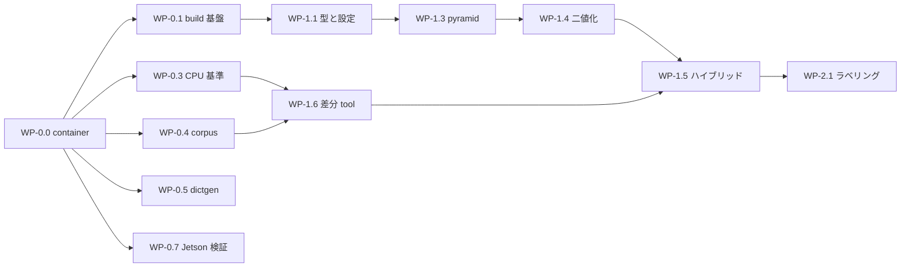

# 実装計画

## 目的

[ロードマップ](roadmap.md) の Phase 定義を、着手可能な作業単位、成果物、完了条件、依存関係へ分解し、設計・実装・評価を同じ前提で進められる状態にします。

## 対象範囲

Phase 0 から Phase 4 までの作業単位、repository 構成、開発 container 環境、検証戦略、評価計画への追加提案、リスクを対象とします。Phase 5 の upstream 提案作業は判断条件のみを扱います。日程と担当は対象外です。

## 現状

- WP-0.0 から WP-0.5 までが完了しています。開発 container、CMake build 基盤、`ctest`、Compute Sanitizer 経路、format と静的解析、CPU 基準 runner、合成 corpus 生成器、Dictionary 変換 tool が動作します。
- core は build 基盤の疎通確認に必要な最小構成のみです。CUDA 検出器、adapter、benchmark harness、データセットはありません。
- 開発機は DGX Spark GB10 です。実測値と build baseline の決定案は [ADR-0002](adr/0002-toolchain-and-target-baseline.md) にまとめています。
- Jetson Orin 実機はこの環境から参照できていません。JetPack version と power mode は未確認です。
- 開発機に OpenCV、`clang-format`、`ninja` が install されていません。`compute-sanitizer` は使用できます。これらは host へ直接 install せず、開発 container 側で供給します。
- Docker 28.3.3、Docker Compose v2.39.1、NVIDIA Container Toolkit 1.18.0 が利用可能で、`nvidia` runtime が登録済みです。
- 開発 container 環境は `dgx-spark` profile を構築済みで、CUDA Toolkit を image へ固定する `pinned` mode と host から mount する `mounted` mode の両方で環境検査と smoke test が合格しています。設計は [Docker 環境設計](design/docker-environment.md) を参照してください。
- 互換対象である OpenCV 4.x の ArUco3 経路の観測仕様は [検出パイプライン設計](design/detector-pipeline.md) に記録済みです。

### 着手前の blocker

| ID | blocker | 解消方法 | 影響する作業単位 |
| --- | --- | --- | --- |
| B1 | OpenCV が開発機に無い | WP-0.0 の image へ 4.14.0 を commit 固定で build して含める。`dgx-spark` profile で解消済み | WP-0.2 以降のほぼ全て |
| B2 | Jetson Orin の環境が未確認 | 実機の JetPack、CUDA、power mode を確認し ADR-0002 の未確定事項を閉じる | WP-0.7、WP-4.4 |
| B3 | `clang-format` が無い | WP-0.0 の `dgx-spark` profile へ含める。解消済み | WP-0.1 |
| B4 | test corpus と ground truth が無い | WP-0.4 で生成器を作る | Phase 1 以降の正確性評価 |

B1 と B3 を host への直接 install ではなく container で解消するのは、DGX Spark と Jetson Orin で同じ手順を使い、測定結果へ環境情報を機械可読形式で残すためです。

B2 について、開発機に存在する別 project の container image は JetPack 5.1.2 と CUDA 11.4 を示しています。Jetson 側が CUDA 11.4 系である場合、DGX Spark の CUDA 13.0 との差が大きく、使用できる CUDA 機能と CUB / Thrust の version が制約されます。実機確認を WP-0.7 で行い、確認前は共通経路が CUDA 11.4 でも compile できる範囲に留めます。

## 目標

### 全体構成



### repository 構成案

```
ArUco3-CUDA/
├── CMakeLists.txt             作成済み
├── CMakePresets.json          作成済み。profile ごとの architecture を切り替える
├── cmake/                     作成済み。build option、警告、Compute Sanitizer target
├── docker/                    開発 container。profile ごとの image と環境検査 script
├── include/aruco3cuda/        公開 header。OpenCV へ依存しない
│   └── opencv/                adapter の公開 header
├── src/
│   ├── core/                  作成済み。kernel と host 制御。段階ごとに file を分ける
│   ├── util/                  作成済み。CUDA にも OpenCV にも依存しない共通処理
│   ├── dictionary/            作成済み。packed table と照合。generated/ は生成物
│   ├── dictionary/            packed table と loader
│   └── adapter/opencv/        cv::Mat / cv::cuda::GpuMat 変換
├── tools/
│   ├── dictgen/               作成済み。OpenCV から packed codeword を生成する
│   ├── corpusgen/             作成済み。ground truth 付き合成画像生成器
│   └── report/                差異分類と集計 script
├── reference/                 作成済み。OpenCV CPU 基準 runner
├── bench/                     測定 harness
├── test/
│   ├── unit/                  型、設定検証、kernel 単体
│   ├── conformance/           Dictionary 互換
│   ├── differential/          CPU 基準との差分
│   └── robustness/            異常入力、境界値、overflow
├── data/manifest/             データセットの所在と checksum のみ
└── docs/
```

大容量の画像と動画は repository へ commit せず、`data/manifest/` に保存先と checksum を記録します。

### 作業単位

`規模` は相対的な目安であり、日程ではありません。日程は [ロードマップ](roadmap.md) の未確定事項のままです。

#### Phase 0: 基盤と基準

| ID | 内容 | 成果物 | 完了条件 | 依存 | 規模 |
| --- | --- | --- | --- | --- | --- |
| WP-0.0 | 開発 container。CUDA Toolkit の供給を pinned と mounted から選べる 2 profile、環境検査 script、環境情報記録 script、環境 smoke test | `docker/**`、[Docker 環境設計](design/docker-environment.md) | `dgx-spark` profile の image が build でき、`verify-environment.sh` と `smoke-test.sh` が合格する。`jetson-orin` profile は WP-0.7 で確認する | - | M |
| WP-0.1 | CMake project、C++17、`sm_87` と `sm_121`、warning、`clang-format`、静的解析、`ctest` 骨格 | `CMakeLists.txt`、`CMakePresets.json`、`cmake/**`、`.clang-format`、`.clang-tidy` | 空 library と smoke test が両 architecture 向けに build でき `ctest` が通る。達成済み | WP-0.0 | M |
| WP-0.2 | OpenCV 4.14.0 の commit 固定 build と provenance 記録 | `docker/scripts/build-opencv.sh`、image 内 provenance JSON | 再現可能に build でき、version と commit が環境情報 JSON へ出力される | WP-0.0 | S |
| WP-0.3 | CPU 基準 runner | `reference/**`、`aruco3cuda_reference_runner` | 同一入力に対し決定的な ID と四隅、および環境情報を保存できる。達成済み | WP-0.2 | M |
| WP-0.4 | 合成 corpus 生成器 | `tools/corpusgen`、manifest | seed 固定で再生成でき、四隅の ground truth を持つ corpus が得られる。達成済み | WP-0.2 | M |
| WP-0.5 | Dictionary 変換 tool と互換テスト | `tools/dictgen`、`src/dictionary`、生成 table | [Dictionary 方針](dictionaries.md) の検証 1 から 5 が自動テストで通る。達成済み | WP-0.2 | M |
| WP-0.6 | benchmark harness 骨格 | 環境収集、CUDA event、JSONL 出力、集計 script | CPU 経路の p50・p95・p99 と環境情報を機械可読形式で保存できる | WP-0.3、WP-0.0 | M |
| WP-0.7 | Jetson Orin profile の実機検証 | `docker/.env` の既定値確定、[ADR-0002](adr/0002-toolchain-and-target-baseline.md) の更新 | Jetson 実機で image が build でき、環境検査が合格し、CUDA Toolkit の最低 version が確定する | B2、WP-0.0 | M |

G0 の完了条件: 同一入力に対する CPU 基準結果と環境情報を保存でき、CUDA 側の空実装が両 profile の container 内で build とテストを通ること。

WP-0.1 の検証結果は次のとおりです。`libaruco3cuda.a` に `sm_87` と `sm_121` の両方の code が含まれることを `cuobjdump --list-elf` で確認しています。

| 確認項目 | 結果 |
| --- | --- |
| `sm_87` と `sm_121` の同時 build | 成功 |
| `ctest` | 12 件全て合格 |
| Compute Sanitizer 4 mode を含む `ctest` | 16 件全て合格 |
| `format-check` | 差分なし |
| `clang-tidy` | 指摘なし |

WP-0.3 の検証結果は次のとおりです。

| 確認項目 | 結果 |
| --- | --- |
| 合成マーカーの検出 | ID と四隅が描画位置と 1 pixel 以内で一致 |
| 決定性 | `--omit-timing` 指定時、同一入力から byte 単位で同じ JSON |
| ArUco3 の縮小率 | 1280x720、`S=32`、`tau_i=0.05` で `fxfy=0.3333`、segmentation 427x240 |
| ArUco3 の効果 | 同一画像・同一検出結果で 5.917 ms から 1.112 ms |
| `ctest` | 35 件全て合格。Compute Sanitizer を含めて 39 件 |

`rotation` は OpenCV の `detectMarkers` が独立した値として返さないため、出力へ含めていません。marker rotation は四隅の並び順として表現されるため、比較は四隅の順序で行います。

WP-0.4 と WP-0.5 の検証結果は次のとおりです。

| 確認項目 | 結果 |
| --- | --- |
| corpus の決定性 | 同じ seed から manifest と画像 checksum が一致 |
| ground truth の妥当性 | CPU 基準実装の検出結果と四隅が 1.5 pixel 以内で一致 |
| Dictionary 適合性 | 250 ID 全 4 回転の codeword が OpenCV の `bytesList` と一致 |
| Dictionary 訂正境界 | bit 反転に対する accept / reject が OpenCV の `identify()` と一致 |
| 最小 Hamming 距離 | 再計算値 12。公称値と一致 |
| 生成物の再現性 | `dictgen --check` が既存 file と byte 単位で一致 |
| `ctest` | 61 件全て合格。Compute Sanitizer を含めて 65 件 |

ArUco3 が検出対象とする最小辺長は `tau_i` そのものではなく `S + L * tau_i` で決まります。`S` は `minSideLengthCanonicalImg`、`L` は画像の長辺です。1280x720、`S = 32`、`tau_i = 0.05` の場合は 96 pixel が下限であり、実測では 96 pixel は検出されず 128 pixel は検出されました。corpus の manifest は各マーカーの `side_ratio` を記録し、どの `tau_i` で検出対象になるかを後から判断できるようにしています。

#### Phase 1: ハイブリッド最小成立版

| ID | 内容 | 成果物 | 完了条件 | 依存 | 規模 |
| --- | --- | --- | --- | --- | --- |
| WP-1.1 | 公開型、設定、`validate()` | `include/aruco3cuda/**` | 設定の矛盾と不正な画像 view を境界で拒否するテストが通る | WP-0.1 | S |
| WP-1.2 | workspace 所有と再確保統計 | `src/core` の allocator | フレームごとの確保が発生しないことをテストで確認できる | WP-1.1 | M |
| WP-1.3 | S1 pyramid と S2 segmentation の kernel | `src/core` | OpenCV の縮小結果との差が定めた許容内に収まる | WP-1.2 | M |
| WP-1.4 | S3 適応的二値化 kernel | `src/core` | 3 通りの window size で CPU 基準の二値化と一致率が許容内 | WP-1.3 | M |
| WP-1.5 | 案 C ハイブリッド経路 | 二値化画像を host へ戻し CPU で候補抽出と decode | 合成画像の基本条件で ID と四隅を取得できる | WP-1.4、WP-0.3 | M |
| WP-1.6 | 差分レポート tool | `tools/report` | 差異を未検出・過検出・ID 不一致・rotation 不一致・四隅ずれへ分類できる | WP-1.5 | S |

G1 の完了条件: 合成画像の基本条件で ID と四隅を取得でき、CPU 基準結果との差異が分類できること。

#### Phase 2: GPU 候補抽出

| ID | 内容 | 成果物 | 完了条件 | 依存 | 規模 |
| --- | --- | --- | --- | --- | --- |
| WP-2.1 | S4 連結成分ラベリング | `src/core` | 既知 label 画像に対し CPU 実装と label 集合が一致する | WP-1.4 | L |
| WP-2.2 | label 統計の集計 | `src/core` | bbox、pixel 数、重心が CPU 集計と一致する | WP-2.1 | S |
| WP-2.3 | S5 極点探索による四隅推定 | `src/core` | 合成マーカーで四隅を許容誤差内に推定できる | WP-2.2 | L |
| WP-2.4 | S6 フィルタと compaction と overflow | `src/core` | 上限超過時に `kCandidateOverflow` を返し結果を打ち切ることをテストで確認できる | WP-2.3 | M |
| WP-2.5 | 近接候補の統合 | `src/core` | CPU 基準の grouping との差異を分類できる | WP-2.4 | M |
| WP-2.6 | 案 A と案 C の比較 spike | 比較レポート、ADR | 差異と速度の両面から主案を決定し ADR へ記録する | WP-2.5、WP-1.6 | M |

G2 の完了条件: 候補抽出まで GPU 常駐で完結し、CPU 基準との差異を分類でき、案の選択が ADR に記録されていること。

#### Phase 3: GPU decode

| ID | 内容 | 成果物 | 完了条件 | 依存 | 規模 |
| --- | --- | --- | --- | --- | --- |
| WP-3.1 | S7 射影変換とセル sampling | `src/core` | 既知 homography で正しいセル値を得られる | WP-2.6 | M |
| WP-3.2 | S8 前半 Otsu と border 検証 | `src/core` | `minOtsuStdDev` と `maxErroneousBitsInBorderRate` の境界で CPU と判定が一致する | WP-3.1 | M |
| WP-3.3 | S8 後半 Dictionary 照合 | `src/core` | 全 ID と 4 回転で CPU と同じ ID・rotation・距離を返す | WP-3.2、WP-0.5 | M |
| WP-3.4 | S9 重複整理 | `src/core` | 重複入力に対し CPU と同じ代表候補を選ぶか、差異を説明できる | WP-3.3 | M |
| WP-3.5 | S10 四隅の subpixel 補正と upsampling | `src/core` | 四隅 RMSE が CPU 基準に対する許容内に収まる | WP-3.4 | L |
| WP-3.6 | device 常駐出力 API | `DeviceDetections` | host 同期なしで検出結果を参照できることをテストで確認できる | WP-3.5 | S |

G3 の完了条件: ID と四隅の出力まで GPU 経路で完結し、`CUDA-Resident` 経路が測定可能であること。

#### Phase 4: 最適化と評価

| ID | 内容 | 成果物 | 完了条件 | 依存 | 規模 |
| --- | --- | --- | --- | --- | --- |
| WP-4.1 | kernel 起動数と stream の最適化 | `src/core` | 最適化前後で正確性が不変であり、変化を測定値で示せる | WP-3.6 | M |
| WP-4.2 | memory 経路 4 種の実装と測定 | `src/core`、`bench` | pageable、pinned、managed、device 常駐を別結果として記録できる | WP-3.6 | M |
| WP-4.3 | 機種別 tuning の設定化 | 設定 file | block size 等が source の固定値でなく設定から上書きできる | WP-4.1 | S |
| WP-4.4 | Jetson Orin での全評価 | 測定結果 | 同一 corpus が通り、環境情報と power mode が記録されている | B2、WP-4.3 | L |
| WP-4.5 | crossover point の報告 | benchmark report | CPU が有利な条件を含めて境界を示せる | WP-4.4 | M |
| WP-4.6 | Compute Sanitizer 全経路 | CI target | memcheck、racecheck、initcheck、synccheck で指摘が無い | WP-4.1 | M |

G4 の完了条件: [評価計画](evaluation-plan.md) の成果物が揃い、再現手順で同じ結果が得られること。

### 推奨する着手順



critical path は WP-0.0 から WP-0.1、WP-1.1、WP-1.3、WP-1.4、WP-1.5 を経て WP-2.1 へ至る経路です。WP-0.0 が全ての起点になるため最優先で着手します。WP-0.3 から WP-0.5、および WP-0.7 は WP-0.0 の完了後に並行して進められます。WP-0.2 は WP-0.0 の image build 手順そのものへ統合されます。

### 検証戦略

| 層 | 対象 | 実行頻度 |
| --- | --- | --- |
| unit | 型、設定検証、host 側の境界処理、kernel 単体 | 全 commit |
| conformance | Dictionary の ID 数、markerSize、4 回転 codeword、訂正境界 | 全 commit |
| differential | CPU 基準結果との ID・rotation・四隅の比較 | 全 commit |
| robustness | 0 マーカー、上限超過、非連続 pitch、ROI、極小画像、null pointer、memory 空間の不一致 | 全 commit |
| sanitizer | Compute Sanitizer の 4 mode | 日次または PR |
| benchmark | カーネル時間と end-to-end 時間、latency 分布 | 変更時と Phase 完了時 |

差分テストは CPU 基準結果を互換性の基準として扱い、ground truth は合成 corpus の生成時情報を使用します。両者が食い違う場合は、差異を分類したうえで CPU 基準側の挙動として記録します。

CUDA device code は host coverage と別に、入力分割と境界値で実行経路を確認します。対象は、overflow 経路、`minOtsuStdDev` 未満の候補、border 誤り上限、回転 4 種、pyramid の最上位と最下位 level です。

### 評価計画へ反映した変更

[評価計画](evaluation-plan.md) へ次の 3 点を反映済みです。理由をここへ記録します。

#### 1. memory 経路を測定軸へ加える

DGX Spark GB10 は `integrated` を 1 と報告し、host と device が同一物理 memory を共有します。Jetson Orin も同様の構成です。このため `CUDA-E2E` と `CUDA-Resident` の差は、discrete GPU の場合より小さくなることが見込まれます。現在の 4 経路に加えて、pageable host、pinned host、managed、device 常駐の 4 通りを独立した測定軸として記録します。

あわせて、得られた crossover point は統合 GPU 環境の結果であり、discrete GPU へは一般化できないことを benchmark report へ明記します。OpenCV への提案時には、利用者の多くが discrete GPU を使う点が判断材料になります。

#### 2. ArUco3 の既定値に関する測定条件を明記する

OpenCV の `minMarkerLengthRatioOriginalImg` の既定値は 0.0 であり、この場合 `useAruco3Detection` を有効にしても縮小率は 1 になります。ArUco3 検出戦略の効果を測るには、この値を明示的に設定した条件で測定する必要があります。測定条件へ縮小率 `fxfy` の実効値を記録する項目を追加しました。

#### 3. 外部報告値を sanity check の基準に使う

OpenCV Issue #27118 の報告者は、CPU 実装の処理時間として 640x480 で約 50 ms、1920x1080 で約 150 ms を挙げています。これは環境と設定が不明な参考値ですが、こちらの CPU 基準測定が桁違いに離れた場合は測定条件を疑う材料になります。基準値としてではなく sanity check として記録します。

### リスクと対策

| ID | リスク | 影響 | 対策 |
| --- | --- | --- | --- |
| R1 | 案 A の四隅推定が CPU 基準と一致せず、差異が許容できない | Phase 2 の手戻り | 案 C を fallback として維持し、WP-2.6 で判断する |
| R2 | 統合 GPU では転送費用が小さく、CPU 有利の条件が広い | 成功判定 2 を満たせない | CPU が有利な条件も成果物として報告する。crossover point の提示自体を成果と位置付ける |
| R3 | 四隅精度が subpixel 補正の実装差で劣化する | 成功判定 1 を満たせない | WP-3.5 を最重要作業とし、pyramid level ごとの誤差を分解して記録する |
| R4 | Jetson Orin の環境差で build または測定が再現しない | 成功判定 3 を満たせない | B2 を Phase 0 の間に解消し、環境情報を測定結果へ必ず埋め込む |
| R5 | Dictionary data の由来を説明できない状態で取り込む | ライセンス上の問題 | WP-0.5 で hash と変換手順を [Code Provenance 記録](code-provenance.md) へ残す |
| R6 | 測定条件の差で有利な結果だけが残る | 評価の信頼性低下 | 外れ値を削除せず全分布を保存し、条件を機械可読形式で併記する |
| R8 | compiler が image と分離していると測定結果を後から再現できない | 成功判定 3 を満たせない | CUDA Toolkit を image へ固定する `pinned` mode を既定とし、version を環境情報へ記録する |
| R7 | patent clearance が未実施のまま商用検討が進む | 事業判断の遅延 | [知的財産・ライセンス方針](ip-and-licensing.md) の手順を Phase 4 完了までに開始する |

## 未確定事項

- 各作業単位の担当、開始日、完了日。
- 案 A の妥当性検証しきい値と、CPU 基準との候補差異の許容範囲。
- 四隅座標誤差と性能改善率の合格基準の数値。[評価計画](evaluation-plan.md) の未確定事項と同じ。
- CUDA Toolkit の最低 version。[ADR-0002](adr/0002-toolchain-and-target-baseline.md) の未確定事項と同じ。
- CI を実行する環境。開発機、Jetson 実機、外部 runner のどれを使うか。
- corpus に実画像を含める時期と、その入手・配布条件。

## 関連

- [ロードマップ](roadmap.md)
- [アーキテクチャ](architecture.md)
- [検出パイプライン設計](design/detector-pipeline.md)
- [公開 API 草案](design/public-api.md)
- [Docker 環境設計](design/docker-environment.md)
- [評価計画](evaluation-plan.md)
- [ADR-0002: build 基盤と対象環境の baseline を固定する](adr/0002-toolchain-and-target-baseline.md)
