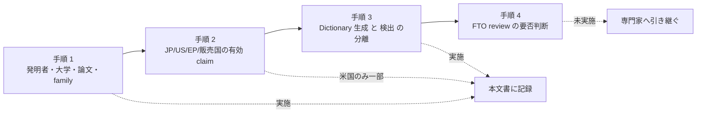

# 特許 Clearance 下調べ記録

> [!CAUTION]
> この文書は開発上のリスク管理を目的とした**事実の収集記録**であり、法律上の助言ではありません。侵害の有無、権利の有効性、実施の可否についての判断は一切含みません。判断は弁理士または弁護士が行います。

## この文書の位置づけ

[知的財産・ライセンス方針](ip-and-licensing.md) の `特許` 節は、商用公開前に実施する事項として次の 4 手順を定めています。本文書は **2026-08-29 に実施した web 検索と公報取得の記録**であり、4 手順のうちどこまで到達したかは次のとおりです。

| 手順 | 方針文書の記載 | 本文書での到達点 |
| --- | --- | --- |
| 1 | 発明者名、大学名、論文名、優先日前後の patent family を検索する | **実施した。** 発明者 5 名、Universidad de Córdoba、論文題名と特徴語、優先日帯 2013-2020 を軸に検索した。ただし利用できた database は限られる (後述) |
| 2 | 日本、米国、欧州および販売予定国の有効 claim を確認する | **一部のみ。** 米国の登録 claim を 8 件について逐語で確認した。**日本 (J-PlatPat) と欧州 (EPO Register) は 1 件も確認していない。** 販売予定国が未定のため、そもそも完了できない |
| 3 | marker Dictionary の生成方法と検出方法を分けて確認する | **実施した。** 生成側と検出側を別の軸として棚卸しと検索を行い、本 project が Dictionary を生成していない事実を code 上で確認した |
| 4 | 専門家による freedom-to-operate review の要否を判断する | **判断していない。** 判断材料の提示までにとどめる。依頼事項の候補は末尾に列挙する |

## 目的

ArUco3-CUDA の技術特徴を棚卸しし、それぞれについて「関係しうる第三者特許を web 検索の範囲で発見できたか」を、再現可能な形 (検索語、database、実施日、取得 URL) で記録します。否定的結果 (探したが見つからなかった) も同じ重みで記録します。

この記録の用途は次の 2 つです。

- 専門家へ freedom-to-operate review を依頼する場合の入力資料とする。
- 依頼するかどうかを判断するための材料を、事実と不確実性に分けて提示する。

## 対象範囲

### 含むもの

- 本 repository の検出 pipeline S0-S11 の技術特徴 (`docs/design/detector-pipeline.md`、`src/core/*`)。
- marker Dictionary の**生成方法**と**検出・識別方法** (`tools/dictgen/`、`src/dictionary/`)。
- GPU 実装に固有の構成 (workspace 管理、CUDA Graph、並列 reduction、決定性の確保)。
- 上記に関係しうる第三者の特許出願および登録特許のうち、**実際に page を取得して番号と内容を確認できたもの**。

### 含まないもの

- 侵害の有無、claim の有効性、実施の可否についての評価。
- 網羅的な調査。本記録は 2026-08-29 の 1 日に web 検索で辿れた範囲にとどまります。
- 商標、意匠、著作権および license の論点。著作権・license は [知的財産・ライセンス方針](ip-and-licensing.md) と [Code Provenance 記録](code-provenance.md) が扱います。
- 販売予定国の特定。**未定です** (後述の未確定事項)。

## 現状

### 実施条件

| 項目 | 内容 |
| --- | --- |
| 実施日 | 2026-08-29 |
| 実施方法 | web 検索および公報 page の取得。対話型 database の操作は行っていない |
| 対象 repository | `/home/tobeta/ArUco3-CUDA` (commit `65f1f41` 時点) |
| 検証の原則 | 番号は、実際に取得した page に記載されていたものだけを記録する。取得していない番号は記録しない |
| 本 repository に関する事実 | grep の結果は 2026-08-29 に commit `65f1f41` に対して実行し直して確認した。対象は corner 検出器、角度計算、`extendDictionary` 呼び出し、色空間変換の 4 点で、いずれも 0 件 |

### 使用できた database と使用できなかった database

| Database | 状態 | 用途と備考 |
| --- | --- | --- |
| Google Patents (patents.google.com) | **部分的に使用可** | 書誌、法的状態、family 一覧の確認に使用。ただし調査の中盤以降 HTTP 503 が継続し、多くの page を取得できなかった |
| USPTO Patent Public Search 画像配信 (image-ppubs.uspto.gov) | 使用可 | 公報 PDF (画像) を安定して取得できた。**claim 全文の一次確認はこの経路で行った** |
| FreePatentsOnline (freepatentsonline.com) | 使用可 | claim 全文の取得と claim 限定検索 (`ACLM/`) に使用。US 特許・US 公開公報が中心で、**ES 国内公報は非収録** |
| patentados.com | 使用可 | スペイン OEPM 系アグリゲータ。Universidad de Córdoba 名義の一覧確認に使用 |
| qrcode.com (DENSO WAVE 特許 page) | 使用可 | 隣接分野の権利状況の一次情報として使用 |
| Espacenet (worldwide.espacenet.com) | **使用不可 (HTTP 403)** | 一度も取得できなかった。**INPADOC の法的状態と family の独立確認ができていない** |
| WIPO PATENTSCOPE | **使用不可 (HTTP 403)** | 未使用 |
| J-PlatPat | **未実施** | 対話型 session が必要で本調査の手段では検索できなかった。**日本国内出願の調査は実質的に未実施** |
| EPO Register | **未実施** | 欧州の法的状態を一切確認していない |
| OEPM INVENES (スペイン特許庁) | **未実施** | ES 国内出願のみの案件は捕捉できていない |

この表は clearance の結論に直接影響します。**日本と欧州の権利は、本調査ではほぼ何も確認していません。**

### 実施した検索の軸と検索語

再現のため、実施した検索を軸ごとに記録します。検索語は代表的なものを挙げます。

| 軸 | 主な検索語 | 主な database |
| --- | --- | --- |
| 発明者・出願人 | `inventor=Munoz-Salinas` / `Garrido-Jurado` / `Marin-Jimenez` / `Medina-Carnicer` / `Romero-Ramirez`、`IN/"muñoz salinas"` (発音区別符号あり・なしの両形)、`AN/"universidad de cordoba"`、`assignee="Universidad de Cordoba"` | Google Patents, FreePatentsOnline, patentados.com |
| 論文題名・要旨の特徴語 | `"squared fiducial marker"`、`"inter-marker distance"`、`"marker dictionary"`、`SPEC/"mixed integer linear programming" AND SPEC/"fiducial marker"`、`SPEC/"fiducial marker" AND SPEC/"image pyramid" AND SPEC/"corner refinement"`、`OREF/"Speeded up detection of squared fiducial markers"` | Google Patents, FreePatentsOnline |
| 縮小戦略 (ArUco3 の中核) | `"reduced resolution" candidate detection "full resolution" refine corner subpixel`、`ACLM/"fiducial marker" AND (ACLM/"reduced resolution" OR ACLM/"downsampled" OR ACLM/"downscaled")`、`coarse-to-fine corner detection pyramid propagate` | Google Patents, FreePatentsOnline, web 検索 |
| 候補抽出・二値化 | `ACLM/"marker" AND ACLM/"adaptive threshold" AND ACLM/"quadrilateral"`、`ACLM/"marker" AND ACLM/"connected component"`、`connected component labeling GPU union-find` | FreePatentsOnline, Google Patents |
| Dictionary 生成 | `fiducial marker dictionary generation mixed integer linear programming`、`generating marker code set "minimum Hamming distance" rotations`、`rotationally unique code set generation` | Google Patents, USPTO 画像配信, web 検索 |
| Dictionary 照合 | `ACLM/"fiducial marker" AND ACLM/"Hamming distance"`、`ACLM/"fiducial marker" AND (ACLM/"codeword" OR ACLM/"dictionary")`、`popcount marker code matching` | FreePatentsOnline |
| GPU 実装 | `GPU accelerated fiducial marker detection`、`stream compaction prefix sum GPU`、`Otsu thresholding GPU parallel histogram`、`command buffer / execution graph kernel launch replay`、`packed atomicMax argmax` | Google Patents, FreePatentsOnline, web 検索 |

### 発見した特許 — 番号を独立に検証したもの

次の 8 件は、報告された番号を**別の担当者が改めて page を取得し、番号・題名・書誌・claim を自分で読んで確認した**ものです。すべて実在しました。

| 番号 | 種別 | 題名 | 出願人 | 優先日 | 状態 (確認できた範囲) | 確認 URL |
| --- | --- | --- | --- | --- | --- | --- |
| US11113819B2 | 登録 | Graphical fiducial marker identification suitable for augmented reality, virtual reality, and robotics | NVIDIA | 2019-01-15 | 2021-09-07 登録。Google Patents 表示は Active、満了予測 2039-05-03。**維持年金の納付状況は未確認** | [Google Patents](https://patents.google.com/patent/US11113819B2/en) / [claim 全文](https://www.freepatentsonline.com/11113819.html) |
| US12322114B2 | 登録 | Graphical fiducial marker identification | NVIDIA | 2019-01-15 (継続) | 2025-06-03 登録。terminal disclaimer 対象。154(b) で 331 日調整。**法的状態は未確認** | [USPTO 公報 PDF](https://image-ppubs.uspto.gov/dirsearch-public/print/downloadPdf/12322114) |
| US20250292411A1 | **出願 (公開公報)** | Graphical fiducial marker identification | NVIDIA | 2019-01-15 (継続の連鎖) | 2025-06-02 出願、2025-09-18 公開。**登録ではない。審査状況は未確認** | [USPTO 公報 PDF](https://image-ppubs.uspto.gov/dirsearch-public/print/downloadPdf/20250292411) |
| US11430212B2 | 登録 | Methods and apparatuses for corner detection | Magic Leap | 2018-07-24 (仮出願 62/702,477) | 2022-08-30 登録。154(b) で 42 日調整。**存続状況は未確認** | [USPTO 公報 PDF](https://image-ppubs.uspto.gov/dirsearch-public/print/downloadPdf/11430212) |
| US9558560B2 | 登録 | Connected component labeling in graphics processors | Intel | 2014-03-14 | 2017-01-31 登録。Google Patents 表示は Active、満了 2034-09-20。**維持年金は未確認** | [Google Patents](https://patents.google.com/patent/US9558560B2/en) / [claim 全文](https://www.freepatentsonline.com/9558560.html) |
| US11100649B2 | 登録 | Fiducial marker patterns, their automatic detection in images, and applications thereof | Millennium Three Technologies (発明者 Mark Fiala) | 2014-05-21 | 2021-08-24 登録。Google Patents 表示は Active、満了予測 2035-05-21。**維持年金は未確認** | [Google Patents](https://patents.google.com/patent/US11100649B2/en) / [claim 全文](https://www.freepatentsonline.com/11100649.html) |
| ES2894549A1 / ES2894549B2 | 出願公開 / 登録 | Sistema de realidad aumentada o realidad virtual con localización activa de herramientas | Seabery Soluciones S.L. (発明者に Sergio Garrido Jurado) | 2020-08-10 | A1 は 2022-02-14 公開、B2 は 2022-06-22 発行。Google Patents 表示は Active、満了予測 2040-08-10。**OEPM での年金納付状況は未確認** | [ES2894549A1](https://patents.google.com/patent/ES2894549A1/en) / [ES2894549B2](https://patents.google.com/patent/ES2894549B2/en) |
| US20230316669A1 | **出願 (公開公報)** | Augmented Reality or Virtual Reality System with Active Localisation of Tools | Seabery North America, Inc. | 2020-08-10 (ES P202030858) | 2023-10-05 公開。**登録ではない。以後の登録・拒絶・放棄の別は未確認** | [USPTO 公報 PDF](https://image-ppubs.uspto.gov/dirsearch-public/print/downloadPdf/20230316669) |

補足として、上記の family に次の番号が表示されていました。**いずれも個別 page を取得できておらず、番号は Google Patents の family 一覧を読んだだけの二次的確認です。**

| 番号 | 由来 | 未確認事項 |
| --- | --- | --- |
| JP7429542B2 | US11113819B2 の family 一覧 | **日本の登録公報番号が表示されている。claim も法的状態も未確認。本調査で最も重要な残件** |
| CN111435438B / DE102020100684B4 | 同上 | claim・法的状態とも未確認 |
| US11887312B2 | US11100649B2 の継続出願 | claim 未読。同一明細書から別 claim を取っている可能性がある |
| US11605223B2 / US20220366688A1 | US11430212B2 の継続 | claim 本文について情報源間で不一致がある (後述) |
| JP2023539810A / EP4195182A4 / CN116075875A / WO2022034252A1 ほか | ES2894549B2 の family 一覧 | 日本・欧州の family が存在すると表示されている。各国の状態は未確認 |

### 発見した特許 — 番号を独立検証していないもの

次は、検索の過程で page を取得して番号と題名を確認したものの、**別担当者による再取得・claim の逐語確認を行っていない**候補です。参考として記録します。

| 番号 | 題名 | 記録した URL |
| --- | --- | --- |
| US11605223B2 | Methods and apparatuses for corner detection | https://www.freepatentsonline.com/11605223.html |
| US20220366688A1 | Methods and apparatuses for corner detection | https://patents.google.com/patent/US20220366688A1/en |
| US7769236B2 | Marker and method for detecting said marker | https://patents.google.com/patent/US7769236B2/en |
| US10366307B2 | Coarse-to-fine search method, image processing device and recording medium | https://www.freepatentsonline.com/10366307.html |
| US20200211198A1 | Fiducial marker patterns, their automatic detection in images, and applications thereof | https://patents.google.com/patent/US20200211198A1/en |
| US10504231B2 | Fiducial marker patterns, their automatic detection in images, and applications thereof | https://image-ppubs.uspto.gov/dirsearch-public/print/downloadPdf/10504231 |
| US9042652B2 | Techniques for connected component labeling | https://patents.google.com/patent/US9042652B2/en |
| US11132569B2 | Hardware accelerator for integral image computation | https://www.freepatentsonline.com/11132569.html |
| US7725518B1 | Work-efficient parallel prefix sum algorithm for graphics processing units | https://www.freepatentsonline.com/7725518.html |
| US5726435 | Optically readable two-dimensional code and method and apparatus using the same | https://image-ppubs.uspto.gov/dirsearch-public/print/downloadPdf/5726435 |
| US5691527 / US7032823 / JP2938338 / JP2867904 / JP3716527 / JP3726395 / JP3843595 / JP3996520 | DENSO WAVE が自社 QR code 特許として列挙している番号群 | https://www.qrcode.com/en/patent.html |

### 技術特徴と特許の対照表

本 project の技術特徴ごとに、本調査で関係しうる特許を発見できたかを対照します。「**発見なし**」は「存在しない」ではなく「2026-08-29 の検索範囲では見つからなかった」という意味です。番号のうしろの括弧は claim を読んだうえでの**事実の差異**であり、侵害・非侵害の評価ではありません。

#### A. ArUco3 検出戦略と pipeline 段 (S0-S11)

| 技術特徴 | 由来 | 関係しうる特許 (検証済み) | 本調査の結果 |
| --- | --- | --- | --- |
| 想定最小マーカー辺長からの縮小率決定 `fxfy = S / (S + max(W,H) * tau)` | ArUco3 論文 + OpenCV 観測仕様 | **発見なし** | claim に「最小マーカー寸法から縮小率を逆算する」限定を持つ特許は見つからなかった。近い概念を含むとされる文献が検索結果に現れたが、page を取得できず番号を報告しない |
| 縮小画像のみでの候補探索 (segmentation 画像の単一化) | ArUco3 論文 + OpenCV 観測仕様 | **発見なし** | `ACLM/"fiducial marker" AND (ACLM/"reduced resolution" OR "downsampled" OR "downscaled")` は 2 件のみで、いずれも深層学習の姿勢推定系 |
| 検出下限辺長が 2 パラメータで規定されること | ArUco3 戦略の帰結 | **発見なし** | 該当する claim を見つけられなかった |
| 原寸からの scale-2 grayscale pyramid 構築 | ArUco3 + OpenCV | **発見なし** | `ACLM/"fiducial marker" AND ACLM/"pyramid"` は 6 件で、照明色推定・micro pattern・心臓幾何であり無関係 |
| 候補辺長に応じた pyramid level の選択的復号 (S7) | ArUco3 + OpenCV | **発見なし** | 「候補の周長に応じて復号解像度を選ぶ」限定を持つ claim は見つからなかった |
| 四隅だけを段を登りながら upsampling し各段で subpixel 補正 (S10) | ArUco3 の中核 + OpenCV | US11430212B2 (Magic Leap) | claim 1 に「低解像度画像で corner を検出し、その位置に基づいて第 1 画像中の corner 位置を決定する」がある。ただし claim 1 は (a) screen と camera を備える**頭部装着装置**を前提部とし、(b) Harris 系定数 `k1 = R/(1+R)^2` を必須要件とする。本 project は library であり装置を持たず、corner 補正は `cornerSubPix` 相当の勾配正規方程式であって `k1` に相当する定数を持たない |
| 一般の coarse-to-fine 探索 (背景技術) | — | US10366307B2 (未検証)、US7769236B2 (未検証) | 粗密探索や多重解像度 marker 検出の**開示**は 2005-2015 年の明細書に存在する。claim は template matching や marker という物に向いており、縮小率の決定手順ではない |
| ArUco3 有効時の corner refinement 強制 subpix 化 | OpenCV 由来 | **発見なし** | 検索軸として立てていない。実装上の分岐であり claim 化の対象になりにくいと判断した |
| 補正窓半径を pyramid 段の寸法から決める | OpenCV 由来 | **発見なし** | 該当する claim を見つけられなかった |

#### B. 候補抽出・二値化・候補整理 (S3-S6, S9)

| 技術特徴 | 由来 | 関係しうる特許 (検証済み) | 本調査の結果 |
| --- | --- | --- | --- |
| 連結成分ラベリングと極点探索による四隅抽出 (案 A) | **本 project 独自** (ADR-0003) | US11113819B2 / US12322114B2 / US20250292411A1 (NVIDIA) | 技術分野が完全に一致する (GPU 上の fiducial marker 検出)。ただし 3 件の独立 claim はいずれも「**候補 corner 点を別途検出し**、境界画素からの**閾値画素距離**で絞る」または「候補 corner 点を結ぶ辺の**角度**を期待値と比較する」を必須要件とする。本 repository には corner 検出器が存在せず (`harris` / `goodFeatures` / `cornerHarris` の grep は 0 件)、角度計算も無い (`atan2` / `acos` / `asin` の grep は 0 件)。四隅は連結成分の全画素に対する距離最大化で生成する |
| 8 bit grayscale のみを入力とする構成 | 本 project の公開 API | US11113819B2 claim 1 (NVIDIA) | claim 1 は前段に「image data を**高次元の色空間から低次元の色空間へ変換する**」を置く。本 project の公開 API は 8 bit grayscale の `ImageViewU8` しか受け取らず、`src/` と `include/` に色空間変換は存在しない (`cvtColor` / `COLOR_` / `rgb` / `yuv` / `hsv` の grep は 0 件)。この差異は 2026-08-29 に本 repository を grep して確認した |
| 四角形らしさを 2 つの比で判定 (内側比・辺の裏付け比) | **本 project 独自** | US20250292411A1 (係属中) | 同 family の公開 claim は辺の**角度**および**辺長比**と期待値との比較を要件とする。本 project の判定は面積・画素支持の比であり、角度も辺長比も使わない。ただし**係属中で claim が確定していない** |
| 複数 window の適応的二値化を並列次元として同時処理 | OpenCV + 本 project 独自 | **発見なし** | `ACLM/"marker" AND ACLM/"adaptive threshold" AND ACLM/"quadrilateral"` は 0 件 |
| 分離型 row-sum / col-sum による適応的二値化 | OpenCV 意味論 + 本 project 独自 GPU 実装 | US11132569B2 (未検証、Texas Instruments) | integral image を計算する**hardware accelerator 回路**の claim。本 project は integral image を作らず、box 平均を行合計と列合計の 2 kernel に分ける。`docs/design/detector-pipeline.md` は integral image 方式への切替を未確定事項として残しているため、方式を変える場合は再確認が必要 |
| 決定的な連結成分ラベリング (block union-find + 昇順採番) | **本 project 独自** (8 近傍の選択のみ OpenCV 由来) | US9558560B2 (Intel) | 技術分野が一致する。ただし claim 1 は (a) 画像を表示する **display** を備える system、(b) 領域が均質か否かで **fast / generic の 2 経路を切り替える** scan、(c) thread ごとの connection table 生成、を要件とする。本 project は library であり display を持たず、均質条件による経路切替も持たない。**独立 claim 5 / 9 / 13 の全文は未読** |
| ラベリングの一般手法 | — | US9042652B2 (未検証) | 「等価 label を最小 label へ解決してから書き戻す」二段方式の claim。GPU 特有の記載はない |
| label 統計の SoA 配置と整数 atomics のみによる集計 | **本 project 独自** | **発見なし** | 該当する claim を見つけられなかった |
| 距離と画素 index を 64 bit へ packing した atomicMax | **本 project 独自の適用** | **発見なし** | 特許は見つからず、同一手法が学術論文 (arXiv) で公開技術として記載されているのを確認した |
| 四隅折れ線の chain code 長を周長の代用にする | **本 project 独自** | **発見なし** | 該当する claim を見つけられなかった |
| 順位空間 union-find による近接候補統合と最大周長代表の選択 | OpenCV 規則 + 本 project 独自表現 | **発見なし** | 該当する claim を見つけられなかった |
| 候補の包含木と 64 bit 整数による内外判定、打ち切り段数への縮約 | OpenCV 規則 + 本 project 独自 GPU 定式化 | **発見なし** | 該当する claim を見つけられなかった |
| 二値化 window 間の候補連結を device 側 counter で行う構成 | **本 project 独自** | **発見なし** | 該当する claim を見つけられなかった |
| frame 間追跡を持たない単一 frame 検出 | 本 project の構成 | US11100649B2 (Millennium Three / Fiala) | 独立 claim 1 / 9 が「**先行 frame での検出**」「先行 frame のマーカー線分 edge の**追跡**」「連続画像列であること」を必須要件とする。本 project は S0-S11 が 1 frame 完結で frame 間状態を持たない。ただし**継続出願 US11887312B2 の claim は未読** |

#### C. marker Dictionary — 生成方法 (手順 3 の「生成」側)

方針文書の手順 3 に従い、生成と検出を分けて確認しました。

| 技術特徴 | 本 project での事実 | 関係しうる特許 (検証済み) | 本調査の結果 |
| --- | --- | --- | --- |
| 符号集合 (codeword 集合) の探索・設計 | **実装していない。** repository 全体を grep した結果、codeword を探索・最適化する処理は存在しない。`extendDictionary()` の呼び出しは 0 件。MILP solver も制約定式化も無い | — | **本 project は Dictionary を生成していない**ため、生成方法を対象とする方法 claim には対応する実施行為が無い。ただし marker という「物」や、Dictionary を含む装置・system claim には同じ論法が及ばない可能性がある (専門家判断) |
| 回転を含む inter-marker Hamming 距離の最大化による符号設計 | 実装していない (MIP 論文由来の思想だが手順は未実装) | US7769236B2 (未検証、Fiala) | 明細書に「全 marker 間を全ての相対回転を考慮して最近接 2 marker の Hamming 距離の最小値を最大化するよう符号を選ぶ」という**開示**がある。ただし取得できた claim 1 は marker という**物**の claim。他の独立 claim の有無は未確認 |
| MILP による Dictionary 生成 | 実装していない | **発見なし** | 「正方形 2 値 marker の符号集合を、全回転を考慮した inter-marker Hamming 距離を最大化するように MILP で選ぶ」ことを claim する特許は **1 件も見つからなかった**。該当技術は学術文献としてのみ確認できる |
| OpenCV `bytesList` から 64 bit packed への変換、4 回転の事前展開 table | **本 project 独自のデータ表現** | **発見なし** | データ表現そのものを claim する特許は見つからなかった |
| 生成時の回転規則自己検証、`--check` による byte 一致検証 | **本 project 独自の build 方式** | **発見なし** | 該当する claim を見つけられなかった |
| marker image の描画 | **自前実装を持たない。** 描画はすべて OpenCV の API 呼び出しで、用途は test fixture と評価 corpus 生成に限られる | US10817743B2 (未検証)、US11107243B2 (未検証) | marker の設計・生成側を押さえる特許は存在するが、本 project は marker を設計も生成もしない |

#### D. marker Dictionary — 検出・識別方法 (手順 3 の「検出」側)

| 技術特徴 | 由来 | 関係しうる特許 (検証済み) | 本調査の結果 |
| --- | --- | --- | --- |
| canonical 画像全体への Otsu 閾値決定と GPU 3 相分割 | Otsu 法は公知 + OpenCV 意味論 + 本 project 独自の分解 | **発見なし** | GPU での Otsu 並列化を claim する特許は見つからず、Otsu を引用する古い二値化特許 (1990-2000 年代) と学術論文のみ |
| 内側領域の平均・母標準偏差による低分散分岐 | OpenCV 由来 | **発見なし** | 該当する claim を見つけられなかった |
| セル単位の白画素比 (bit へ潰さない中間表現) | OpenCV 由来 + 本 project 独自のデータ構造 | **発見なし** | 該当する claim を見つけられなかった |
| 外周セルによる border 検証 | OpenCV 由来 | **発見なし** | 該当する claim を見つけられなかった |
| 2 mask による 3 値表現と分岐なし Hamming 距離式 + popcount | OpenCV 意味論 + 本 project 独自の packed 表現 | **発見なし** | `ACLM/"fiducial marker" AND ACLM/"Hamming distance"` は **0 件**。`ACLM/"fiducial marker" AND (ACLM/"codeword" OR ACLM/"dictionary")` は 1 件のみで、MRI 中の金属物体位置決定に関するもの |
| 「ID 昇順で最初に許容距離を満たした ID」を採る規則の atomicMin による再現 | OpenCV 規則 + 本 project 独自の並列等価実装 | **発見なし** | 該当する claim を見つけられなかった |
| 4 回転を事前展開した packed codeword の device 常駐化 | **本 project 独自** | **発見なし** | 該当する claim を見つけられなかった |
| 射影変換とセル sampling の演算順序まで一致させた canonical 画像生成 | OpenCV 由来 + 本 project 独自の GPU 構成 | **発見なし** | 該当する claim を見つけられなかった |
| 照合で得た回転による四隅の並べ替え打ち消し | OpenCV 由来 | **発見なし** | 該当する claim を見つけられなかった |
| ID による重複除去を行わない出力規則 | OpenCV 由来の挙動 | **発見なし** | 該当する claim を見つけられなかった |

#### E. GPU 実装に固有の構成

| 技術特徴 | 由来 | 関係しうる特許 (検証済み) | 本調査の結果 |
| --- | --- | --- | --- |
| 全段 GPU 常駐の marker 検出 pipeline | **本 project 独自の段構成** | US11113819B2 (NVIDIA) | 明細書が GPU 上での並列実行を前提とし、`THRESHOLDER` / `IMAGE SEGMENTER` / `CORNER DETECTOR` / `CORNER FILTER` / `QUAD FITTER` / `DECODER` / `GPU(s)` を構成要素として列挙する。**pipeline 全体像として最も近い family**。claim 16 は GPU で候補 corner 点を求め CPU へ複写する分担を明文化している |
| device 常駐結果を同期なしで返す出力 API | **本 project 独自** | **発見なし** | 該当する claim を見つけられなかった。zero-copy 一般の特許は検索結果に現れたが page を取得しておらず番号を報告しない |
| bump pointer arena による frame ごとの確保回避 | **本 project 独自の適用** (arena allocator 自体は一般技術) | **発見なし** | 該当する claim を見つけられなかった |
| 設定上限からの最悪値事前確保と単調性による上界導出 | **本 project 独自** | **発見なし** | 該当する claim を見つけられなかった |
| 上限付き device buffer と 2 本の counter による overflow 通知 | **本 project 独自** | **発見なし** | 該当する claim を見つけられなかった |
| 1 frame の kernel 発行列の CUDA Graph 化と無効化契機の管理 | CUDA 機能 + 本 project 独自の無効化規則 | **発見なし** | 「command buffer / execution graph / kernel launch replay」で検索したが特許は 1 件も現れず、NVIDIA 公式文書・blog・論文のみ。**ただし NVIDIA 自身が graph 実行に関する特許を持つ可能性を否定できていない** |
| 入力内容に依存しない固定 kernel 発行列 | **本 project 独自** | **発見なし** | 該当する claim を見つけられなかった |
| device の SM 数から起動 block 数を導く自動調整 | **本 project 独自** | **発見なし** | 該当する claim を見つけられなかった |
| 1 block が 1 隅を担当し grid-stride で隅を跨ぐ割り当て | **本 project 独自** | **発見なし** | 該当する claim を見つけられなかった |
| 自前 3 段 scan による stream compaction | 公知の古典技法 + 本 project の自前実装 | US7725518B1 (未検証、NVIDIA) | GPU の 3 段 prefix sum の claim。ただし claim 1 は部分列長を `K*(J+1)+L` という bank interleave に紐づく式で限定する。本 project の scan はこの寸法規定を持たない。**存続状況は未確認** |
| 数値再現性を保証したまま並列化する規約 (`-fmad=false`、順序保存 reduction) | **本 project 独自の方法論** | **発見なし** | 該当する claim を見つけられなかった |
| memory 空間の型による区別と device 属性に基づく経路選択 | **本 project 独自の設計** | **発見なし** | 該当する claim を見つけられなかった |
| caller-owned stream と最小同期契約 | **本 project 独自** | **発見なし** | 該当する claim を見つけられなかった |
| CPU / GPU ハイブリッド経路との切替可能構成 | **本 project 独自の構成判断** | US11113819B2 claim 16 (NVIDIA) | claim 16 は「GPU が候補 corner 点と境界画素を求め、閾値距離以内の集合を GPU memory から CPU memory へ複写し、以降を CPU が行う」。本 project の案 C は labeling まで GPU、四隅抽出を CPU の輪郭追跡へ委譲する構成で、claim 16 が要件とする候補 corner 点の検出・閾値距離による絞り込み・角度による四角形決定のいずれも行わない |

### 否定的結果の記録

clearance では否定的結果それ自体が成果物です。本調査で**探したが見つからなかった**主要な事項を列挙します。すべて「存在しない」ではなく「2026-08-29 の検索範囲で見つからなかった」です。

1. **ArUco / ArUco3 の著者を発明者とする、marker 検出・生成の特許は 1 件も見つかりませんでした。** Rafael Muñoz-Salinas、Sergio Garrido-Jurado、Manuel J. Marín-Jiménez、Rafael Medina-Carnicer、Francisco J. Romero-Ramírez のいずれかを発明者とし、正方形 fiducial marker の生成または検出を対象とするものは発見できませんでした。
2. **Universidad de Córdoba を出願人とする marker 関連特許も見つかりませんでした。** patentados.com の UCO 名義 109 件の一覧を確認しましたが、内容はバイオ・診断、材料、農業機械に集中し、computer vision・画像処理・マーカー・AR・ロボティクスに該当するものはありませんでした。センシング系は高精度レーダ 1 件のみです。
3. **論文著者名は「引用される側」としてのみ特許文献に現れました。** Google Patents の全文検索で `"Munoz-Salinas"` 37 件、`"Garrido-Jurado"` 91 件がヒットしましたが、いずれも他社特許が ArUco 論文を非特許文献として引用しているものでした。権利者側としては現れません。
4. **ArUco3 論文の中核 (縮小率の逆算 + 縮小画像単一化 + pyramid による四隅復元) を claim する特許は見つかりませんでした。** これは本 repository の S1-S10 に最も近い技術特徴であり、該当なしという結果は clearance 上の意味があります。
5. **Dictionary 生成手法 (MILP による符号集合設計) を claim する特許は見つかりませんでした。**
6. **claim 中に `fiducial marker` と `Hamming distance` を同時に含む US 特許・US 公開公報は 0 件でした。**
7. **claim 中に `marker` と `adaptive threshold` と `quadrilateral` を同時に含むものは 0 件でした。**
8. UCO の研究グループ AVA の ArUco portfolio ページには**特許への言及が一切なく**、GPLv3 と商用問い合わせ先のみが記載されています。これは技術が特許ではなく license (著作権) で管理されていることを示唆しますが、非公開の出願や失効した出願の不存在を意味しません。

### 番号の実在性検証と、その限界

本調査では、報告された特許番号のうち 8 件について、別の担当者が改めて公報を取得して番号・題名・書誌・claim を確認しました。**結果として、実在しなかった番号は 1 件もありませんでした。**

ただし、この種の調査の限界として次を記録します。

- 検索結果の抜粋にのみ現れ、page を取得できなかったため**意図的に報告しなかった番号が複数あります。** 縮小率の決定に近い概念を含むとされた 3 件、Texas Instruments の integral image accelerator の継続と思われる文献、Intel の memory copy engine 関連、NVIDIA の別の prefix sum 特許などです。これらは「存在しないと判断した」のではなく「確認できなかったので書かなかった」ものです。
- US4939354 (Data Matrix の基本特許とされるもの) は、**他の公報の References Cited 欄に印字された番号を読んだだけ**で、内容も権利状況も未検証です。
- US11605223B2 の claim 1 について、**情報源の間で内容が食い違っています。** Google Patents 経由の読み取りでは「第 1 解像度 / 第 2 解像度」型の claim、FreePatentsOnline では定数 `k1` のみの claim でした。どちらが正しいかは USPTO の公報原本で確認する必要があります。
- 発音区別符号の扱いで検索結果が変わることを実測しました。`IN/"munoz salinas"` (ñ なし) は 0 件、`IN/"muñoz salinas"` (ñ あり) は 4 件です。**「0 件」という結果は表記ゆれの影響を受けており、不存在の証明ではありません。**

### 本調査で確認できなかったこと

| 項目 | 状態 |
| --- | --- |
| 日本国内の権利 | **ほぼ未調査。** J-PlatPat を使用していない。US family を持たない日本出願は捕捉できていない。とくに `JP7429542B2` (NVIDIA family) の claim と法的状態は未確認 |
| 欧州の権利 | **未調査。** Espacenet が 403、EPO Register 未使用。EP の各国移行、異議申立、失効を一切確認していない |
| スペイン国内出願 | **未調査。** FreePatentsOnline は ES 国内公報を収録せず、OEPM INVENES も未使用。UCO はスペインの大学であり、ES 国内出願のみで PCT に乗らなかった案件は捕捉できていない |
| 中国の権利 | **未調査。** `CN111435438B` の claim と法的状態は未確認 |
| 存続性 (維持年金) | **ほぼ未確認。** Google Patents の Active 表示に依拠しており、USPTO Patent Center / EPO Register / OEPM での一次確認を行っていない |
| 従属 claim | 検証した 8 件のうち、独立 claim を読んだものは全件だが、**従属 claim の逐語は大半が未読** |
| CPC 分類による網羅検索 | **未実施。** すべて技術語による検索であり、語のゆれによる漏れが生じている |
| 譲受人 (assignee) 名での網羅検索 | **未実施。** ARToolKit 系 (HITLab / DAQRI)、PTC / Vuforia、Qualcomm、Microsoft、Apple、Boeing、Cognex、Zebra、DENSO WAVE、Sony、Seiko Epson、Keyence、Omron については該当特許を 1 件も特定できていないが、これは不在の根拠にならない |
| 引用・被引用関係の追跡 | **未実施。** とくに US11113819B2 の被引用を辿ると同領域の後発出願が出る可能性が高い |
| 公開前の出願 | **原理上確認不能。** 出願から 18 か月未満の出願はどの database でも見えない |

## 目標

- 販売予定国を確定させ、その国について有効 claim の確認 (手順 2) を完了できる状態にする。
- 日本 (J-PlatPat)、欧州 (EPO Register)、スペイン (OEPM INVENES) を含む一次 database で、本記録の未確認事項を解消する。
- 本記録を入力資料として、専門家による freedom-to-operate review の要否 (手順 4) を判断できる状態にする。
- 判断の結果を [知的財産・ライセンス方針](ip-and-licensing.md) の `Patent review` 欄と [Code Provenance 記録](code-provenance.md) へ反映し、実装単位ごとの review 状態を追跡可能にする。

## 未確定事項

- **販売予定国が未定です。** これは [知的財産・ライセンス方針](ip-and-licensing.md) の未確定事項 (`patent clearance の対象国と実施担当`) に挙がっている項目です。**対象国が決まらない限り手順 2 は完了できません。** 本記録が米国の登録 claim に偏っているのは、この未確定と、利用できた database の偏りの両方によるものです。
- patent clearance の実施担当が未定です。
- 専門家による freedom-to-operate review を依頼するか否かが未決定です。本文書は判断材料の提示にとどめています。
- NVIDIA family の日本出願 `JP7429542B2` の claim と法的状態が未確認です。日本国内で実施する場合、本記録における**最も重要な残件**です。
- US11605223B2 の claim 1 の内容について情報源間で不一致があり、原本での確認が必要です。
- US11887312B2 (US11100649B2 の継続出願) の claim が未読です。同一明細書から単一 frame 検出に及ぶ claim を取っている可能性を検証していません。
- US9558560B2 の独立 claim 5 / 9 / 13 の全文が未読です。display 要件を持たない claim が存在する可能性を排除できていません。
- 係属中の NVIDIA 継続出願 (`US20250292411A1`、および family 一覧に現れた US 19/225,463) の claim は今後補正されうるため、現時点の読みは暫定です。
- `docs/design/detector-pipeline.md` が未確定事項として残している「適応的二値化を integral image 方式へ変更するか」は、US11132569B2 (未検証) の claim との関係を確認してから決める必要があります。
- 本 project が変換元とする `DICT_ARUCO_MIP_36h12` の設計者と、Seabery 出願の発明者 `Sergio Garrido Jurado` が同一人物かは未確認です。同一である場合、Seabery 名義の出願群を出願人軸で網羅検索する価値があります。

## 専門家へ依頼するとしたら

以下は依頼事項の**候補**であり、依頼するか否かの判断は行っていません。優先度は本記録の未確認事項の重さに基づく整理です。

### 最優先 (対象国の確定が前提)

1. **販売予定国の確定を前提とした調査範囲の設定。** 対象国が未定のままでは手順 2 を実施できません。まず対象国 (少なくとも日本を含むか、米国・欧州へ広げるか) を確定させ、その国の権利のみを対象にするよう調査範囲を絞ることを依頼します。
2. **日本国内の調査。** J-PlatPat で次を確認することを依頼します。
   - `JP7429542B2` (NVIDIA、US11113819B2 の family と表示されていた番号) の claim 全文、権利者、存続状況。**US の claim と範囲が同じとは限りません。**
   - ES2894549 family の日本出願 `JP2023539810A` の状態と claim。
   - 発明者名 (Muñoz-Salinas ほか 4 名、表記ゆれを含む) と出願人 Universidad de Córdoba による日本出願の有無。本調査では実質未実施です。
   - 日本の主要権利者 (DENSO WAVE、Canon、Sony、Seiko Epson、Keyence、Omron、Toshiba、Hitachi) の正方形マーカー検出・GPU 画像処理に関する出願。US family を持たない案件は本調査で捕捉できていません。

### 次点 (claim 解釈が必要なもの)

3. **NVIDIA family の claim chart 作成。** `US11113819B2` / `US12322114B2` / 係属中の `US20250292411A1` の各独立 claim と、本 project の S3-S6 (適応的二値化 → 連結成分ラベリング → 極点探索による四隅抽出 → 内側比・辺の裏付け比による候補検証) を要素ごとに対照することを依頼します。**本 repository には corner 検出器も角度計算も存在しない**という事実 (grep 結果) を入力として提示できます。従属 claim および継続出願の claim 変遷の監視方針も含めて依頼します。
4. **Magic Leap の corner detection family の claim 解釈。** `US11430212B2` の claim 1 は前提部が頭部装着装置であり、本 project は library です。**本 library を頭部装着型 AR 機器へ組み込んだ製品形態では前提部の評価が変わりうる**ため、想定する製品形態を specify したうえでの評価を依頼します。あわせて `US11605223B2` の claim 1 について情報源間の不一致を原本で解消することを依頼します。
5. **Intel `US9558560B2` の独立 claim 5 / 9 / 13 の確認。** 本調査で読めたのは claim 1 のみです。display 要件と均質条件による経路切替という 2 つの限定を持たない独立 claim が存在するかを確認することを依頼します。
6. **Millennium Three 継続出願 `US11887312B2` の claim 確認。** 親 `US11100649B2` は frame 間追跡を必須要件とし本 project と前提が異なりますが、継続出願が単一 frame 検出に及ぶ claim を取っている可能性を検証していません。

### 調査手法の補完 (本調査の手段では実施できなかったもの)

7. **一次 database での法的状態の確認。** 本記録の 8 件について、USPTO Patent Center の維持年金記録、EPO Register、OEPM で存続性を確認することを依頼します。本記録の状態欄は大半が Google Patents の推定表示に依拠しています。
8. **CPC 分類ベースの網羅検索。** `G06V 10/24`、`G06K 7/14`、`G06T 7/73` 等の分類による検索を依頼します。本調査はすべて技術語ベースであり、語のゆれによる漏れが構造的に残っています。
9. **譲受人軸での網羅検索。** ARToolKit の権利を取得した経緯がある DAQRI、PTC / Vuforia、Qualcomm、Cognex、Zebra、Seabery を含む出願人名での検索を依頼します。本調査では技術語検索に現れなかった企業を取りこぼしています。
10. **スペイン国内出願 (OEPM INVENES) の確認。** ArUco の著者はスペインの大学に所属しており、ES 国内出願のみで PCT に乗らなかった案件は本調査で捕捉できていません。発音区別符号を含む全表記での検索を依頼します。
11. **被引用関係の追跡。** `US11113819B2` および ArUco3 論文を引用する後発出願の追跡を依頼します。論文は他社特許の引用文献として広く流通していることが確認できており、同領域の後発出願を効率的に洗い出せる見込みがあります。

### 論点の切り分け

12. **Dictionary の「生成」と「検出」の切り分けに関する評価。** 本 project は Dictionary を生成しておらず、OpenCV 収録済み Dictionary の**変換物**を保持しているだけです (`extendDictionary()` の呼び出し 0 件、MILP solver 不在)。この事実が生成方法を対象とする方法 claim に対して持つ意味と、marker という「物」の claim や Dictionary を含む装置・system claim に対して同じ論法が及ぶかについて、評価を依頼します。あわせて、**marker を印刷・配布する行為**と、**software が code table を保持する行為**とで実施の性質が異なるかについての整理も依頼します。
13. **freedom-to-operate review の要否と範囲の判断 (手順 4)。** 本記録を入力として、full FTO を行うか、特定 family (NVIDIA / Magic Leap / Intel) に絞った限定調査にとどめるかの判断を依頼します。