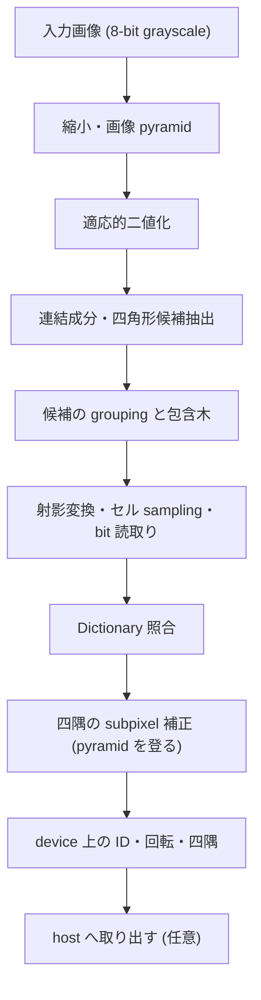

# プロジェクト概要

## 目的

ArUco3 の高速検出戦略を CUDA で実装し、OpenCV の CPU 実装と比較可能な形で正確性と性能を示すことが本 project の目的です。CUDA が常に速いという前提は置かず、CPU が有利になる条件も測定結果として示します。有効性を確認できた場合には、OpenCV へのコントリビュートを検討します。

本文書は project が存在する理由と全体像を扱います。使い方と build 手順は [README](../README.md) を参照してください。

## 背景

### marker 検出と ArUco3 検出戦略

ArUco3 検出戦略は、新しい Dictionary ではなく高速化のための検出方式です。入力画像を縮小した segmentation 画像だけで候補抽出を行い、四隅は画像 pyramid を登りながら原寸へ復元します。原寸の全画素に対して二値化と輪郭抽出を行う従来方式より、候補抽出の仕事量が大きく減ります。

OpenCV 4.x は `DetectorParameters::useAruco3Detection` によってこの戦略を有効化できます。実装は CPU 側にあり、ArUco 検出について OpenCV に公式の CUDA API はありません。

### license に関する事実

| 対象 | license | 本 project との関係 |
| --- | --- | --- |
| 公式 ArUco library (Universidad de Córdoba) | GPLv3 | 取得・参照・利用のいずれも行いません |
| OpenCV 4.x | Apache-2.0 (一部の `imgproc` の file は 3 条項 BSD) | 互換対象。振る舞いを写した file は `NOTICE` に attribution を保持します |
| ArUco3 論文 | - | 実装根拠 |
| 本 repository | Apache-2.0 | - |

実装根拠は ArUco3 論文と Apache-2.0 の OpenCV 4.x に限定します。定義済み Dictionary は公式 ArUco 配布物から抽出せず、version と commit を固定した OpenCV 4.x のデータを正本とします。file 単位の由来は [Code Provenance 記録](code-provenance.md)、方針の詳細は [知的財産・ライセンス方針](ip-and-licensing.md) にあります。

### 統合 GPU 環境の事情

Jetson Orin や DGX Spark GB10 のような統合 GPU では、host と device が同一の物理 memory を共有します。discrete GPU とは転送費用の構造が異なり、検出結果を device 上に置いたまま後段 (姿勢推定、tracking など) へ渡せると host 同期を省けます。本 project が GPU 常駐の出力を持つのはこのためです。

一方で、統合 GPU で測った結果がそのまま discrete GPU へ当てはまるとは限りません。そのため評価対象へ単体 GPU を 1 機加え、統合 GPU 固有の結果と一般に成り立つ結果を切り分けられるようにしています。

## 対象範囲

単一の 8-bit grayscale 画像から、ArUco マーカーの ID・回転・四隅座標を検出する処理を対象とします。

### 対象

- ArUco3 検出戦略の CUDA 実装 (縮小・二値化から候補抽出、Dictionary 照合、四隅の subpixel 補正まで)
- 定義済み Dictionary `DICT_ARUCO_MIP_36h12`。他の Dictionary は同じ loader と lookup 形式で段階的に追加します ([Dictionary 方針](dictionaries.md))
- CUDA stream による非同期実行と、device 常駐の結果表現
- OpenCV CPU 実装との正確性比較と end-to-end 時間の比較
- GPU 常駐入力、host 入力、CPU/GPU ハイブリッドの各経路の比較
- 統合 GPU 2 機と単体 GPU 1 機で共通に使う開発 container 環境

### 対象外

- 姿勢推定 (検出結果を OpenCV の `solvePnP` 等へ接続できる形で出力します)
- ChArUco board と board refinement
- AprilTag 専用 quad detector
- ROS2 node と Python API
- Jetson Nano、Xavier、Thor

## 現状

### 検出の流れ

入力画像から ID・回転・四隅までを GPU 上で処理します。`Detector` は host 同期なしで device 上の結果を返し、1 frame 分の kernel 発行列を CUDA Graph へ畳みます。

姿勢推定は行いません。後段が同じ device 上にある場合は、図の `J` を経由せずに結果を利用できます。段ごとの設計は [検出パイプライン設計](design/detector-pipeline.md)、公開 API は [公開 API](design/public-api.md) にあります。

### 対象機

| 機体 | architecture | GPU | GPU の種別 | Compute Capability | CUDA |
| --- | --- | --- | --- | --- | --- |
| DGX Spark GB10 | aarch64 (Cortex-X925 x10 + A725 x10) | NVIDIA GB10 | 統合 | 12.1 | 13.0 |
| Jetson AGX Orin | aarch64 (Cortex-A78AE x12、MAXN) | Orin | 統合 | 8.7 | 11.4 |
| GeForce RTX 5070 Ti | x86_64 (Core Ultra 7 265) | RTX 5070 Ti | 単体 | 12.0 | 13.0 |

3 機すべてで自動 test と Compute Sanitizer (memcheck / racecheck / initcheck / synccheck) が通ります。Compute Sanitizer は 2 実行 file x 4 tool の 8 件です。環境の構築手順は [Docker 環境設計](design/docker-environment.md) にあります。

### 正確性

合成 corpus 91 場面、真値 480 個に対して、CPU 基準・Hybrid・CUDA-Resident の 3 経路 x 3 機で測定しています。

- precision は全 18 組合せで 100% です。false positive 0 件、ID 誤り 0 件です。
- ArUco3 検出戦略は、縮小後の 1 辺が下限を下回るマーカーを原理上検出しません。**corpus 全体の recall は 18.33% で、下限以上の大きさのマーカーに限れば 94.44% (真値 90 個中 85 個) です。** 全体値は corpus に下限未満のマーカーを多く含めた結果であり、戦略上の下限に支配されています。
- rotation は検出した 85 件すべてで真値と一致します。
- 取りこぼし 5 件の内訳は複合劣化 3、遮蔽 1、境界はみ出し 1 です。回転・射影・ぼけ・noise・照度差は単独では 0 件です。

四隅の誤差は次のとおりです。

| 経路 | 四隅 RMSE (aarch64) | 四隅 RMSE (x86_64) |
| --- | --- | --- |
| CPU 基準 | 0.5184 px | 0.5042 px |
| CUDA-Resident | 0.4806 px | 0.4653 px |

CPU 基準との一致は、Hybrid 経路が 91/91 枚 (最大差 0.000 px)、CUDA-Resident 経路が 90/91 枚です。差が出る 1 枚は遮蔽ありの 640x480 で、差は 3.804 px です。この場面の真値に対する誤差は CPU 3.6351 px、CUDA 1.0936 px で、真値には CUDA の方が近くなります。差の由来は四隅の推定方法の違い (CUDA は極点探索、OpenCV は輪郭の多角形近似) で、ArUco3 を切ると差はすべて sqrt(2) = 1.414 px になります。詳細は [正確性評価の結果](accuracy-report.md) を参照してください。

なお、同じ seed で生成した corpus 画像が aarch64 と x86_64 で 91 場面中 54 場面異なります (差は画素の 0.1% 未満、最大 4 階調)。architecture をまたぐ比較にのみ影響します。

### 速度

検出のみを測った end-to-end 時間を、28 場面 x 3 経路 x 3 機で比較しています。画像の読み込みと checksum は測定区間に含みません。

**CPU が勝つのは 640x480 かつ検出が 1 件以上ある場面だけです。** 28 場面のうち DGX Spark で 5 場面、GeForce RTX 5070 Ti で 4 場面、Jetson AGX Orin で 1 場面です。ただしこれは合成 corpus での境界であり、実画像では輪郭点数が増えて境界が動く可能性があります。

境界を決めるのは解像度でも候補数でもなく、二値化後の輪郭点数です。ArUco3 の縮小により原寸が 27 倍変わっても segmentation 面は 2.2 倍しか変わりません。

| 経路 | 輪郭点 1e5 あたりの係数 | 回帰の R2 | 場面による振れ幅 |
| --- | --- | --- | --- |
| CPU 基準 | 2.48-5.35 ms | 0.977-0.988 | 11.6-20.8 倍 |
| Hybrid | 2.54-5.48 ms | 0.965-0.980 | 10.0-43.7 倍 |
| CUDA-Resident | 0.041-0.278 ms | 0.894-0.973 | 3.4-4.1 倍 |

Hybrid の係数は CPU とほぼ同じです。輪郭抽出から先を host で行うためで、輪郭点数が増えるほど CPU 基準と同じように伸びます。Hybrid と CUDA-Resident の切替点は輪郭点 約 20,000 点です (DGX Spark と GeForce RTX 5070 Ti)。Jetson AGX Orin は 28 場面すべてで CUDA-Resident が勝ちます。

起動費用は GPU 経路の方が大きく残ります。1280x720・マーカー 4 枚の場合、1 process で 1 枚だけ処理したときと定常時の end-to-end 時間は次のとおりです。

| 機体 | 1 枚目まで (CPU / Hybrid / Resident) | 定常 (CPU / Hybrid / Resident) |
| --- | --- | --- |
| DGX Spark GB10 | 3.3 / 171.0 / 174.0 ms | 0.699 / 0.301 / 0.696 ms |
| Jetson AGX Orin | 6.1 / 57.6 / 69.8 ms | 1.676 / 1.144 / 1.077 ms |
| GeForce RTX 5070 Ti | 2.2 / 66.1 / 70.0 ms | 0.614 / 0.295 / 0.421 ms |

実行間のばらつきも経路で異なります。独立した 3 process の p50 の幅は、DGX Spark で CPU 0.6% / Hybrid 17.7% / Resident 14.1%、Jetson AGX Orin で 0.4% / 3.5% / 0.5%、GeForce RTX 5070 Ti で 0.5% / 0.4% / 0.0% です。**GPU 経路のばらつきは CPU 経路より 1 桁大きくなります。**

入力の memory 種別では、managed memory は単体 GPU で pageable の 6.4-30 倍遅く、統合 GPU では 1.01-1.22 倍にとどまります。統合 GPU でも明示的な copy を省けば速くなるとは限りません。詳細は [Benchmark 報告](benchmark-report.md) と [host と device の間の memory 受け渡し](design/memory-transfer.md) を参照してください。

### device memory

workspace は設定の上限から最悪値で一括確保し、検出のたびに確保を追加しません。最大使用量は ArUco3 有効で 17.51 MB、無効で 414.51 MB です。検出を 91 回繰り返しても確保回数は増えません。

### 評価上の制約

- 評価は合成 corpus のみです。実画像 corpus は整備していません。
- 段ごとの時間は host 同期を含む wall-clock です。CUDA event による段別計測は行いません。
- 測定に使う CPU core は種別で固定します。性能 core と効率 core が混在する機では、固定先によって値が約 2 倍変わります。

## 目標

- 実画像 corpus に対して同じ正確性指標を出し、合成 corpus で得た crossover point がどこへ動くかを示す。
- CUDA event で段ごとの kernel 時間を測り、wall-clock 由来の値と分離して記録する。
- 起動から 1 枚目の結果が出るまでの時間を短くし、短い系列でも GPU 経路を選べる条件を広げる。
- `DICT_ARUCO_MIP_36h12` 以外の定義済み Dictionary を、同じ loader と lookup 形式で追加する。
- 有効性を確認できた場合に、OpenCV への提案を検討する ([OpenCV Issue #27118](https://github.com/opencv/opencv/issues/27118))。

## 未確定事項

- 実画像で輪郭点数がどこまで増えるか。CPU と GPU の crossover point が合成 corpus の境界からどれだけ動くか。
- 遮蔽と複合劣化での取りこぼしを減らすために、判定しきい値を実画像に合わせて変えるべきか。
- 対応 Dictionary をどの順序で広げるか。constant memory と global memory を切り替える table size の条件。
- GPU clock の固定方針と、測定に使う CPU thread 数。
- `ArUco` の名称について、考案者側の未登録商標としての評価 ([知的財産・ライセンス方針](ip-and-licensing.md))。

## 関連

- [README](../README.md)
- [アーキテクチャ](architecture.md)
- [検出パイプライン設計](design/detector-pipeline.md)
- [公開 API](design/public-api.md)
- [host と device の間の memory 受け渡し](design/memory-transfer.md)
- [Docker 環境設計](design/docker-environment.md)
- [評価計画](evaluation-plan.md)
- [Benchmark 報告](benchmark-report.md)
- [正確性評価の結果](accuracy-report.md)
- [Dictionary 方針](dictionaries.md)
- [知的財産・ライセンス方針](ip-and-licensing.md)
- [Code Provenance 記録](code-provenance.md)
- [ADR-0002: build 基盤と対象環境の baseline を固定する](adr/0002-toolchain-and-target-baseline.md)
- [ADR-0003: 四角形候補抽出は案 A を主案とする](adr/0003-candidate-extraction-approach.md)
