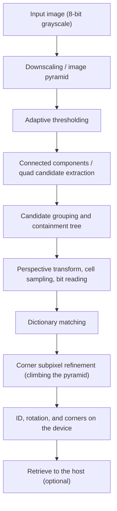

# Project Overview

## Purpose

The purpose of this project is to implement the ArUco3 fast detection strategy in CUDA and to show its correctness and performance in a form comparable to the OpenCV CPU implementation. We do not assume that CUDA is always faster; we also present the conditions under which the CPU wins as measurement results. If we can confirm that it is effective, we will consider contributing to OpenCV.

This document covers why the project exists and what it looks like as a whole. For usage and build instructions, see the [README](../README.md).

## Background

### Marker detection and the ArUco3 detection strategy

The ArUco3 detection strategy is not a new dictionary but a detection method for speed. It performs candidate extraction only on a downscaled segmentation image, and recovers the corners at full size by climbing an image pyramid. Compared with the conventional method, which thresholds and extracts contours over every pixel at full size, the work of candidate extraction is greatly reduced.

OpenCV 4.x can enable this strategy through `DetectorParameters::useAruco3Detection`. The implementation is on the CPU side, and OpenCV has no official CUDA API for ArUco detection.

### Facts regarding licenses

| Subject | License | Relationship to this project |
| --- | --- | --- |
| Official ArUco library (Universidad de Córdoba) | GPLv3 | We neither obtain, consult, nor use it |
| OpenCV 4.x | Apache-2.0 (some `imgproc` files are 3-clause BSD) | Compatibility target. Files whose behavior we mirrored keep their attribution in `NOTICE` |
| The ArUco3 paper | - | Implementation basis |
| This repository | Apache-2.0 | - |

We limit the implementation basis to the ArUco3 paper and Apache-2.0 OpenCV 4.x. Predefined dictionaries are not extracted from official ArUco distributions; the authoritative source is OpenCV 4.x data at a pinned version and commit. Per-file provenance is in the [Code Provenance Record](code-provenance.md), and the details of the policy are in the [Intellectual Property and Licensing Policy](ip-and-licensing.md).

### Circumstances of integrated GPU environments

On integrated GPUs such as the Jetson Orin and the DGX Spark GB10, the host and the device share the same physical memory. The structure of transfer costs differs from a discrete GPU, and if detection results can be handed to downstream processing (pose estimation, tracking, and so on) while staying on the device, host synchronization can be avoided. This is why this project has device-resident output.

At the same time, results measured on an integrated GPU do not necessarily carry over to a discrete GPU. We therefore added one discrete-GPU machine to the evaluation targets, so that results specific to integrated GPUs can be separated from results that hold generally.

## Scope

We target the detection of the ID, rotation, and corner coordinates of ArUco markers from a single 8-bit grayscale image.

### In scope

- A CUDA implementation of the ArUco3 detection strategy (from downscaling and thresholding through candidate extraction, dictionary matching, and corner subpixel refinement)
- The predefined dictionary `DICT_ARUCO_MIP_36h12`. Other dictionaries will be added incrementally using the same loader and lookup format ([Dictionary Policy](dictionaries.md))
- Asynchronous execution with CUDA streams, and a device-resident result representation
- Accuracy comparison against the OpenCV CPU implementation, and comparison of end-to-end time
- Comparison of the GPU-resident input, host input, and CPU/GPU hybrid routes
- A development container environment used in common across the two integrated-GPU machines and the one discrete-GPU machine

### Out of scope

- Pose estimation (we output detection results in a form that can be fed to OpenCV's `solvePnP` and similar)
- ChArUco boards and board refinement
- The AprilTag-specific quad detector
- A ROS2 node and a Python API
- Jetson Nano, Xavier, and Thor

## Current state

### Detection flow

Everything from the input image to the ID, rotation, and corners is processed on the GPU. `Detector` returns results on the device without host synchronization, and folds one frame's sequence of kernel launches into a CUDA Graph.

We do not perform pose estimation. When downstream processing is on the same device, the results can be used without going through `J` in the diagram. The per-stage design is in the [Detection Pipeline Design](design/detector-pipeline.md), and the public API is in the [Public API](design/public-api.md).

### Target machines

| Machine | Architecture | GPU | GPU type | Compute Capability | CUDA |
| --- | --- | --- | --- | --- | --- |
| DGX Spark GB10 | aarch64 (Cortex-X925 x10 + A725 x10) | NVIDIA GB10 | Integrated | 12.1 | 13.0 |
| Jetson AGX Orin | aarch64 (Cortex-A78AE x12, MAXN) | Orin | Integrated | 8.7 | 11.4 |
| GeForce RTX 5070 Ti | x86_64 (Core Ultra 7 265) | RTX 5070 Ti | Discrete | 12.0 | 13.0 |

The automated tests and Compute Sanitizer (memcheck / racecheck / initcheck / synccheck) pass on all three machines. Compute Sanitizer amounts to 8 runs: 2 executables x 4 tools. The procedure for setting up the environment is in the [Docker Environment Design](design/docker-environment.md).

### Accuracy

We measure over a synthetic corpus of 91 scenes and 480 ground truth markers, across 3 routes (CPU reference, Hybrid, CUDA-Resident) x 3 machines.

- Precision is 100% in all 18 combinations. There are 0 false positives and 0 ID errors.
- The ArUco3 detection strategy inherently cannot detect markers whose side, after downscaling, falls below a lower limit. **Recall over the whole corpus is 18.33%, and 94.44% (85 of 90 ground truth markers) when restricted to markers at or above the limit.** The overall value is a consequence of including many markers below the limit in the corpus, and is dominated by the lower limit of the strategy.
- Rotation matches ground truth in all 85 detections.
- The 5 misses break down as 3 combined degradation, 1 occlusion, and 1 border clipping. Rotation, projective distortion, blur, noise, and illumination difference each produce 0 misses on their own.

The corner errors are as follows.

| Route | Corner RMSE (aarch64) | Corner RMSE (x86_64) |
| --- | --- | --- |
| CPU reference | 0.5184 px | 0.5042 px |
| CUDA-Resident | 0.4806 px | 0.4653 px |

Agreement with the CPU reference is 91/91 images (maximum difference 0.000 px) for the Hybrid route and 90/91 images for the CUDA-Resident route. The one image that differs is a 640x480 scene with occlusion, and the difference is 3.804 px. The error against ground truth in this scene is 3.6351 px for the CPU and 1.0936 px for CUDA, so CUDA is closer to ground truth. The difference originates in the method of estimating the corners (CUDA uses extreme point search, OpenCV uses polygonal approximation of the contour); with ArUco3 turned off, all differences become sqrt(2) = 1.414 px. For details, see the [Accuracy Evaluation Results](accuracy-report.md).

Note that corpus images generated with the same seed differ between aarch64 and x86_64 in 54 of 91 scenes (the difference is under 0.1% of pixels, with a maximum of 4 gray levels). This affects only comparisons across architectures.

### Speed

We compare end-to-end time measuring detection only, across 28 scenes x 3 routes x 3 machines. Image loading and checksums are not included in the measured interval.

**The CPU beats CUDA-Resident on small scenes with few contour points.** Out of 28 scenes, this happens in 5 scenes on the DGX Spark, 4 scenes on the GeForce RTX 5070 Ti, and 1 scene on the Jetson AGX Orin. **Resolution alone does not decide it.** Even at the same 640x480, `noise_640x480` has many contour points, and on the DGX Spark the GPU is 2.3 times faster: CUDA-Resident 0.612 ms against CPU 1.406 ms. Conversely, the 5 scenes on the DGX Spark include one 1280x720 scene. That said, on the DGX Spark and the GeForce RTX 5070 Ti **there is not a single scene where the CPU beats Hybrid**, so if the faster GPU route can be chosen per scene, there are no scenes left where the CPU wins on these two machines. The only case where the CPU beats both routes at once is 1 scene on the Jetson AGX Orin. This is the boundary on the synthetic corpus, and on real images the contour point count may increase and move the boundary.

What determines the boundary is neither resolution nor candidate count, but the contour point count after thresholding. With ArUco3 downscaling, a 27-fold change in the full-size area changes the segmentation area by only 2.2 times.

| Route | Coefficient per 1e5 contour points | R2 of the regression | Spread across scenes |
| --- | --- | --- | --- |
| CPU reference | 2.48-5.35 ms | 0.977-0.988 | 11.6-20.8 times |
| Hybrid | 2.54-5.48 ms | 0.965-0.980 | 10.0-43.7 times |
| CUDA-Resident | 0.041-0.278 ms | 0.894-0.973 | 3.4-4.1 times |

The coefficient for Hybrid is almost the same as for the CPU. This is because everything from contour extraction onward runs on the host, so it grows with the contour point count just as the CPU reference does. The switchover point between Hybrid and CUDA-Resident is about 20,000 contour points (on the DGX Spark and the GeForce RTX 5070 Ti). On the Jetson AGX Orin, CUDA-Resident wins in all 28 scenes.

Startup cost remains larger on the GPU routes. For 1280x720 with 4 markers, the end-to-end time when a single process handles just one image, and in the steady state, is as follows.

| Machine | To the first image (CPU / Hybrid / Resident) | Steady state (CPU / Hybrid / Resident) |
| --- | --- | --- |
| DGX Spark GB10 | 3.3 / 171.0 / 174.0 ms | 0.699 / 0.301 / 0.696 ms |
| Jetson AGX Orin | 6.1 / 57.6 / 69.8 ms | 1.676 / 1.144 / 1.077 ms |
| GeForce RTX 5070 Ti | 2.2 / 66.1 / 70.0 ms | 0.614 / 0.295 / 0.421 ms |

Run-to-run variance also differs by route. The spread of the p50 across 3 independent processes is CPU 0.6% / Hybrid 17.7% / Resident 14.1% on the DGX Spark, 0.4% / 3.5% / 0.5% on the Jetson AGX Orin, and 0.5% / 0.4% / 0.0% on the GeForce RTX 5070 Ti. **Variance on the GPU routes is an order of magnitude larger than on the CPU route.**

As for the memory kind of the input, managed memory is 6.4-30 times slower than pageable on the discrete GPU, while on integrated GPUs it stays within 1.01-1.22 times. Even on an integrated GPU, skipping the explicit copy does not necessarily make it faster. For details, see the [Benchmark Report](benchmark-report.md) and [Memory Transfer Between Host and Device](design/memory-transfer.md).

### Device memory

The workspace is allocated in one go, at the worst-case size derived from the configured upper limits, and no further allocation is added per detection. Peak usage is 17.51 MB with ArUco3 enabled and 414.51 MB with it disabled. Repeating detection 91 times does not increase the allocation count.

### Constraints on the evaluation

- The evaluation uses only the synthetic corpus. A real-image corpus is not in place.
- The per-stage times are wall-clock values that include host synchronization. We do not perform per-stage measurement with CUDA events.
- The CPU cores used for measurement are fixed by type. On machines that mix performance cores and efficiency cores, the value changes by roughly a factor of 2 depending on which is pinned.

## Goals

- Produce the same accuracy metrics on a real-image corpus, and show where the crossover point obtained on the synthetic corpus moves.
- Measure per-stage kernel time with CUDA events and record it separately from wall-clock-derived values.
- Shorten the time from startup until the first image produces a result, widening the conditions under which a GPU route can be chosen even for short sequences.
- Add predefined dictionaries other than `DICT_ARUCO_MIP_36h12`, using the same loader and lookup format.
- Consider proposing this to OpenCV if we can confirm that it is effective ([OpenCV Issue #27118](https://github.com/opencv/opencv/issues/27118)).

## Open questions

- How far the contour point count rises on real images. How far the CPU/GPU crossover point moves from the boundary found on the synthetic corpus.
- Whether the decision thresholds should be adjusted to real images in order to reduce misses under occlusion and combined degradation.
- In what order to widen dictionary support. The table size conditions for switching between constant memory and global memory.
- The policy for locking the GPU clock, and the CPU thread count to use for measurement.
- The assessment of the name `ArUco` as an unregistered trademark of the originators ([Intellectual Property and Licensing Policy](ip-and-licensing.md)).

## See also

- [README](../README.md)
- [Architecture](architecture.md)
- [Detection Pipeline Design](design/detector-pipeline.md)
- [Public API](design/public-api.md)
- [Memory Transfer Between Host and Device](design/memory-transfer.md)
- [Docker Environment Design](design/docker-environment.md)
- [Evaluation Plan](evaluation-plan.md)
- [Benchmark Report](benchmark-report.md)
- [Accuracy Evaluation Results](accuracy-report.md)
- [Dictionary Policy](dictionaries.md)
- [Intellectual Property and Licensing Policy](ip-and-licensing.md)
- [Code Provenance Record](code-provenance.md)
- [ADR-0002: Fix the build infrastructure and target environment baseline](adr/0002-toolchain-and-target-baseline.md)
- [ADR-0003: Adopt approach A as the primary approach for quad candidate extraction](adr/0003-candidate-extraction-approach.md)
