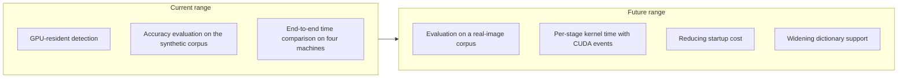

# Roadmap

## Purpose

This document gathers in one place how far this project has gotten and what we take on next. For individual measurements, the [Benchmark Report](benchmark-report.md) and the [Accuracy Evaluation Results](accuracy-report.md) are authoritative.

## Scope

We cover the implementation of detection (from the input image through to IDs and corners), its accuracy and speed evaluation, and the range of supported hardware. Pose estimation is out of scope; we output detection results in a form that can be passed to OpenCV's `solvePnP` and similar.

## Current state

### What works

- Everything from downscaling and thresholding the input image through candidate extraction, dictionary matching, and corner subpixel refinement completes on the GPU. `Detector` returns results on the device without host synchronization, and one frame's sequence of kernel launches is folded into a CUDA Graph when the caller passes an explicit stream. The legacy default stream cannot be captured, so passing `nullptr` issues the kernels one stage at a time. The list of stages is in the [Detection Pipeline Design](design/detector-pipeline.md).
- We can compare three routes under the same conditions: the CPU reference (OpenCV ArUco3), Hybrid (only preprocessing and thresholding on the GPU), and GPU-resident.
- The automated tests and the four Compute Sanitizer tools (memcheck, racecheck, initcheck, synccheck) pass on all four machines.

### Target machines

| Machine | Architecture | GPU | GPU type | CC | CUDA |
| --- | --- | --- | --- | --- | --- |
| DGX Spark GB10 | aarch64 | NVIDIA GB10 | Integrated | 12.1 | 13.0 |
| Jetson AGX Orin | aarch64 | Orin | Integrated | 8.7 | 11.4 |
| GeForce RTX 5070 Ti | x86_64 | RTX 5070 Ti | Discrete | 12.0 | 13.0 |
| Jetson AGX Thor | aarch64 | Thor | Integrated | 11.0 | 13.0 |

The configuration of three integrated-GPU machines and one discrete-GPU machine lets us separate results specific to integrated GPUs from results that hold generally. All four are measured; the figures below cover them all.

### Accuracy

Over a synthetic corpus of 91 scenes and 480 ground truth markers, all 12 combinations of 3 routes x 4 machines give 100% precision, 0 false positives, and 0 ID errors. Recall is 94.44% for sizes at or above the ArUco3 detection strategy's detection limit, and 18.33% over the whole corpus. The overall value is low because the corpus deliberately includes sizes below the limit; it does not represent misses by the implementation. The limit per resolution and the breakdown by condition are in the [Accuracy Evaluation Results](accuracy-report.md).

### Speed

We compare end-to-end time measuring detection only, across 28 scenes x 3 routes x 4 machines. Image loading and checksums are not included in the measured interval.

**There are conditions where the CPU wins.** On the synthetic corpus, the CPU beats CUDA-Resident on small scenes with few contour points: out of 28 scenes, this applies to 5 scenes on the DGX Spark GB10, 4 scenes on the GeForce RTX 5070 Ti, 1 scene on the Jetson AGX Orin, and none at all on the Jetson AGX Thor. Resolution alone does not decide it; even at the same 640x480, the GPU wins on scenes with many contour points. When the route can be chosen per scene, the only case where the CPU beats both GPU routes at once is 1 scene on the Jetson AGX Orin. What determines the boundary is neither resolution nor candidate count, but the contour point count after thresholding. Since the contour point count on real images can be higher than on the synthetic corpus, the boundary may move, but we have not confirmed this yet. For details, see the [Benchmark Report](benchmark-report.md).

### Device memory

Peak workspace usage is 17.51 MB with the ArUco3 detection strategy enabled and 414.51 MB with it disabled. Repeating detection 91 times does not increase the allocation count.

### Constraints on the evaluation

- The evaluation is limited to the synthetic corpus. There is no real-image corpus.
- The per-stage times are end-to-end times that include host synchronization. We do not separate out kernel time with CUDA events.
- For a single detection, the startup cost of the GPU routes dominates. On the DGX Spark GB10, the time until the first image produces a result is 174.0 ms for GPU-resident against 3.3 ms for the CPU, an order of magnitude away from the steady-state 0.696 ms.

## Goals

This is the range we take on going forward. We have not set dates.

- **Evaluation on a real-image corpus.** We will confirm how the crossover point and the detection rates obtained on the synthetic corpus move on real images.
- **Per-stage kernel time.** The current per-stage times are wall-clock values that include host synchronization. Separating them with CUDA events would let us decide by measurement which stage to cut.
- **Reducing startup cost.** CUDA context creation cannot be reduced, but narrowing the target architectures, or preloading cubins, may shorten kernel loading.
- **Widening dictionary support.** Seventeen dictionaries are bundled, and accuracy is recorded for every one of them on all four machines ([Accuracy Evaluation Results](accuracy-report.md)). The benchmark figures were taken with `DICT_ARUCO_MIP_36h12` alone; a per-dictionary sweep has not been run, because the dictionary was measured to make no difference to time that rises above the run-to-run spread. The policy is in the [Dictionary Policy](dictionaries.md).
- **Considering an upstream proposal.** If we can assess the effectiveness and the maintenance cost, we will consider proposing this to OpenCV. The venue for discussion is [OpenCV Issue #27118](https://github.com/opencv/opencv/issues/27118).

## Open questions

- Where the crossover point moves on real images.
- In what order to widen dictionary support.
- Whether to lock the GPU clock frequency during measurement or measure at the default.
- The scope of Jetson support. For now we target the Orin family; Nano, Xavier, and Thor are out of scope.
- The acceptable corner coordinate error, and numeric criteria for the performance improvement rate.

## See also

- [Project Overview](project-overview.md)
- [Evaluation Plan](evaluation-plan.md)
- [Benchmark Report](benchmark-report.md)
- [Accuracy Evaluation Results](accuracy-report.md)
- [Detection Pipeline Design](design/detector-pipeline.md)
- [Docker Environment Design](design/docker-environment.md)
- [ADR-0003: Adopt approach A as the primary approach for quad candidate extraction](adr/0003-candidate-extraction-approach.md)
