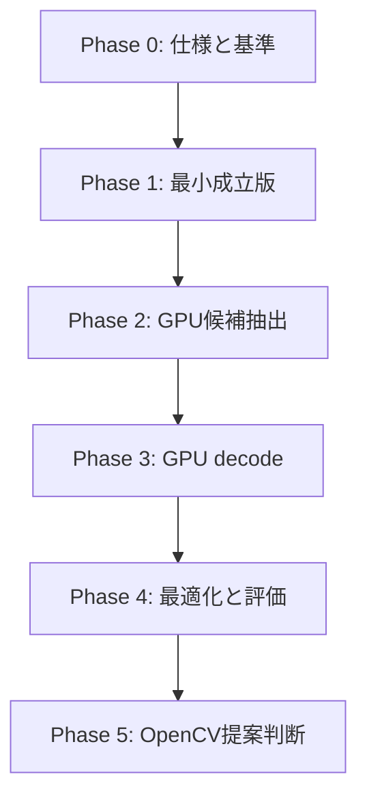

# ロードマップ

## 目的

独立 CUDA 実装から OpenCV への提案判断までの作業段階と完了条件を定義します。

## 対象範囲

設計、最小成立版、正確性評価、性能最適化、hardware 検証、OpenCV への提案準備を対象とします。

## 現状

Phase 0 を完了しました。開発 container、build 基盤、CPU 基準 runner、test corpus 生成器、Dictionary 変換 tool、benchmark harness が DGX Spark と Jetson AGX Orin の両方で動作します。次は Phase 1 の最小成立版です。日付は hardware と開発時間を確認後に設定します。

## 目標

### Phase 0: 仕様と基準

- DGX Spark と Jetson Orin で共通に使用する開発 container を用意する。
- API、Dictionary、検出設定の初期範囲を決める。
- OpenCV CPU 基準 runner と test corpus を作る。
- build、format、lint、unit test、benchmark の Skeleton を作る。
- Apache License 2.0 の適用範囲と第三者 notice の管理方法を確認する。

完了条件: 両 profile の container 内で build とテストが通り、同一入力に対する CPU 基準結果と環境情報を保存できる。

### Phase 1: 最小成立版

- grayscale device 入力を受け取る。
- CUDA 前処理と簡易候補生成を実装する。
- CPU decode を使用したハイブリッド経路で正確性を確認する。

完了条件: 合成画像の基本条件で ID と四隅を取得できる。

### Phase 2: GPU 候補抽出

- 連結成分または contour 相当処理を実装する。
- 四角形候補の生成、整理、上限管理を GPU 内で行う。
- 可変長出力と overflow を検証する。

完了条件: 候補抽出まで GPU 常駐し、CPU 基準との差異を分類できる。

### Phase 3: GPU decode

- warp、セル sampling、border 検証を実装する。
- Dictionary 照合、rotation、error correction を実装する。
- 重複候補を整理する。

完了条件: ID と四隅の出力まで GPU 経路で完結する。

### Phase 4: 最適化と評価

- workspace、memory access、stream、kernel launch を最適化する。
- Jetson Orin と DGX Spark で全評価を実施する。
- CPU、CUDA、ハイブリッドの crossover point を報告する。

完了条件: [評価計画](evaluation-plan.md) の成果物が揃い、再現可能である。

### Phase 5: OpenCV 提案判断

- 有効性、互換性、保守費用を評価する。
- OpenCV Issue #27118 に結果と API 案を提示する。
- maintainer と対象 branch、module、API を合意する。
- 合意後に OpenCV 向け PR を分離して作成する。

完了条件: upstream PR を作るか、独立 library として継続するかを ADR で決定する。

## 未確定事項

- 各 Phase の担当と開始日・完了日。
- Phase 1 のハイブリッド構成が十分な検証価値を持つか。
- OpenCV 側の希望 module と API。
- 対応 Dictionary の拡張順序。

## 関連

- [実装計画](implementation-plan.md)
- [Docker 環境設計](design/docker-environment.md)
