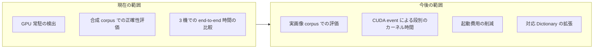

# ロードマップ

## 目的

本 project が現在どこまでできていて、次に何へ取り組むかを 1 箇所へまとめます。個々の測定値は [Benchmark 報告](benchmark-report.md) と [正確性評価の結果](accuracy-report.md) が正本です。

## 対象範囲

検出 (入力画像から ID と四隅まで) の実装、その正確性と速度の評価、対応 hardware の範囲を対象とします。姿勢推定は対象外であり、検出結果を OpenCV の `solvePnP` 等へ渡せる形で出力します。

## 現状

### できること

- 入力画像の縮小・二値化から、候補抽出、Dictionary 照合、四隅の subpixel 補正までを GPU 上で完結します。`Detector` は host 同期なしで device 上の結果を返し、1 frame の kernel 発行列は CUDA Graph へ畳んであります。段の一覧は [検出パイプライン設計](design/detector-pipeline.md) にあります。
- CPU 基準 (OpenCV ArUco3)、Hybrid (前処理と二値化のみ GPU)、GPU 常駐の 3 経路を同じ条件で比較できます。
- 3 機すべてで自動 test と Compute Sanitizer の 4 tool (memcheck、racecheck、initcheck、synccheck) が通ります。

### 対象機

| 機体 | architecture | GPU | GPU の種別 | CC | CUDA |
| --- | --- | --- | --- | --- | --- |
| DGX Spark GB10 | aarch64 | NVIDIA GB10 | 統合 | 12.1 | 13.0 |
| Jetson AGX Orin | aarch64 | Orin | 統合 | 8.7 | 11.4 |
| GeForce RTX 5070 Ti | x86_64 | RTX 5070 Ti | 単体 | 12.0 | 13.0 |

統合 GPU 2 機と単体 GPU 1 機という構成は、統合 GPU 固有の結果と一般に成り立つ結果を切り分けるためです。

### 正確性

合成 corpus 91 場面・真値 480 個に対し、3 経路 x 3 機の全 18 組合せで precision 100%、false positive 0 件、ID 誤り 0 件です。recall は ArUco3 検出戦略の検出下限以上の大きさで 94.44%、corpus 全体では 18.33% です。全体値が低いのは、corpus が下限を下回る大きさを意図的に含むためであり、実装の取りこぼしを表しません。解像度ごとの下限と条件別の内訳は [正確性評価の結果](accuracy-report.md) にあります。

### 速度

検出のみを測った end-to-end 時間を 28 場面 x 3 経路 x 3 機で比較しています。画像の読み込みと checksum は測定区間に含みません。

**CPU が勝つ条件があります。** 合成 corpus では 640x480 かつ検出が 1 件以上ある場面で CPU が速く、28 場面中 DGX Spark GB10 で 5 場面、GeForce RTX 5070 Ti で 4 場面、Jetson AGX Orin で 1 場面がこれに当たります。境界を決めているのは解像度でも候補数でもなく二値化後の輪郭点数です。実画像では輪郭点数が合成 corpus より多くなりうるため境界は動く可能性がありますが、まだ確かめていません。詳細は [Benchmark 報告](benchmark-report.md) にあります。

### device memory

workspace の最大使用量は ArUco3 検出戦略が有効で 17.51 MB、無効で 414.51 MB です。検出を 91 回繰り返しても確保回数は増えません。

### 評価の制約

- 評価は合成 corpus に限ります。実画像 corpus はありません。
- 段ごとの時間は host 同期を含む end-to-end 時間です。CUDA event によるカーネル時間の分離は行っていません。
- 単発の検出では GPU 経路の起動費用が支配します。1 枚目の結果が出るまでの時間は DGX Spark GB10 で CPU 3.3 ms に対し GPU 常駐 174.0 ms であり、定常の 0.696 ms とは桁が違います。

## 目標

今後扱う範囲です。時期は定めていません。

- **実画像 corpus での評価。** 合成 corpus で得た crossover point と検出率が実画像でどう動くかを確かめます。
- **段別のカーネル時間。** 現在の段階時間は host 同期を含む wall-clock です。CUDA event で分離すると、どの段を削るべきかを測定で決められます。
- **起動費用の削減。** CUDA の文脈生成は減らせませんが、対象 architecture を絞る、または cubin を事前に読み込むことで kernel の読み込みを短縮できる可能性があります。
- **対応 Dictionary の拡張。** 現在は `DICT_ARUCO_MIP_36h12` に固定して評価しています。方針は [Dictionary 方針](dictionaries.md) にあります。
- **upstream への提案の検討。** 有効性と保守費用を評価できた場合に、OpenCV への提案を検討します。議論の場は [OpenCV Issue #27118](https://github.com/opencv/opencv/issues/27118) です。

## 未確定事項

- 実画像で crossover point がどこへ動くか。
- 対応 Dictionary をどの順序で広げるか。
- 測定時に GPU の動作周波数を固定するか、既定のまま測るか。
- Jetson の対象範囲。当面は Orin 系を対象とし、Nano、Xavier、Thor は対象外です。
- 許容する四隅座標の誤差と、性能改善率の数値基準。

## 関連

- [プロジェクト概要](project-overview.md)
- [評価計画](evaluation-plan.md)
- [Benchmark 報告](benchmark-report.md)
- [正確性評価の結果](accuracy-report.md)
- [検出パイプライン設計](design/detector-pipeline.md)
- [Docker 環境設計](design/docker-environment.md)
- [ADR-0003: 四角形候補抽出は案 A を主案とする](adr/0003-candidate-extraction-approach.md)
